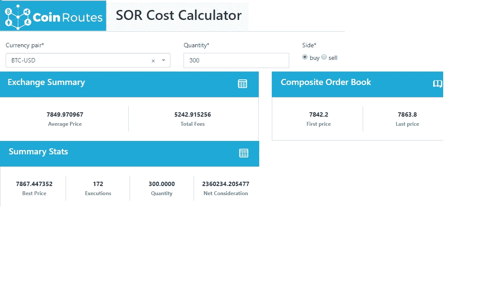
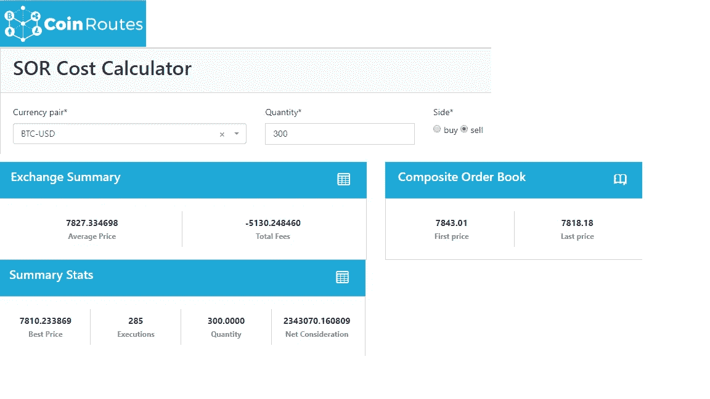

# 如果加密交易所希望比特币交易所交易基金获得批准，球就在它们的一边

> 原文：<https://medium.com/hackernoon/if-crypto-exchanges-want-approval-of-a-bitcoin-etf-the-ball-is-in-their-court-69000fe7455b>

尽管美国证交会最近决定不批准文克莱沃斯比特币交易所交易基金，但我认为批准此类产品的时机差不多到了。然而，至少有一个结构性障碍应该首先解决:加密交换应该允许数据提供商不受约束地整合和重新发布报价信息。

比特币(BTC)现货市场的流动性非常好，可以从各个平台获得此类报价。与其它大宗商品的交易所交易基金不同，如果你知道如何收集和分析数据，BTC 有一个稳健、透明、可电子化执行的现货市场。

CoinRoutes 为我们的客户提供的软件可以实时计算合并的最佳买价和卖价以及获得或清算足够比特币以代表 ETF 或期货合约的全价买价或卖价。我们的客户使用我们正在申请专利的 RealPrice，可以实时看到购买或出售 5 BTC(以及其他流行硬币的规定数量)的价格，并可以随时使用我们的成本计算器计算获得或清算任何数量的成本。使用这个软件，我们可以看到比特币的潜在流动性优于许多经批准的 ETF。

要解释这一点，你必须理解让股票型 ETF 价格与其基础资产保持一致的方法。“授权参与者”可以通过交付一篮子股票来创建 ETF 份额，或者赎回 ETF 以获得基础股票。这些篮子分别被称为“创造单位”和“赎回单位”。此类单位的规模差异很大，但许多创建和赎回单位的价值在 200 万至 500 万美元之间。

将这一过程与由商品本身支持的比特币交易所交易基金进行比较是很简单的。使用 CoinRoutes 成本计算器，我们可以检查在这些规模的 BTC 立即可用的流动性。正如下面的截图所示，今天早上某个时候买入 300 只 BTC 的总价格(名义价值 235 万美元)约为 7850 美元，而最佳报价为 7842 美元，成本为 0.10%。(对于平均交换费，由于平均交换费为 0.24%，该成本上升至 7867 美元)。与此同时，出售 300 BTC 的总收益为 7827 美元，而最佳出价为 7843 美元，成本约为 0.2%，而包括交易费在内的总收益为 7810 美元。这些数字每天都在变化，但对于交易超过 230 万美元的基础资产来说，57 美元(7810 美元至 7867 美元)或不到 0.75%的净交易费价差并不过分。

除了比特币交易者可以获得明显的流动性之外，这种透明度可以与许多已经批准 ETF 的基础市场相媲美。此外，这不依赖于使用报告交易的定价服务，这些交易很容易通过不正当交易或选择性报告来操纵。CoinRoutes 使用可立即访问的可执行出价和报价。虽然账簿中可能有不打算执行的出价或报价，但它们*是可执行的，可以进行交易。*

*然而，问题是不止一个加密交易所有服务条款，不允许供应商向公众重新分发这种合并数据。简而言之，这些交易所采取了法律手段，不允许公众为“最佳执行”进行比较。有趣的是，20 多年前，场外股票市场也有类似的问题，当时与领先的纳斯达克做市商达成了一项解决方案，以开放市场竞争…*

*对于太年轻或不记得历史的读者来说，股票的场外交易市场曾经是一个相对封闭的系统。纳斯达克的做市商将向公众发布报价，同时通过 Instinet 或交易商间经纪人相互发布“私人”报价。还据称，他们串通一气，人为地保持这些公开价差，这些交易商和纳斯达克在 20 世纪 90 年代中期以超过 10 亿美元的价格解决了这些指控。随后出台了新规则，要求经纪人向公众展示客户限价单，为客户订单提供优先权，并寻求和报告最佳执行情况。它还有助于刺激监管 ATS 的采用，从而促进了电子订单簿的兴起。*

*我怀疑美国证券交易委员会想要推动加密市场采用这些规则背后的原则，而且，我相信，如果他们这样做，市场将受益。尽管如此，在美国，大宗商品和证券之间的监管管辖权断裂是一个问题，因为 SEC 没有明确的管辖权。目前，加密是第一种有大量散户投资者参与的电子交易投资类型，没有明确定义的监管机构。美国证券交易委员会(SEC)认为自己的使命是保护这些投资者，希望迫使这些市场遵守最佳执行和公平有序市场等原则，但它的权力有限。因此，他们似乎是在利用 ETF 的审批程序来这样做，因为他们确实有权这么做。*

*因此，我认为球在行业的球场上。如果加密交易所接受这些概念，允许 CoinRoutes 等供应商公布统一定价，并采取有关最佳执行、反操纵和利益冲突的明确政策，SEC 批准加密 ETF 的决定可能会改变。此类举措还有一个好处，那就是缓解仍在观望的大型机构投资者的许多担忧，但如果没有这些举措，僵局可能会持续下去。*