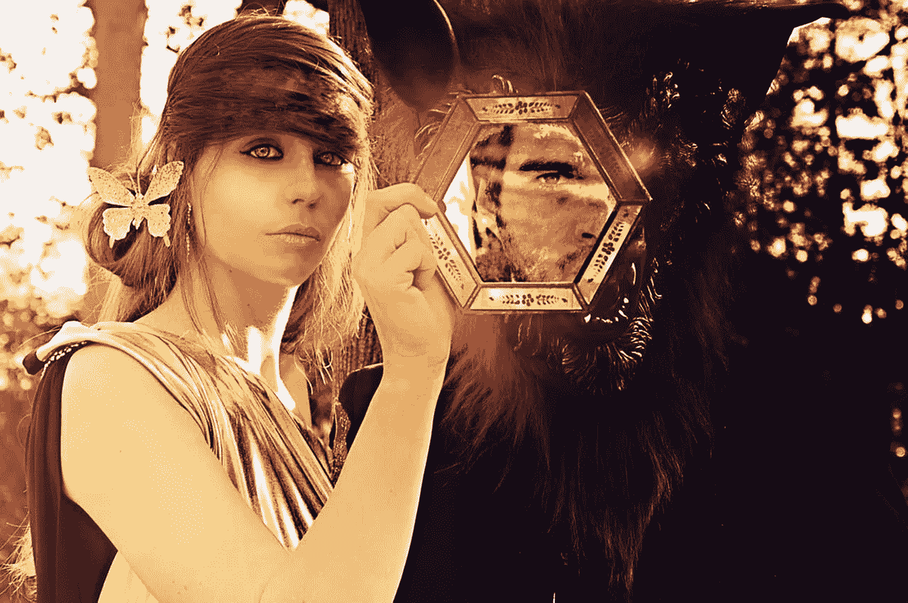
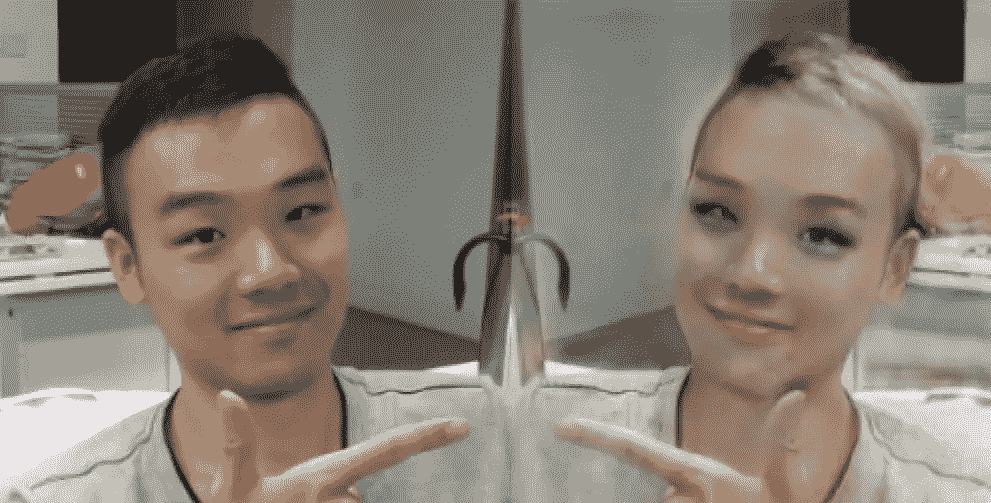
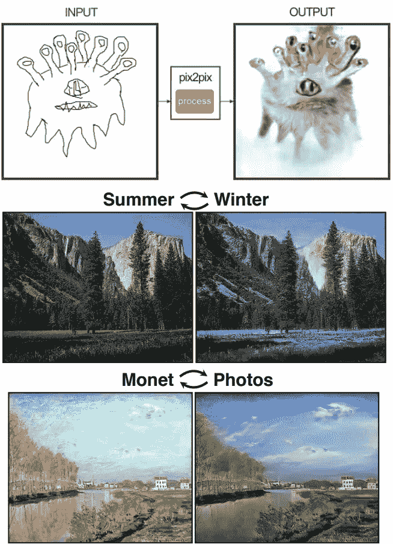
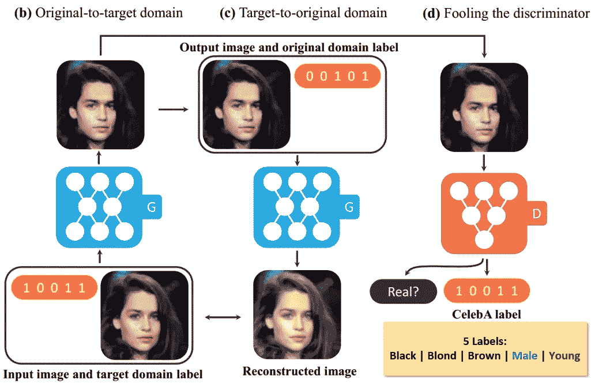
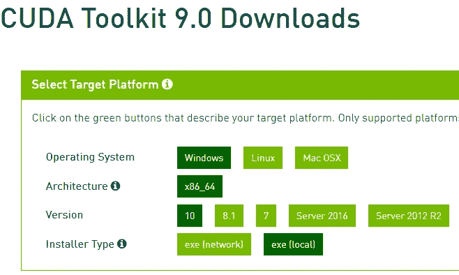
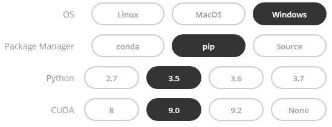

# 《如果我是女孩》——斯塔根的魔镜

> 原文：<https://medium.com/hackernoon/if-i-were-a-girl-magic-mirror-by-stargan-b2cc6787badf>

Magic mirror

> 有没有想过如果你是女孩，你会是什么样子？

> 想象一下。我跳下床，看着镜子。我是金发的！
> 
> 你问:“那是你作为一个女孩的样子吗？”
> 
> 我说:“是的，天啊，是的，是的，是的！这是我一直想要的！

魔镜由 StarGAN 提供支持，StarGAN 是一个用于多域图像到图像翻译的统一生成对抗网络。这篇文章将向你展示这个模型是如何工作的，以及你如何建造魔镜。

## 在这里欣赏 YouTube 演示[。](https://youtu.be/PkWIalWnYUg)

## 我的 [GitHub](https://github.com/Tony607/DeepMagicMirror) 页面上有完整的源代码。

# StarGAN 简介

图像到图像的转换是将给定图像的特定方面改变为另一个，例如，将人的性别从男性改变为女性。随着生成对抗网络(GANs)的引入，这项任务经历了重大的改进，结果包括从边缘地图生成照片，改变风景图像的季节，以及从莫奈的画作重建照片。

Images generated with GANs

给定来自两个不同领域的训练数据，这些模型学习以单向方式将图像从一个领域翻译到另一个领域。例如，一个生成模型被训练成将黑头发的人翻译成金发。任何单个现有的 GAN 模型都不能“向后”翻译，就像前面的例子中从金色头发到黑色头发。此外，单一模型无法处理灵活的多领域图像翻译任务。比如性别和头发颜色的可配置转换。这就是 StarGAN 脱颖而出的地方，这是一个新颖的生成式对抗网络，它只使用一个生成器和一个鉴别器来学习多个域之间的映射，从所有域的图像中有效地进行训练。StarGAN 的模型不是学习固定的翻译(例如，从黑人到金发)，而是将图像和域信息都作为输入，并学习将输入图像灵活地翻译到相应的域中。
预训练的 StarGAN 模型像其他 GAN 模型一样由两个网络组成，即生成网络和判别网络。虽然只需要生成网络来构建魔镜，但是理解完整的模型来自哪里仍然是有用的。

生成网络将两条信息作为输入，即分辨率为 256×256 的原始 RGB 图像和目标标签，以生成具有相同分辨率的伪图像，判别网络学习区分真实图像和伪图像，并将真实图像分类到其对应的域。

我们将要使用的预训练模型是在 CelebA 数据集上训练的，该数据集包含 202，599 张名人的面部图像，每张图像都用 40 个二元属性进行了注释，而研究人员使用以下属性选择了七个域:头发颜色(黑色、金色、棕色)、性别(男性/女性)和年龄(年轻/年老)。

StarGAN

# 建造魔镜

StarGAN 的研究人员在我们的魔镜项目所在的 GitHub 上发布了他们的[代码](https://github.com/yunjey/StarGAN)。我也是第一次处理 PyTorch 框架，到目前为止进展顺利。如果你像我一样是 PyTorch 框架的新手，你会发现很容易上手，尤其是有了 Keras 或 TensorFlow 等深度学习框架的经验之后。

完成这个项目只需要 PyTorch 框架最基本的知识，比如 PyTorch 张量、加载预定义的模型权重等。

让我们从安装框架开始。在我的情况下，在 Windows 10 上，这是最新的 PyTorch 官方支持的。

要使魔镜实时运行，并将可察觉的延迟降至最低，请使用游戏电脑的 Nvidia 显卡(如果有)来加速模型执行。

从 Nvidia 开发者网站上的[这个链接安装 CUDA 9。](https://developer.nvidia.com/cuda-90-download-archive)

Install CUDA 9

之后安装 PyTorch 与 CUDA 9.0 支持以下[其官方网站](https://pytorch.org/)的指示。

Install PyTorch

当 PyTorch 和其他 Python 依赖项安装好后，我们就可以开始编写代码了。

为了实现简单的实时人脸跟踪和裁剪效果，我们将使用 Python 的 OpenCV 库中的轻量级 **CascadeClassifier** 模块。该模块从网络摄像头帧中获取灰度图像，并返回检测到的人脸的边界框信息。如果在给定的帧中检测到多个面部，我们将采用具有最大计算边界框面积的“主要”面部。

由于 StarGAN 生成网络期望图像的像素值在-1 到 1 之间，而不是在 0 到 255 之间，我们将使用 PyTorch 的内置图像转换实用程序来处理图像预处理。

PyTorch image transform

生成网络将 PyTorch 的`nn.Module`子类化，这意味着您可以通过将输入张量作为参数传入来直接调用它。

Run the generative network

`labels`变量是 PyTorch 张量，有 5 个值，每个值设置为 0 或 1，以指示 5 个目标标签。

['黑发'，'金发'，'棕发'，'男性'，'年轻']

例如，我们希望将一幅肖像转换为金发的年轻女性。`labels`的值将被设置为[0，1，0，0，1]。

为了显示用 cv2 的 imshow()函数生成的图像张量，下面是一行代码。

这就是崩溃，

1.  首先通过调用`cpu()`将图像数据从 GPU 移动到 CPU。
2.  使用`detach()`调用从图中检测它。
3.  `numpy()` call 以 Numpy 数组的形式返回张量值。
4.  第一个[0]从生成的批次中取出第一个图像(即使批次大小为 1)。
5.  交换轴，将(3，256，256)形状的数组变成(256，256，3)。
6.  将像素值从范围-1~1 恢复到 0~1。
7.  用`::-1`操作水平翻转生成的图像。
8.  将图像通道顺序从 RGB 转换为 BGR，最后一个`::-1`操作为`cv2.imshow()`功能需要 BGR 通道顺序的图像。

将代码包装成一个函数调用`MagicMirror()`，该函数调用带有几个可选参数。

*   videoFile:保留默认值 0 以使用第一个网络摄像头，或者传入一个视频文件路径。
*   setHairColor:三种之一，“黑色”，“金色”，“棕色”。
*   变形为男性？设置为真或假。
*   setYoung:转变成一个年轻人？设置为真或假。
*   showZoom:缺省值为 4，这是在显示在屏幕上之前放大生成的图像的系数。

# 结论和进一步的思考

本教程向您展示了使用 PyTorch 这样的新框架，并使用预先训练好的 StarGAN 网络构建一些有趣的东西是多么容易和有趣。

生成的图像可能看起来还不是非常真实，而 [StarGAN 的论文](https://arxiv.org/abs/1711.09020)显示了一个与 CelebA + RaFD 数据集联合训练的模型可以通过利用这两个数据集来改善面部关键点检测和分割等共享的低级任务，从而生成伪影更少的图像。你可以跟随他们的官方 GitHub 下载数据集并训练这样一个模型，只要你有一台强大的机器和额外的一周时间来运行训练。

[在 Twitter 上分享](https://twitter.com/intent/tweet?url=https%3A//www.dlology.com/blog/if-i-were-a-girl-magic-mirror-by-stargan/&text=%22If%20I%20were%20a%20girl%22%20-%20Magic%20Mirror%20by%20StarGAN) [在脸书分享](https://www.facebook.com/sharer/sharer.php?u=https://www.dlology.com/blog/if-i-were-a-girl-magic-mirror-by-stargan/)

*最初发表于*[*【www.dlology.com】*](https://www.dlology.com/blog/if-i-were-a-girl-magic-mirror-by-stargan/)*。*