# 如果不是美国的 H1-B，加拿大、澳洲或英国的呢？

> 原文：<https://medium.com/hackernoon/if-not-a-us-h1-b-how-about-one-elsewhere-2eb1abf02e97>

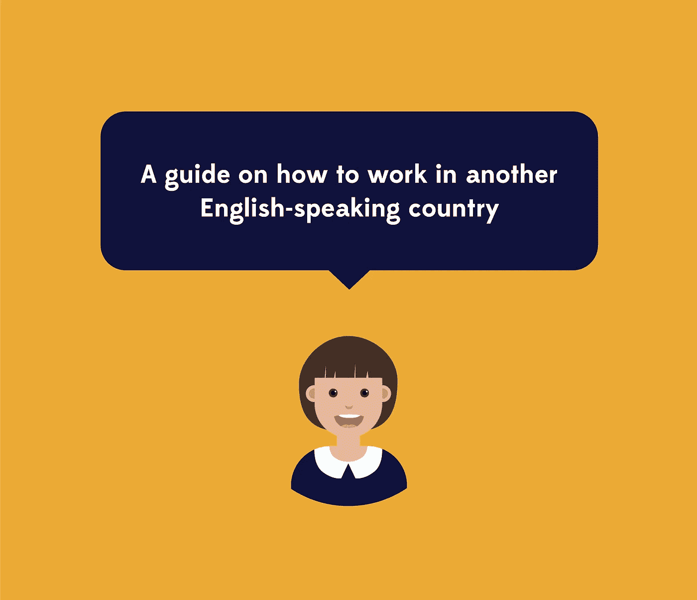

美国移民制度令人沮丧！在所有的税收、学费和一份很好的工作之后，在 H1-B 过程中，如果没有中奖，你仍然可能被踢出这个国家。

是的，我们可以为唐纳德·特朗普祈祷。但是我要说，如果我们把自己的未来掌握在手中会更好。

这里有一点关于我的…

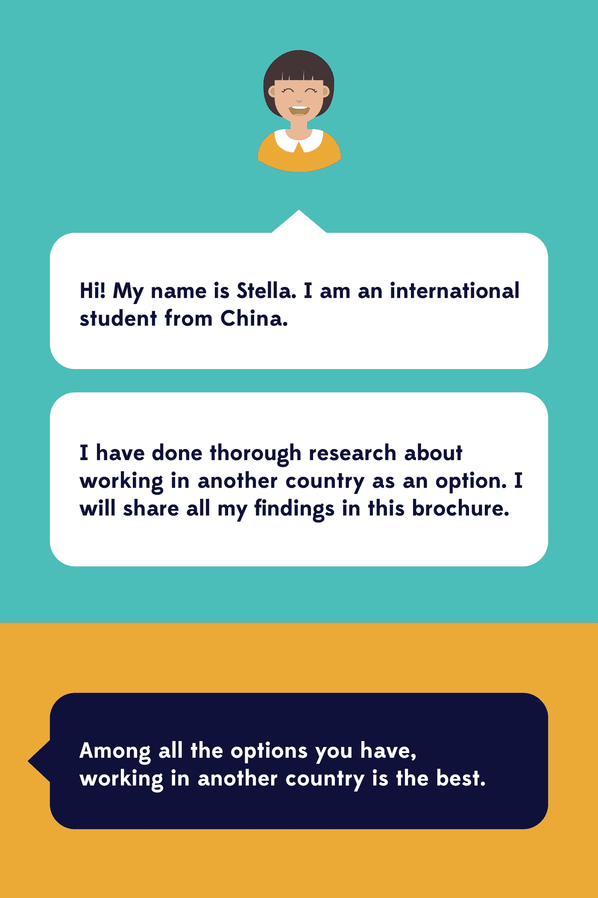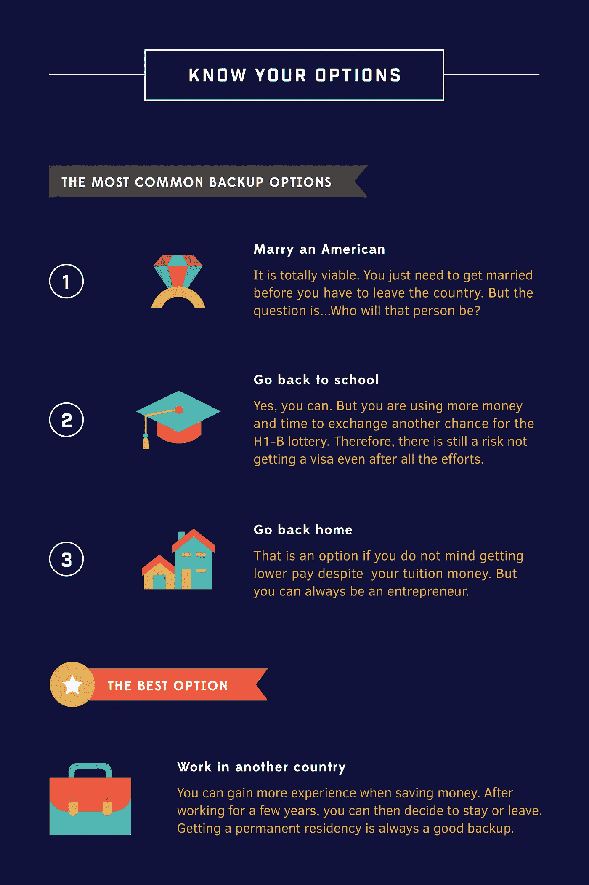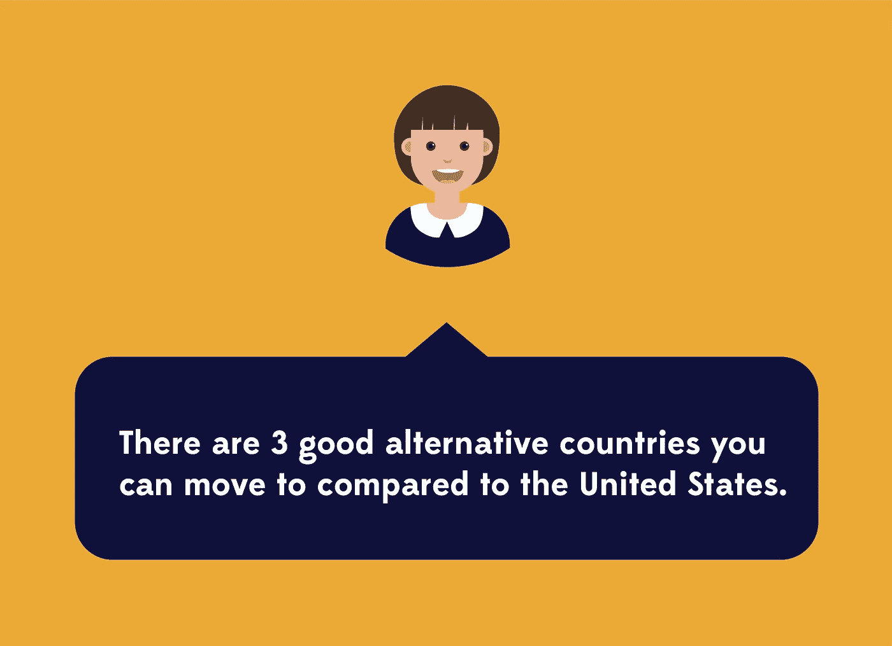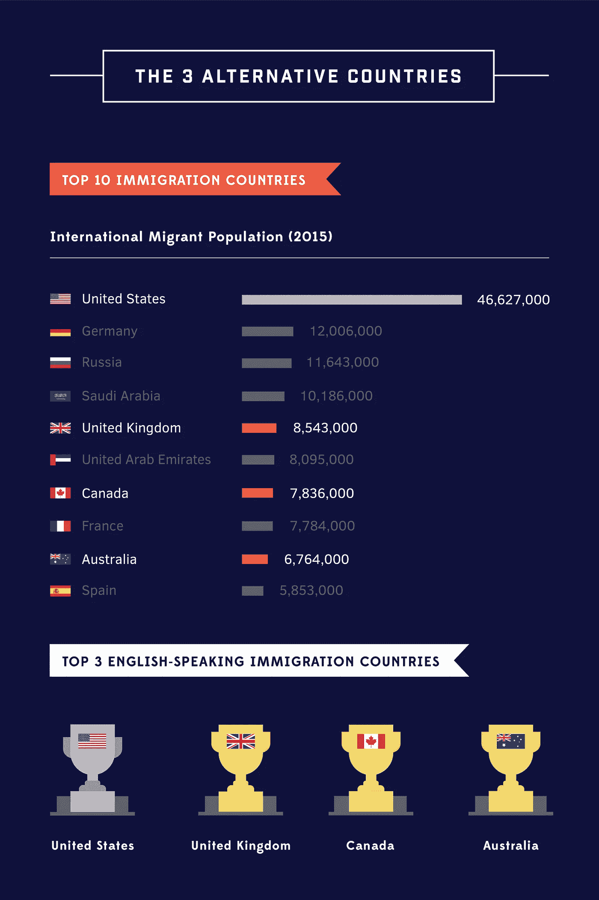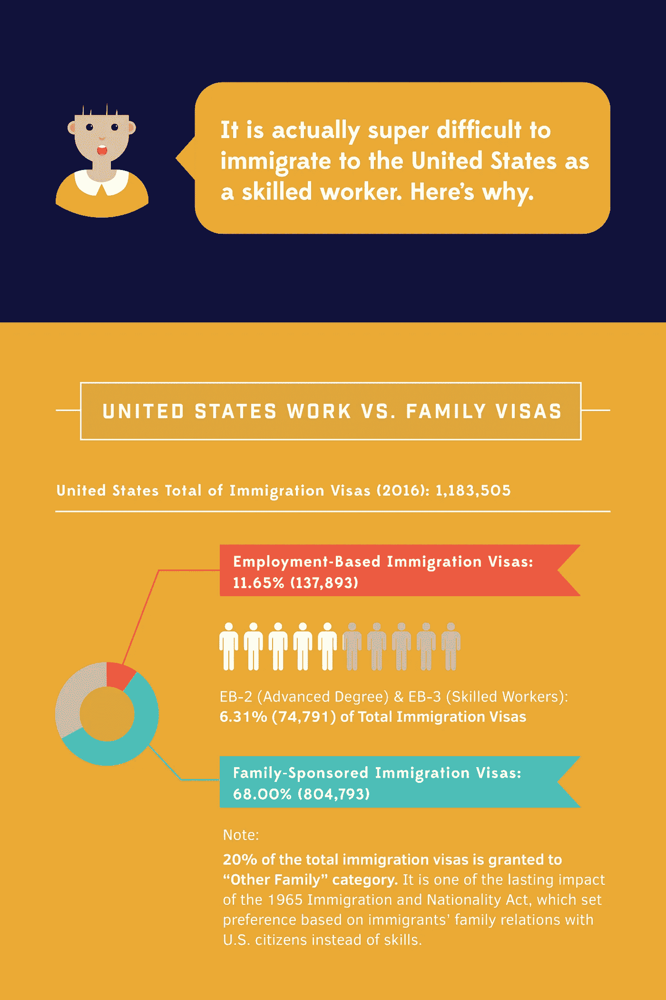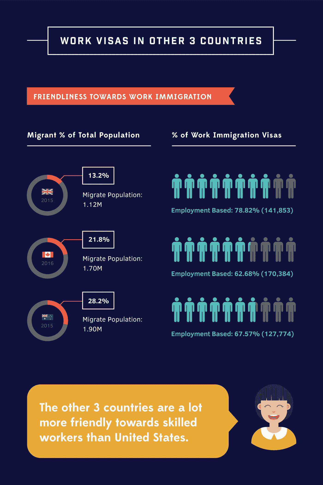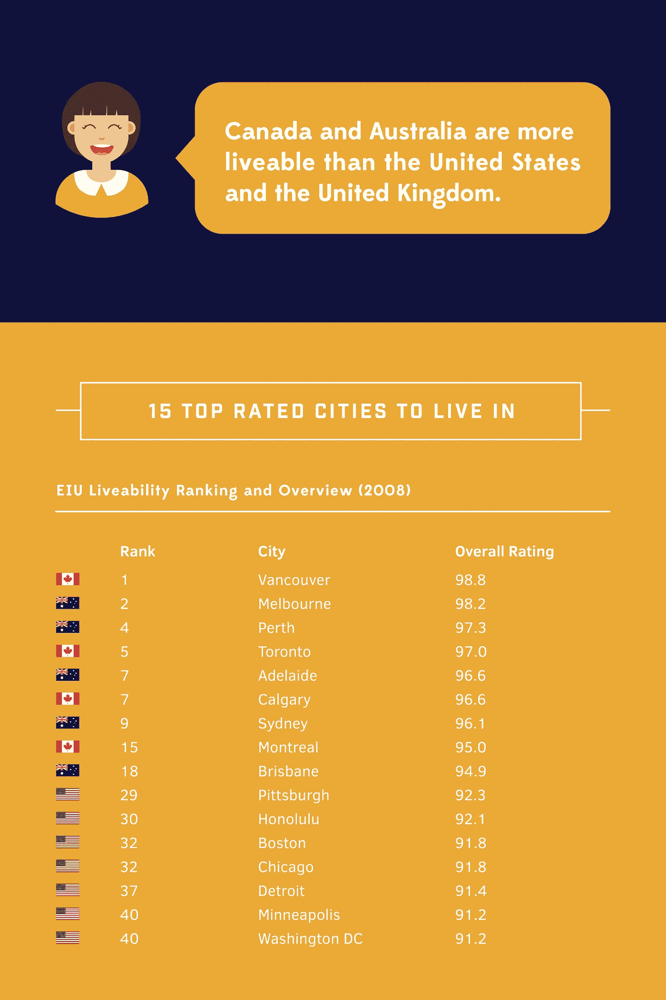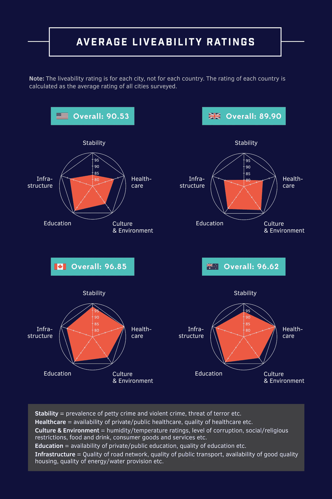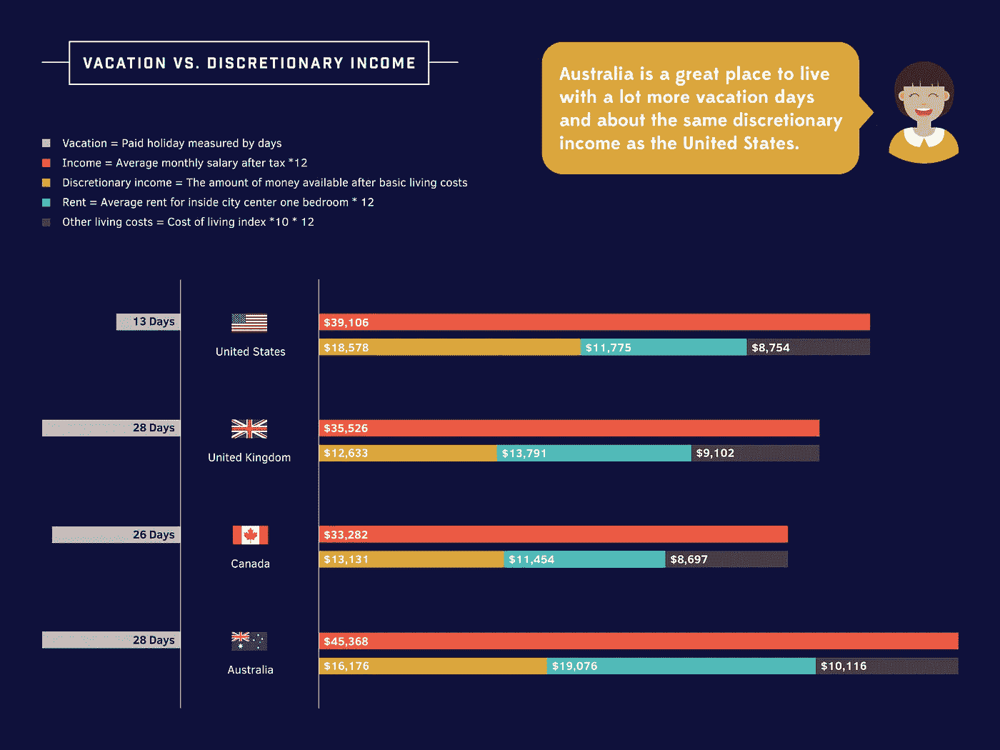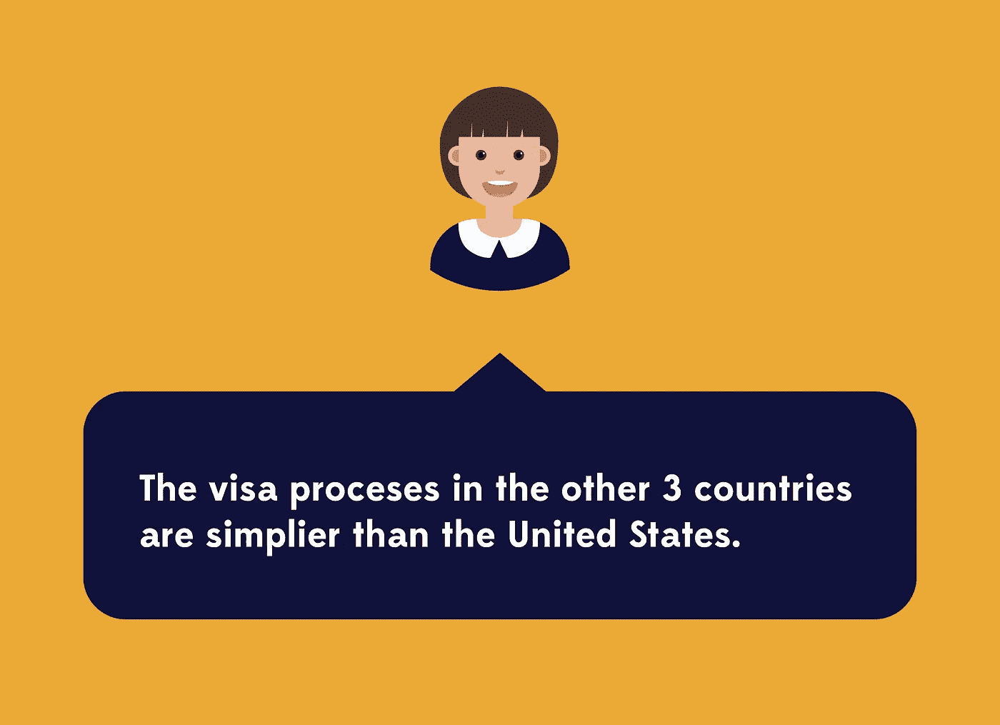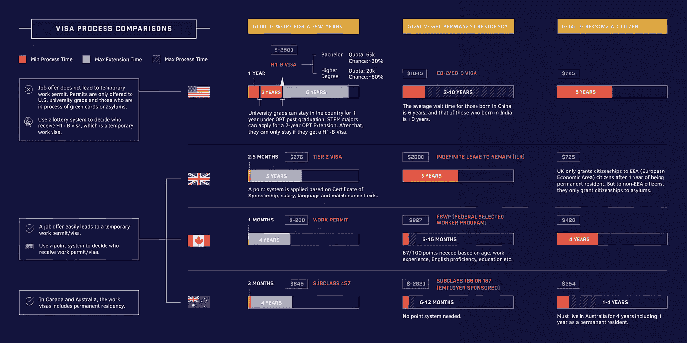

到目前为止，我相信你应该相信，如果你没有获得 H1 B 签证(或者如果你想去冒险)，移居到另一个说英语的移民国家确实是一个合法的选择。

这可能需要做很多工作，但这是值得的。

最后，如果你觉得这篇文章有帮助，记得给它一个掌声。它将允许人们看到它并使用这种资源。

祝你好运！

2022 年 1 月更新:2021 年 6 月，我搬到了加拿大。我通过公司内部调动获得了 Salesforce 的工作签证。如果你也在考虑类似的可能性，那就 ping 我，我们聊聊。

# 来源

1.  美国移民签证类别分布年报[https://travel . state . gov/content/travel/en/legal/visa-law 0/visa-statistics/annual-reports . html](https://travel.state.gov/content/travel/en/legal/visa-law0/visa-statistics/annual-reports.html)
2.  1950-2015 年国际移民人口[https://www . migration policy . org/programs/data-hub/international-migration-statistics](https://www.migrationpolicy.org/programs/data-hub/international-migration-statistics)
3.  2016 年英国移民签证分布[https://www . gov . uk/government/publications/immigration-statistics-July-to-September-2015/list-of-tables](https://www.gov.uk/government/publications/immigration-statistics-july-to-september-2015/list-of-tables)
4.  加拿大移民签证分布，2016[https://www . Canada . ca/en/immigration-refugees-citizenship/corporate/publications-manuals/annual-report-parliament-immigration-2016 . html](https://www.canada.ca/en/immigration-refugees-citizenship/corporate/publications-manuals/annual-report-parliament-immigration-2016.html)
5.  澳洲移民签证发放[https://www . home affairs . gov . au/ReportsandPublications/Documents/Annual-reports/DIBP-Annual-Report-2014-15-optimized . pdf](https://www.homeaffairs.gov.au/ReportsandPublications/Documents/annual-reports/DIBP-Annual-Report-2014-15-optimised.pdf)
6.  2008 年 1 月宜居性排名和概述[https://store.eiu.com/article.aspx?productid=475217632](https://store.eiu.com/article.aspx?productid=475217632)
7.  各国平均休假天数[http://www . VP calendar . net/average-vacation-days-by-country . html](http://www.vpcalendar.net/average-vacation-days-by-country.html)
8.  全国平均月可支配工资/市中心一居室平均租金
    [http://www.nationmaster.com/country-info/stats](http://www.nationmaster.com/country-info/stats)
9.  各国生活成本指数
    [https://www . numbeo . com/cost-of-living/rankings _ by _ country . JSP](https://www.numbeo.com/cost-of-living/rankings_by_country.jsp)
10.  美国工作签证资格及等待时间
    [http://www.immi-usa.com/immigration/employment-green-card/](http://www.immi-usa.com/immigration/employment-green-card/)[https://travel . state . gov/content/travel/en/us-visas/immigrate/employment-based-immigration-visas . html](https://travel.state.gov/content/travel/en/us-visas/immigrate/employment-based-immigrant-visas.html)
11.  英国工作签证资格和等待时间[http://www.ukpermits.com/visa-types/tier-2](http://www.ukpermits.com/visa-types/tier-2)
12.  加拿大工作签证资格及等待时间[https://www.canadianvisaexpert.com/visa-types/](https://www.canadianvisaexpert.com/visa-types/)[https://www . Canada visa . com/Canadian-immigration-application-processing-times . html](https://www.canadavisa.com/canadian-immigration-application-processing-times.html)[https://www . Canada visa . com/Canada-immigration-processing-times . html](https://www.canadavisa.com/canada-immigration-processing-times.html)
13.  澳洲工作签证资格及等待时间【http://visacorp.com.au/australian-skilled-visas.htmlT21[http://www . Thames migration . com/Australia-visa-application-processing-times-2017/](http://www.thamesmigration.com/australia-visa-application-processing-times-2017/)