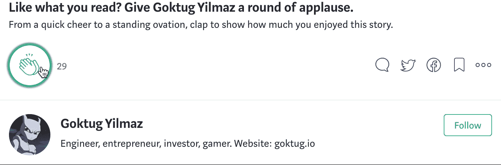

# 如果你必须在 10 年内 HODL 只有 1 种加密货币，你会怎么选择？

> 原文：<https://medium.com/hackernoon/if-you-had-to-hodl-only-1-cryptocurrency-for-10-years-how-should-you-choose-5b1030293915>

让我们想象一个[思维实验](https://fs.blog/2017/06/thought-experiment-how-einstein-solved-difficult-problems/)，你将你的整个加密货币投资组合转移到一枚硬币上，然后通过低温技术将你的身体冷冻 10 年。你应该如何选择一枚硬币？在这种情况下，解决问题的最佳方式是防御性的。避免丢失硬币的可能性，并确保该协议将在未来 10 年内继续有效，这应该是您最关心的问题。

以下是协议或[网络](https://hackernoon.com/tagged/network)可能消亡的几种方式:

1.  矿工、黑客、对手协议或政府的持续多数攻击
2.  严重的[设计](https://hackernoon.com/tagged/design)问题
3.  代码中的严重错误
4.  开发团队内部的腐败
5.  量子计算的兴起
6.  加密算法已经过时
7.  对团队和社区的不信任

应该采用什么决策模型来确保您的硬币不会遭受这些潜在的漏洞？

## 1.多数攻击

为了在攻击中幸存，硬币应该:

*   a)拥有与其他币完全不同的挖掘算法。这将使大型矿工池很难将他们的 [ASIC](https://en.bitcoin.it/wiki/ASIC) 散列功率切换到您的硬币并集中它。
*   b)理想情况下，硬件数量和产生功率的模块数量不应相关。一个关联迟早会导致某一方的网络中心化。这可以通过改变共识机制来实现。能力证明比工作证明更难被接受。由于令牌的早期所有权，股权证明将使集中化变得更加困难。
*   c)是免疫的经典已知攻击:西比尔，拒绝服务，洪水，双花，网络拒绝，芬尼等..
*   d)具有低成本安全性和分散性，这通常是能量硬币的问题。传统的资本主义激励导致矿商创建资金池，变得更有效率，最终变成收购小公司的大公司。这种竞争增加了每枚硬币的电力和硬件成本。最终，这些公司变成了垄断企业。如果安全和去中心化的成本很高，矿工们将会——通过经济激励——获得一个权力的位置，在那里他们可以慢慢地摧毁整个网络。

## 2.严重的设计问题

一些协议在设计上就存在严重的安全问题，并且具有非常大的攻击面。虽然公众意识到了这些问题，但开发人员似乎受到了一致性偏见的影响，不会/不能解决这些问题。直接消除这些协议将是最好的选择。

## 3.代码中的严重错误

协议包含的功能越多，攻击面就越大，也更容易出现漏洞。因此，理想情况下，一个没有数百个用例和智能契约的协议将是一个安全的选择。你需要的只是保证账本的安全。

此外，最危险的错误并不是恶意开发者放入错误并试图破坏网络的错误。代码通常经过同行评审和测试，这有助于轻松捕捉和惩罚这种行为。即使这种类型的错误进入了实时版本，当被发现时，网络可能会分叉。

一种更危险的错误形式是，当一个善意的开发人员在改进协议时，创建了一个通过同行评审过程的错误。然后一小群人发现并利用它，几年内都不会被注意到，直到漏洞被发现。这将危及对协议的信任。

防止恶意开发人员产生错误的方法:

*   a)拥有更好的组织和招聘流程
*   b)有办法跟踪开发人员的意图和心理健康
*   c)拥有更彻底的同行评审流程

防止善意开发人员开发错误的方法:

*   a)保持代码库不变。(没有新功能，没有提交，代码库保持不变)
*   b)在安全工具、库和语言的基础上构建协议，使得[不太可能产生 bug](https://softwareengineering.stackexchange.com/questions/22769/what-programming-language-generates-fewest-hard-to-find-bugs)。比如使用一种[功能](https://steemit.com/functional/@nphacker/why-functional-languages-should-be-used-for-blockchain-development)，强&静态类型，内存安全的编程语言。
*   c)雇用或授权给不会引入错误的世界级开发人员。选择一种[函数式编程语言](http://degoes.net/articles/blockchain-myths)将会间接把你引向世界级的开发者。

为了防止这两类错误:

*   a)有一个非常正式、严格、科学的方法流程来更新协议

## 4.开发团队内部的腐败

如果团队从一开始就是腐败的，并且十年内都不打算支持该协议，那该怎么办？如果他们想在几年后翻转项目以获取利润怎么办？或者，如果由于政治或其他因素，团队成员慢慢改变，协议中的大部分权力最终被一群人拥有？(像 BitPay/Blockstream 控制比特币开发)这种事件可能会伤害社区的信任。这些人可能会决定在网络上加入对自己有利的功能，他们可能会故意停止对协议的改进，他们可能会想办法从其他人那里窃取硬币，给自己一些优势，等等..

## 5.量子计算的兴起

未来 10 年量子计算可能会也可能不会进入我们的生活。但它确实有真正的机会用于大数据中心，特别是加密挖掘设施。想象一下，一家矿业公司的哈希速率有一天增长了 1000 倍。这有可能严重影响网络中的所有平衡。防止这种情况的方法有:

*   a)具有量子电阻算法
*   b)有一个不具备处理能力的共识算法
*   c)有一个团队已经计划好并准备好应对这样的巨大变化

## 6.加密算法已经过时

如果你看看密码学的历史，每个算法最终都会被破解。这就是为什么我们要创造新的算法。问题是要多久才能算出破解它的数学方法。每一种算法的答案都会改变，但这种情况时不时会发生，整个行业都必须改变他们的算法。

如果使用的加密算法变得过时、易受攻击或被破解，协议需要使用新的加密算法。为这种情况做好准备的团队可以很容易地更新他们的加密，而其他人就不那么容易了。如果破解加密的方法突然变得广泛可用，并且存在明显的攻击和黑客行为，那么协议可能会被硬破解。但是，如果一个小团体秘密破解了算法，或者我们的计算能力增长到足以用暴力破解它，那可能对协议是毁灭性的。

## 7.对团队和社区的不信任

这可能是一个主观的标准，但却是一个重要的标准。该协议应该有一个称职的、善意的团队和社区围绕着它。总会有坏演员，但如果核心人物是好演员，长期损害将是最小的。理想情况下，你会希望人们在你睡觉的时候奋力保护你的硬币和协议。人类的直觉善于发现这些，所以如果很多人不信任一个团队，最好远离他们的协议。

其他需要考虑的事项:

*   运行一个 masternode 10 年将提供巨大的经济回报，但协议被破坏的风险应该是优先考虑的问题，因为 master node 可以提供的回报将比不上你所有破产的投资组合。
*   如何保护您的私钥？显然是通过使用冷钱包，但如果你永远不会从你的冷冻会议中醒来呢？你的私人钥匙会寄给你的家庭成员吗？还是用 multisig 拆散给 5 个人？你怎么知道他们不会在接下来的 5 年里耍你？也许可以考虑给 multisig 加一个时间锁？
*   如果协议实际上是有用的，并且被市场接受，这是最佳的。虽然它可能非常安全，但如果这个协议没有被市场接受，你的硬币价值在 10 年内只会下降。没有被市场采用也为多数攻击创造了巨大的风险。你可能一觉醒来，发现硬币仅仅因为市场力量就下跌了 99%。

将这些标准投入使用的一个好方法是创建一个电子表格，并检查每种加密货币的每种风险。

