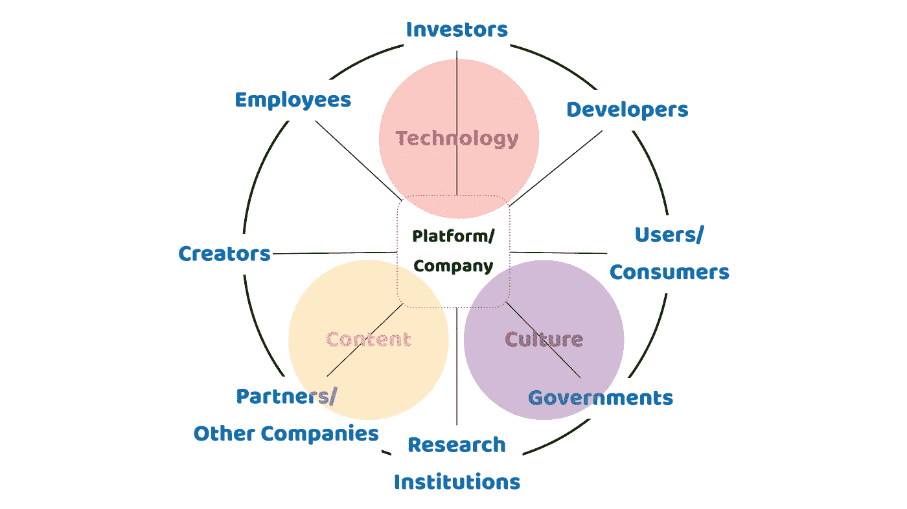
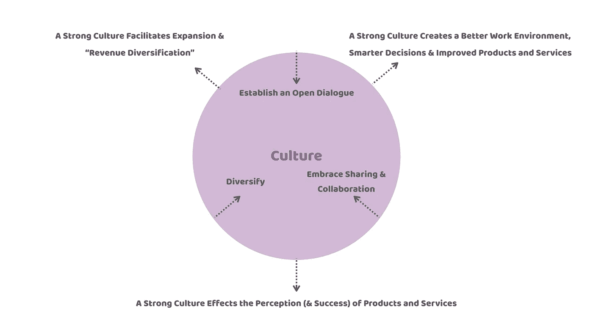

# 如果你想成功，不要忽视文化

> 原文：<https://medium.com/hackernoon/if-you-want-to-be-successful-dont-ignore-culture-13a48637ebec>

## 大多数企业低估了文化的力量，或者认为文化是建立在过程之上的

Photo by [Jonny Clow](https://unsplash.com/photos/BuMVDXZTGn0?utm_source=unsplash&utm_medium=referral&utm_content=creditCopyText) on [Unsplash](https://unsplash.com/?utm_source=unsplash&utm_medium=referral&utm_content=creditCopyText)

上周，我在罗马谈论了数字化转型及其对初创公司的影响。观众知识渊博，准备充分，但他们未能体会到文化的力量及其对企业建立和保持成功前景的影响。

意大利的观众希望建立一个平台业务，向软件开发人员和科学家传播地球观测数据。他们希望这将加快联合国称为可持续发展目标的关键领域的研发，如零饥饿、良好的健康和福祉、清洁水和卫生设施。

重点是数字技术以及这些技术可以提供的产品和服务。他们了解数字技术，如大数据、云服务、人工智能甚至区块链技术，是如何影响组织、产品和服务的。

他们似乎也接受了 Eric Ries 的*精益创业*“构建-测量-学习”反馈循环，在这个循环中，你首先基于一个想法和一些确定的假设构建一个“最小可行产品”(MVP)。然后，MVP(以及想法和假设)将接受严格的测试和衡量，并将结果和数据整合到一个学习过程中，使公司能够完善 MVP 和潜在的想法/假设。

虽然这种对“技术”和“内容”的关注对于建立可持续发展的企业至关重要，但它没有认识到文化的力量。我的观众似乎不明白“文化”是至关重要的“第三维度”(与技术和内容(即产品)一起推动初创公司的业绩和成功)。

Three Dimensions of Business Success in a Digital Age

# **为什么文化很重要**

## *(1)强大的文化创造了更好的工作环境、更明智的决策以及更好的产品和服务*

布莱恩·切斯基(Brian Chesky， *Airbnb* 的联合创始人)在 2013 年 10 月 21 日的信中解释了第一个原因。

 [## 不要搞砸文化

medium.com](/@bchesky/dont-fuck-up-the-culture-597cde9ee9d4) 

文化越强大，对企业流程和程序的需求就越少。我们都知道，随着时间的推移，流程和程序会扼杀创造力，破坏组织文化。

这是一个非常重要的观察，因为我知道的许多公司都使用公司流程和程序来确保核心价值观得到维护。当“程序”很容易成为问题时，他们将它视为解决问题的方法。

相反，对可识别的核心价值观的不断奉献是建立和维护强大文化的关键。

为了创造这样一种真正的企业家精神、信任、自由和责任的文化，企业必须在所有的决策和运营中确定并“遵守”一套核心价值观。这种文化需要成为这些核心价值观的真实生动的体现。

如果做得“正确”，公司文化可以为更好的决策和更好、更有成效的“产出”做出重要贡献

比如你“雇佣和解雇”谁，就应该由这些核心价值观来决定。强大的文化可以带来更高的忠诚度和强烈的社区意识，从而吸引和留住最优秀的人才。这确保了整个组织是统一的，一起工作以实现一个共同的目标。

## *(2)强大的文化影响产品和服务的感知(和成功)*

文化已经成为公司产品或服务的重要元素或“组成部分”。

在数字时代，商业文化是无法掩盖的。迟早，它会变得可见，并决定消费者对产品或服务的看法。因此，文化不再与产品区分开来，而是产品的一部分。如果这种文化在某种程度上是“错误的”，用户和消费者更有可能拒绝一家公司的产品，转向竞争对手。

《纽约时报》**最近的一篇文章把同样的观点表述如下:**

> ***“不要只考虑一个产品有多好，还要看看谁在制造它，它是如何销售的。”***

**这一点最近在游戏行业变得非常明显。例如，考虑一下 [*Kotaku*](https://kotaku.com/inside-the-culture-of-sexism-at-riot-games-1828165483) 发表文章《在*暴乱游戏中的性别歧视文化内部》的影响***

***Riot Games* 知道有毒的“兄弟文化”会让员工、前员工、承包商以及玩家和粉丝失望:**

> **“我们知道游戏背后的工作室是你对游戏感受的重要组成部分。我们知道我们让您失望了，我们致力于解决这个问题。”**

**人们普遍认为，对防暴游戏的未来前景而言，修复文化是至关重要的下一步。**

**或者，就拿最近的*暴雪*-暗黑不朽惨败来说。在一次为铁杆粉丝举办的活动上，这一笨拙的宣布——暗黑破坏神系列的新版本将是一款“仅限手机”的游戏——揭示了内部公司文化和更广泛的粉丝群之间的严重脱节。**

**结果呢？对暗黑破坏神专营权和(可能的)球迷迁移的严重损害。**

**这些失误揭示了在数字时代，产品和公司文化的紧密联系。**

**文化上的失败——甚至是公司和消费者之间脱节的感觉——都会扼杀公司的成功前景。获得“正确的”文化可以使所有利益相关者之间更加紧密地结合，从而更好地理解“产出”，并最大限度地增加成功的机会。**

## ***(3)强势文化有利于扩张&“收入多元化”***

**在罗马提出的另一个问题是，大多数最大的平台公司都依赖一个主要的收入来源:主要是广告(*脸书、谷歌*)、交易(*亚马逊*)或订阅( *Spotify* 、*网飞*)。**

**从中长期来看，这种方法似乎有风险。在一个拥有强大和开放文化的企业中，“利益相关者的声音”可以成为一个极其重要的灵感来源，推动向新领域扩张，从而实现收入多元化。**

**利益相关者是消费者、投资者，但也包括其他公司(即供应商、合作伙伴、初创企业)和开发商。利益相关者的声音在提供动力和确定其他收入来源方面非常重要。**

**之前写过印尼的[*Go-Jek*](https://hackernoon.com/3-ways-to-grow-your-business-in-a-digital-age-86e8bb3f33d1)*。 *Go-Jek* 是开放文化如何帮助推动和指导必要的“收入多元化”和“产品扩张”的一个明显例子。***

# ****如何打造强势文化？****

**如前所述，强大的文化与公司的核心价值观相关。这些核心价值观会随着时间的推移而改变，但仔细观察数字世界中最成功的公司就会发现，有三个原则至关重要。**

****

**The Three Principles of Company Culture**

## ***(1)建立公开对话***

**它总是关于交流。在数字时代，利益相关者不仅仅想要被告知；他们想和公司合作。建立和保持公开对话。很重要。社交媒体使这比以往任何时候都更容易，并利用新的交流形式(博客、视频博客、Twitter 等)。)至关重要。**

## ***(2)充分拥抱分享和协作***

**正如塞特亚·纳德拉正确指出的:**

> **当每个开发人员都可以一起创作、协作、共享代码并基于彼此的成果时，真正的力量就来了**

**营造一个能提供参与性和有意义的体验的环境也需要商业领袖投入时间和资源。需要鼓励利益相关者的参与，并且需要以不同的形式分享(例如，信息、收入分享、津贴等。).**

## ***(3)多样化！***

**初创企业失败的原因之一——尤其是在持续扩大规模方面——是它们没有拥抱“多样性”**

**再次， *Riot Games* 提供了一个很好的例子。他们的“兄弟文化”最初非常成功。它导致了历史上最成功的游戏之一:英雄联盟。但为了进一步发展壮大，他们现在认识到，在当今的数字世界中，包容性、多样性、尊重和平等是不容讨价还价的。**

**当然，多样化并不总是容易的。它会导致问题，需要管理。但是利用这种紧张所产生的创造力是很重要的。**

** [## 我们前进的第一步

### 在过去的三周里，我们一直专注于听力和学习。作为一家公司，我们习惯于修补问题…

www.riotgames.com](https://www.riotgames.com/en/who-we-are/our-first-steps-forward) 

# **文化不软**

我的印象是，一个组织的“软”方面很快就被抛弃了。“文化对话”和投资时间建立强大的文化通常被视为一种无关紧要的奢侈品，一家苦苦挣扎的初创企业负担不起。

但是这种态度与事实相去甚远。为致力于共同愿景和价值观的员工营造一个充满灵感和协作的工作环境，是确保持续成功和保持不断追求“新”的唯一途径

毕竟，这是在当今高度竞争和快速发展的全球市场中取得成功的必要条件。** 

***非常感谢您的阅读！请按住*👏*下面，还是留下评论吧。***

**每周都有新的故事。因此，如果你关注我，你不会错过我关于数字技术如何改变我们生活、工作和学习方式的最新见解。**