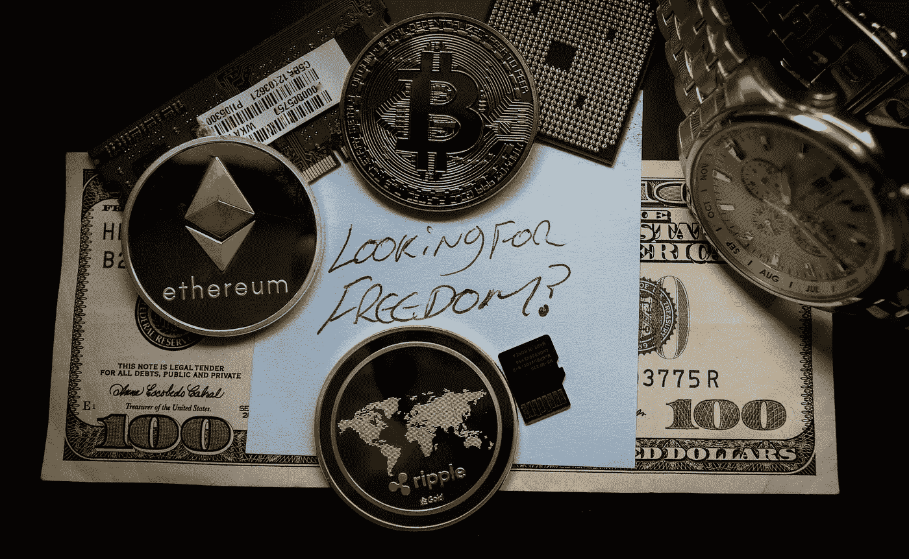
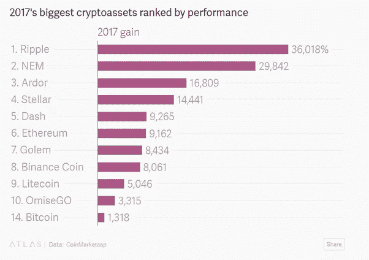

# 如果你想用 1 万美元获得 5000%的回报，只买加密货币，你现在会投资什么？

> 原文：<https://medium.com/hackernoon/if-you-wanted-to-make-a-5-000-return-on-10-000-only-buying-cryptocurrency-what-would-you-invest-1492f19568eb>

> 这个答案最初发布在 Quora 上。[可以在这里查看答案](https://www.quora.com/If-you-wanted-to-make-500k-by-the-end-of-2018-with-only-10k-to-buy-cryptocurrencies-what-would-you-invest-in-now/answer/Brian-Schuster-5)。更多来自 [Quora](https://medium.com/u/3853f85f7d5e?source=post_page-----1492f19568eb--------------------------------) 的趋势科技答案，请访问【HackerNoon.com/quora】的。

首先，你必须从正确的假设和对风险的正确理解开始。为了获得 50 倍的投资回报，你必须承担一些非常大的风险，即使是按照加密货币的标准。这也意味着接受这很可能不会发生的事实。但是如果你*有*得到 50 倍，我会这样考虑这个问题…

**投资以太坊、比特币或任何其他排名前 10 的加密货币可能不会有什么影响**。你将不得不投资于今天价值非常低的东西，这意味着你将不得不看到市场其他人今天不重视的东西，并希望市场最终会纠正过来。

我不是说找到一个代币，访问他们的网站并认为他们“有机会”，我的意思是实际上对市场将如何变化以及你的特定代币将如何从中受益有一个基本假设。不仅如此，您还需要用代币购买进行两次下注:

1.  你感兴趣的加密货币将会改变相对排名(比如从不到 200 名到前 20 名)
2.  整个市场将会反弹(从 3000 亿美元涨到更高的水平)

如果这两个假设中的任何一个失败，你都不会获得 50 倍的回报。相比之下，[去年(2017 年)只有 9 个代币能够获得 50 倍的回报](https://qz.com/1169000/ripple-was-the-best-performing-cryptocurrency-of-2017-beating-bitcoin/)，这是加密货币的突破之年。

**那么，想要 50 倍的回报，现在应该投资什么呢？**我不会给你一个特别的令牌(也永远不会给你)，但是如果我尝试这样做的话，下面是我的方法:

*   找到一种不在市值前 20 名的加密货币中、基本面“良好”的代币。这是一个很大的话题，我会在我的其他帖子和平台中详细介绍，但它的核心包括拥有一个经验丰富的团队，一个坚实的使命，实现这个使命的技术，并且不会搞砸。
*   当你有了一些通过你的第一次投资价值测试的加密货币时，通过加入他们的 slack，reddit 和任何其他沟通渠道，找到你联系最多的一种。深入了解这些团队，了解你希望长期与哪一个团队合作。
*   大量投资，尽可能安全地锁定你的投资，成为这个社区的一部分。说真的，去写文档，帮助写文章，真正熟悉这个项目，并尝试构建一些东西。你可以帮助改进这个项目，而不会在社交媒体上成为一个彻头彻尾的推手(以及在大多数情况下丢失的艺术)，并最终在这个项目中找到你真正喜欢的东西。

最后，在达到 50 倍之前不要卖出。否则有什么意义？

Brian Schuster 是区块链行业的开发人员和作家。自 2017 年 1 月以来，他的内容被观看了超过 500 万次。你可以在他的 pateron 页面 *上查看更多的* [*他的内容，他在这里*](https://www.patreon.com/hivergent) [*制作内容，帮助他的观众在这个新兴行业中找到自己的位置。*](https://www.patreon.com/hivergent)