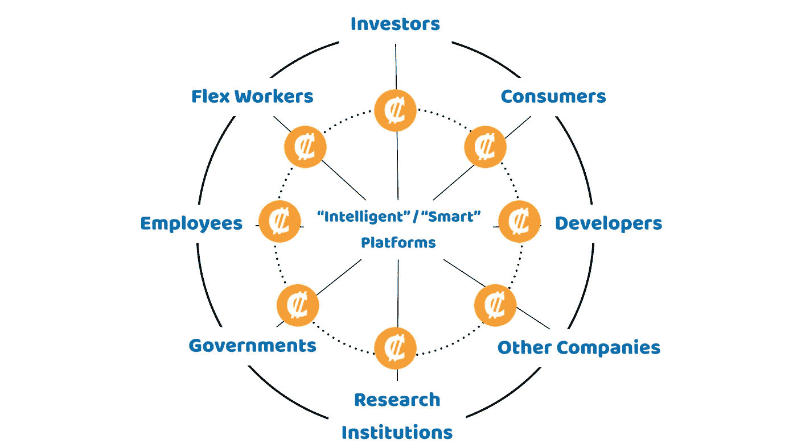

# 忽略加密硬币和代币是一个错误

> 原文：<https://medium.com/hackernoon/ignoring-crypto-coins-tokens-is-a-mistake-7dba38146ec5>

## 公司在秘密经济方面不能太慢

让我们思考一下“秘密经济”。

自从我在 2016 年成为“区块链爱好者”以来，我交谈过的许多人都将加密货币视为法定货币(由中央政府发行)的替代品。或者，他们将其与首次公开募股(ico)联系起来，这是一种不受监管的企业融资方式(尤其是年轻的科技公司)。其他人则更不屑一顾:他们认为这只是炒作。

我觉得三观都是“错的”。至少，我不认为这是在加密经济中硬币和代币的真正价值所在。

相反，加密硬币和代币将成为公司在快速变化的数字世界中保持相关性的重要“工具”。各个企业将发行自己的代币，这种公司专用代币将在未来公司如何运营、通信和交易中发挥至关重要的作用。

为了理解“为什么”和“如何”，思考“平台”以及每个公司都需要将自己视为智能平台的想法是有帮助的。

# **密码经济中的“智能平台”**

我以前用过“[智能平台](https://hackernoon.com/working-for-a-big-company-can-be-fun-if-8eaf1eb560d9)”(或“智能平台”)这个术语。

在技术驱动的“数字世界”中，许多最大、最成功的企业现在都以“智能平台”的方式运营。这些平台利用网络技术来促进经济交流、传递信息和联系人们。

想想*亚马逊*、*苹果*、*脸书*，或者*谷歌*。这些公司都促进价值创造者和提取者之间的互动，并为平台本身创造财富。

但这些平台不仅仅是利用新技术来实现经济或社会互动。智能平台的共同之处在于，它们以一种更扁平、更包容的方式设计自己的“内部”和“外部”组织。这促进了多个参与者之间的实验、协作和创造性。这些参与者包括消费者、员工、投资者、灵活工作人员、开发人员、内容创建者、服务提供商、其他公司(无论大小)、非营利组织、教育机构、政府等。

通过这样做，他们最大限度地增加了平台产品、服务和其他解决方案不断创新的机会。

“智能平台”的真正智能之处在于，它利用平台参与者的输入和反馈来不断改善他们对“平台”的体验和参与。

这就是加密硬币和代币变得必不可少的地方:

> 与其说是一种通用货币或融资机制，不如说是一种创新组织设计方法的工具。

通过向平台功能添加“令牌”,企业可以创造多种机会。由于所有企业(不仅仅是科技企业)都需要考虑成为一个智能平台，颠覆的潜力是巨大的。

# **令牌驱动的组织设计**

偶尔，你会读到或听到使用区块链技术、加密硬币和代币来设计平台。

 [## 加密令牌:开放网络设计的突破

### 互联网和网络被创建为开放平台，任何人——用户……

medium.com](/@cdixon/crypto-tokens-a-breakthrough-in-open-network-design-e600975be2ef) 

对我来说，这就是秘密经济的真正含义。

当我上周在杜塞尔多夫的暑期学校讲座上讨论代币驱动的组织设计的好处时，很明显，我们可以预计在不久的将来会看到更多基于区块链的硬币和代币。

我们可以称它们为“公司/行业专用”硬币或代币，如果你愿意，也可以称之为“忠诚”硬币或代币。在加密经济中，公司(或公司集团或行业)将发行自己的令牌，作为平台运营的一个组成部分。

这些令牌可以执行许多功能并带来多种好处:

## **#1 —津贴**

在他的书 [*区块链大师&初始硬币发行*](https://www.amazon.com/Masters-Blockchain-Initial-Coin-Offerings/dp/1718610572) 中，Andrew Romans 将这些硬币/代币的发行比作一家公司(或一群公司)的忠诚度计划。硬币/代币提供获得产品、服务、折扣和/或其他优惠的途径。这将类似于忠诚度计划，有助于聚集参与者社区，如开发商、投资者、消费者等。在站台上。他们将个人与平台的生态系统联系在一起。

## **#2 —流动性**

但与单纯的忠诚度计划不同，硬币/代币有更多的好处。最重要的是，它们提供流动性。平台参与者可以在密码交易所或二级市场上出售和转让给其他感兴趣的人。这些团体可以是“公众”或更受限制和预先定义的人群。无论哪种方式，它都将代币(和平台)融入了主流经济。

## **# 3——融资**

因为硬币/代币的所有者没有被锁定在忠诚度计划中，所以发行硬币/代币可以是为平台吸引资本/资金的直接且相对简单的手段(无需发行公司股份)。

## **# 4——一个公平的竞争环境**

智能平台是围绕通过开放、包容和持续的“共同创造”过程实现持续创新的理念构建的。

多个参与者对于一个成功的平台至关重要，但每个群体可能都有其独特的能力。一个设计良好的代币驱动平台可以仔细规划硬币/代币在所有网络参与者中的分配。

所有的参与者(消费者、开发者、投资者等等)都团结一致，为平台的成功而共同努力。硬币或代币的发行创造了一个“公平竞争的环境”

> 至关重要的是，这有助于建立一个“社区所有”的平台，它不是基于平台参与者之间的传统层级(想想股东、经理和员工之间的层级)。

通过这样做，加密硬币和代币:

*   为多个平台参与者提供适当的激励。
*   满足参与者的动态需求。
*   向所有平台参与者提供“个人”相关体验。
*   促进与“对他们重要”的社区的联系
*   帮助建立一种强大而开放的“公司文化”,包括参与、合作和联系。

简而言之，硬币/代币产品将被集成到平台的核心功能中，使其成为“社区所有和驱动的”

## **#5 —新数字技术**

最后，加密硬币和代币为整合“不远的将来”的数字技术提供了机会。

例如，硬币和代币可以被赋予“智能合约”功能，仅当满足预定义的规则和要求时才允许特定的操作/利益。

反过来，智能合约可以由“人工智能”算法来支持，允许定制服务、持续沟通和更好地协调参与者之间的利益。

# **最后一件事**

当然，我明白忠诚度硬币/令牌不会在明天被广泛引入和采用。

挑战依然存在。

基于区块链的硬币和代币仍然存在重大的监管、技术和运营缺陷。

然而，我同意区块链的“顽固派”

> 拥抱加密经济的公司将是未来的赢家。

硬币或代币的发行将与公司文化挂钩，这将是吸引和激励消费者、投资者、员工和开发商的方式，并提供预期的体验。它将与公司不断创新的能力挂钩。

当你更详细地考虑它时，你会发现区块链技术、加密硬币和代币确实提供了巨大的机会。

事实上，我认为(正如我在杜塞尔多夫所做的那样)，理解“秘密经济”将显著增加你的职业发展。

*感谢您的阅读！请点击*👏*下面，还是留下评论吧。*

每周都有一个新故事。因此，如果你关注我，你不会错过我关于数字时代如何改变我们生活和工作方式的最新见解。