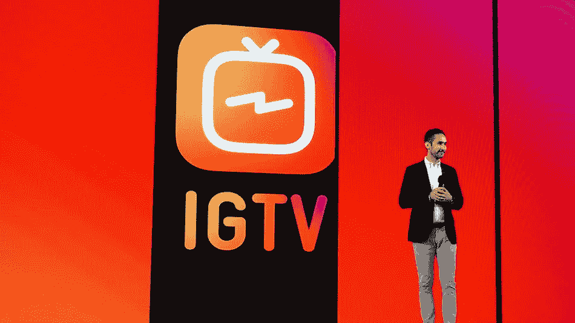
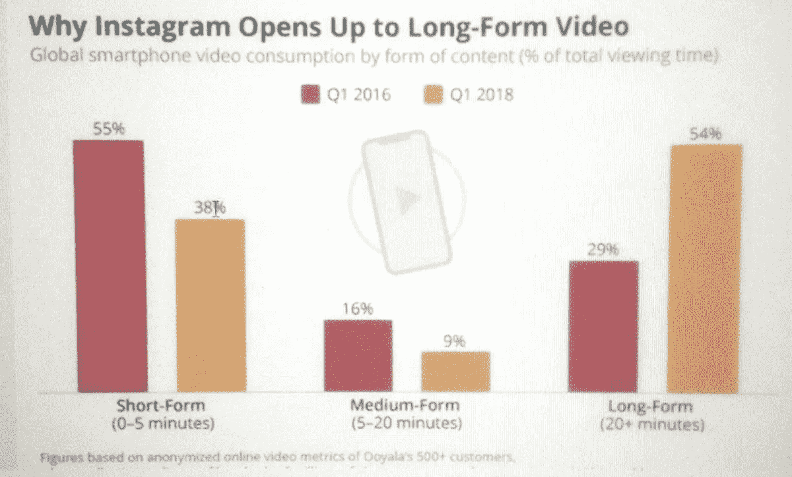
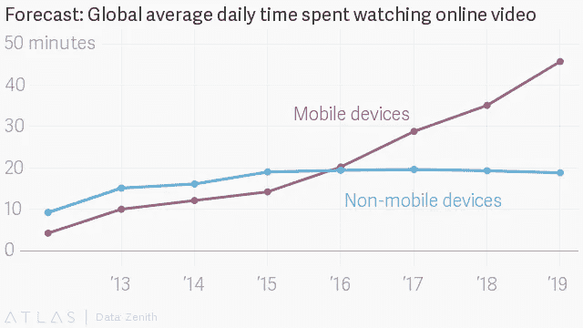

# IGTV:内容难题中的另一块砖

> 原文：<https://medium.com/hackernoon/igtv-another-brick-in-the-wall-of-a-content-conundrum-ad426dae267c>

[Source: mashable.com](http://mashable.co)

新产品发布会是职场人士一生中最伤脑筋的事情。无论你属于生产、营销还是销售部门，在一个混乱的市场中推出新产品的压力超过了一个人在一个日历年中遇到的大多数挑战。

虽然长达 16 分钟的 IGTV 发布会看起来近乎完美，但 Instagram 团队中肯定有很多人在全球发布会上可能会紧张得心都提到了嗓子眼。

首先，继 Vine(以及即将到来的 Periscope)之后，我们决定推出一款移动优先的视频产品，这无疑是我们在消费视频技术领域看到的最大胆的一步。除了[脸书](https://hackernoon.com/tagged/facebook)，我只能想到亚马逊能以如此大的规模推出新产品，来挑战像 YouTube 这样的播放器。

随着对该产品的反应纷至沓来，IGTV 让我思考它将如何进一步改变已经充满活力的消费者视频格局。这是(不可想象的)YouTube 棺材上的第一颗钉子，还是会夺走 OTT 玩家的消费时间？内容公司将如何为 IGTV 定制他们的产品？最后，对于一个品牌来说，有多少张幻灯片最适合作为 IGTV 战略资料？

以下是我的一些想法，并试图回答一些关于 IGTV 对移动视频领域意味着什么的问题。

# 商业问题

首先，让我们理解为什么 IGTV 对脸书至关重要。众所周知，FB 视频的完成率很低。由于这些糟糕的完成率，FB 上的广告费用比 YT 便宜得多。

为了让脸书在视频广告领域占据一席之地，他们需要一剂强心针。IGTV 就是那个镜头。是的，还有 FB watch，但 FB Watch 的内容成本很高，他们的 [2018 年估计超过 10 亿美元](https://digiday.com/media/facebook-watch-deals-changing/)。

与 IGTV 的内容成本相比，IGTV 的大部分内容将来自创作者社区，你就知道为什么从整个脸书投资组合的角度来看，IGTV 非常合适了。除此之外，[去年 Instagram Stories](https://www.socialreport.com/insights/article/115005343286-Instagram-Stories-Vs-Snapchat-Stories-2017-Statistics) 的成功看起来非常强劲。就我个人而言，作为一个有书要做广告的人[、](https://www.amazon.in/Buffering-Love-Stories-App-Store/dp/0143429485)[曼朱纳斯](/@manjunath2137)和我经常在这些平台和故事上做实验，到目前为止已经被证明对广告客户相当友好。

围绕视频消费出现的另一个有趣趋势是，人们不再完全反对长篇内容。不久前，有一个思想流派强烈宣传简写内容是吸引消费者进入你的平台的最佳方式。

其中一部分被脸书夸大了，在他们的报告指标下，将任何超过 3 秒的[都算作“查看”](https://www.facebook.com/business/help/743427195703387)。Vine 的兴起也顺应了这一趋势。这是昨天我的 Linkedin feed 上出现的一些关于不同视频格式消费增长的数据。来源是 Ooyala 的内部数据。

你可以在这个[链接](http://www.ooyala.com/resources/news/press-releases/video-consumption-mobile-devices-stabilizes-q1-2018-nearly-three-every)上访问新闻稿和更多数据。报告全文明确指出，关于表单内容采用时间长短的传统观点在最近几个季度被证明是错误的，在所有地区都是如此。

# 消费者用例问题

在发布会上，凯文·斯特罗姆邀请到台上的两位创作者是[布莱斯·泽维尔](https://www.instagram.com/brycexavier/)和[勒勒彭斯](https://www.instagram.com/lelepons/)。当然，发布会的目标是来自世界各地的 Instagram 影响者。虽然布莱斯是一个即将到来的视频创作者，但拥有 2530 多万粉丝的 LeLePons 在 Instagram 上拥有比大多数好莱坞和音乐名人更多的粉丝群。

Source: Instagram

凯文发出的信号很明确。他们希望 IGTV 的第一批用户成为视频世界的“酷孩子”。每一个渴望成为广告目标的品牌，都想和这些酷孩子交流。甚至像马克斯·布朗利这样的知名 YouTube 创作者也对该产品赞不绝口。到目前为止，一切顺利。

这是大多数人，尤其是 Instagram 中的人希望你忽略的部分。如果你看看 Bryce 和 LeLePons 在他们的 Instagram 页面上的内容质量，你会意识到 Systrom 的“移动优先”内容也意味着另一件事:IGTV 将使你很容易创建内容，他们不会真正关心你在平台上拍摄和发布什么。

Instagram 的创作者有他们自己的疯狂创作内容的方法，绝不是每个人都需要成为斯皮尔伯格才能成为视频影响者，但我在 Instagram 上看到的内容越多，我就越知道我们在人类的选择方面退步了。例如，保罗·尼克兰比乐乐·庞斯更需要被倾听和追随。

我的感觉是，IGTV 在降低噪音方面作用不大。相反，它将进一步扩散无用的、短暂的内容，我们中很少有人会再回头去看这些内容。从本质上讲，它将会产生更多的垃圾。

音乐、喜剧、美容、娱乐和时尚内容将在这里蓬勃发展——这也是 IGTV 将削弱 YouTube 部分消费的地方。我预计 YouTube 会对年龄较大的观众有很大吸引力，但在 2 到 3 年的时间里，YouTube 可能会像今天的电视对千禧一代一样，成为你生活中潜在的可有可无的一部分。

我之所以这么说，是因为大多数优质的高质量内容都将与网飞或迪士尼或美国电话电报公司(AT&T)等内容流媒体应用一起，位于付费墙之后。随着内容所有者、发行公司和电信公司之间的界限迅速变得模糊，我不确定哪种内容会出现在 YouTube 上，而在其他任何地方都不会出现。

我不愿评论的部分是，除了迎合 16-24 岁人群的核心类别之外，YouTube 真的会变得多么多余。

从表面上看，16X9 的格式是我喜欢视频的原因，每当我看到垂直视频时，我的脑海中都会有一种不完整的感觉。作为一个用户，我无法想象在 IGTV 上看一个很长的单口相声套路或者长格式的采访或者电影预告片。不过，我不确定有多少人在考虑移动视频时有这种区别。

YouTube 会因此在他们的应用上也有一个垂直部分吗？我认为在可预见的将来这是完全可能的。同样，这是否也意味着 YouTube 需要快速创建一个优质内容创作者的供应链？是的。这是一个响亮的是。

如果你在周末关注新闻，YouTube 对这种新的格局反应迅速，[宣布了三种新的方式让其用户从内容中获利。当然，他们知道 IGTV 正在筹备中，还有什么比给自己的内容创作者一个信号更好的方式呢，比如说:“*嘿，别忘了我们。我们是来帮你赚钱的。*'](https://marketingland.com/youtube-opens-channel-memberships-to-more-creators-rolls-out-new-revenue-opportunities-243013)

# IGTV 令人上瘾的本质

这让我想到了下一个不可避免的问题。你如何让一个大部分去放没用内容的平台成功？答案是:让产品超级直观，易于使用。

过去几天，我花了几个小时在 IGTV 应用上，我对 Instagram 和独立应用的第一反应是，它会让人上瘾。

Source: giphy.com

一个又一个视频，我知道我在看垃圾内容，不会让我变得更聪明或更聪明一点，但我一直在筛选。我特别喜欢的功能之一是*继续观看*标签。

我从来没有想过我会在有生之年说出这些话，但 IGTV 的体验回到你正在观看的视频比网飞更好。

对于 Instagram 的优秀工程师和产品团队来说，这是一个巨大的胜利。更不用说，IGTV 体验在 Instagram 中的巧妙整合意味着他们发布的营销成本将只与公关相关的支出有关，收购是通过传统应用本身驱动的。

雷德·哈斯汀斯曾有一句名言[网飞最大的竞争对手是睡眠](https://www.independent.co.uk/life-style/gadgets-and-tech/news/netflix-downloads-sleep-biggest-competition-video-streaming-ceo-reed-hastings-amazon-prime-sky-go-a7690561.html)。我想不出为什么 IGTV 的产品领导会有不同的想法。

# 未来

就产品而言，我可以看到两个改进，我认为 IGTV 将在短期内迅速推出。

1.  搜索:目前搜索功能，像 Instagram 是以用户名和标签为主导的。这似乎是最少烘烤的特点。按标题搜索视频会增加消费者的接受度。
2.  原生编辑和拍摄:鉴于 Instagram 在主应用程序上的核心专业知识，这是一个相对容易的修复方法。

在内容方面，虽然发布活动的姿态是围绕独立创作者的，但我可以想象 Instagram 的合作伙伴团队会接触网飞和 WB 等公司，为 IGTV 创建独家内容。这将是他们增加平台使用时间的首要任务。

我还无法想象联合创始人会因为 IGTV 的 mau 数量而失眠。他们想要严格监控的是那些在平台上的人所花费的时间。这和视频完成率应该是未来几个月成功的衡量标准。

在商业领域，我的猜测是，在 2019 年之前，我们不会在这个平台上看到任何广告。此外，他们会对希望在平台上展示的品牌进行严格挑选，并相应地向首先在平台上做广告的品牌收取额外费用。

# 最后，在这一生中，我还需要消费多少内容？

从哲学的角度来说，我觉得人类作为一个整体将会面临更多的挑战，那就是避开大量的视频内容。[苹果签了奥普拉](https://www.cnbc.com/video/2018/06/15/oprah-winfrey-apple-original-content.html)， [YouTube 签了威尔·史密斯](https://www.theguardian.com/film/2018/jan/12/gettin-vloggy-with-it-how-youtube-might-save-will-smiths-career)，还有[网飞签了奥巴马](https://www.nytimes.com/2018/05/21/us/politics/barack-obama-netflix-show.html)，这是我在过去三秒钟内想到的前三个名字。

它会在哪里结束？

似乎我们花在手机上的时间还不够多(见下图)，我们正在更快地沉迷于 IGTV 和[biggies to coming](https://deadline.com/2018/02/disney-streaming-service-launch-slate-star-wars-marvel-1202281846/)。

Source: Business of Apps

我经常问自己的一个问题是，我是真正寻找内容的消费者，还是被猎杀的对象？

我想我们都在寻找这个问题的答案。

附:很想知道你的观点，留下评论或想法。我已经吃了饼干了。