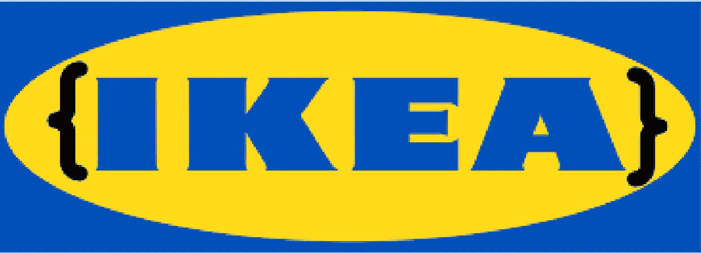

# 宜家准则

> 原文：<https://medium.com/hackernoon/ikea-code-c014874599ac>

T 何[代码](https://hackernoon.com/tagged/code)是[干](https://en.wikipedia.org/wiki/Don%27t_repeat_yourself)，简单易读，量少得多的功能，bug 可解释隔离，新手上手容易，功能添加快。我称之为[宜家](https://hackernoon.com/tagged/ikea)代码。

IKEA your code

作为 dataloop.ai 的首席执行官，在过去的两年里，我一直在认真研究商业模式，同时精心打造自己的商业模式，我最喜欢的学习新领域(所有领域)的途径是找到在这个领域对我有意义的人，并浏览他们在 you-tube 上提供的所有视频，[米歇尔·波特](https://en.wikipedia.org/wiki/Michael_Porter)是这些人中的一员，因为我正在完成我的个人在线“MBA”。

波特改变了我对宜家的看法，你看，我讨厌去宜家，从来不理解他们在每家商场设置的迷宫，为什么一旦我决定要买什么东西，我就必须拿起零件？波特的 [5 种力量分析](https://research-methodology.net/ikea-porters-five-forces-analysis/)不仅让我更好地理解了宜家，还将这些原则推广到我自己的业务中，一直到我们的代码库。

如果你已经因为寻找代码部分而失去耐心，那么请告诉我:)，制定宜家代码的一部分是对你的组织挑战、市场、愿景、竞争、顾客和机会的深入分析。这就是为什么大多数程序员无法交付宜家代码的原因，他们来这里是为了编码和功能列表，准确的产品描述和未来的业务路径不是他们工作定义或热情的一部分。如果你想制定宜家准则，首先要深刻理解你公司的“为什么”,而不是关注“如何”。巨大的变化始于商业模式，而工程是该模式的一部分。那么，宜家有什么特别之处(以及商业模式的美妙之处)？

# 主要原则

当你购买家具时，两个主要因素分割了市场——质量和价格，可能也是你的产品平衡及其市场适应性的因素。如果你提高质量，你必须提高价格，反之亦然，宜家设法提高质量，但保持价格有吸引力的竞争，如何？产品成本的一部分是设计、运输、储存、销售、交付、组装和安装，这些都是宜家留给顾客参与的方面，从不同过程中提取的额外价值被回馈给质量和他们的股东。你在宜家产品上看到的工程是这种商业途径的结果，当我开始组装新的宜家产品时，我开始给予更多的关注，在一个沮丧的下午(我从来没有第一次就把该死的事情做到 100%正确)，我突然想到，当我设计新的软件架构时，我试图模仿宜家放入代码中的相同类型的工程原则。

# 什么是宜家准则？

简而言之,《宜家准则》预测了其设计和建筑的未来。IKEA code 并不意味着你不会重构并永远拥有相同的版本，它只是意味着你的业务将在功能发布、支持成本和客户反馈方面看到显著的加速，但随着时间的推移，你最初的预测和假设变得无效，每天都让你的产品离代码墓地更近一步，迫使你转向 v2.0.0，整个过程将重新开始。因此，宜家准则不是为了阻止第 2 版，而是为了在更长时间内充分利用第 1 版，用 [semver](https://semver.org/) 的术语来说，宜家准则会影响你的补丁和次要速度，同时推迟下一个主要版本。

最简单的宜家架构至少会将核心和功能逻辑分开，其中核心代表管理全局应用状态、功能和连接的引擎，而功能逻辑使用核心中的服务来交付用户功能，放置这种类型的定义通常并不困难，大多数软件架构师能够非常快地放置这些占位符定义，很多时候太快了。

那么，传递宜家准则的途径是什么？

Start by defining these blocks

# 宜家准则设计阶段

## 阶段 1 —描述世界

No code please

这是未来预测发生的地方，这个阶段不是关于编码，而是纯粹的思考和头脑风暴。在我处于这个阶段的时候，我会发现自己在没有 youtube 的情况下开车几个小时，静静地玩我想象中的虚拟块，参与实体及其关系，同时将定义与现实生活场景以及预测的场景进行交叉。这一阶段的产出集中在:

*   实体:它们的功能、它们的输入/输出、它们的关系以及在提供特征逻辑中的作用。
*   假设:解决方案能够根据未来需求进行扩展

规则

这些是您可以对您的实体及其逻辑做出的最关键的陈述，一个不成立的假设意味着 bug，一个迫使假设改变的 bug 修复潜在地迫使重大改变(或者在现实生活中，您的代码由于许多未计划的相互连接而变得丑陋，导致更多未来的 bug)。

作为打破规则的一个例子，假设你正在开发一个汽车共享应用程序，你的假设是一辆汽车在任何给定的时间都只有一个所有者——从来没有 2 个，也没有 0 个。你的代码将变得深深依赖于这个假设，打破它意味着跨核心的变化。

定义这些规则的方法是真正理解你的产品需求(你的产品经理==容易)和你的产品未来(你，你的项目经理，市场营销，销售，高管==难)

一旦你完成了这个阶段，你的头脑中就有了这个系统、文档、电子邮件和白板图片，在这个阶段，你不需要处理编程语言、环境、数据库、协议和所有其他你迫切想要接触的东西。值得注意的是，您确实知道所有这些定义都没有被您的技术栈阻止，并且已经有了一个“需要验证的事情”的清单。

## 第 2 阶段—描述全球实施情况

Test your rules and assumption with your tech stack

让我们编码一些东西。

我称之为 printf 版本，它是你的实体的最简单的版本，它们的关系中的逻辑被打印到日志中，增加了最少的实际功能。在这一阶段，您将测试您的假设(第一阶段的结果通常包含您的技术堆栈上的清单)，并定义第一阶段**中描述的世界将如何由您的技术堆栈实施**。

这个阶段还涉及技术堆栈的选择，有些可能是强制的(传统的),有些可能是新的。在这个阶段结束时，无论您选择什么样的技术组合，毫无疑问，它都可以完全实现世界定义。

努力满足您在技术堆栈中引入许多前沿技术的需求，1-2 项前沿技术已经足够了，因为它们中的每一项都存在您忽视的风险和局限性。

如果你很大胆(或者对你的技术非常有经验)，你可以跳到第三阶段。

## 第 3 阶段— Hello 功能

在此阶段，您将把单个工作功能(用户功能)付诸实施，您选择的功能应具有以下属性:

Going into high gear

*   非常简单的功能
*   它需要尽可能多的核心服务。

在这一点上，你的核心仍然是一个整体或者非常接近它，你开始编码那个特性，而大部分时间花在分析特性需求和在核心中实现它们上。当特性完全工作时，这个阶段就结束了，你应该能够进行自我测试了:97%的代码实际上都被添加到了核心中，这个特性占用的内存非常少。

## 第四阶段——强调你的核心

What are your layers ?

添加更少的功能，尝试采用会给你的核心功能增加更多需求/压力的远程功能，现在你的核心已经成长并拥有自己的实体及其关系**在内部，**可能包含逻辑分层，而功能仍然生活在快乐简单的世界中。

随着您添加功能和核心变得越来越大，新的规则诞生了，这将为您的产品带来新的限制，第 1 阶段的信息应该让您感觉到正确和错误的假设，与您的项目经理一起测试这种感觉，因为您放置的每个无效规则都是灾难之门。

## 第 5 阶段—MVP

是时候推出最小版本的新产品，让人们尝试一下了。

如果你做得对，那么每一个 bug 都会导致简单的修复或者围绕单元功能的技术讨论，关系破裂或者缺少定义。

请注意，添加的每个代码都应该符合系统定义——在许多情况下，当新加入者加入时，他们的代码往往会暴露缺失的核心功能，因为他们往往会在功能中局部解决问题，预计每个新加入者功能都会进行重构。

如果您在 MVP 发布结束时得到以下内容:

*   bug 被快速修复或者点燃阶段 1 之类的讨论。
*   讨论是围绕单元功能而不是特征行为。
*   特性是局部，被隔离到特定的文件夹/类中，带有少量的核心更改。
*   您可以添加新的开发人员对 0 core touch 开发的期望。
*   您可以在几天或几小时内添加来自营销的新功能。

那么恭喜你，你已经完成了宜家准则。

# 如何让你的下一件产品成为宜家风格？

它从管理开始，有一个简单而棘手的任务:指派领导者。

最初的核心团队必须很小，其领导者必须对业务和产品充满热情，他应该喜欢了解业务，讨论路线图，集思广益(预测)纯虚拟的功能、能力和需求——不在计划中也没有记录，了解竞争对手在做什么，并搜索整个产品交付的替代解决方案。谁知道呢，你可能会发现你可以用开发成本的 1%来购买你的软件的一部分。

这个开发人员既是过程的管理者，也是第一个核心和特性开发人员。

很难找到一个具有这些品质的强大开发人员，因为技术世界倾向于将业务方面和 R&D 分成相反的阵营，在许多组织中，开发人员被鼓励专注于…发展。

如果要做出妥协，则分配两个关键职位:

*   开发主管——对业务有深刻的理解，能够做出好的定义，并在整个开发过程中验证它们的实现。
*   SW Arch——第一个核心开发人员，很快将加入其他开发人员。

开发主管是经理，避免职责混淆——也就是说，代码和架构的最终决定权不在软件架构师。这可能是一个冲突点，明确一个时间点，如果可能的话，把两个能把自我放在一边的人结合起来。

# 摘要

我们正在进入一个时代，在这个时代，软件开发成为每个企业的关键需求，企业因不良软件而遭受的损失正在飙升，而技术巨头正在传统市场上快速前进。

拥有坚实的软件开发能力正成为许多企业生存的关键，而[获得人才却很难](https://hackernoon.com/2018s-software-engineering-talent-shortage-its-quality-not-just-quantity-6bdfa366b899)。

无论你是经验丰富的科技公司，还是需要开发软件来维持业务，都要雇佣顶尖人才，即使这意味着整体开发人员数量减少，这些人才可以领导宜家代码的交付。

不良软件正在从昂贵的问题转变为致命的问题，无论这个问题看起来有多难，它都比你的组织必须尽快解决的数据问题要小得多(数据是新的软件)，但宜家数据在另一段时间是一个全新的故事。