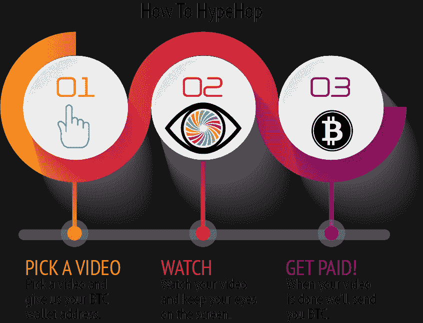

# 媒体坏了，所以我会付钱给你看视频

> 原文：<https://medium.com/hackernoon/ill-pay-you-to-watch-videos-163d5360f881>

“苹果/微软/谷歌给你多少钱来发布这个？”

作为一名记者，我一遍又一遍地听到这句话。媒体被购买和支付的感觉是非常有害的，非常恼人的，非常令人沮丧的。而且，除非某样东西在网上标有“赞助”,否则很难判断是否有人为你的眼球付费。

那么我们如何把付费内容和真实内容分开呢？我们如何奖励浏览我们付费信息的用户？

一种方法是通过小额支付或加密货币向内容制作者付费。这并没有很好地发挥作用。Steemit 和 Civil，这两个不是由真正的记者提出的解决方案，目前正陷入分散式厕所。

所以我们决定建造[睡眠室](http://hypehop.com)。这是一个让营销人员为你的时间付费的工具。营销人员(和普通人)必须创造引人注目的内容，并付钱让你观看，而不是被骗去看一些垃圾的 YouTube 视频，这样你就可以看到你从来不想看的广告。它颠覆了广告的概念，确保每个人——营销者、内容创作者和用户——都能得到他们想要的东西。

此外，我们还增加了一个有趣的功能:当你观看视频时，系统可以观察你。因为我们需要确保您观看这些视频来收取您的现金，所以我们创建了一个在您观看视频时观察您的面部(并评估您的情绪)的组件。想测试一下人们是否会喜欢你的广告吗？试试 [HypeHop](http://hypehop.com) 。想了解人们对某一段视觉数据的反应？试试 [HypeHop](http://hypehop.com) 。想用你的创业投资来吸引投资者吗？试试 [HypeHop](http://hypehop.com) 。

该系统在 BTC 支付，并接受 BTC 张贴视频。这是因为没有合理的方法接受美元或任何其他法定货币的小额支付。

HypeHop 是一个实验。我知道有很多方法可以利用这个系统，我们正在努力进一步保护它。我们也理解加密人员不喜欢监视。这很好，我们鼓励他们避免这种服务。世界瞬息万变，我们的隐私每天都在被窃取。至少，在这种情况下，我们为它付钱。

所以请试一试。我很想听听你的想法，所以如果你有任何意见或问题，请发电子邮件给 john@hypehop.com。