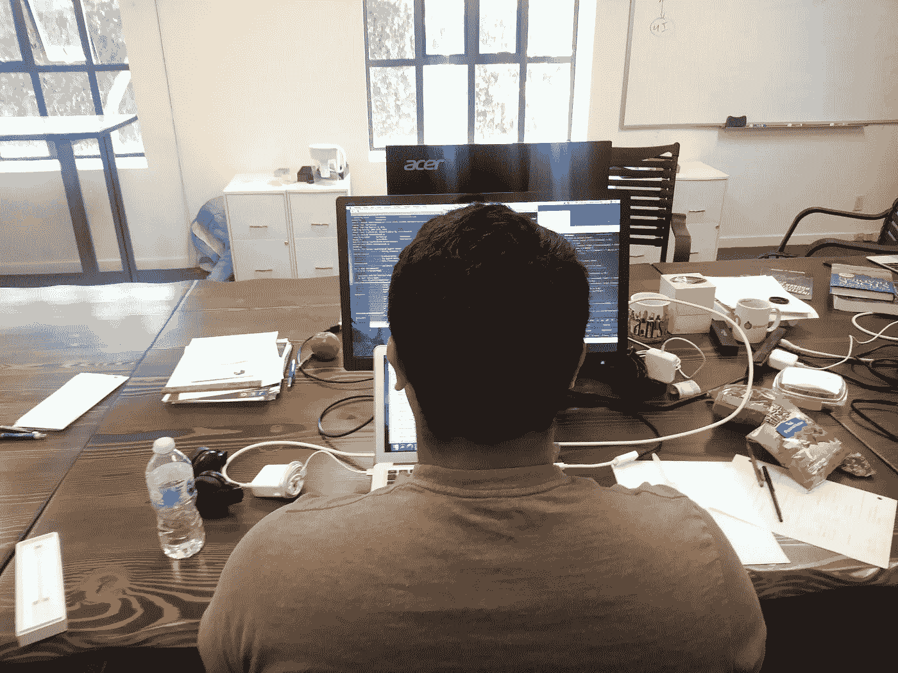
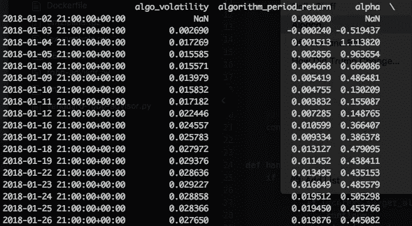

# 我是一名大学生，我还在建造我的机器人顾问

> 原文：<https://medium.com/hackernoon/im-a-college-student-and-i-m-still-building-my-robo-advisor-928110fe5bf1>

*所有用于设置的代码和外部指令等。可以在* [*GitHub*](https://hackernoon.com/tagged/github) *资源库* [*这里找到。*](https://github.com/alpacahq/roboadvisor) *这是一个帖子，是 Quantopian 中*[*robo advisor*](https://hackernoon.com/tagged/robo-advisor)*的续篇。你可以在 Hackernoon* [*这里*](https://hackernoon.com/i-am-a-college-student-and-i-built-my-own-robo-advisor-3f31b39dab50) *找到第一部分，或者在羊驼的博客* [*这里*](https://blog.alpaca.markets/blog/2018/6/8/i-am-a-college-student-and-i-built-my-own-roboadvisor) *。*

[](https://blog.alpaca.markets/blog/2018/6/8/i-am-a-college-student-and-i-built-my-own-roboadvisor) [## 我是一名大学生，我建立了自己的机器人顾问

### 我叫饶，是羊驼的一名实习生，致力于构建一个开源的 robo advisor。我在…方面没有太多经验

博客.羊驼.市场](https://blog.alpaca.markets/blog/2018/6/8/i-am-a-college-student-and-i-built-my-own-roboadvisor) 

大家好，我是羊驼的实习生饶。大约两周前，我在 HackerNoon 上发表了一篇关于我一直在研究的机器人顾问的文章。在过去的两周里，我把工作转移到了线下，用 Zipline 推动开发。在那段时间里，我学到了一些技巧和诀窍，我想与你分享。



I’m…still…working…

# 滑索——什么，什么时候，为什么，在哪里，如何？

我们现在已经在 Quantopian 上创建了一个功能性的 robo advisor。但是，IDE 限制了我们工作的规模和复杂性。为了进一步扩展这个机器人顾问，最好是用 Zipline 在本地做我们未来的工作。

这种转变提供了优势。我们可以使用多个文件、配置文件，并像开发任何其他 python 应用程序一样开发出 robo-advisor。摆脱单一的文件格式意味着我们的工作可以更有条理，单个的功能不那么臃肿(后面会详细介绍)。

但是，这不是所有的玫瑰。在 Zipline 中开发也有自己的挑战。但是，如果我能做到，你也能！

在本地机器上安装 zipline 并不像“pip install zipline”那么简单。它有几个依赖项，每个操作系统略有不同。您可以在这里找到所有必要的安装说明[。](http://www.zipline.io/install.html)

我在安装过程中犯了几个错误，所以我建议您在虚拟环境中运行 zipline，或者按照我的个人喜好，在 Docker 容器中运行。我已经附上了完成的容器和相应的 Dockerfile 文件。花些时间，弄清楚你的开发环境。准备好了吗？让我们开始吧。

# Zipline 命令—捆绑和执行

在本地打开新的 python 文件。从 Quantopian IDE 中复制并粘贴您的代码。现在，我们准备好了——拉着你走。我们还没有准备好。Quantopian 的 IDE 是一个很棒的开发环境。它负责后台进程，让您可以专注于您的算法。

首先，我们需要历史数据来运行我们的算法。Zipline 使用一种叫做 bundles 的东西来读取数据。要使用这些包，需要首先接收它们，这可以使用以下命令来完成:

```
$zipline ingest -b <bundle>
```

Zipline 提供了两个包，quandl 和 quantopian-quandl。要接收 quandl，您需要创建一个帐户，然后获得一个 API 密钥。你不需要为 quantopian-quandl。Zipline 还提供了通过编写自定义摄取函数来创建自定义包的选项。这将留待以后的文章讨论。

Quandl 和 quantopian-quandl 都不提供 ETF 数据，所以我提供了一个定制的羊驼捆绑包。本地安装这个包的说明可以在 GitHub repository readme 中找到。

使用以下格式运行 zipline 代码:

```
$zipline run -f <filename> -b <bundle> --start <date> --end <date>
```

您可以看到 Quantopian 的许多 GUI 输入都是使用 Zipline 从命令行配置的。

## 码头集装箱:

我创建了一个运行 python 3.6 的 docker 容器，安装了 zipline 和必要的依赖项。如果您对在本地安装 zipline 犹豫不决，您可以从 [docker hub](https://hub.docker.com/r/alpacamarkets/roboadvisor/) 中取出容器，并在环境中进行试验。

使用以下命令运行映像:

```
$docker run -it alpaca/roboadvisor /bin/bash
```

# 第一个滑索例子——买入并持有

就像我最初投资 Quantopian 一样，我用简单的买入并持有策略投资了 Zipline。

以下是一些需要记住的区别。首先，所有自定义功能，如订单、符号等。不再自动包含，必须手动导入(*从 zipline.api 导入** )。接下来，这是相当愚蠢的，但现在我们不在 Quantopian 的 IDE 中，我们不再使用 log.info 来跟踪事务，而是打印语句。

让我们使用前面的格式运行代码，并从 1 月到 6 月运行测试:

```
$zipline run -f buy-and-hold.py -b alpaca --start 2018-01-01 --end 2018-06-01
```

如果没有语法错误，Zipline 会吐出一大堆数据。我们怎么知道我们是对的？滚动直到从 STDOUT 中找到下表:



Look at the cumulative alpha value from the last simulated trading day (2018–06–01)

找到累积的 alpha 值(相对于基准的性能)，并将其与在 Quantopian 上运行相同算法时的累积 alpha 值进行比较。它们应该是非常相似的值。

我们已经很好地了解了 Zipline 是如何工作的，所以我们可以继续实现我们的单宇宙算法的其余部分(距离计算和重新平衡)。我花了一整篇文章来讨论这个实现，所以我认为没有必要重新讨论它。如果你还没有读过那本书，我建议你读一读——这是一本很棒的书！(完全公正的观点)

# 多重宇宙

在上一篇文章中，我展示了如何通过在 initialize 函数中添加多个字典来扩展算法，以覆盖所有可能的先锋宇宙。但是，如果我们想实现所有六个先锋宇宙，我们将完成一个臃肿的摄取功能，这看起来并不漂亮。

但现在我们离开了量子乌托邦，来到了高空滑索！我们可以将代码分布在多个文件中，所以让我们开始吧。

为了被算法使用，一个宇宙需要两组信息。第一个是符号集，第二个是基于风险的权重分布。从符号函数的工作方式来看，每个宇宙的符号列表都需要在初始化函数中设置。

但是，权重是没有绑定到任何 zipline.api 函数的字典，所以我们实际上可以在一个单独的文件中配置它们。ConfigParser 包可以读入存储在外部。ini 文件。更重要的是，它以类似于字典(键/值)的结构存储数据，并且易于调用和组织。

首先，我们需要安装软件包:

```
$pip3 install ConfigParser
```

安装好软件包后，就可以创建 INI 文件了。INI 文件包含基于风险级别的分配信息。

INI 文件被分成几个部分，新的部分由括号中的部分标题描述。章节标题很像字典中的一个键，是组织输入的一种有用的方式。这个文件把每一个先锋宇宙都组织成了自己的一部分。如果你想添加你自己的宇宙，叉出要点，用括号内的宇宙名称创建一个新的部分，并在它下面列出信息。

机器人顾问的算法将输入解析为字典。虽然 INI 文件的工作方式很像一个字典，但是我们仍然需要编写一个函数来将它翻译成字典。

```
def section_to_dict(section):
    config = ConfigParser()
    config.read('universe-config.ini')
    out_dict = {}
    for key in config[section]:
        out_dict[int(key)] = ast.literal_eval(config[section][key])
    return(out_dict)
```

configparser 被初始化，然后读取给定的 INI 文件。读取的部分作为用户输入给出。如果我们回头参考 INI 文件，我们会看到值采用 key = value 的形式。所以就像字典一样，我们可以遍历 INI 部分的关键字。在每种情况下，每个键/值对都被添加到字典中。(*注意:如果你收到一个密钥错误，那是因为你的 config.ini 文件的路径是错误的*

还有两件事需要注意。在 INI 文件中，一切都是字符串，但是我们的算法期望一个整数/元组键值对。对于键，将它们转换成整数就足够了，但是对于元组，我们必须对值进行解串。为此，我发现 ast.literal_evalto 是效果最好的函数。

现在，让我们将这种检索基于权重的分配的新方法与我们的 robo-advisor 算法相结合:

我已经在初始化中列出了每个宇宙的所有符号。这个宇宙的权重是通过在 INI 文件的适当部分调用 section_to_dict 来确定的。

现在，您可以随意添加任意数量的宇宙！

# 下一步是什么？

从这里开始，我对可视化 Zipline 回溯测试的所有输出数据感兴趣。在我的下一篇文章中，我希望探索原始数据中不同的可视化效果。

*由* [到*饶*到](/@raobvinnakota)

[](https://medium.com/automation-generation)

## 请关注[羊驼](/@alpacahq)和[自动化生成](https://medium.com/automation-generation)关于金融市场、算法交易、技术的新帖子。

## 你可以找到我们[@羊驼 HQ](https://twitter.com/AlpacaHQ) ，如果你用 twitter 的话。

[](https://medium.com/automation-generation)

如果你是一名黑客，并且可以创造一些在金融市场中工作的很酷的东西，**请查看我们的项目“** [**无佣金股票交易 API**](https://alpaca.markets/?utm_source=medium&utm_medium=blog&utm_campaign=strategy_list&utm_content=part1) **”,在那里我们免费提供简单的 REST 交易 API 和实时市场数据。**

经纪服务由 FINRA/SIPC 成员羊驼证券有限责任公司([羊驼.市场](https://alpaca.markets/?utm_source=medium&utm_medium=blog&utm_campaign=strategy_list&utm_content=part1))提供。羊驼证券有限责任公司是 AlpacaDB，Inc .的全资子公司。

特别感谢 Hitoshi、Yoshi 和其他羊驼队成员在我设计滑索和 Docker 时提供的所有帮助和技术支持。