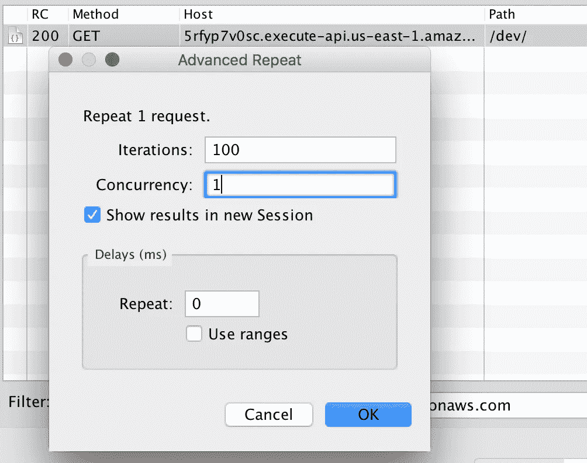
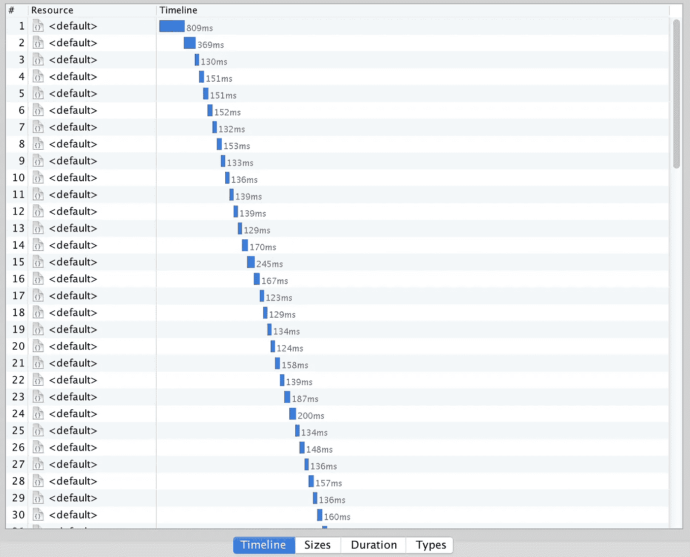
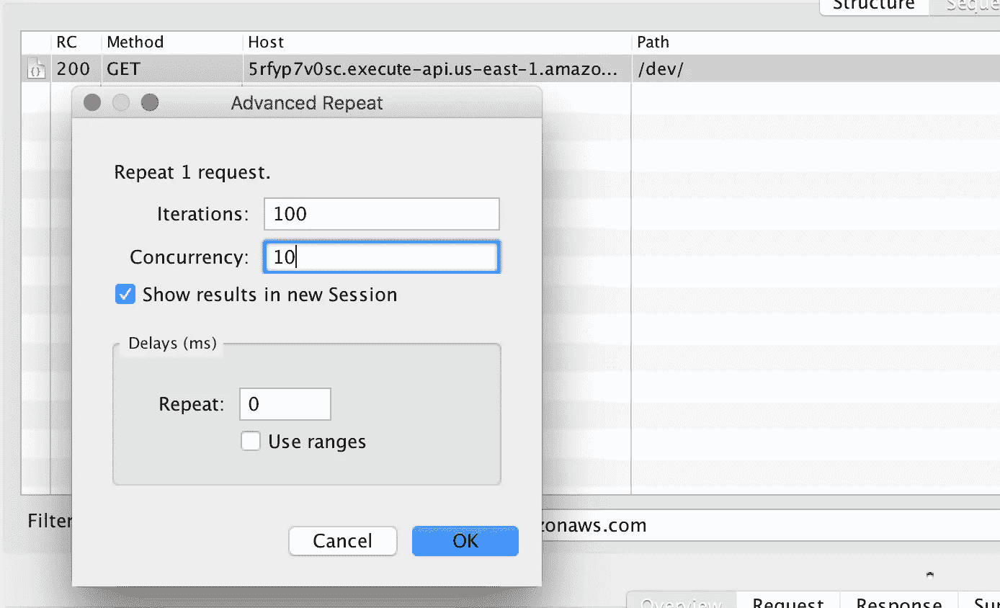
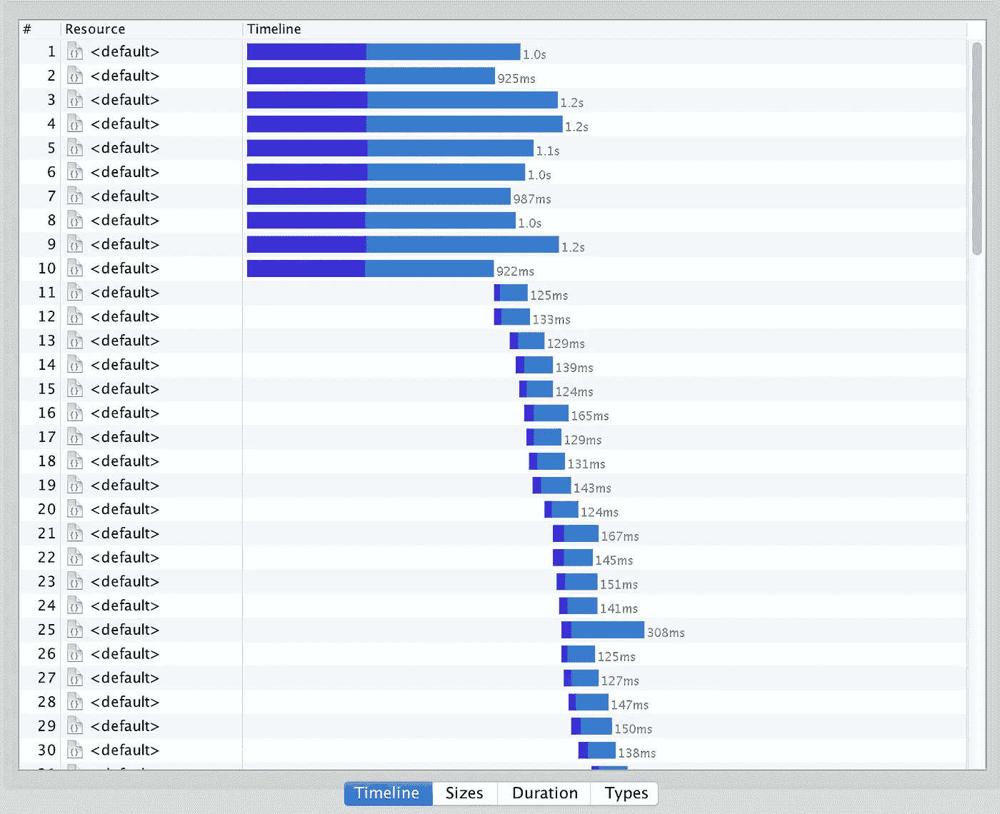
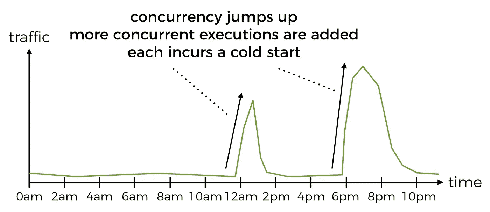
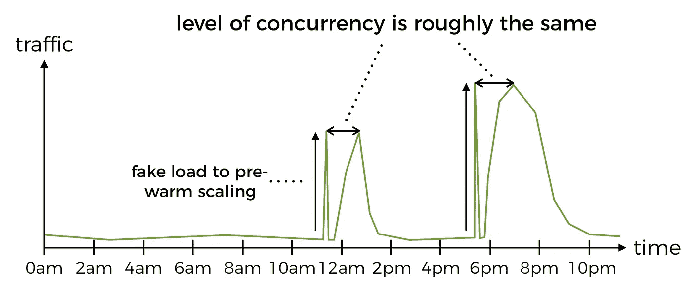
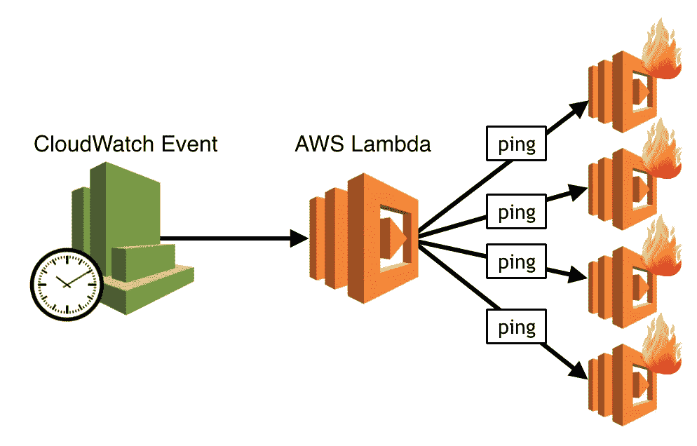
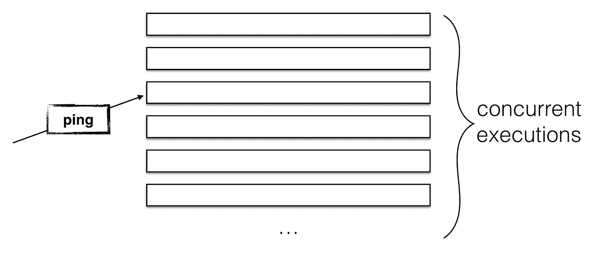

# 恐怕你对 AWS Lambda 冷启动的想法完全错了

> 原文：<https://medium.com/hackernoon/im-afraid-you-re-thinking-about-aws-lambda-cold-starts-all-wrong-7d907f278a4f>

当我在 API Gateway 的环境中与人们讨论 AWS Lambda 冷启动时，我经常得到这样的回答:

> 呣，这只是第一个要求，对吗？所以如果一个请求很慢，下一百万个请求就会很快。

不幸的是，这过于简单化了。

对于函数的每个**并发执行**，冷启动发生**一次**。

如果可能的话，API Gateway 会重用已经在运行的函数的并发执行，根据我的观察， ***甚至可能*** *将请求排队一小段时间，希望其中一个并发执行能够完成并被重用*。

如果所有用户对 API 的请求都是一个接一个发生的，那么在这个过程中，你肯定只会经历一次冷启动。您可以通过捕获对 API 网关端点的请求并使用并发设置 1 重复它，来模拟使用 [Charles proxy](https://www.charlesproxy.com/) 会发生什么。

正如您在下面的时间线中看到的，只有第一个请求经历了冷启动，因此与其他请求相比明显较慢。

100 分之一，这是可以忍受的，见鬼，它甚至不会出现在我的 99%的延迟指标中。

Only the first request incurred the penalty of cold start.

如果用户请求成群结队地到来会怎样？毕竟，用户行为是不可预测的，不太可能遵循我们上面看到的好的顺序模式。因此，让我们模拟一下，当我们收到 100 个请求，并发数为 10 时会发生什么。

突然间，事情看起来不那么乐观了——前 10 个请求都是冷启动！如果您的流量模式在一天中的特定时间或特定事件中高度突发，这可能会带来麻烦，例如

*   订餐服务(如 JustEat、Deliveroo)在用餐时间会出现流量激增
*   电子商务网站在一年中受欢迎的购物日——网络星期一、黑色星期五等，流量高度集中。
*   博彩服务在体育赛事期间流量激增
*   社交网络的流量会激增，嗯，几乎是世界各地发生的任何值得关注的事件

对于所有这些服务，流量的突然爆发意味着 API Gateway 将不得不添加更多的 Lambda 函数并发执行，这相当于冷启动的爆发，这对您来说是个坏消息。这是你的业务最关键的时期，也正是你希望你的服务达到最佳状态的时候。

如果峰值是可预测的，就像食品订购服务的情况一样，您可以通过预热 API 来减轻冷启动的影响，也就是说，如果您知道中午会出现流量激增，那么您可以在上午 11:58 安排一个 cron 作业(也称为 CloudWatch schedule + Lambda ),该作业将向相关的 API 发出大量并发请求，足以使 API Gateway 产生足够数量的函数并发执行。

您可以用一个特殊的 HTTP 头或有效负载来标记这些请求，以便处理函数可以将其与普通的用户请求区分开来，并且可以在不尝试执行普通代码路径的情况下短路。

在这些可预测的流量爆发期间，您减轻了冷启动的影响，这很好，但**这难道没有违背无服务器计算的精神，** **您不应该担心扩展吗？**

当然，但是**让用户开心**重击其他一切，如果用户不得不等待你的功能冷启动才能点餐，他们会不高兴，转向竞争对手的成本很低，所以他们甚至可能第二天就不会回来。

或者，您可以考虑通过缩短冷启动时间来减少冷启动的影响:

*   通过使用不会导致高冷启动时间的[语言编写 Lambda 函数，例如 Node.js、Python 或](https://read.acloud.guru/does-coding-language-memory-or-package-size-affect-cold-starts-of-aws-lambda-a15e26d12c76) [Go](https://aws.amazon.com/blogs/compute/announcing-go-support-for-aws-lambda/)
*   为处理用户请求的关键路径上的函数选择较高的内存设置(例如，用户必须等待响应的任何东西，包括中间 API)
*   优化函数的依赖项和包的大小
*   **尽可能远离 VPC！** VPC 接入要求 Lambda 为目标 VPC 创建 ENIs(弹性网络接口),这很容易为您的冷启动增加 10 秒(是的，您没有看错)

还有另外两个因素需要考虑:

*   [闲置一段时间的执行将被垃圾收集](https://read.acloud.guru/how-long-does-aws-lambda-keep-your-idle-functions-around-before-a-cold-start-bf715d3b810)
*   已经活跃了一段时间(大约 4 到 7 个小时)的执行也会被垃圾收集

最后，那些很少用的 API 呢？实际上，很有可能每次有人点击那个 API 时，他们都会遭遇冷启动，所以对你的用户来说，那个 API 总是很慢，他们将来更不可能使用它，这是一个恶性循环。

对于这些 API，您可以有一个 cron 作业，它每隔 5-10 分钟运行一次，并对 API 执行 ping 操作(使用一个特殊的 ping 请求)，这样，当 API 被一个真正的用户使用时，它就有希望是热的，而用户就不必忍受冷启动时间了。

这种 pinging API 端点以保持其热度的方法对于具有大量并发执行的“繁忙”函数来说不太有效——您的 ping 消息只会到达其中一个并发执行，如果并发用户请求的级别下降，那么一些并发执行将在闲置一段时间后被垃圾收集，这就是您想要的(不要为您不需要的资源付费)。

无论如何，这篇文章不打算成为你的 AWS Lambda 冷启动的一站式指南，而只是为了说明这是一个比“*只是第一个请求*”更微妙的讨论。

冷启动是我们不得不接受的平台特性，我们喜欢 AWS Lambda 平台，并希望使用它，因为它在许多方面都提供了支持。重要的是，不要让我们自己的偏好蒙蔽了我们的双眼，让**让我们的用户开心，并打造一款他们愿意继续使用的产品**。

要做到这一点，您确实需要了解您正在构建的平台，而且由于实验成本如此之低，没有理由不亲自尝试 AWS Lambda，并尝试了解它的行为以及如何充分利用它。

嗨，我叫**崔琰**。我是一个 [**AWS 无服务器英雄**](https://aws.amazon.com/developer/community/heroes/yan-cui/) 和 [**量产无服务器**](https://bit.ly/production-ready-serverless) 的作者。我已经在 AWS 中运行了近 10 年的大规模生产工作负载，我是一名架构师或首席工程师，涉足从银行、电子商务、体育流媒体到移动游戏等多个行业。我目前是一名专注于 AWS 和无服务器的独立顾问。

你可以通过[邮箱](mailto:theburningmonk.com)、[推特](https://twitter.com/theburningmonk)和 [LinkedIn](https://www.linkedin.com/in/theburningmonk/) 联系我。

查看我的新课程，[**AWS 步骤功能完全指南**](https://theburningmonk.thinkific.com/courses/complete-guide-to-aws-step-functions) 。

在本课程中，我们将介绍有效使用 AWS Step Functions 服务所需了解的一切。包括基本概念、HTTP 和事件触发器、活动、设计模式和最佳实践。

在此获取您的副本[。](https://theburningmonk.thinkific.com/courses/complete-guide-to-aws-step-functions)

来了解 AWS Lambda: CI/CD 的操作性**最佳实践**，本地测试&调试功能、日志记录、监控、分布式跟踪、金丝雀部署、配置管理、认证&授权、VPC、安全性、错误处理等等。

代码 **ytcui** 还可以获得**票面价格 6 折**。

点击获取您的副本[。](https://bit.ly/production-ready-serverless)