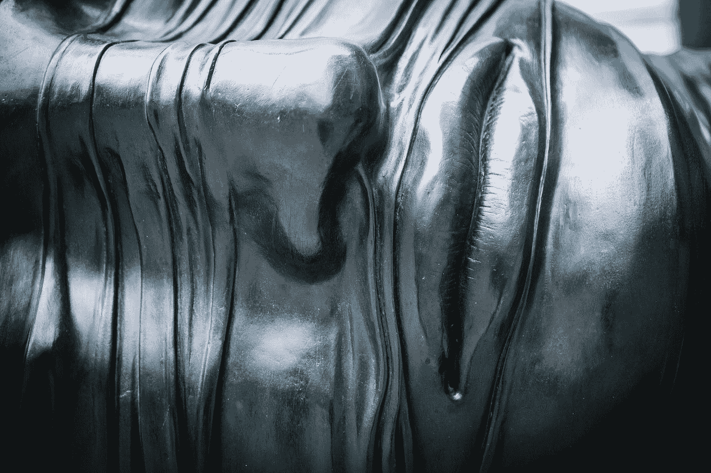
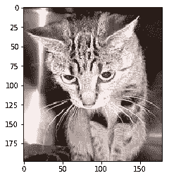
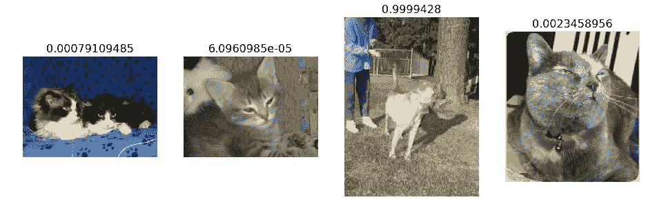
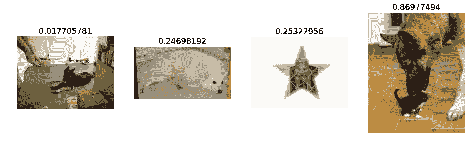
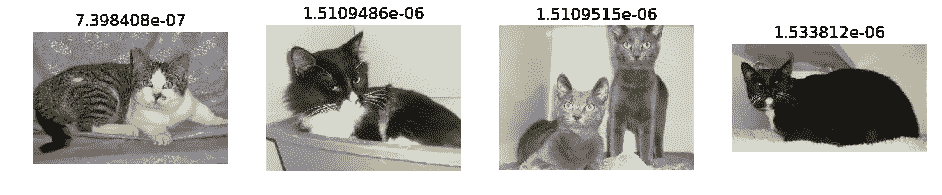
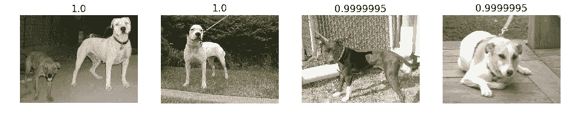
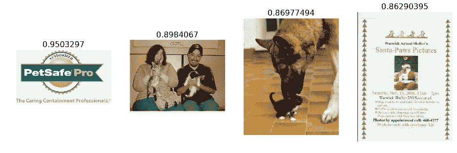
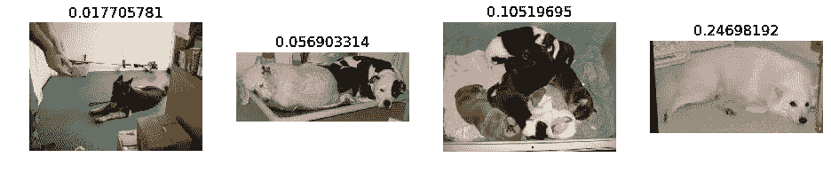
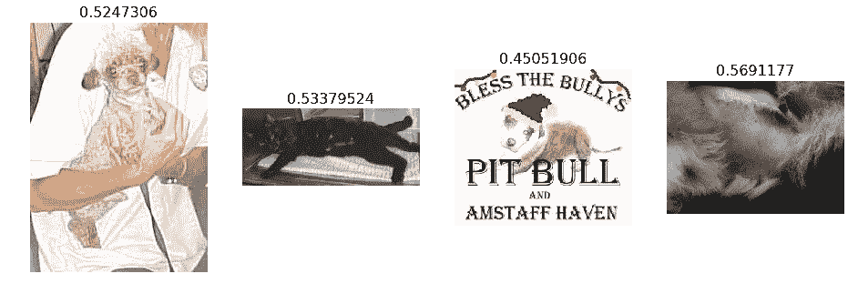

# 基于卷积神经网络的图像分类

> 原文：<https://medium.com/hackernoon/image-classification-with-convolutional-neural-networks-e2ec72130ecc>



“Close up of modern metal sculpture of human face at Canary Wharf” by [Clem Onojeghuo](https://unsplash.com/@clemono2?utm_source=medium&utm_medium=referral) on [Unsplash](https://unsplash.com?utm_source=medium&utm_medium=referral)

## 在 21 秒内，用 4 行代码训练和评估一个世界级的深度学习模型

> 斯蒂芬·里马克

以下包含笔记和 [python](https://hackernoon.com/tagged/python) 代码，编译自 [fast.ai](http://course.fast.ai) 联合创始人[杰瑞米·霍华德](http://www.fast.ai/about/#jeremy)的一次演讲。非常感谢 Jeremy 和 [Rachel Thomas](http://www.fast.ai/about/#rachel) 构建 fast.ai 和 [fast.ai 库](https://github.com/fastai/fastai/)，这是 [PyTorch](http://pytorch.org) 的高级包装器。以下代码基于 fast.ai 库。要了解更多信息，请观看面向程序员的实用[深度学习](https://hackernoon.com/tagged/deep-learning)第一部分的第一课(共七课),该课程免费公开提供。如果你热衷于学习深度学习，你不会后悔的！

# 目录

1.  介绍我们的第一个任务:“狗对猫”
2.  先看猫咪图片
3.  模型
4.  分析结果:查看图片

# 1.介绍我们的第一个任务:狗对猫

我们将使用卷积神经网络(CNN)来让我们的计算机看到——这只能归功于深度学习。

我们将尝试基于之前名为[狗对猫](https://www.kaggle.com/c/dogs-vs-cats)的 Kaggle 比赛的数据创建一个深度学习 CNN 模型。有 [25，000 张带标签的狗和猫照片](https://www.kaggle.com/c/dogs-vs-cats/data)可用于训练，测试集中有 12，500 张我们必须为这场比赛尝试标记。根据 Kaggle 网站，当这项比赛开始时(2013 年底):

> “最新技术水平:目前的文献表明，机器分类器在这项任务中可以达到 80%以上的准确率”。

因此，如果我们能超过 80%，那么到 2013 年，我们将处于领先地位！好了，我们走吧。

将这些放在每个笔记本的顶部，以获得自动重新加载和内嵌绘图:

```
%reload_ext autoreload
%autoreload 2
%matplotlib inline
```

在这里，我们导入我们需要的库:

```
**from** **fastai.imports** **import** *
**from** **fastai.transforms** **import** *
**from** **fastai.conv_learner** **import** *
**from** **fastai.model** **import** *
**from** **fastai.dataset** **import** *
**from** **fastai.sgdr** **import** *
**from** **fastai.plots** **import** *PATH = "data/dogscats/"
```

我们将下面的尺寸设置为`224`，因为 **resnet** 使用 224 x 224 的图像尺寸。稍后将详细介绍:

```
sz=224
```

# 数据下载

数据集可在[http://files.fast.ai/data/dogscats.zip](http://files.fast.ai/data/dogscats.zip)获得。您可以通过在终端中运行下面一行来直接下载到您的服务器上。`wget http://files.fast.ai/data/dogscats.zip`。您应该将数据放在 Jupyter 笔记本目录的子目录中，名为`data/`。

# 2.先看猫咪图片

fast.ai 库会假设你有 *train* 和*有效的*目录。它还假设每个目录都有您希望识别的每个类的子目录(在本例中为“猫”和“狗”)。

下面将显示“路径”文件夹的内容；`!`意为迎头痛击。

```
!ls {PATH}!ls {PATH}valid
```

以下代码显示了 validation cats 文件夹中的内容。这是共享或提供影像分类文件的标准方式。

```
files = !ls {PATH}valid/cats | head
files*# Example: show first cat image in the cats folder*img = plt.imread(f'**{PATH}**valid/cats/**{files[0]}**') *# This is formatting string*

plt.imshow(img);
```



I am cute

下面的代码显示了原始数据的样子。这被称为一个`rank 3 tensor` 又名一个 3×3 矩阵。每个单元显示红色、绿色和蓝色像素值 btwn 0 和 255。

```
img.shape**Output:**
(198, 179, 3)img[:4,:4]**Output:**
array([[[ 29,  20,  23],
        [ 31,  22,  25],
        [ 34,  25,  28],
        [ 37,  28,  31]],

       [[ 60,  51,  54],
        [ 58,  49,  52],
        [ 56,  47,  50],
        [ 55,  46,  49]],

       [[ 93,  84,  87],
        [ 89,  80,  83],
        [ 85,  76,  79],
        [ 81,  72,  75]],

       [[104,  95,  98],
        [103,  94,  97],
        [102,  93,  96],
        [102,  93,  96]]], dtype=uint8)
```

# 3.模型

我们将使用一个**预训练的**模型，也就是说，一个由其他人创建的模型来解决一个不同的问题。我们将使用一个在[ImageNet](https://en.wikipedia.org/wiki/ImageNet)(120 万张图片和 1000 个类)上训练的模型作为起点，而不是从头构建一个模型来解决类似的问题。该模型是卷积神经网络(CNN)，这是一种为计算机视觉建立最先进模型的神经网络。

我们将使用 **resnet34** 作为我们的预训练模型。resnet34 是赢得 2015 年 ImageNet 竞赛的模型版本。这里有更多关于 resnet 模型的信息。

以下是如何用 4 行代码在 21 秒内训练和评估一个*狗对猫*模型。在下面的语法罩下是由 fast.ai 编写的代码/包装器。fast.ai 库定期更新，并跟上尖端的深度学习研究。所以 fast.ai 确保最佳实践总是被使用。反过来，这工作得非常快(例如，10-60 秒，取决于 GPU)，因为它位于 Pytorch 之上，py torch 是 facebook 编写的一个非常灵活的库。

```
arch=resnet34data = ImageClassifierData.from_paths(PATH, tfms=tfms_from_model(arch, sz))learn = ConvLearner.pretrained(arch, data, precompute=**True**)learn.fit(0.01, 3)**Output:**100%|██████████| 360/360 [00:57<00:00,  6.24it/s]
100%|██████████| 32/32 [00:05<00:00,  6.04it/s]epoch      trn_loss   val_loss   accuracy                     
    0      0.045726   0.028603   0.989258  
    1      0.039685   0.026488   0.990234                     
    2      0.041631   0.03259    0.990234[0.032590486, 0.990234375]
```

`data`对象包含训练和验证数据。

`ImageClassifierData.from_paths`读入图像及其标签作为子文件夹名称:

*   `path`:数据的根路径(用于存储训练模型、预计算值等)
*   `bs`:批量大小。默认 64。
*   `tfms`:转换(用于数据扩充)。例如`tfms_from_model`的输出。默认“无”
*   `trn_name`:包含训练图像的文件夹的名称。默认“列车”
*   `val_name`:包含验证图像的文件夹的名称。默认“有效”
*   `test_name`:包含测试图像的文件夹的名称。默认“无”
*   `num_workers`:工人数量。默认“8”

`learn`对象包含模型。

`ConvLearner.pretrained`:

*   `f`:拱形。例如 resnet34
*   `data`:之前定义的数据对象
*   `precompute`:包含/排除预计算激活。默认“假”

`learn.fit`通过给定的学习率和时期训练/拟合模型。在这种情况下，它将以 0.01 的学习率进行 3 个时期，这意味着它将总共查看每幅图像三次。

`trn_loss`和`val_loss`是交叉熵损失函数值。

这种模式有多好？在这场比赛之前，最先进的是 80%的准确率。但比赛的结果是准确率大幅跃升至 99.0%，一个受欢迎的深度学习库的作者赢得了比赛。不同寻常的是，不到 4 年后，我们现在可以在几秒钟内打破这个结果！

上面的模型，可以用在任何类型的图片上，只要是人们平常拍照的东西。然而，像病理图片或 CT 扫描这样的东西使用这种模型不会做得很好。我们需要做一些小事情来实现这些功能。这将在随后的笔记本中介绍。敬请期待！

# 4.分析结果:查看图片

除了查看整体指标，查看一些预测示例也是一个不错的主意:

1.  随意几个正确的标签
2.  一些不正确的标签
3.  每个类别中最正确的标签(即最有可能正确的标签)
4.  每个类别中最不正确的标签(即最有可能不正确的标签)
5.  最不确定的标签(即概率最接近 0.5 的标签)。

我们很快就会看到这一切。但是首先，如果我们想要了解数据，我们可以用下面的一些方法来查看内部:

```
*# Pull the label (dependent variable)* data.val_y*# Pull the data classes* data.classes*# Pull the y log predictions* log_preds = learn.predict()
log_preds.shape*# Pull first 10 predictions* log_preds[:10]*# from log probabilities to 0 or 1* preds = np.argmax(log_preds, axis=1) *# pr(dog); i.e., anti log* probs = np.exp(log_preds[:,1])
```

**绘图功能**

```
**def** rand_by_mask(mask): **return** np.random.choice(np.where(mask)[0], 4, replace=**False**)**def** rand_by_correct(is_correct): **return** rand_by_mask((preds == data.val_y)==is_correct)**def** plot_val_with_title(idxs, title):
    imgs = np.stack([data.val_ds[x][0] **for** x **in** idxs])
    title_probs = [probs[x] **for** x **in** idxs]
    print(title)
    **return** plots(data.val_ds.denorm(imgs), rows=1, titles=title_probs)**def** plots(ims, figsize=(12,6), rows=1, titles=**None**):
    f = plt.figure(figsize=figsize)
    **for** i **in** range(len(ims)):
        sp = f.add_subplot(rows, len(ims)//rows, i+1)
        sp.axis('Off')
        **if** titles **is** **not** **None**: sp.set_title(titles[i], fontsize=16)
        plt.imshow(ims[i])**def** load_img_id(ds, idx): **return** np.array(PIL.Image.open(PATH+ds.fnames[idx]))**def** plot_val_with_title(idxs, title):
    imgs = [load_img_id(data.val_ds,x) **for** x **in** idxs]
    title_probs = [probs[x] **for** x **in** idxs]
    print(title)
    **return** plots(imgs, rows=1, titles=title_probs, figsize=(16,8))**def** most_by_mask(mask, mult):
    idxs = np.where(mask)[0]
    **return** idxs[np.argsort(mult * probs[idxs])[:4]]

**def** most_by_correct(y, is_correct): 
    mult = -1 **if** (y==1)==is_correct **else** 1
    **return** most_by_mask(((preds == data.val_y)==is_correct) & (data.val_y == y), mult)
```

# 随意几个正确的标签

任何大于 0.5 的都是狗；小于 0.5 的任何值都是 cat:

```
plot_val_with_title(rand_by_correct(**True**), "Correctly classified")
```



Ahhh

# 一些不正确的标签

任何大于 0.5 的都是狗；小于 0.5 的任何值都是 cat:

```
plot_val_with_title(rand_by_correct(**True**), "Correctly classified")
```



Dogs?

# 每类最正确的标签

(即，正确概率最高的那些)

```
plot_val_with_title(most_by_correct(0, **True**), "Most correct cats")plot_val_with_title(most_by_correct(1, **True**), "Most correct dogs")
```



I like the grey ones



# 每类最不正确的标签

(即最有可能不正确的那些)

```
plot_val_with_title(most_by_correct(0, **False**), "Most incorrect cats")plot_val_with_title(most_by_correct(1, **False**), "Most incorrect dogs")
```



# 最不确定的标签

(即概率最接近 0.5 的那些)

```
*# probabilites are closest to 0.5*most_uncertain = np.argsort(np.abs(probs -0.5))[:4]
plot_val_with_title(most_uncertain, "Most uncertain predictions")
```



weird

注意:上面尺寸错误的图片(如矩形图片)会扭曲结果。我们使用一种叫做`data augmentation`的技术来处理这个问题。在以后的文章中会有更多的介绍。

**专家提示**:如果你想让模型变得更好，你可能想利用它为什么做得好，并修正它做得不好的地方。例如，在另一个 Jupyter 笔记本中，尝试移除只是扭曲数据的图像，如卡通等。如果你知道怎么做，请告诉我:)

以上所有工作见下面的 GitHub 链接。

感谢阅读！

[](https://github.com/Stephen-Rimac/Image-classification-with-CNNs) [## Stephen-Rimac/使用 CNN 的图像分类

### 通过在 GitHub 上创建一个帐户，为使用 CNN 的图像分类开发做出贡献。

github.com](https://github.com/Stephen-Rimac/Image-classification-with-CNNs)