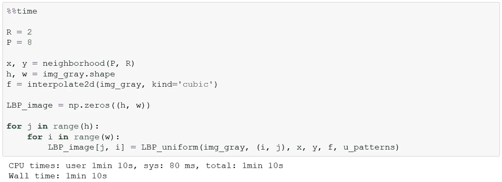

# 图像特征提取:基于 Cython 的局部二值模式

> 原文：<https://medium.com/hackernoon/image-feature-extraction-local-binary-patterns-with-cython-b31171ad5dc9>

# 介绍

特征提取的共同目标是将原始数据表示为一组精简的特征，以更好地描述其主要特征和属性[1]。这样，我们可以减少原始输入的维数，并使用新的特征作为输入来训练模式识别和分类技术。

虽然我们可以从图片中提取一些特征，但局部二进制模式(LBP)是一种理论上简单但有效的灰度和旋转不变纹理分类方法。它们之所以有效，是因为最常见的模式对应于原始的微观特征，如边缘、拐角、斑点、平坦区域[2]。

在[2]中，Ojala 等人表明，均匀图案的离散出现直方图是一种非常强大的纹理特征。图像纹理被定义为由两个属性表征的二维现象:(1)空间结构(图案)和(2)对比度。

Fig 1\. Image used to test the local binary patterns methodology

# 方法学

## 循环对称邻居集

给定像素 *gc* 的循环对称邻居集由围绕半径为 *R* 的圆上的中心点的坐标为(I，j)的点和多个元素 *P* 定义。

## 纹理

我们将纹理定义为灰度图像中的像素集合

其中 *gp* 对应于 *p* 局部邻域的灰度值。

## 插入文字

当邻居不位于像素的中心时，应该通过插值计算该邻居灰度值。因此，我们需要定义一个函数，给定一个坐标，返回插值后的灰度值。

## 实现灰度不变性

考虑到可能的信息损失，可以将纹理转化为关节差。为了计算它，我们将中心像素的灰度值减去所有相邻像素的灰度值。联合差分分布是一种高分辨率的纹理算子。它记录了 P 维直方图中每个像素附近各种模式的出现情况。

其中 *gp* 是 *p* 邻居的灰度值。这种分布对于灰度变化是不变的。

## 局部二元模式

*LBP_{P，R}* 算子根据定义相对于灰度的任何单调变换是不变的。只要灰度值的顺序保持不变， *LBP_{P，R}* 算子的输出就保持不变。

在哪里

## 均匀局部二元模式

在[2]中，Ojala 提到在他们的实践经验中，LBP 不是一个好的鉴别者。他们建议只选择局部二进制模式的集合，使得空间转换(逐位 0/1 变化)的数量不超过 2。例如，图案‘1111’具有 0 个空间过渡，图案‘1100’具有 1 个空间过渡，图案‘1101’具有 2 个空间过渡。每个统一模式都有一个唯一的索引。创建指数的公式是从这里的[借用过来的](https://github.com/scikit-image/scikit-image/blob/master/skimage/feature/_texture.pyx)。

现在，我们可以计算中心像素的局部二进制模式。下一步是计算所有像素的局部二进制模式。

*提示:为了简单起见，我不考虑所选索引为负的情况(即 img_gray[-1][0]返回第一列的最后一个像素)。如果我们想有一个更准确的计算，我们应该考虑这种情况，并对待它。*

# Cython 代码

之前的代码并不完善；然而，真正让它慢的是我们遍历所有的图像像素。如果我们考虑到我们还必须训练模式识别技术，那么等待 1 分 10 秒来计算我们的特征是很多的。因此，我们需要一个对于循环来说速度更快的替代实现。在这种情况下，我们将使用 Cython。下一张图中显示了代码，这是一大段代码。它的某些部分还可以改进，但它已经快得多了。如果你对代码有不理解的地方，请留下你的评论。

代码的编写方式使得大部分代码完全在 C API 中运行。这种策略大大加快了执行速度，同时也让我们能够利用 Cython 的并行模块。我们将在 CPU 的多个内核之间分配任务。

使用 4 个线程，我们可以在不到 150 毫秒的时间内计算所有像素的局部二进制模式。这是如此之快，我甚至懒得计算多少次。

# 与类似图像的比较

让我们采取另一个形象的砖，但这将有一个不同的纹理。

两个直方图非常相似，应该是，最后两个都是砖块。尽管如此，从 20 岁到 40 岁的特征在两幅图像中非常不同。这意味着有了好的机器学习算法，我们可以正确地对它们进行分类。

# 结论

局部二进制模式是简单但有效的特征。背后的理论不难理解，也很容易编码。然而，如果我们完全用 Python 来编写它们，我们会有一些性能问题。我们用 Cython 解决了这个问题，并取得了令人印象深刻的结果。下一步是收集不同的纹理图像，训练你喜欢的机器学习算法进行分类。

# Jupyter 笔记本

[https://github . com/oc import/notebooks/blob/master/notebooks/image/features/local-binary-patterns . ipynb](https://github.com/ocampor/notebooks/blob/master/notebooks/image/features/local-binary-patterns.ipynb)

# 文献学

[1]马克斯·奥(2011 年)。使用 MATLAB 进行实际的图像和视频处理。约翰·威利父子公司。

[2]茨韦塔纳·奥贾拉、米韦塔纳·皮蒂凯宁和梅恩佩·茨韦塔纳(2002 年)。基于局部二值模式的多分辨率灰度和旋转不变纹理分类。IEEE 模式分析和机器智能汇刊，24(7)，971–987。