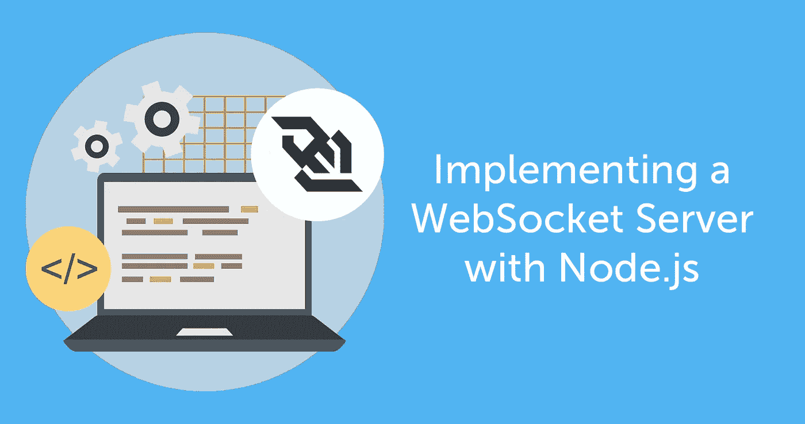
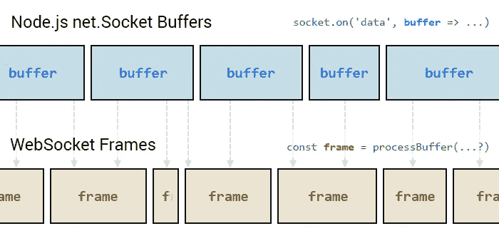
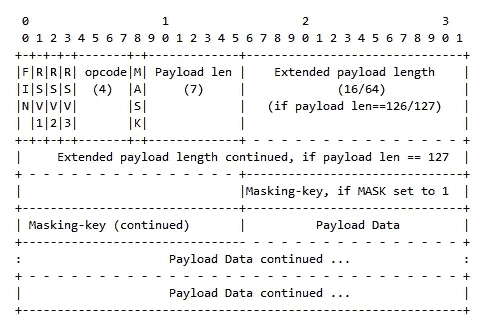
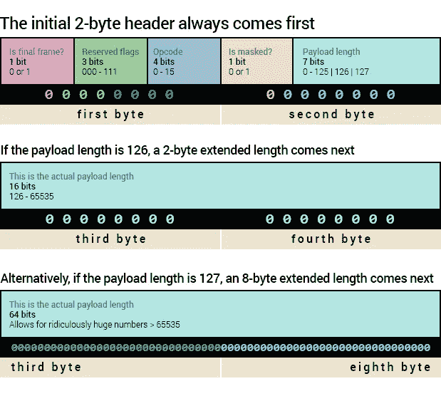

# 用 Node.js 实现 WebSocket 服务器

> 原文：<https://medium.com/hackernoon/implementing-a-websocket-server-with-node-js-d9b78ec5ffa8>



在本文中，我们将看到如何使用 Node.js 实现 WebSocket 服务器。

在我们开始之前——如果你不熟悉作为传输协议的 WebSockets，[这里有一篇精彩的文章，你应该读一读](https://ably.com/topic/websockets)。你可以通过另一篇关于[长时间投票](https://ably.com/topic/long-polling)的伟大文章来进一步学习。

为此，我将使用 Node.js(在撰写本文时，我的机器上已经安装了 10.7 版本)。

您的服务器可能正在运行 Go，。NET，Java，或者别的什么。每种环境中的实现都将根据可用的 HTTP 服务器库而有所不同。

尽管实际的概念是相当一致的。它们都遵循相同的标准规范来解释和构造 HTTP 请求和响应，以及解析和生成使用 [WebSocket](https://www.ably.io/topic/websockets) 成帧协议的数据。

不过现在，我假设您至少对 Node.js 有所了解。

**注意:**如果你一生中从未接触过 Node.js，你应该查阅几个 [Node.js 教程](https://www.youtube.com/watch?v=w-7RQ46RgxU&list=PL4cUxeGkcC9gcy9lrvMJ75z9maRw4byYp)来获得一个在你的机器上运行的简单 Node.js 服务器。您还应该了解如何使用 NPM 安装包，因为随着我们的继续，我假设您至少对这些有一点熟悉。

在构建一个 [WebSocket](https://ably.com/topic/websockets) 服务器时，有很多事情需要考虑，这里的意图只是演示一个起点。

诸如可伸缩性、性能、连接恢复、不同边缘情况的健壮处理、大型消息(例如 10kb+)的处理等主题超出了本教程的范围。

在客户端，除了使用现代浏览器默认内置的`WebSocket`类之外，您实际上不需要做任何特殊的事情。一个可能的例外是，如果您在浏览器环境之外实现定制的东西，比如某种定制的移动硬件。

但是在服务器上，除非您使用已经安装的 WebSocket 服务器库，否则您需要自己处理 HTTP 连接 WebSocket 升级握手。

然后，您需要读取通过 HTTP 套接字连接接收的原始二进制数据，并根据 WebSocket 帧协议规范对其进行转换。这在 RFC 6455 的第 5 节[中有所概述。](https://tools.ietf.org/html/rfc6455#section-5)

最后，服务器需要根据相同的规范构造自己的消息，并通过开放套接字连接将它们发送回客户机。

# 设置您的项目环境

在一个新文件夹中，确保你已经准备好了一个`package.json`文件，然后是`npm install node-static`。这将有助于我们快速提供您的客户端文件。

创建以下文件:

## 1.server.js:

`node-static`库是一种便利，它负责处理响应静态 HTML 和 JavaScript 文件请求的复杂过程，这些文件将在浏览器的客户端运行。

## 2.client.js:

上面只是一个存根，所以你知道你的客户端脚本实际上已经正确加载。我们将在下面继续实现时填写它。

## 3.index.html:

以上是前端的基本 HTML 框架。

然后，从终端/控制台运行:

```
node server.js
```

您应该看到:

```
Server running at [http://localhost:3210](http://localhost:3210)
```

打开浏览器，加载`index.html`文件。从浏览器的开发工具中，你应该可以看到`client.js`脚本的控制台输出，如下所示:

```
WebSocket client script will run here.
```

# 开始使用 HTTP

在定义 WebSocket 标准时，早期的考虑之一是确保它与 web“配合良好”。

这意味着要认识到网络通常是使用 URL 来寻址的，而不是 IP 地址和端口号。WebSocket 连接应该能够与用于任何其他类型的 web 请求的相同的基于 HTTP 的初始握手发生。

## 下面是一个简单的 HTTP GET 请求中发生的情况

假设有一个 HTML 页面托管在[*http://www.example.com/index.html*](http://www.example.com/index.html)。

无需深入了解 HTTP 协议本身，只需知道请求必须以所谓的[请求行](https://tools.ietf.org/html/rfc2616#section-5.1)开始就足够了。

接下来是一系列的键值对标题行。每一个都告诉服务器在报头数据之后的后续请求有效负载中会有什么，以及在它能够理解的响应类型方面，它可以从客户端得到什么。

请求中的第一个标记是 HTTP 方法。这将告诉服务器客户端针对所引用的 URL 正在尝试的操作类型。当客户机简单地请求服务器交付一个由指定 URL 引用的资源副本时，使用`GET`方法。

根据 HTTP RFC 格式化的请求头的基本示例如下所示:

```
GET /index.html HTTP/1.1
Host: [www.example.com](http://www.example.com/)
```

接收到请求报头后，服务器格式化以[状态行](https://tools.ietf.org/html/rfc2616#section-6.1)开始的响应报头。接下来是一组键-值头对，它们向客户机提供来自服务器的交互信息，这些信息与服务器正在响应的请求有关。

状态行告诉客户端 HTTP 状态代码(如果没有问题，通常是`200`)。它还提供了一个简短的“原因”文本描述来解释状态代码。

接下来出现的是键-值头对，随后是所请求的实际数据(除非状态代码表明请求由于某种原因无法实现)。

```
HTTP/1.1 200 OK
Date: Wed, 1 Aug 2018 16:03:29 GMT
Content-Length: 291
Content-Type: text/html
(additional headers…)(response payload continues here…)
```

你可能会问，这和 [WebSockets](https://ably.com/topic/websockets) 有什么关系？

当发出 HTTP 请求并接收响应时，实际的双向网络通信发生在活动的 TCP/IP 套接字上。

浏览器中请求的 web URL 通过全球 DNS 系统映射到一个 IP 地址，HTTP 请求的默认端口是 80。

这意味着即使在浏览器中输入了一个 web URL，实际的通信也是通过 TCP/IP 进行的，使用的是类似于`123.11.85.9:80`的 IP 地址和端口组合。

WebSockets 也构建在 TCP 栈之上。这意味着我们需要的只是一种方法，让客户端和服务器同意保持套接字连接打开，并将其用于正在进行的通信。

如果他们这样做了，那么他们就没有技术上的理由不能继续使用套接字来传输任何类型的任意数据。唯一的要求是它们都同意如何解释发送和接收的二进制数据。

为了开始将 HTTP TCP 套接字重新用于 [WebSocket](https://ably.com/topic/websockets) 通信，客户端可以包含一个专门为此类用例发明的标准请求头:

```
GET /index.html HTTP/1.1
Host: [www.example.com](http://www.example.com/)
Connection: Upgrade
Upgrade: websocket
```

`Connection`报头告诉服务器，客户端希望协商改变套接字的使用方式。伴随的值`Upgrade`表示当前通过 TCP 使用的传输协议应该改变。

既然服务器知道客户机想要升级当前通过活动 TCP 套接字使用的协议，服务器就知道寻找相应的`Upgrade`报头。这将告诉它客户端希望在连接的剩余生命周期中使用哪个传输协议。

一旦服务器看到`Upgrade`头的值`websocket`，它就知道 WebSocket 握手过程已经开始。

握手过程(以及其他一切)在 [RFC 6455](https://tools.ietf.org/html/rfc6455) 中有详细描述，如果你想更详细地了解这个主题的话。

更新 server.js 代码，使其能够响应 HTTP 升级请求:

Node.js 完成了解析从客户端接收的 HTTP 请求的大部分繁重工作，正如您在上面的代码中看到的。

我们所需要做的就是监听`upgrade`事件，然后检查`Upgrade`报头是否试图切换到 [WebSocket](https://ably.com/topic/websockets) 连接，而不是其他意外的事情。

一旦我们完成了这些，我们就可以完成握手，然后继续发送和接收 [WebSocket](https://ably.com/topic/websockets) 帧数据。

RFC 的第[部分概述了握手的详细细节。](https://tools.ietf.org/html/rfc6455#section-4)

# 避免有趣的事情

除了上面描述的以外，WebSocket 握手的第一部分包括证明这实际上是一个正确的 WebSocket 升级握手。证明流程没有被某种中间欺骗劫持是很重要的——要么被客户端劫持，要么被位于中间的代理服务器劫持。

当启动对 WebSocket 连接的升级时，客户端必须包含一个具有该客户端唯一值的`Sec-WebSocket-Key`头。这里有一个例子:

```
Sec-WebSocket-Key: BOq0IliaPZlnbMHEBYtdjmKIL38=
```

如果使用现代浏览器中提供的`WebSocket`类，以上是自动完成的。您只需要在服务器端寻找它并产生一个响应。

响应时，服务器必须将特殊的 GUID 值`258EAFA5-E914-47DA-95CA-C5AB0DC85B11`附加到键上，并生成结果字符串的阿沙-1 散列。然后，它将此作为 base-64 编码的值包含在响应中的`Sec-WebSocket-Accept`头中:

```
Sec-WebSocket-Accept: 5fXT1W3UfPusBQv/h6c4hnwTJzk=
```

在 Node.js WebSocket 服务器中，我们可以编写一个函数来生成这个值，如下所示:

然后我们只需要调用这个函数，将`Sec-WebSocket-Key`头的值作为参数传递，并在发送响应时将函数返回值设置为`Sec-WebSocket-Accept`头的值。

要完成握手，请将适当的 HTTP 响应头写入客户端套接字。简单的回答应该是这样的:

```
HTTP/1.1 101 Web Socket Protocol Handshake
Upgrade: WebSocket
Connection: Upgrade
Sec-WebSocket-Accept: m9raz0Lr21hfqAitCxWigVwhppA=
```

像这样更新您的`server.js`脚本:

在这一点上，我们实际上还没有完全完成握手——还有几件事情需要考虑。

# 子协议——就共享方言达成一致

客户端和服务器通常需要就如何格式化、解释和组织数据本身达成一致的兼容策略。这既存在于给定的消息中，也随着时间的推移从一个消息到下一个消息。

这就是子协议(前面提到的)的用武之地。

如果客户机知道它可以处理一个或多个特定的应用程序级协议(如 WAMP、MQTT 等)。)，它可以在发出初始 HTTP 请求时包含它所理解的协议列表。

如果是这样，则要求服务器要么选择这些协议中的一个并将其包含在响应报头中，要么握手失败并终止连接。

子协议请求标题示例:

```
Sec-WebSocket-Protocol: mqtt, wamp
```

服务器在响应中发出的对等标头示例:

```
Sec-WebSocket-Protocol: wamp
```

请注意，服务器必须从客户端提供的列表中选择一个协议。选择多个将意味着服务器无法可靠地解释后续 WebSocket 消息中的数据。

一个例子是，如果服务器选择了`json-ld`和`json-schema`。两者都是基于 JSON 标准的数据格式。会有许多边缘情况，其中一个可能被解释为另一个，导致处理数据时出现意外错误。

虽然不可否认的不是消息传递协议本身，但是这个例子仍然适用。

当客户机和服务器都实现为从一开始就使用一个公共的消息传递协议时，可以在初始请求中省略`Sec-WebSocket-Protocol`头。在这种情况下，服务器可以忽略这一步。

当没有转发来保证一旦建立了 WebSocket 连接，客户机和服务器就能相互理解时，子协议协商是最有用的。

通用协议的标准化名称[应在](https://tools.ietf.org/html/rfc6455#section-11.5) [IANA 注册中心注册](https://www.iana.org/assignments/websocket/websocket.xml)用于 WebSocket 子协议名称。在撰写本文时，已经有 36 个名字被注册。其中包括`soap`、`xmpp`、`wamp`、`mqtt`等。

注册中心是将子协议名称映射到其解释的唯一来源。然而，唯一严格的要求是客户机和服务器就它们相互选择的子协议的实际含义达成一致。它是否出现在 IANA 注册表中并不重要。

作为握手中子协议的演示，让客户机和服务器在通信时都同意使用 JSON 格式的数据。

如上所述，没有人强迫客户端和服务器只使用一个官方的子协议，或者子协议是一个真正的端到端消息传递协议。

出于以一致的方式格式化客户端和服务器消息的目的，简单地同意将`json`作为子协议是完全有效的。这就是我们在这里要做的。作为起点，我们将把它添加到服务器代码中:

紧接在`const responseHeaders = [ ... ];`语句之后:

**注意:**如果客户端请求使用子协议，但没有提供服务器能够支持的任何子协议，服务器必须发送失败响应并关闭连接。在这个实现中，我们不会为此费心。但是如果你想更进一步的话，你就需要这么做。

## **WebSocket 扩展**

还有一个头，用于定义数据有效载荷编码和成帧方式的扩展。在撰写本文时，只存在一种标准化的扩展类型。它提供了一种 web socket——相当于消息中的 gzip 压缩。

扩展可能发挥作用的另一个例子是多路复用——使用单个套接字来交错多个并发的通信流。

WebSocket 扩展是一个高级主题，超出了本文的范围。现在，只要知道它们是什么，以及它们是如何融入画面的就足够了。

# 客户端:在浏览器中使用 WebSockets

在继续服务器实现之前，让我们先来看看客户端。毕竟，在没有客户机启动的情况下，测试服务器代码有点困难。

WebSocket API 是在 WHATWG HTML 生活标准中定义的，实际上非常容易使用。首先，构造一个`WebSocket`对象:

请注意在通常使用`http`方案的地方使用了`ws`。也可以选择在通常使用`https`的地方使用`wss`。这些协议是和`WebSocket`规范一起引入的。它们被设计用来表示一个 HTTP 连接，该连接包含一个升级连接以使用 WebSockets 的请求。

创建`WebSocket`对象本身不会做很多事情。连接是异步建立的，因此在发送任何消息之前，您需要侦听握手的完成:

为了从服务器接收消息，需要另一个事件侦听器:

还有`error`和`close`事件。当连接终止时，WebSockets 不会自动恢复。这是您需要自己实现的事情，也是为什么有许多客户端库存在的部分原因。

虽然`WebSocket`类简单易用，但它实际上只是一个基本的构建块。对不同子协议或附加功能的支持，如[消息通道](https://ably.com/pub-sub-messaging)必须单独实现。

# 自己试一试

为了方便起见，测试 [WebSockets](https://ably.com/pub-sub-messaging) 的公共 echo 服务器由[websocket.org](http://websocket.org/)托管。在您的浏览器中尝试以下代码。回显服务器接收您发送的任何消息，并将消息数据回显到发出消息的 WebSocket。

在您的`client.js`脚本中输入以下内容并运行它，注意开发人员控制台:

你应该看到“你好！”消息发送到 echo 服务器，然后在`message`处理程序中接收回来:

```
Sending: Hello!
Received: Hello!
```

完成后，修改代码，准备与您自己的 WebSocket 服务器进行通信:

请注意，我在`WebSocket`构造期间添加了一个额外的参数——一组将通过`Sec-WebSocket-Protocol`请求头发送的子协议。

与前面提供的服务器代码一样，服务器将从列表中选择`json`，并将其包含在初始握手响应中。如果服务器没有选择指定的子协议之一，浏览器实现的 WebSocket API 将自动使连接失败。

在实现过程中，尝试让服务器选择一个子协议，该子协议与在初始请求过程中从客户端接收到的不一致。客户端应该抛出一个错误并立即终止连接。

上面的代码是我们将要使用的整个客户端脚本！您可以添加任何其他内容，但是该实现的其余部分将在服务器端进行。

# 生成和解析 WebSocket 消息帧

一旦握手响应被发送到客户机，我们就可以开始在客户机和服务器之间发送和接收消息。快速浏览一下 RFC 的[第 5 部分，了解一下所涉及的内容。](https://tools.ietf.org/html/rfc6455#section-5)

WebSocket 消息在称为“帧”的包中传递。这些消息以消息头开始，以“有效载荷”——该帧的消息数据——结束。

大型消息可能会将数据分割成几个帧。在这种情况下，你需要记录你目前收到的信息，并在所有信息到达后将它们拼凑起来。

# Node.js 套接字缓冲区与 WebSocket 消息帧的对齐

Node.js 套接字数据([我说的是这里的](https://nodejs.org/api/net.html#net_class_net_socket) `[net.Socket](https://nodejs.org/api/net.html#net_class_net_socket)`，不是 WebSockets)是以缓冲块的形式接收的。这些是分开的，不考虑你的 WebSocket 框架从哪里开始或结束！

这意味着，如果您的服务器正在接收被分割成多个 WebSocket 帧的大量消息，或者快速连续地接收大量消息，则不能保证 Node.js 套接字接收的每个数据缓冲区都将与构成给定帧的字节数据的开始和结束对齐。

因此，在解析套接字接收的每个缓冲区时，需要跟踪一帧的结束位置和下一帧的开始位置。您需要确保已经接收了一个帧的所有字节的数据，然后才能安全地使用该帧的数据。

一帧可能在下一帧开始的同一个缓冲器的中途结束。也有可能一个帧被分割成几个缓冲器，这些缓冲器将被连续接收。

下图夸大了这个问题。在大多数情况下，帧往往适合一个缓冲区。由于数据到达的方式，您经常会发现一个帧的开始和结束与套接字缓冲区的开始和结束一致。但是这并不是在所有情况下都可以依赖的，必须在实现过程中加以考虑。



这可能需要一些工作才能做好。

对于下面的基本实现，我跳过了任何处理大消息或跨多个框架拆分的消息的代码。

这样做需要跨多个帧的多个数据缓冲器的协调。这将使更多关于 Node.js 套接字而不是 WebSockets 的逻辑变得过于复杂。我在这里的目的是演示解析 WebSocket 帧以实现客户机和服务器之间的双向通信所需的一些底层工作。

# 实现解析器

首先，用下面的代码更新`server.js`代码:

我们将从实现`parseMessage`函数开始。

RFC 实际上相当容易理解。帧中的字节序列[使用下图在 RFC](https://tools.ietf.org/html/rfc6455#section-5.2) 中进行布局:



我们来分解一下。有两种主要类型的帧:消息帧和控制帧。

消息帧携带消息数据(“有效载荷”)。控制帧用于其他目的，例如发送 ping 或 pong，表示连接即将关闭，等等。

WebSocket 帧由一个标头组成，后跟消息有效负载(如果适用)。报头总是以两个字节(或 16 位)开始。

对于消息帧，第一位告诉我们这是否是当前消息的最后一帧。如果您的消息帧很小(< 126 字节)，这个值将始终为`1`。

接下来是三个保留位(我们通常可以忽略它们)，然后是四个“操作码”位，它告诉我们这是哪种帧。

之后，有一个单独的位告诉我们消息有效负载是否被“屏蔽”(稍后将详细介绍)，然后是七个位表示有效负载中的字节数。

不过 7 位并不算多，所以如果长度是 126，那么我们可以预期实际有效载荷长度会多出两个字节(16 位)。或者，如果长度是 127，而不是两个字节，那么将有额外的八个字节来将长度存储为 64 位整数。



# 操作码:消息帧与控制帧

根据 RFC:

```
Opcode: 4 bitsDefines the interpretation of the “Payload data”. If an unknown
opcode is received, the receiving endpoint MUST *Fail the
WebSocket Connection*. The following values are defined.%x0 denotes a continuation frame%x1 denotes a text frame%x2 denotes a binary frame%x3–7 are reserved for further non-control frames%x8 denotes a connection close%x9 denotes a ping%xA denotes a pong%xB-F are reserved for further control frames
```

要点:

*   当消息被分成多个帧时，使用连续帧。我们的实现只处理小消息，所以我们暂时不处理这种情况。但是如果您自己决定这样做，请记住，当您遇到一个连续帧时，这意味着操作码与序列中的初始消息帧相同，直到最后一个帧结束。您可以通过消息头的第一位来识别这一点。
*   我们一般只关心消息的文本帧和二进制帧。在我们的例子中，我们将只支持文本框架。您可以对图像、音频等使用二进制帧。
*   您确实需要支持`0x8`—“关闭”操作码——否则您不会知道客户端已经断开连接。

让我们来实现它:

# 蒙版框架

客户端发送的帧可能会被“屏蔽”(当客户端是浏览器时，情况总是如此)。这意味着浏览器将包括一个特殊的四字节“屏蔽密钥”，它必须与消息有效负载中的每个连续的四字节序列进行异或运算。结果将是实际数据。

屏蔽是一种确保消息帧保持完整性的机制，不会受到第三方(如中间代理服务器)的干扰。

如果初始报头的第二个字节以设置为`1`的第一个位开始，那么屏蔽键将占用有效载荷长度之后的四个字节(包括扩展有效载荷长度，如果存在的话)。

首先从缓冲区读取屏蔽键:

接下来，从缓冲区读取数据:

`data`缓冲区现在应该保存客户端发送的数据，这意味着我们所要做的就是将缓冲区解码成一个字符串:

# 为响应消息构造帧缓冲器

根据 RFC 的说法，如果你能够成功地完成上述所有工作，那么响应应该是相当微不足道的——特别是因为服务器*发送的消息不应该被屏蔽*。

为了节省时间，实现如下:

# 将响应发送回客户端

您应该已经有了本文前面的代码，但是为了更好地总结，我将在这里重复一遍:

此时，您可以从命令行运行您的服务器，然后在端口`3210`上打开您的浏览器到`localhost`。使用浏览器的开发工具，您将看到浏览器发送一条消息，服务器做出相应的响应。

请记住，我的实现还远未完成。也不是特别有效率。已经有许多现有的 [WebSocket 服务器实现](https://ably.com/topic/websockets#some-of-the-open-source-web-socket-libraries-you-can-use-right-now)。

# 继续前进——你可能会考虑的其他事情

WebSocket 服务器的原始实现实际上只是这个过程的第一步。如果你想更进一步，以下是你需要考虑的一些事情:

*   你将支持什么样的框架扩展，比如每条消息压缩？
*   您的目标是什么程度的客户机互操作性？
*   邮件的接收顺序是否与发送顺序相同？如果不是，如何防止这将您的应用程序置于无效状态？
*   你需要信息传递的保证吗？如果是这样，你能为此实施什么策略？
*   您的服务器上有多少个活动连接？
*   是否有任何连接占用了服务器的所有资源？
*   是否有任何连接是空闲的，并且理想情况下应该被丢弃？
*   平均连接寿命有多长？
*   连接是否被过早/意外地丢弃，如果是，如何保留诊断数据来解释原因？
*   您是否经历过短暂的连接高峰，如果是，对您的服务器性能有什么影响？
*   总体使用了多少带宽，它对您的预算有何影响？
*   您的服务器容量是否接近极限，如果不是，多久会达到极限？
*   如果需要，您将如何自动添加额外的服务器容量？

考虑可用的消息传递协议，如 MQTT、WAMP 等。，以及它们是否能为其中一些问题提供解决方案。考虑一下现有的库和框架，以及它们提供的除了简单、基本的 WebSocket 连接管理之外的附加特性。

如需进一步阅读，您可以查看[使用 Node.js 和 WebSockets 构建实时应用程序:客户端考虑事项](https://ably.com/topic/websockets-nodejs)。

如果您特别需要扩展，但人力或专业知识有限，无法有效实现，那么可以考虑利用已经为您解决了这些问题的[基于云的实时消息解决方案](https://ably.com/)。

[](http://twitter.com/Srushtika)

Srushtika is a Developer Advocate for Ably Realtime