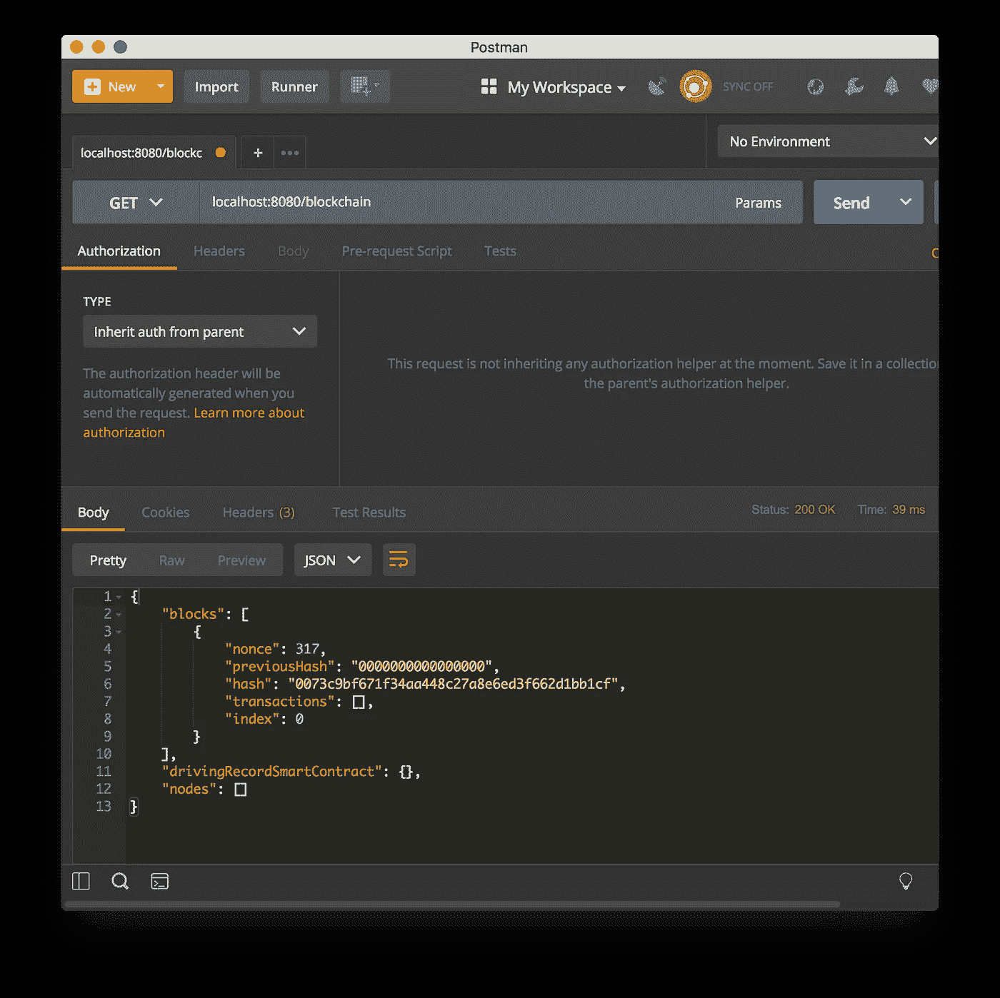
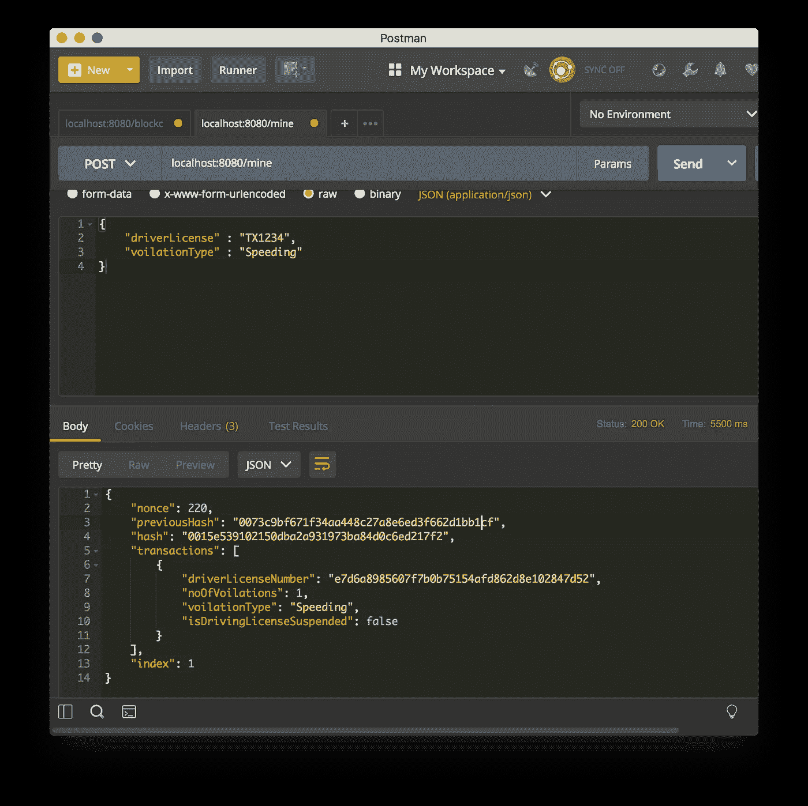
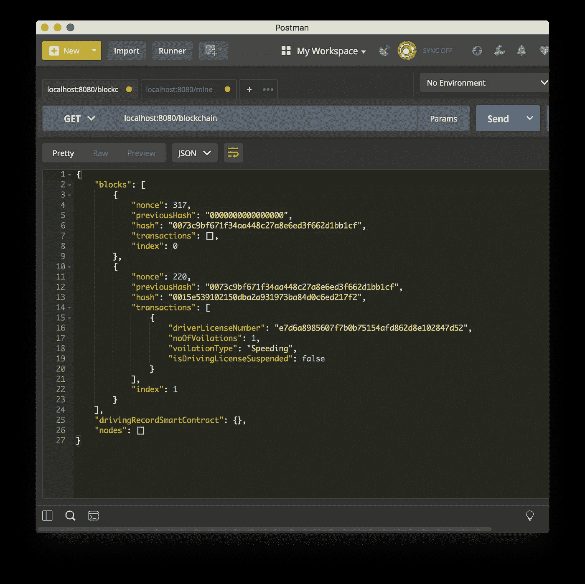
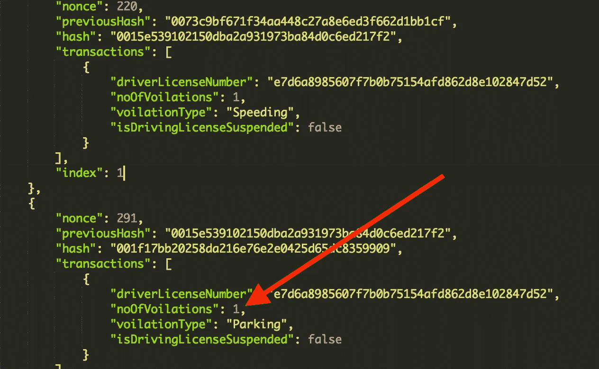
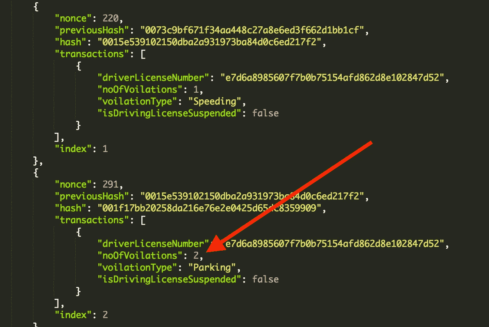
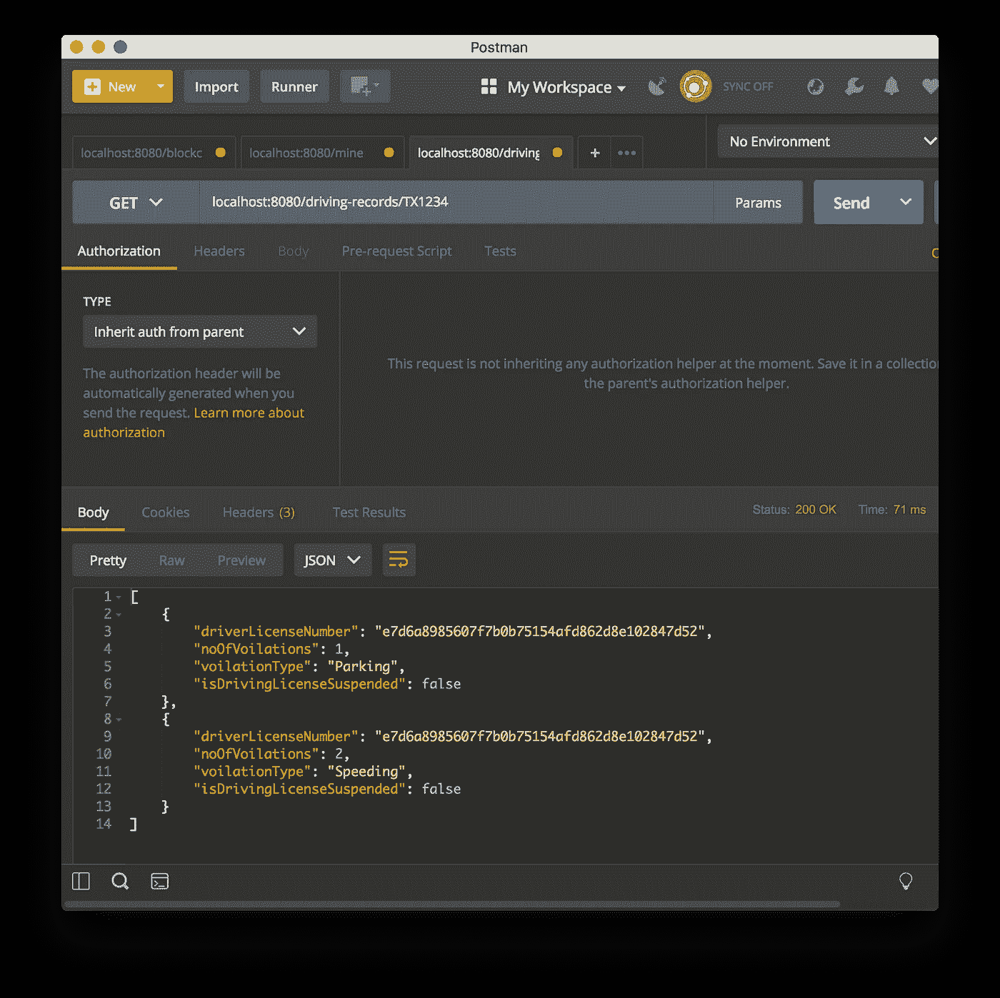
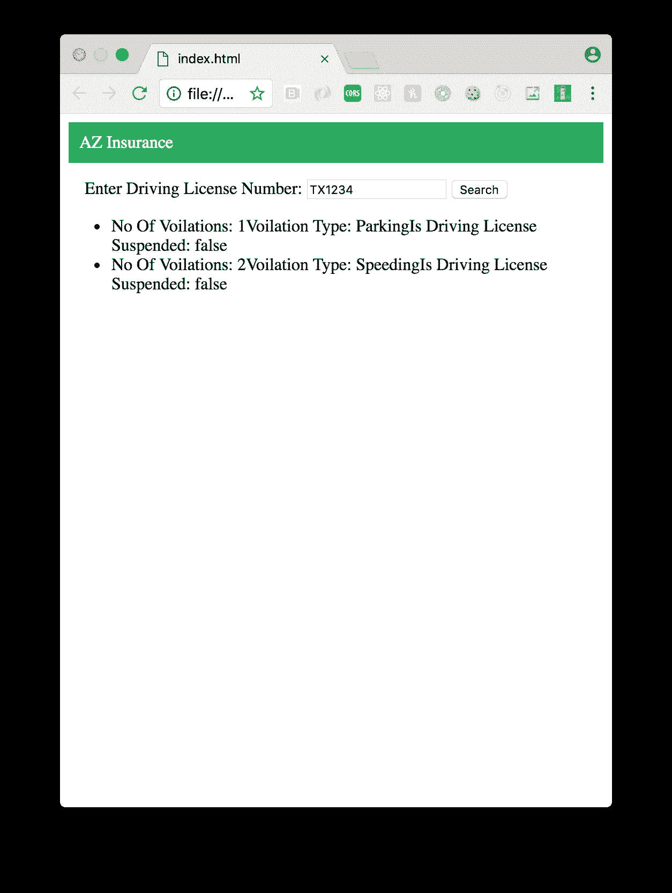

# 使用 Swift 在 iOS 中实现行车记录区块链

> 原文：<https://medium.com/hackernoon/implementing-driving-records-blockchain-in-ios-using-swift-23fb258819b1>

不管你喜不喜欢，汽车保险公司会查看你的驾驶记录，以便为你提供最新的保险费率。如果您从一个州搬到另一个州，您的驾驶记录可能会根据新州的规则和规定而变化。通常，驾驶记录存储在旧的政府系统中，这些系统容易受到网络攻击。

在本帖中我将使用 Swift 语言在 [iOS](https://hackernoon.com/tagged/ios) 中实现一个[区块链](https://hackernoon.com/tagged/blockchain)，负责存储用户的行车记录。接下来，我将使用 Vapor，服务器端 Swift 框架，将区块链暴露为 Web API。最后，我将创建一个简单的接口，该接口将与 API 进行通信，以通过特定用户的驾驶执照号码来获取和显示他们的驾驶历史。

完整的代码可以从[这里](https://github.com/azamsharp/BlockchainRealWorld)下载。

> 我还提供 ARKit、iOS、React 和 Redux 开发的培训研讨会。如果您或您的公司对研讨会感兴趣，请随时联系我。

## 实现模型

让我们从实现应用程序中使用的领域模型开始。为了实现区块链，我们需要以下模型:

*   区块链
*   街区
*   交易

区块链和区块是不言自明的。交易模型表示用户的驾驶记录。如果您不喜欢“事务”这个名称，那么您可以将其更改为“驱动记录”。在这篇文章中，我将使用“交易”，这将代表一个用户的驾驶记录。

**交易**:

交易类别由与驾驶记录相关的属性组成。这包括以下内容:

*   驾驶执照号码
*   语音类型
*   没有变化
*   isDrivingLicenseSuspended

显然，您可以添加更多的属性来存储更多与驾驶记录相关的信息。

**区块:**

Block 类负责存储事务。每个区块都要由矿工开采，之后再加入区块链。Block 类的实现如下所示:

块类的属性“ **key** ”是一个计算属性，它取决于块链中块的交易数据、先前散列、随机数和索引。

**区块链:**

最后，区块链类负责维护和添加区块到区块链。区块链类的实现如下所示:

## **将区块链公开为 Web API:**

在我之前的一篇[帖子](https://hackernoon.com/building-blockchain-web-api-using-swift-and-vapor-2daf599c8449)中，我讨论了如何使用服务器端 Swift 框架 Vapor 将区块链公开为 Web API。你可以在这里阅读[的帖子。Web API 由负责管理区块链的**区块链控制器**组成。](https://hackernoon.com/building-blockchain-web-api-using-swift-and-vapor-2daf599c8449)

路由“**区块链**”负责返回 JSON 格式的区块链。实现如下所示:

如果您使用 Postman 调用“区块链”路线，您将得到以下结果:

该屏幕截图显示被返回的区块链由单个块组成。该程序块是自动创建的，它被称为“**生成程序块**”。

BlockchainController 的“ **mine** ”路由负责挖掘块，并将事务添加到挖掘的块中。如果您使用 Postman 调用“我的”路线，您将得到以下结果:

您可以再次获取区块链，以验证具有行驶记录的块是否已添加到区块链。只需使用 Postman 或您的浏览器访问“**区块链**”路径，查看 JSON 响应。

这确保了我们的驾驶记录被成功添加到区块链。请注意，在区块链中，driverLicenseNumber 是经过哈希处理的，而不是以普通驾照号码的形式存储。

> 在本例中，我向一个块添加了一个事务。实际上，一个块由几个事务组成，这取决于块的大小。

此时，如果您为同一个驾照号码添加另一个违规，您将立即看到问题。

即使这个人有两次违规，区块链仍然说 1。我们不能去更新原始事务并将违例增加到 2，因为区块链中的块是不可变的并且不能被改变。在将事务添加到区块链之前，我们必须根据一些逻辑动态地更改事务。这听起来像是智能合约的完美工作。

**实施智能合同:**

智能合约是位于区块链上的代码块，能够执行自定义逻辑。我们可以使用这个定制逻辑在事务被添加到块之前更新它。**驱动记录智能合同**的实现如下所示:

DrivingRecordSmartContract 由一个名为“ **apply** ”的函数组成。apply 函数遍历区块链中的每个块，并找到与驾照号码相关联的交易。一旦找到驾照号码，就会更新该交易的违规次数。如果违章次数超过 5 次，那么驾照将被吊销。

区块链类更新为支持智能合约，如下所示:

在 **getNextBlock** 函数中，我们调用智能契约，并将事务和对块的引用传递给它。

现在，如果您访问区块链，您将获得更新后的交易，如下所示:

## 使用 Web 界面访问驾驶记录:

现在，我们的区块链实现已经完成，让我们看看如何使用 web 界面访问区块链记录。首先，我们需要创建一条可以通过驾照号码的路线。根据驾驶执照号码，区块链服务将返回适当的结果。

下面的实现显示了 BlockchainController 路由，它可用于传递驾驶执照号码:

Blockchain 类已经更新，包含了基于驾照号码返回交易的 **transactionsBy** 函数。

下面的截图显示了 JSON 结果:

通过 web 应用程序访问时，结果如下所示:

如果您有兴趣了解更多关于区块链的知识，请查看下面我的 Udemy 课程:

 [## 使用 Swift | Udemy 在 iOS 中进行区块链编程

### 有兴趣了解区块链技术吗？区块链技术是比特币的支柱…

www.udemy.com](https://www.udemy.com/blockchain-programming-in-ios-using-swift/?couponCode=ILOVEBLOCKCHAIN)  [## 使用 Javascript | Udemy 的区块链编程

### 了解自互联网以来最具颠覆性的发明

www.udemy.com](https://www.udemy.com/blockchain-programming-using-javascript/?couponCode=BLOCKCHAINJS) 

非常感谢，编码快乐！