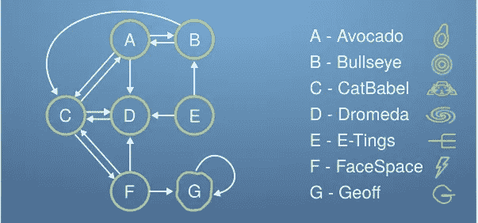
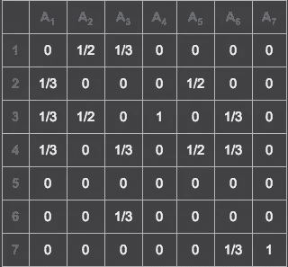
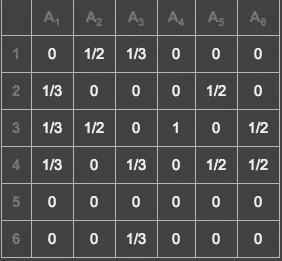

# 实现 Google 的 Pagerank 算法

> 原文：<https://medium.com/hackernoon/implementing-googles-pagerank-algorithm-88069314fb3d>

作为一名学习编程的学生，在某种程度上，也是学习计算机科学的学生，我经常发现新的令人兴奋的历史成就让我着迷，至少在计算机科学领域是这样。这次是机器学习，但不止于此，是[谷歌的 Pagerank 算法](https://www.geeksforgeeks.org/page-rank-algorithm-implementation/)。更重要的是，它开始对如何增加我的互联网可见性感兴趣，然后转向谷歌如何决定什么显示什么隐藏，最后转向“我如何实现这一点？”。我不断问自己的这些问题会导致更大更频繁的发现。

那么，谷歌是如何决定什么被显示，什么被隐藏的呢？用最简单的话来说，就是基于你的网页链接到不同网页的次数，以及第二个网页的信息质量如何。本质上，你的网页与其他网页的链接越多，谷歌就越有可能推广你的网页。

谷歌是如何确定这一点的？当筛选网页时，你点击链接进入另一个网页的几率必须达到 100%。当然，在这种算法的更高级的实现中，您必须考虑到有人在网页中键入 URL 的可能性。至少现在，为了简单起见，我们将忽略这种可能性。为了确定哪个网站将以什么频率向您发送哪里的信息，该算法使用线性代数的数学方法形成一个矩阵。该矩阵是通过计算每次你的网页链接到另一个网页的次数来构建的。例如，看看下面的插图。

Image credit goes to Imperial College London.

在图示中，

a 链接到 B、C 和 d。

b 链接到 A 和 c。

c 链接到 A、D 和 f。

d 链接到 C

e 到 D 和 B 的链接

f 到 D、G 和 C 的链接

链接到 g。

这提供了一个类似下图的矩阵。

Image from [https://matrix.reshish.com/](https://matrix.reshish.com/)

为了实现 Pagerank 算法，你需要一个向量，我们称它为‘r’。向量 r 将代表当前在互联网上查看特定主题的人。现在，重复进行矩阵的点积，直到数字稳定。您这样做是为了检查互联网上的人们访问分配的每个特定网站的概率。经过这么多次重复，数字会收敛。得到的向量将具有这些人中的每一个将出现在任何特定站点上的概率。

例如，使用上面的矩阵和包含 100 个人的向量 r 随机选择上面的一个网站，结果将收敛于:

r1 = 0

r2 = 0

r3 = 0

r4 = 0

r5 = 0

r6 = 0

r7 = 100

为什么 r7 = 100？

这 100 个人在互联网上的时间越长，他们越有可能到达网页 G，网页 G 只链接到它自己，所以他们一旦到达就无法离开它。当收敛发生时，唯一可能的解决方案是每个人都将在网页 g 上。

如果我们选择一组不同的网页呢？

Image from [https://matrix.reshish.com/](https://matrix.reshish.com/)

去除网页 G 的可能性给出如上所示的结果。其他一切都保持不变，除了网页 F 到 G 的链接和网页 G 不再存在。

当我们对新矩阵执行上述过程时，结果如下:

r1 = 16

r2 = 16/3

r3 = 40

r4 = 76/3

r5 = 0

r6 = 40/3

16 + 16/3 + 40 + 76/3 + 0 + 40/3 = 100

因此，当我们达到收敛时，大多数人将在网页 3，其次是网页 4。

摩西问了一个很棒的问题。问题是，Inlinks(链接到一个网页，而不是从一个网页)如何影响 Pagerank 算法。

引用我对他的问题的回答，

“当然，是的，谢谢你提起这件事。内链是这些网站排序的主要部分。

以示例 1 为例，网页 G 只有指向自身的内链接。网页 F 链接到网页 G，网页 G 链接到网页 G。这导致了一个问题，因为这意味着在一段合理的时间之后，每个人都将最终出现在网页 G 上，从而当有人搜索与网页 A-G 相关的内容时，将网页 G 放在列表的顶部

在示例 2 中，我通过消除网页 g 的任何可能性来纠正这个错误。这样做允许 convergence 在给定参数的情况下提供我们预期的结果。"

我特别希望这些信息能满足对那个问题的好奇心。

这是 Google page rank 算法的一个基本实现。如果您有任何问题、意见或顾虑，请在下面留言。

感谢您的阅读！