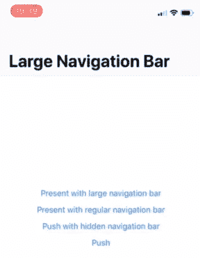
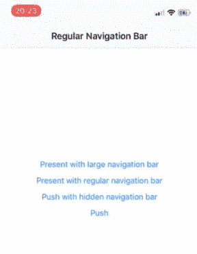
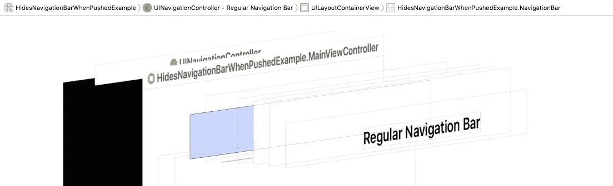
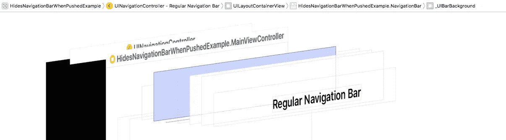

# 在 UIViewController 上实现 hidesNavigationBarWhenPushed

> 原文：<https://medium.com/hackernoon/implementing-hidesnavigationbarwhenpushed-on-uiviewcontroller-10d8a68bca86>

距离我上次发帖已经有一段时间了。

我回来了，希望花更多的时间来写教程和开源有趣的东西。

## 这篇文章是关于什么的？

在这篇文章中，我想浏览一下最近发布的[HidesNavigationBarWhenPushed](https://github.com/gontovnik/HidesNavigationBarWhenPushed/)库，并解释其背后的动机和实现。

hidesNavigationBarWhenPushed in action (With interactive pop gesture recognizer)

## 动机

当[在各种项目上破解](https://hackernoon.com/tagged/hacking)时，我不时地得到这样的设计，视图控制器 A 有[导航条](https://hackernoon.com/tagged/navigation-bar)可见，而视图控制器 B 隐藏了导航条。让它运转起来总是很痛苦。

最简单的解决方案是:

它是这样工作的:

这并不十分奏效，因为关键要求是**保持**导航条标题和按钮转换相同，就好像导航条是可见的一样。

所以我想…

> *如果在推送或弹出时，我可以隐藏现有的导航栏，而显示假的导航栏，会怎么样？*

## 调查

在直接跳到编码之前，我决定更好地理解 [UINavigationBar](https://developer.apple.com/documentation/uikit/uinavigationbar) 在幕后是如何工作的。该过程包括两个步骤:

1.  通读 [UINavigationBar 运行时标题](https://github.com/nst/iOS-Runtime-Headers/blob/master/Frameworks/UIKit.framework/UINavigationBar.h)
2.  通过**调试视图层次**检查导航栏内的内容

这让我明白了两件事:

1.  导航条本身总是以与状态栏高度相等的 **origin.y** 定位，但是它的子项以负的 **origin.y** 布局，以模拟好像导航条的 **origin.y** 等于 0。
2.  导航栏包含一个类 **_UIBarBackground** 的子类，负责绘制实际背景。在运行时头中，我发现有一个 getter **_backgroundView** 。

The position of navigation bar is offset vertically by the height of the status bar.

The vertical position of the background view is negative, to simulate that navigation bar is position with origin.y equal to 0.

## 履行

调查之后，我有了足够的信息，可以开始入侵了。

我制定了一个关于它应该如何工作的小型计划。有两种情况我不得不担心:

1.  从显示导航栏的视图控制器转换到隐藏导航栏的视图控制器，然后再转换回来
2.  从隐藏导航栏的视图控制器转换到显示导航栏的视图控制器，然后再转换回来

让我们更详细地看一下这些案例。

**从可见到隐藏再返回**

1.  当我从导航栏可见的当前视图控制器推到导航栏隐藏的目标视图控制器时，我复制了导航栏并将其添加到当前视图控制器的视图中，并且我隐藏了原始导航栏上的背景视图，它是导航控制器视图的子视图。在这种情况下，我可以保证导航栏背景只保留在当前视图控制器中，而不在目标视图控制器中。[见实施。](https://github.com/gontovnik/HidesNavigationBarWhenPushed/blob/master/HidesNavigationBarWhenPushed/NavigationController.swift#L76-L78)
2.  当我从隐藏了导航条的当前视图控制器跳到导航条可见的目标视图控制器时，我等待导航转换完成。在过渡结束时，我从目标视图控制器的视图中移除了伪导航栏，并在原始导航栏上取消隐藏背景视图。[见实施。](https://github.com/gontovnik/HidesNavigationBarWhenPushed/blob/master/HidesNavigationBarWhenPushed/NavigationController.swift#L119-L123)

**从隐藏到可见再返回**

1.  当我从隐藏了导航条的当前视图控制器推到导航条可见的目标视图控制器时，我复制了导航条，但是我只在调用 **viewWillAppear** 时才将其添加到目标视图控制器。在这个推送过渡的最后，我必须从目标视图控制器中移除伪导航条，并在原始导航条上取消隐藏背景视图。[参见实现。](https://github.com/gontovnik/HidesNavigationBarWhenPushed/blob/master/HidesNavigationBarWhenPushed/NavigationController.swift#L80-L91)
2.  当我从导航栏可见的当前视图控制器跳到导航栏隐藏的目标视图控制器时，我复制了导航栏并将其添加到当前视图控制器，并隐藏了原始导航栏上的背景视图。如果过渡失败，我们返回到当前视图控制器，我会添加逻辑来移除假的导航栏，并在当前视图控制器的 **viewWillAppear** 上取消隐藏原始导航栏上的背景视图。[见实施。](https://github.com/gontovnik/HidesNavigationBarWhenPushed/blob/master/HidesNavigationBarWhenPushed/NavigationController.swift#L125-L130)

## 错误和错误修复

令人惊讶的是，我只遇到了一个 bug，并且不得不与之斗争。

由于 **_backgroundView** 是私有 API，由苹果公司管理，因此存在该视图被苹果公司隐藏或取消隐藏的情况。为了防止这种情况，并使其与我的状态保持同步，我添加了逻辑来观察背景视图上隐藏的**标志，并在它发生意外变化时用我的值覆盖它。[见实施。](https://github.com/gontovnik/HidesNavigationBarWhenPushed/blob/master/HidesNavigationBarWhenPushed/NavigationBar.swift#L51-L67)**

## 结论

老实说，像这样将 *hack* 包含到生产应用程序中是有风险的，因为它使用的是苹果的内部 API，这个 API 可以随时改变。另一方面，我在生产中有这个逻辑一年多了，没有遇到任何 bug。

如果你有任何问题，请给我写信！

## 感谢您的阅读！如果你喜欢这篇文章，请点击“鼓掌”(掌声)👏按钮)，这样其他人也可以看！😉

如果你想聊天，请在 Twitter 上点击我。