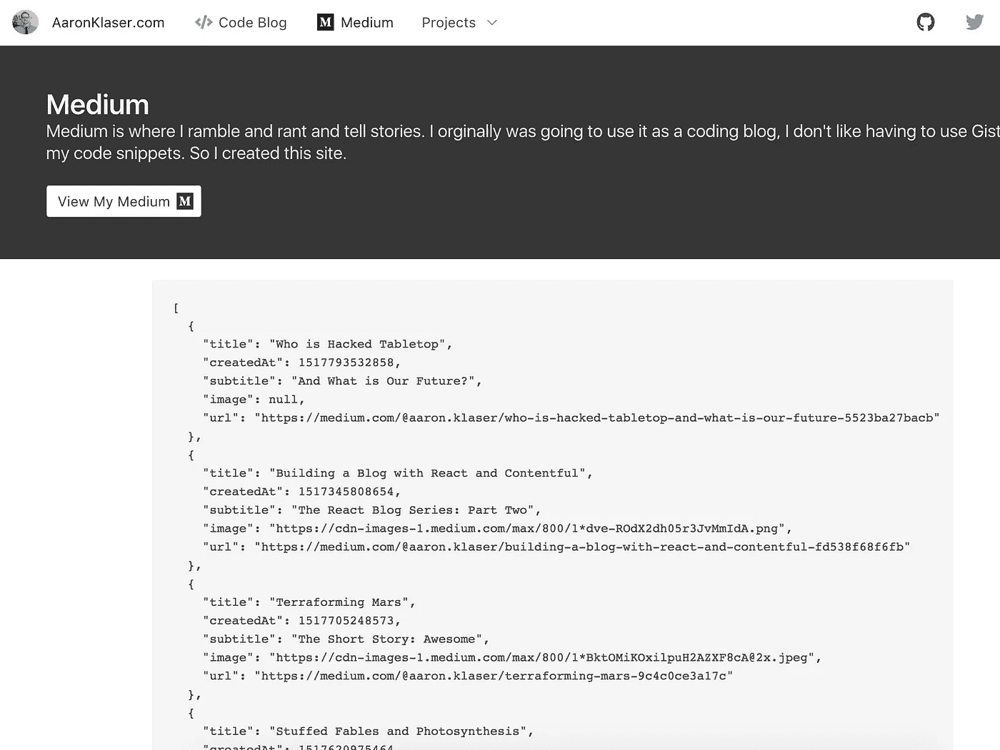

# 将您的媒体提要导入 React

> 原文：<https://medium.com/hackernoon/import-your-medium-feed-into-react-ceadbaf785c7>

## React 博客系列:第三部分

本文是用 React 创建博客的每周系列文章的第三部分，是前几部分创建的代码的扩展。

## React 博客系列

[**第一部分:**用 React 和布尔玛](/front-end-hacking/building-a-website-with-react-and-bulma-d655214bff2a)
[**建立一个网站第二部分:**用 React 和 Contentful 建立一个博客](/@aaron.klaser/building-a-blog-with-react-and-contentful-fd538f68f6fb)
**第三部分:**将你的媒体提要导入 React
[**第四部分:**向 React 博客添加一个 Redux](/@aaron.klaser/adding-redux-to-a-react-blog-97f5fea606c2)
[**第五部分:**用 Redux Sagas 替换 Redux Thunks](https://hackernoon.com/replacing-redux-thunks-with-redux-sagas-4aa306854925)

如果你还没有在 medium 上写博客，你应该写。太简单了。

本周我们将在我们的网站上添加一个 feed，这样我们就有了一个另类的博客。

首先，让我们看看什么是中等饲料。我们可以通过添加**将内容转换成 JSON 格式？format=json** 到 url 的末尾。这是我的饲料。

[https://medium.com/@aaron.klaser/**最新？格式= JSON**](https://medium.com/@aaron.klaser/latest?format=json)

这将返回一大块 JSON，但是我们只关心`payload.references.Post`

> 我认为公平地说，这实际上不是一个“feed”，这基本上是 Medium 用来在我的 Medium 个人资料上显示我最新帖子的**预览**的内容，而不是完整的帖子本身。Medium 提供了一个 RSS 提要，它像传统的博客提要一样包含更多的信息，但是它不能返回任何 JSON，只能返回 XML。我喜欢在 Medium 上预览我的 Medium 文章的链接，这是一个额外的好处，因为不必解析 XML。但是，如果您想使用实际的媒体提要，这些概念几乎是相同的，您可以使用 url `[https://medium.com/**feed/**@aaron.klaser](/@aaron.klaser)`

但是我们需要一页纸来把它放上去。我[已经有一个标签在导航](/front-end-hacking/building-a-website-with-react-and-bulma-d655214bff2a)我们只需要创建一个页面把它放在上面。基本设置遵循了我上一篇文章中的许多步骤，所以我将快速浏览一下基本页面设置。

在 **app** 文件夹中，创建一个名为`Medium.js`的文件

```
import React from 'react'
import PageHeader from './components/PageHeader'
import PageContent from './components/PageContent'
import axios from 'axios'class Medium extends React.Component { state = {
    posts: []
  } componentDidMount() {
    this.fetchPosts().then(this.setPosts)
  } fetchPosts = () => axios.get(`https://cors.now.sh/https://us-central1-aaronklaser-1.cloudfunctions.net/medium?username=@aaron.klaser`) setPosts = response => {
    this.setState({
      posts: response
    })
  } render() {
    return (
      <div>
        <PageHeader color="is-dark" title="Medium">
          Medium is where I ramble and rant and tell stories. I orginally was going to use it as a coding blog, I don't like having to use Gist for all my code snippets. So I created this site.
          <br /><br />
          <a className="button is-inverted is-outlined" href="https://medium.com/@aaron.klaser" target="_blank">
            View My Medium
            <span className="icon" style={{ marginLeft: 5 }}>
              <i className="fab fa-lg fa-medium"></i>
            </span>
          </a>
        </PageHeader>
        <PageContent>
          <pre>{JSON.stringify(this.state.posts, null, 2)}</pre>
        </PageContent>
      </div>
    )
  }
}export default Medium
```

然后设置此页面的路由，并更新“媒体”项以指向此页面。

## 这不容易弄清楚

因此，当我们在本地构建这个中型块时，cors 的本地主机。您可以告诉 fetch 运行 no cors 模式，但是您会得到一个没有数据的不透明响应。我发现我可以通过一个 express 服务器运行所有的东西来解决这个问题，但是我不希望我的网站需要一个后端。我也试着在 cors-anywhere 和 cors.now 中运行它。它们只是被屏蔽了，老实说是有原因的。

# 拯救世界的无服务器架构

我可以用 Firebase 云函数帮我打电话来解决这个问题。然而，firebase 仍然抛出 cors 错误，但它们不会被 **cors.now** 阻止。

我的函数看起来像这样，很难看，但我让它工作了，我继续前进。

> Medium 返回一个奇怪的前缀 `to prevent JSON` Hacking (:P)，所以我们将删除它并返回我们的数据。

```
const functions = require('firebase-functions');
var request = require('request');exports.medium = functions.https.onRequest((req, res) => {
  if(!req.query.username) {
    return res.status(400).send('Error: You need to include query param ?username=@yourUsername');
  } const url = `https://medium.com/${req.query.username}/latest?format=json`; return request(url,(error, response, body) => {
    const prefix = `])}while(1);</x>`
    const strip = payload => payload.replace(prefix, ``)
    res.send(JSON.parse(strip(body)));
  });
})
```

我已经在 **firebase 函数**中设置了一个端点，你可以使用**或者尝试创建自己的端点。我甚至可能会写一篇关于它的文章，因为事实证明它很酷。**

`https://cors.now.sh/https://us-central1-aaronklaser-1.cloudfunctions.net/medium?username=**@yourUsername**`

只需更新您的用户名，您应该会在 pre 块中看到您的 json。


# 为我们的帖子提取数据

有一种简单的方法，但是很脏，然后有一种困难的方法，但是很干净。

## 简单的方法:

使用 Object.values()将 Posts 节点转换为对象数组。这将使用我们的数据，但它是我们所有的数据，我们不能在我们的媒体上传播(我们将很快建立)

```
setPosts = (**{data}**) => {
  this.setState({
    posts: **Object.values(data.payload.references.Post)**
  })
}
```

但当你运行应用程序时，你会看到前块有提取后的数据，但也有大量你不需要的数据。艰难的方式解决了这个问题。

## **敬酒不吃吃罚酒:**

*(推荐)*让我们提取帖子中唯一需要的数据。这将是:**创建日期，图像，标题，副标题，描述，**和**网址**回到媒体上的帖子。

```
setPosts = ({**data**}) => { **const { Post } = data.payload.references** **const posts = Object.values(Post).map(({ id, title, createdAt, virtuals, uniqueSlug }) => Object.assign({},{
      title,
      createdAt,
      subtitle: virtuals.subtitle,
      image: virtuals.previewImage.imageId ? `https://cdn-images-1.medium.com/max/800/${virtuals.previewImage.imageId}` : null,
      url: `https://medium.com/@aaron.klaser/${uniqueSlug}`
    })
  )** this.setState({
    posts
  })
}
```

现在，当我们运行我们的应用程序时，它应该只打印出我们需要的来自 JSON 的巨大 blob 的五个字段，所有这些都准备好在我们将要构建的 MediumItem 对象中展开…



现在！

# 构建媒体组件

在我们的应用程序文件夹中，创建一个中型文件夹，并在其中创建 MediumItem.js

这将看起来类似于我们的博客项目，但由于 medium 没有给我们内容，我们不需要像博客那样的 MediumPost，所以我们不会有任何共享项目，我们将把它们都放在这个组件中。

```
import React from 'react'
import moment from 'moment'const MediumItem = ({title, createdAt, subtitle, image, url}) => (
  <div className="box is-paddingless card">
    { image
    ? (<div className="card-image">
         <figure className="image">
           
         </figure>
       </div>)
     : "" }
    <div className="card-content">
      <div className="media">
        <div className="media-content" style={{ overflow: 'inherit' }}>
        <p className="title is-4">{title}</p>
      </div>
    </div>
    <div className="content">
      { subtitle }
    </div>
    <nav className="level">
      <div className="level-left">
        <div className="tags has-addons">
          <span className="tag is-primary">{moment(createdAt).format('MMM Do')}</span>
          <span className="tag">{moment(createdAt).format('YYYY')}</span>
        </div>
      </div>
      <div className="level-right">
        <a className="button is-small is-link is-outlined" target="_blank" href={url}>
          Read on Medium
        </a>
      </div>
    </nav>
  </div>
</div>
)export default MediumItem
```

它应该看起来像这样


这就是你要的，孩子们！现在，您的博客中有了一个链接回您的中型文章的中型提要。开始鼓掌！！

# 让我们回顾一下

*   我们为我们的媒体提要建立了一个页面
*   我们链接到无服务器功能来检索我们的媒体馈送
*   我们从我们的媒体内容中提取了我们需要的数据
*   我们设置了一个简单的媒体组件。

> 接下来— [向 React 博客添加 Redux](/@aaron.klaser/adding-redux-to-a-react-blog-97f5fea606c2)