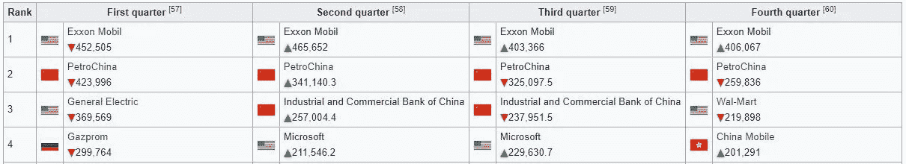
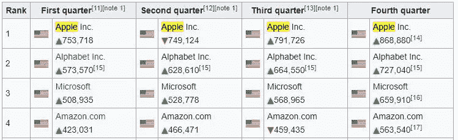

# 大数据和分析在电子商务中的重要性

> 原文：<https://medium.com/hackernoon/importance-of-big-data-and-analytics-in-ecommerce-faa22bf65dee>

大数据只是一种短暂的趋势，还是会一直存在下去？在线商务仅占美国整体零售份额的 9%，大数据对零售企业有意义吗？我的业务大数据准备好了吗？拥有大数据思维意味着什么？

在这篇文章中，我将仔细研究这些问题和更多。

# 大数据的相关性

让我们仔细看看 2008 年的公司估值——这份名单主要是石油、电信和快速消费品公司。

微软是唯一进入前十的“数字”战士。然而，基于数据的估值并不重要。

展望 2017 年，包括亚马逊、Alphabet、脸书(以及数据收入不断增长的苹果或微软)在内的数据优先公司一直统治着前 10 名。

随着包括亚马逊、阿里巴巴和腾讯在内的顶级零售商塑造零售业的未来，是时候让整个零售链迎头赶上了。

# 大数据就绪意味着什么

Moneyball 的这个场景真实地总结了零售业中决策的方式。

[https://www.youtube.com/watch?v=pWgyy_rlmag](https://www.youtube.com/watch?v=pWgyy_rlmag)

很多时候，消费者的眼球和思维空间——优质零售库存——被零售商根据直觉、陈旧的数据点和模仿成功竞争对手的做法提供的不相关产品推荐所充斥。

零售商目标战略失败的原因要么是因为他们尚未采用数据优先的方法，要么是因为他们没有充分利用他们的数据基础设施。

# 那么，作为企业，我们如何为大数据做好准备呢？

首先要认识到数据是一种资产！今天的技术使我们能够为零售交易的每一步收集数据，从产生网站访问的第一次点击开始，到每个消费者和产品的终身价值(LTV)。

**延伸阅读:** [计算你的客户 LTV 带动重复购买](https://onlinesales.ai/blog/life-time-value-ecommerce-shoppers/)

这些数据点中的每一个都可以为在线和线下营销和销售提供非常强大的实时洞察。

数据优先方法的成败取决于收集和使用的数据的质量。

人工智能驱动的电子商务营销平台，如 OnlineSales.ai，可帮助您为所有营销需求准备好大数据。

# 以下是找到合适平台的一些提示:

客户档案实质上是对目标人群的详细描述，包括:

寻找一个与流行的商业引擎有直接 API 集成的平台，包括 [Magento](https://onlinesales.ai/multi-platform-integration/magento) 、 [Shopify](https://onlinesales.ai/multi-platform-integration/shopify) 、 [BigCommerce](https://onlinesales.ai/multi-platform-integration/bigcommerce) 、 [Vinculum](https://www.vinculumgroup.com/) 和 KartRocket。

然后，您可以选择您喜欢的引擎，并从一个地方立即进行集成。

找到一个平台，自动创建智能订阅源，并快速将您的产品电子商务与包括[谷歌](https://onlinesales.ai/cross-channel-marketing-platform/google-advertising-ecommerce)、[脸书](https://onlinesales.ai/cross-channel-marketing-platform/facebook-ads-ecommerce/)和[亚马逊在内的知名购物引擎进行匹配。](https://onlinesales.ai/cross-channel-marketing-platform/amazon-sponsored-products/)

强烈推荐一个平台，您可以在其中定义您的业务目标，并为您提供一个数据驱动的引擎，该引擎具有针对受众选择、营销偏好和设备选项的智能选项，以确保没有人工劳动和错误。

确保放置一个跟踪像素。找到一个拥有专有跟踪技术的平台，该平台将实现对网站访问者的新近频率、受众和城市的产品移动、订单季节性和按漏斗划分的转化率的实时群组分析。

相信我，你会需要这些数字(很多！)

尝试找到一个能够将在线营销数据与线下销售 CRM 数据集成的平台，确保客户购买漏斗的端到端视图。

# 大数据的行为——相关性和因果性的混合

大数据挑战了零售决策的传统方法——适用于更多人群的较小数据集假设。这种方法主要基于对因果关系的分析。

大数据方法是彻底改变这一理念，将样本集扩展到 n=all(或尽可能接近)。

计算能力大幅提高，甚至可以在几秒钟内分析大 Pb 的数据集。随着海量数据的处理，证明因果关系可能会非常耗时，而且会损失大量机会。

考虑到零售的性质，借助大数据方法，关联是一种非常有效的技术，可以推动销售增长。

例如，如果分析证明某个特定品牌的手表经常被加利福尼亚的年轻女性在一天中的特定时间购买，像 OnlineSales 这样的智能平台就会抬起头来，自动调整那些手表在该时间的出价，并且只针对该观众和地区。

更进一步，像 OnlineSales 这样的平台部署了自学算法，帮助识别最佳表现产品和受众群体的更新组合。(OnlineSales 是同类产品之一，这是一个不同的故事；))

当我们分析一组数据时，因果关系也同样重要。

如果我们正在分析网站上的转化漏斗，彻底分析漏斗中转化率下降的原因就变得极其重要。

例如，客户的添加到购物车和购物车结账之间的转换率下降了 50%。

进一步分析发现，下降是由于将购物车开始时的优惠券代码份额移动到现在结账前。

变量是无穷无尽的，但必须立即调查和修复，以确保零漏斗泄漏。

# 概率的力量

任何大而复杂的问题都有一个固有的问题，那就是结果不可能总是 100%准确地预测。

当数据集很小的时候，不同的维度可以被分割以得到一个具体的假设，然后这个假设可以被应用于不同的情况。

然而，在零售营销的情况下，当我们考虑所有移动部分时，复杂性显著增加——产品数量、广告文案类型和格式、按人口统计、地理位置和兴趣划分的客户群、目标设备、时间和一周中的首选日期等。

作为零售商，我可以一直等待产品-理想的广告文案-顾客的神奇组合，然而击中靶心的机会总是很小。

大数据，结合强大的机器学习算法，可以让你在一定的概率范围内(假设> 85%的概率)得出一个可能获胜的组合。

机器学习的强大之处在于，可以分析广告文案，从中找出数百万种产品和客户组合中表现最佳的图像、标题、描述和颜色背景。

通过跨人口统计、兴趣和地理区域的客户细分实验，有可能以 90–95%的准确率得出下一组“英雄”客户细分。

# 大数据的风险

权力越大，责任就越大，而数据越多，数据收集者就越有责任确保数据的隐私性和完整性。让我们仔细看看其中的风险。

# 数据保密

当我们为任何零售商收集数据时，都有足够的数据点可以将购买历史与任何个人联系起来——姓名、电子邮件 id、抄送信息等。

而第三方支付网关允许在零售商的记录上不保留任何 CC/支付信息的自由。

对于要在记录中保留的任何个人身份信息(PII ),遵循适当的数据安全指导原则并对数据进行加密至关重要。

此外，必须制定强有力的政策来确保数据不会在第三方之间共享，除非事先得到客户和供应商的同意。

# 数据独裁

虽然数据分析在推动决策方面非常重要，但应该引入检查点，以确保不会出现失控的情况。

内置了所有功能的机器学习仍然容易在这些角落场景中中断，而且随着规模的扩大，惩罚可能会很严重。

另一个需要注意的差距是确保组织不会成为数据和数据的奴隶。

过去曾有过数据分析给出某种建议的例子，然而常识告诉我们还有别的东西。

这么说吧，虽然飞机的 95%都处于自动模式，但关键的 5%仍然是人类的智慧在保护我们的安全。

大数据已经存在，现在是零售商认真对待大数据的时候了，只有这样，他们的业务才能蓬勃发展，才能更上一层楼。

零售业的动态本质要求组织投资技术并保持开放的实验态度。

整个供应链正在进行彻底改革，零售营销占据了领先地位，接受数据并为零售商带来巨大价值。

我们如何利用您的数据来提高营销效率的可能性是无限的。联系在线销售团队，深入挖掘并解决问题。

# 关键要点

*   大数据+机器学习=制胜组合
*   强大的能力意味着巨大的责任，海量的数据意味着巨大的责任
*   不要只依赖数据。听逻辑。

这篇文章是一个完整系列电子书的一部分:**开始你的电子商务商店的最终指南。**阅读完整电子书[点击这里](https://onlinesales.ai/ebook/start-your-ecommerce-business/)

*最初发布于*[*online sales . ai*](https://onlinesales.ai/start-your-ecommerce-business/hope-persistence-data/)*。*