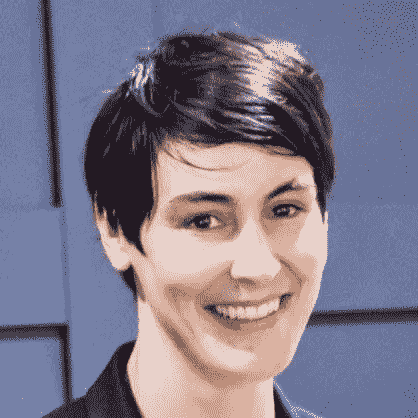
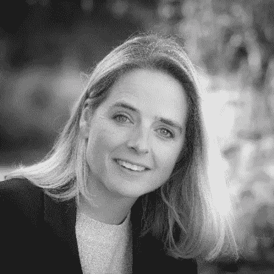
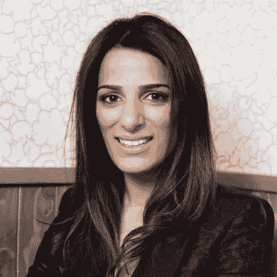
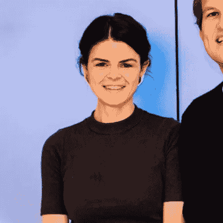
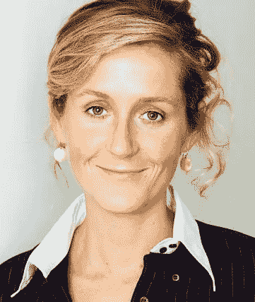
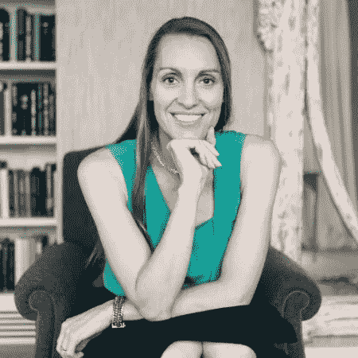

# 没有技术学位的英国女性令人印象深刻

> 原文：<https://medium.com/hackernoon/impressive-women-in-uk-tech-without-a-tech-degree-32aadc8e773a>

女性在科技领域的榜样可以有多种形式。

许多拥有大型科技公司(和许多出口)的令人印象深刻的女性都来自非技术背景。这里只是他们中的一小部分，他们中的许多人因为对技术和创新世界的广泛贡献而被授予英国荣誉——所以，这不是一个小壮举！

作为一名历史系毕业生，我觉得这个列表非常鼓舞人心。不要让你的过去决定你的未来——为了打破那些无形的障碍:)

# [莎拉·伍德·奥贝——首席执行官&联合创始人，桀骜不驯](https://www.linkedin.com/in/sarahfwood/)
学位:剑桥大学英国文学学士，UCL 早期美国文学博士

莎拉在 2006 年创建了 Unruly，该公司已成为世界上最大的视频市场，并于 2015 年以 1.14 亿英镑的价格出售给新闻集团。Sarah 仍然担任主席，并因其对创新和技术的贡献被授予英帝国勋章。

# 杰斯·布彻(Jess Butcher)MBE——布利帕(Blippar)
学位:牛津大学古代&现代史硕士

杰斯在 2011 年创建了 Blippar，随后筹集了 4500 万美元的资金，拥有超过 6000 万用户。她是 Azoomee 的 NED，并被评为 2016 年欧洲科技领域“最鼓舞人心的 50 位女性”之一，2014 年 BBC 的“100 位女性”国际榜单，2012 年《财富》杂志的全球“十大最具影响力的女性企业家”，以及 2013 年 Natwest EveryWoman Iris (tech)奖的获得者，以及其他奖项。

# [Alex Depledge MBE——Resi 首席执行官，前 Hassle.com](https://www.linkedin.com/in/alexandra-depledge-mbe-22b57a14/)
学位:诺丁汉大学历史学学士，芝加哥大学国际关系硕士

亚历克斯在埃森哲工作后，于 2013 年与她的商业伙伴朱尔斯共同创立了 Hassle.com。Hassle 在 2015 年以 2400 万英镑的价格卖给了 help。TechCity Insider 将 Alex 评为 2014 年“年度企业家”。亚历克斯也是伦敦 Leap & EDITD 的董事会成员。她现在正在经营 Resi，旨在让建筑和房主的关系变得更透明。

# [Priya Lakhani OBE——世纪科技创始人&首席执行官](https://www.linkedin.com/in/priyalakhani/)
学位:法学学士&经济学，玛丽女王和马传媒传播法，UCL

Priya 在 2013 年创立了 Century Tech，这是一个人工智能、机器学习和数据科学教育平台。Priya 是英国商务、创新和技能大臣“企业家”论坛的成员，也是几个教育/技能组织的董事会成员。Priya 于 2009 年获得年度商业企业家奖，2016 年获得伦敦市长基金特别表彰奖，2014 年获得大英帝国勋章。

# Debbie woss kow OBE——all bright 联合创始人，前首席执行官 LoveHomeSwap
学位:牛津大学哲学&神学硕士

黛比在 25 岁时开始了她的第一次创业，她身后有两个出口，包括以 5300 万美元卖给[温德姆](https://techcrunch.com/2017/07/31/wyndham-hotel-group-buys-love-home-swap-for-53m/)的 LoveHomeSwap，她现在通过 AllBright 基金投资女性创办的公司。黛比是英国共享经济协会(SEUK)的主席，她是伦敦市长商业顾问委员会的成员，也是汉普斯特德剧院的董事。

# Alice Bentinck MBE——Entrepreneur First 的联合创始人
学位:诺丁汉大学管理学学士

Alice 于 2012 年首次创办了 Code First: Girls，并作为联合创始人建立了 Entrepreneur First，这是一家在过去 6 年中在全球范围内创建了 100 多家新科技公司的机构，包括 Magic Pony 和 AdBrain。

# 玛莎·莱恩·福克斯——Doteveryone.co.uk 教主席学位:牛津大学历史学学士

早期科技成功的先驱 1997 年，玛莎与他人共同创立了 Lastminute.com，此后她成为了 doteveryone.org.uk 的创始人兼董事长——让互联网为每个人服务。她还是 Twitter 的董事、开放大学的校长和幸运之声的联合创始人。她是英国 Gvt 数字冠军，是 mydeco.com 和 M&S 董事会成员。

# [Tamara Lohan MBE——Mr 的联合创始人&CTO&Smith 夫人](https://www.linkedin.com/in/tamaraheberpercy/)
学位:西班牙文学士&意大利文，牛津大学

塔玛拉与丈夫在 2002 年共同创立了精品酒店史密斯夫妇在线旅游目的地，在全球拥有超过 150 万客户。Tamara 还是 notonthehighst.com 的 NED 和 TravelTechLab 的董事会成员。

# Louise Broni-Mensah，Shoobs 的创始人学位:伯明翰大学数理经济学学士

2013 年，路易斯通过 Y Combinator 加速器创建了 Shoobs，这是一个活动和夜生活的市场。她现在在硅谷工作，但最初在英国从事投资银行业。路易斯被强大的媒体认为是英国 40 岁以下最有影响力的黑人之一。

# Kathryn Parsons MBE—CEO&Decoded 创始人
学位:牛津大学古典文学学士&古典语言

科技教育[公司](https://hackernoon.com/tagged/company)成立于 2011 年 Decoded，为全球企业和个人提供技术知识。Kathryn 还被任命为英国编码研究所、伦敦市长商业顾问委员会、英国政府网络安全技能顾问委员会、Tech London 倡导者顾问委员会、MBE 的主席，作为 2016 年新年荣誉名单的一部分。

你有兴趣进入科技行业，但没有相关背景吗？这家面包店正在建立一个企业家渠道，从零开始建立新的科技公司。我们为[提供了很多支持](/the-bakery/starting-tech-companies-from-scratch-e309cc7cbea2)，让第一部分变得容易一些。[获取更多信息](http://www.thebakery.com/start)。