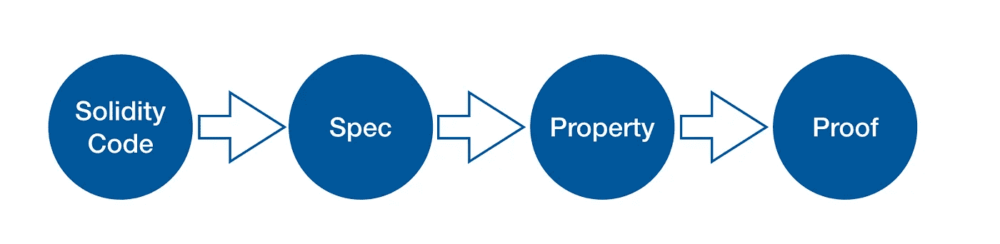

# 通过形式化证明提高智能合同的安全性

> 原文：<https://medium.com/hackernoon/improve-smart-contract-security-by-formal-proofs-c0b377288e2e>


Photo by [Roman Mager](https://unsplash.com/photos/5mZ_M06Fc9g?utm_source=unsplash&utm_medium=referral&utm_content=creditCopyText) on [Unsplash](https://unsplash.com/search/photos/math?utm_source=unsplash&utm_medium=referral&utm_content=creditCopyText)

智能合同中的漏洞长期威胁着区块链的项目、开发商和投资者。越来越多的[安全](https://hackernoon.com/tagged/security)团队正在这一领域努力，用各种方法来获得合同。SECBIT 实验室建议将正式证明与传统测试和安全审计结合起来。在本文中，我们以 GitHub 仓库[token libs-with proof](https://github.com/sec-bit/tokenlibs-with-proofs)中的 ERC20 形式证明为例，展示形式证明在智能合约中的使用。我们希望正式的证明可以帮助消除错误的合同，并保护智能合同的所有方面，包括设计逻辑、实现、经济系统、*等*。

# 什么是正式证明

形式证明是形式验证下的一个概念，在 [Wikipedia](https://en.wikipedia.org/wiki/Formal_verification) 上定义为

> *在硬件和* [*软件系统*](https://en.wikipedia.org/wiki/Software_system)****的背景下，形式化验证*** *是对* [*证明*](https://en.wikipedia.org/wiki/Mathematical_proof) *或反证**正确性的行为* [*算法*](https://en.wikipedia.org/wiki/Algorithms)*
> 
> **这些系统的验证是通过在系统的抽象* [*数学模型*](https://en.wikipedia.org/wiki/Mathematical_model) *上提供一个* [***形式证明***](https://en.wikipedia.org/wiki/Formal_proof) *来完成的，数学模型和系统的性质之间的对应关系通过构造是已知的。经常用于建模系统的数学对象的例子有:* [*有限状态机*](https://en.wikipedia.org/wiki/Finite_state_machine) *，* [*带标签的变迁系统*](https://en.wikipedia.org/wiki/Labelled_transition_system) *，* [*Petri 网*](https://en.wikipedia.org/wiki/Petri_net) *，* [*向量加法系统*](https://en.wikipedia.org/wiki/Vector_addition_system) *，* [*时间自动机*](https://en.wikipedia.org/wiki/Timed_automaton) *编程语言的形式语义如* [*操作语义*](https://en.wikipedia.org/wiki/Operational_semantics) *，* [*指称语义*](https://en.wikipedia.org/wiki/Denotational_semantics) *，* [*公理语义*](https://en.wikipedia.org/wiki/Axiomatic_semantics) *和* [*霍尔逻辑*](https://en.wikipedia.org/wiki/Hoare_logic) *。**

*本质上，形式验证是为了证明数学模型的性质。在智能合约的正式证明中，模型是智能合约及其运行方式，属性是智能合约的那些期望的*良好的*行为，例如永远不会发生整数溢出和下溢。*

*具体来说，我们通过*程序逻辑*对智能契约进行形式化建模，证明它们符合给定的*契约规范*，并证明该规范能够进一步保证某些*高级属性*。所有证明都作为显式*证明对象*提供，其正确性可以独立于证明过程进行检查。*

*在讨论任何形式证明时，我们必须牢记以下先决条件:*

1.  ***所有的证明都是在一定的假设下；***
2.  ***证明的正确性依赖于形式逻辑理论；***
3.  ***最终证明结果和定理确实定义了智能合约的正确性和安全性。***

*在 ERC20 契约的形式证明中，第一点要求基本定义的正确性；第二个要求一个有效的证明，可以由一个流行的证明助手 Coq 来构造和检查；最后一个依赖于我们正确地陈述常见的 ERC20 属性。*

*注意:以上三点是先决条件，也是我们关于智能合约的形式证明的*可信计算基础* (TCB)。每个安全系统都依赖于特定的 TCB。TCB 越小越强，系统越安全。*

# *为什么要为智能合同提供正式证明*

*以太坊通过引入一种图灵完备的智能契约语言改进和增强了智能契约，这种语言带来了与传统编程语言一样的灵活性和表达能力。不可避免地，错误和安全问题也被引入，导致巨大的经济损失。*

*SECBIT Labs 对以太坊上所有部署的令牌合约进行了多轮扫描和分析，共记录了 4172 个存在漏洞和安全风险的合约。其中 101 个也是由 CoinMarketCap 记录的，完整的列表可以在 SECBIT 的 repo[awesome-buggy-ERC 20-tokens](https://github.com/sec-bit/awesome-buggy-erc20-tokens)中找到。*

*在审核了大量智能合同后，SECBIT Labs 意识到智能合同中的安全问题比传统软件更加复杂和关键:*

1.  *智能合约的信任来自于其不变性，*即*，一旦部署，没有人能轻易修改代码。然而，这也意味着，如果没有提前做好准备，很难轻松快速地修复错误，尤其是在受到攻击的时候。这种脆弱性肯定会损害代币经济和区块链项目的信任和价值。*
2.  *许多部署的智能合约的实现都是开源的。虽然它可以提高契约的透明度和信任度，但也降低了攻击者发现漏洞的成本。*
3.  *智能合同语言的设计仍然有许多限制和缺陷，更容易引入错误和安全风险。缺乏有经验的开发人员进一步加剧了这一问题。*

*目前，解决智能合约安全问题的方法主要有两种:测试和审计。尽管它们是避免常见漏洞所必需的，但它们的能力仍然有限。*

*   *试验*

*安全团队可以手动或通过自动测试工具生成测试用例，并使用它们来检查输入组合和尽可能多的契约执行路径。然而，很难保证 100%的覆盖率，所以测试中没有发现问题并不意味着没有 bug。*

*   *审计*

*专业的安全审计员检查合同的执行和逻辑，寻找漏洞和风险。审计主要依赖于审计人员的主观经验，因此审计的范围和有效性难以衡量和评价。*

*形式化证明通过数学模型描述程序，并通过数学证明证明其正确性和安全性。它基于严格的数学和逻辑，因此能够覆盖所有程序行为，并严格保证精确定义的正确性和安全性。形式化证明已成功应用于航天、高速铁路、核能和航空等关键领域。*

*由于智能合约的脆弱性及其管理的大量资产，智能合约要求极高的安全性。此外，经济学和博弈论的一些高层次和复杂的性质不容易通过测试和审计来验证。因此，正式证明无疑是确保这些小而复杂的智能合同的有效方式。*

# *如何正式证明智能合同*

## *证明结构*

*智能合约的正式证明包括四个部分:源代码、规范、属性和证明。*

**

*Structure of Formal Proof*

*   *源代码:是证明对象。*
*   *规范:定义每个契约函数的预期行为。*
*   *Properties:定义当契约作为一个整体工作时期望的或者*好的*属性，比如令牌总量的不变性。*
*   *证据:合同确实实现了规范并保证了特性的原因。*

## *证明的特性*

*我们对 ERC20 合同的证明主要证明了合同的以下性质:*

*   **NAT _ no overflow _ DSL _ no overflow*:transfer()和 transferFrom()中没有有害的溢出*

```
*Lemma nat_nooverflow_dsl_nooverflow:
   forall (m: state -> a2v) st env msg,
    (_from = _to \/ (_from <> _to /\ (m st _to <= MAX_UINT256 - _value)))%nat ->
    ((from == to) ||
     ((fun st env msg => m st (to st env msg)) <= max_uint256 - value))%dsl st env msg = otrue.*
```

*   **Property _ total supply _ equal _ to _ sum _ balances*:total supply 等于执行合同中任何步骤后所有余额的总和*

```
**(* Prop #1: total supply is equal to sum of balances *)*
 Theorem Property_totalSupply_equal_to_sum_balances :
  forall env0 env msg ml C E C' E',
   create env0 msg C E
   -> env_step env0 env
   -> run env C ml C' E'
   -> Sum (st_balances (w_st C')) (st_totalSupply (w_st C')).*
```

*   **Property _ total supply _ fixed _ transfer*:执行转账()后，代币金额保持不变*

```
**(* Prop #2: total supply is fixed with transfer *)*
 Theorem Property_totalSupply_fixed_transfer:
  forall env C C' E' msg to v spec preP evP postP,
   spec = funcspec_transfer to v (w_a C) env msg
   -> preP = spec_require spec
   -> evP = spec_events spec
   -> postP = spec_trans spec
   -> preP (w_st C) /\ evP (w_st C) E' /\ postP (w_st C) (w_st C')
   -> (st_totalSupply (w_st C)) = (st_totalSupply (w_st C')).*
```

*   **Property _ total supply _ fixed _ after _ initial ization*:初始化后令牌总数不变*

```
**(* Prop #3: total supply is fixed after initialization *)*
 Theorem Property_totalSupply_fixed_after_initialization:
  forall env0 env msg C E C' E',
   create env0 msg C E
   -> step env C msg C' E'
   -> (st_totalSupply (w_st C)) = (st_totalSupply (w_st C')).*
```

*   **Property _ total supply _ fixed _ delegate _ transfer*:执行 transferFrom()后，令牌总数保持不变*

```
**(* Prop #4: total supply is fixed with delegate transfer *)*
 Theorem Property_totalSupply_fixed_delegate_transfer1:
   forall env C C' E' from msg to v spec,
   spec = funcspec_transferFrom_1 from to v (w_a C) env msg
   -> (spec_require spec) (w_st C) /\ (spec_events spec) (w_st C) E' /\ (spec_trans spec) (w_st C) (w_st C')
   -> (st_totalSupply (w_st C)) = (st_totalSupply (w_st C')). Theorem Property_totalSupply_fixed_delegate_transfer2:
   forall env C C' E' from msg to v spec,
   spec = funcspec_transferFrom_2 from to v (w_a C) env msg
   -> (spec_require spec) (w_st C) /\ (spec_events spec) (w_st C) E' /\ (spec_trans spec) (w_st C) (w_st C')
   -> (st_totalSupply (w_st C)) = (st_totalSupply (w_st C')).*
```

*   **Property _ from _ to _ balances _ change*:转账只影响所涉及账户的余额，其他账户不变*

```
**(* Prop #5: only balances of from and to changed by transfer*)*
 Theorem Property_from_to_balances_change_only:
  forall env C C' E' to addr msg v spec,
   spec = funcspec_transfer to v (w_a C) env msg
   -> (spec_require spec) (w_st C) /\
     (spec_events spec) (w_st C) E' /\
     (spec_trans spec) (w_st C) (w_st C')
   -> m_sender msg <> to
   -> m_sender msg <> addr
   -> to <> addr
   -> (st_balances (w_st C') to = (st_balances (w_st C) to) + v)
     /\ (st_balances (w_st C') (m_sender msg) = (st_balances (w_st C) (m_sender msg)) - v)
     /\ st_balances (w_st C') addr = st_balances (w_st C) addr.*
```

## *证明过程*

*被证明的合同是一个标准的 ERC20 合同，包括六个公共函数:`constructor`、`transfer()`、`transferFrom()`、`balanceOf()`、`approve()`和`allowance()`。简单的证明过程如下所示。*

***1。定义规格***

> **一种* ***规格语言*** *一种* [*形式语言*](https://en.wikipedia.org/wiki/Formal_language)[*计算机科学*](https://en.wikipedia.org/wiki/Computer_science) *系统分析*[](https://en.wikipedia.org/wiki/Systems_analysis)**[*需求分析*](https://en.wikipedia.org/wiki/Requirements_analysis) *和****

**Spec.v* 定义了合同中六个公共功能的规范。*

*每个函数的执行可能涉及多种情况，并且在每种情况下表现不同。我们为一种情况定义一个规格说明规则，因此规格说明通常由一个或多个规则组成。以`transferFrom()`的规格为例:它由两个规则- `funspec_transferFrom_1`和`funcspec_transferFrom_2`组成，对应的是审批额度小于`2**256-1`或等于`2**256-1`的两种情况。*

*以`funcspec_transferFrom_1`为例，每个规范规则都由以下部分组成。*

*   *`spec_require`指定在第一种情况下执行`transferFrom`之前必须满足的先决条件。*

```
*Definition funcspec_transferFrom_1
        (from: address)
        (to: address)
        (value: value) :=
    fun (this: address) (env: env) (msg: message) =>
     (mk_spec
      (fun S : state =>
      *(* require(balances[_from] >= _value); *)*
        st_balances S from >= value /\
      *(* require(_from == _to || balances[_to] <= MAX_UINT256 - _value); *)*
        ((from = to) \/ (from <> to /\ st_balances S to <= MAX_UINT256 - value)) /\
      *(* require(allowance >= _value); *)*
        st_allowed S (from, m_sender msg) >= value /\
      *(* allowance < MAX_UINT256 *)*
        st_allowed S (from, m_sender msg) < MAX_UINT256
      )
     ...*
```

*   *`spec_events`指定成功执行功能后必须发生的事件:*

```
*Definition funcspec_transferFrom_1
        (from: address)
        (to: address)
        (value: value) :=
    fun (this: address) (env: env) (msg: message) =>
     (mk_spec
      *(* require omitted *)* *(* emit Transfer(_from, _to, _value); *)*
      *(* return True; *)*
      (fun S E => E = (ev_Transfer (m_sender msg) from to value) :: (ev_return _ True) :: nil)*
```

*在哪里，*

*   *`ev_Transfer`代表事件`Transfer`；*
*   *`ev_return`是规范中的一个伪事件，用来表示函数返回和返回值。*
*   *`spec_trans`指定成功执行功能时的状态转换，例如存储变量的变化:*

```
*Definition funcspec_transferFrom_1
        (from: address)
        (to: address)
        (value: value) :=
    fun (this: address) (env: env) (msg: message) =>
     (mk_spec
      *(* require omitted *)*
      *(* events omitted *)* *(* State transition: *)*
      (fun S S' : state =>
      *(* Unchanged. *)*
        st_totalSupply S' = st_totalSupply S /\
        st_name S' = st_name S /\
        st_decimals S' = st_decimals S /\
        st_symbol S' = st_symbol S /\
      *(* balances[_from] -= _value; *)*
        st_balances S' = (st_balances S) $+{ from <- -= value }
      *(* balances[_to] += _value; *)*
                        $+{ to <- += value } /\
      *(* allowed[_from][msg.sender] -= _value; *)*
        st_allowed S' = (st_allowed S) $+{ from, m_sender msg <- -= value }
      )*
```

*其中规定，必须按预期改变`balances`和`allowed`中的相应条目，而其他存储变量不变。*

*所有规范规则的完整定义请参考*规范五*。*

***2。对照规格进行验证***

*在证明上面定义的规范的高级属性之前，我们需要确保 Solidity 源代码确实实现了规范。首先，我们在 Coq 中表示可靠性合同代码。Coq 中为此定义了领域规范语言(DSL)。例如，ERC20 函数`transfer()`可以在 *DSL.v* 中表示如下:*

```
*(* DSL representation of transfer(), generated from solidity *)
   Definition transfer_dsl : Stmt :=
    (@require(balances[msg.sender] >= value) ;
    @require((msg.sender == to) || (balances[to] <= max_uint256 - value)) ;
    @balances[msg.sender] -= value ;
    @balances[to] += value ;
    (@emit Transfer(msg.sender, to, value)) ;
    (@return true)
    ).*
```

*然后我们证明 DSL 中的每一个函数都符合规范，例如我们通过 *DSL.v* 中的以下引理证明`transfer()`符合`funcspec_transfer`:*

```
*Lemma transfer_dsl_sat_spec:
  forall st env msg this,
    spec_require (funcspec_transfer _to _value this env msg) st ->
    forall st0 result,
      dsl_exec transfer_dsl st0 st env msg this nil = result ->
        spec_trans (funcspec_transfer _to _value this env msg) st (ret_st result) /\
        spec_events (funcspec_transfer _to _value this env msg) (ret_st result) (ret_evts result).*
```

*请参考 *DSL.v* 获取完整的 DSL 定义、DSL 表示和规范证明。*

***3。定义并证明高级属性***

*上面的规范定义了一个函数每次执行的预期行为，而高级属性定义了当接收到任意消息调用时，契约作为一个整体所呈现的预期行为。例如，在 *DSL.v* 中定义的以下属性声明了一个属性，即无论契约处理哪个消息调用，令牌都不会丢失:*

```
**(* Prop #1: total supply is equal to sum of balances *)*
  Theorem Property_totalSupply_equal_to_sum_balances :
   forall env0 env msg ml C E C' E',
    create env0 msg C E
    -> env_step env0 env
    -> run env C ml C' E'
    -> Sum (st_balances (w_st C')) (st_totalSupply (w_st C')).*
```

*所有高级属性的完整定义和证明请参见*规范五*。*

# *未来计划*

*我们创建了项目[token libs-with proof](https://github.com/sec-bit/tokenlibs-with-proofs)来收集和发布我们对各种令牌契约的正式证明。*

*   *我们将证明更多的公共属性，以帮助社区避免漏洞和风险。*
*   *我们将证明更多的具有更多特征的象征性契约，例如冻结、升级、权限操纵、添加所有权。*
*   *我们正在研究证明博弈论的高级属性，例如公平性、乐观策略、纳什均衡。*

*我们希望这个项目可以成为一个有用的资源和参考，展示如何在智能合同中使用形式证明。我们也希望更多的智能合约开发者和安全专家能够通过形式化的证明加入到提高智能合约安全性的研究和应用中来。如果您有任何问题、建议和想法，欢迎在我们的 [Gitter 频道](https://gitter.im/sec-bit/Lobby)讨论。*

**特别感谢来自康赛思中国的* [*【汤怡】*](https://medium.com/u/cb00151fd96b?source=post_page-----c0b377288e2e--------------------------------) *与我们讨论了这个话题并提供了反馈和意见。**

# *相关著作*

*   *SECBIT 实验室:真棒-错误-er C20-令牌。[https://github.com/sec-bit/awesome-buggy-erc20-tokens](https://github.com/sec-bit/awesome-buggy-erc20-tokens)*
*   *康斯塞斯:代币。[https://github.com/ConsenSys/Tokens](https://github.com/ConsenSys/Tokens)*
*   *ConsenSys:智能合同安全最佳实践。[https://github.com/ConsenSys/smart-contract-best-practices](https://github.com/ConsenSys/smart-contract-best-practices)*
*   *迈克尔·伯格:以太坊合约的 DSL。[https://www . michaelburge . us/2018/05/15/ether eum-chess-engine . html](https://www.michaelburge.us/2018/05/15/ethereum-chess-engine.html)*
*   *C.艾尔·霍尔。计算机编程的公理基础。美国计算机学会通讯，26(1):53-56，1983 年 1 月。*
*   *长度兰波特。证明多进程程序的正确性。IEEE 软件工程汇刊 SE-3，2(1977 年 3 月)，125–143 页。*
*   *G.内库拉。带证明的代码。在第 24 届 ACM *程序设计语言原理研讨会(POPL'97)* 上。第 106–119 页，纽约，1997 年 1 月。*
*   *inria:Coq 校对助手。[https://coq.inria.fr/](https://coq.inria.fr/)*
*   *《程序分析的原理》。施普林格(2015 年)*
*   *北京大学自然科学学报:基于逻辑的形式验证方法:进展与应用[http://xbna.pku.edu.cn/html/2016-2-363.htm](http://xbna.pku.edu.cn/html/2016-2-363.htm)*

*[***sec bit***](https://secbit.io)*由一群加密货币爱好者创立。我们正在研究智能合同安全、智能合同形式验证、加密协议、编译、合同分析、博弈论和加密经济学。**