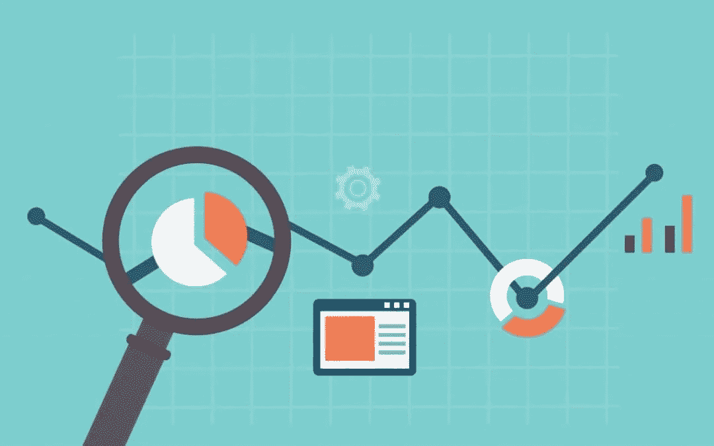

# 通过基准研究提高品牌战略的投资回报率

> 原文：<https://medium.com/hackernoon/improve-the-roi-of-your-brand-strategy-with-benchmarking-research-68115bff9546>

我们的许多客户指望他们的品牌战略成为增长的跳板。无论他们是没有达到雄心勃勃的目标，还是真的碰壁了，品牌战略都可以帮助他们创造前进所需的转变。

但是，除了收入和入站查询等硬性指标，你如何衡量成功呢？你如何洞察你的品牌战略是否、如何以及在多大程度上推动了你的增长，以及它还能做些什么？

毕竟，品牌认知度是一个比金钱更难以衡量的指标。对吗？

# 基准研究证明投资回报率

不一定。品牌认知度可以非常精确地衡量——你只需要投资研究。我们坚信，在进行任何战略转变之前，要对你的品牌进行基准测试，然后利用持续的调查来保持你的品牌在市场中的最高地位。

基准研究可能是你最明智的增长战略投资之一，你可以跟踪真实的投资回报率。以下是它的帮助方式。

# 确定哪些问题需要解决

基准研究确立了你的基线，同时提供了重要的见解，为你的品牌战略提供信息。它帮助你了解人们对你的品牌有什么样的联想；无论你是第一个想到的，还是他们没有想到的，或者介于两者之间；他们对你的了解有多少是正确的。

你是否在与缺乏感知、误解或两者兼而有之的情况作斗争？还是冷漠是主要问题——缺乏共鸣？

这些见解应该为你的品牌战略和走向市场的方式提供信息。(点击阅读更多关于使用 quant 进行情感洞察的信息[。缺乏意识可能需要更大的媒体投资，更有共鸣的定位，更有力的信息传递，或者这些事情的组合。](https://www.emotivebrand.com/quantitative-research-emotional-insight/)

有一件事是肯定的:除非你问一个你最想要的潜在客户的统计样本，否则你不会真的知道。

# 了解应该使用哪些与销售相关的杠杆

基准研究还可以帮助你了解受众的购买偏好，以及你的品牌如何帮助或阻碍销售增长。

一份好的定量分析报告可以衡量购买决策中最重要的因素，评估你的品牌属性(以及竞争对手的品牌属性)与这些因素的一致性，并确定你需要在哪些方面加强你相对于竞争对手的优势。

你的品牌故事中有什么对销售很重要但被忽视的元素吗？在市场上，有没有什么误解在伤害你？你的竞争对手有没有什么有价值的空间让你可以有所突破？

这些就是你需要拉动来启动增长的杠杆类型。

# 密切关注你的品牌和投资回报率

因此，你进行了基准研究，制定了新的品牌战略，并带着精心制作的信息走向市场。很有可能你会看到一些销售提升。此时，通常是几个月后，你会想通过新一轮的调查来评估你的品牌工作的影响。

这是你看到你的假设被证实的地方。与竞争对手相比，你的新定位是否产生了更多共鸣？你在纠正任何误解吗？您是否在强化与购买最密切相关的属性？你是否提高了你最重视的受众的意识、关注度和偏好？

有了这些信息，你将完全有能力在建立品牌的同时继续提高销售额。你可以看到投资回报率随着你的数字上升而增加。

Emotive Brand 是一家旧金山品牌战略和设计机构。

*原载于 2018 年 6 月 19 日*[*【www.emotivebrand.com】*](https://www.emotivebrand.com/benchmarking-research-for-growth/)*。*