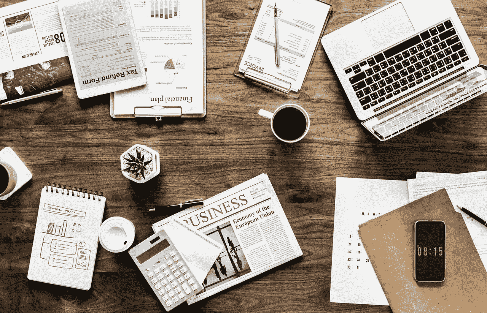
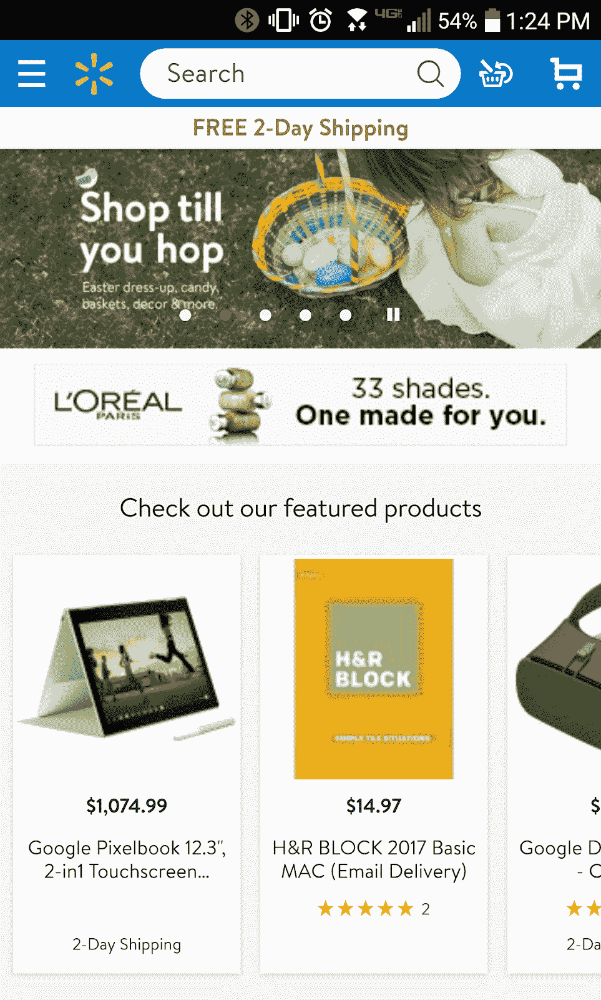
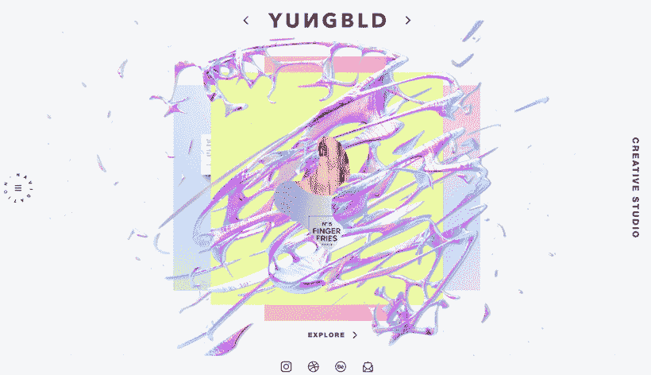
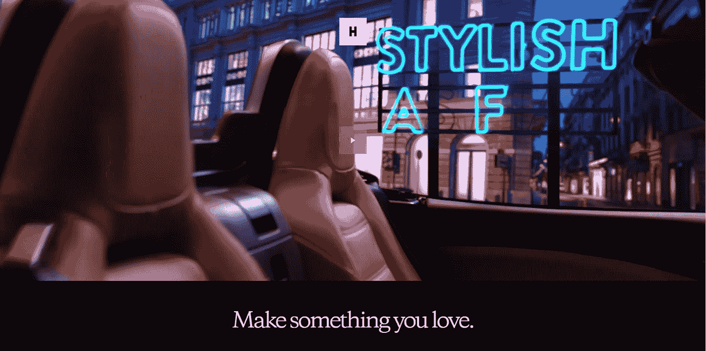
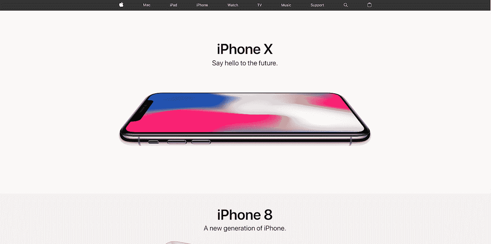

# 用这 5 个网站设计来提高你的营销效果

> 原文：<https://medium.com/hackernoon/improve-your-marketing-efforts-with-this-5-website-designs-d3d3b54cd2ad>

网站设计领域的热点是不断变化的，这使得你的团队不断检查和复查你的网站，并跟上发展趋势变得至关重要。如果做不到这一点，可能会导致设计失败——这意味着更少的转换、更少的销售线索和更少的利润。

你可能还不知道，但网页设计在你的营销工作中起着巨大的作用。一个好的用户界面和用户体验——无论是在桌面上还是在移动设备上——都有助于推动你的营销工作。如果用户对你的网页设计没有好的体验，你的转化率会更低。

它对内容营销也至关重要，给你一个视觉上吸引人和有效的地方来展示你所有的内容和信息。更别提它对社交媒体营销的影响了。

简而言之，网页设计对营销人员很重要。你需要在为时已晚之前明白原因。

我们进入 2018 年才三个月，但新趋势已经开始运作，改变了我们使用网站与观众互动和营销我们品牌的方式。

我们编制了一份 2018 年五大网页设计趋势的清单——你已经在追随它们了吗？

**1。手机友好型设计**

首先也是最重要的，你需要确保你的网站可以在所有媒介上浏览——从笔记本电脑屏幕到平板电脑再到移动设备。没有什么比在手机上打开一个网站却出现故障更让人沮丧的了。

沃尔玛的移动网站设计是你应该实现的一切的一个极好的例子:有凝聚力的品牌，容易导航和网站上快速加载的无缝结账——顾客想要的和营销人员蓬勃发展的一切。

移动友好是网页设计的一个增长趋势，它只会在 2018 年继续增长。用户平均 69%的媒体时间花在智能手机上。随着越来越多的消费者越来越频繁地使用移动设备，在某些情况下，他们在桌面上浏览网站的次数也越来越多，因此，让所有设备上的所有受众都满意的响应式网页设计至关重要。

57%的用户表示，如果一家企业的移动网站设计达不到标准，他们不会推荐这家企业。你可能会因为没有及时了解最新信息而错过这一大部分人。

如果你是一个营销人员，这是巨大的！你需要能够与所有的观众互动，你不希望你的设计把他们拒之门外。

**2。互动动画**

你想迅速抓住注意力，取悦观众，并增加你的网站和品牌的深度吗？那么互动动画是一个很好的方法！

也许你有很多信息要传达，也许你正试图获取数据并将其颠倒过来，或者也许你正试图让一个枯燥的话题变得更有趣——最好的方法是给用户一个他们可以与之互动的交互式和沉浸式动画。甚至像分层 GIF 这样简单的东西——la[创意机构](https://www.designrush.com/agency)年轻的血液——也能为你的品牌身份定下基调，吸引消费者。

包含图像的内容比不包含图像的内容的参与率高 650 %,众所周知，图像和动画比单纯的文本更能让用户长久地记住。因此，包含这些设计元素不仅可以确保用户想要更多地参与到你的内容中，而且在他们离开后还会长久地记住它。

**3。引人入胜的视频**

一个好的视频是保持人们参与的最简单的方法之一。尤其是当视频无缝播放、清晰连贯、讲述引人入胜的故事时。许多品牌，如 Huge Inc .,已经选择用一个视频来取代他们的标题图像，当用户进入一个网站时，视频就会播放，或者给他们一些当他们到达那里时可以立即互动的东西。

用户对观看产品视频的兴趣是单纯阅读产品介绍的 4 倍。与仅仅阅读相关信息相比，他们在观看视频后购买产品的可能性增加了 85%。这意味着视频可以影响用户，并留下比简单的文本更真实和持久的印象。

如果你不[用视频来告知和激励](https://www.savvysme.com.au/article/173-different-ways-to-use-online-video-to-promote-your-business)，你的竞争对手会的。

**4。极简主义**

极简主义是最近席卷设计界的一股潮流，这是有充分理由的。网页设计中的极简主义提倡圆滑、干净的线条、最少的颜色和简化的体验，让用户快速、容易和有效地获得你的品牌所能提供的服务或信息。

好的设计与时俱进，随着许多品牌加入极简主义潮流——流行的极简主义网站包括 Why We Explore、Bear Creek Distillery 和 Apple——如果你不开始将这些元素融入到你自己的网页设计中，你很快就会被视为陈旧、过时、无法应对现代受众。

极简主义是一个强大而有影响力的工具，设计师可以用它来吸引用户并保持他们的参与。它可以帮助你的设计达到视觉上的和谐，让用户进入你想要的互动状态。

利用像极简主义这样的设计趋势对你有利会是一笔巨大的财富。这向消费者表明你了解他们，知道如何吸引他们。

**5。粗体字体**

内容很重要，但如何呈现也很重要。这就是为什么大胆多变的字体对于销售的网页设计至关重要。这不是应该被忽视或遗忘的事情。

大而醒目的文案能吸引观众。用这种方式处理字体可以创造一个干净、愉快的用户体验，让更多的人涌向你的网站。

Artnet 的首席 UX 设计师 Jon Peterson 谈到了排版的重要性:

*它不仅在考虑你的字体和背景之间的对比度时，在可读性和可用性方面发挥着巨大的作用，它也是我能告诉你的区分好设计师和坏设计师的第一件事。字体设计是设计中最关键的方面之一，也是最重要的方面之一，也是最难学的方面之一，因为这是一个非常古老的领域，有很多东西需要吸收。我真的认为这是最重要的部分之一。*

**5 大最佳网站设计趋势**

通过利用这些蓬勃发展的网站设计趋势，你正在巩固你的网站在未来的地位。无论是点击率还是销售额，您都可以确保您的设计能够吸引注意力、激发参与度并推动结果。利用这些小贴士:

*   确保你的网页设计是手机友好的
*   整合互动和有趣的动画
*   制作一个吸引人的视频
*   最小化
*   大胆使用你的字体

一个好的网页设计可以成为你最大的营销资产。它可以说服用户购买或与你的内容互动。它可以给你一个非凡的地方来展示内容，它可以向用户展示你到底是一个什么样的品牌。

网页设计是营销人员最好的朋友——所以让我们开始创造吧！