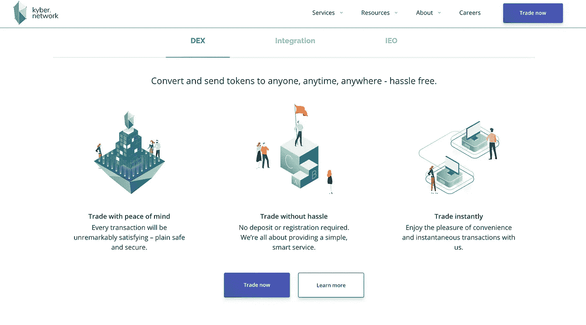
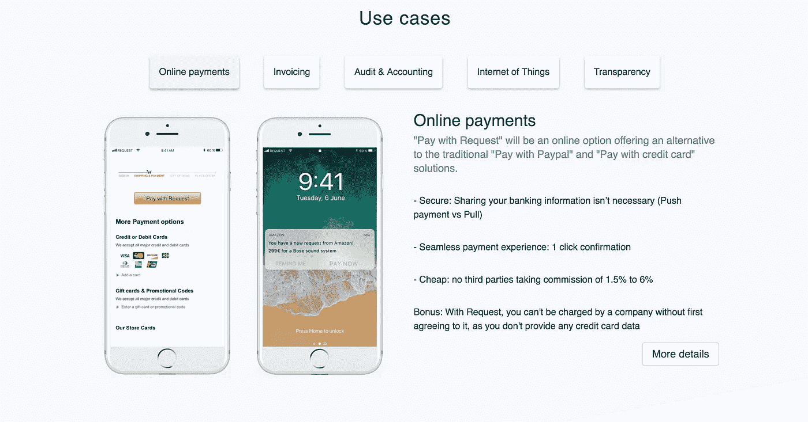
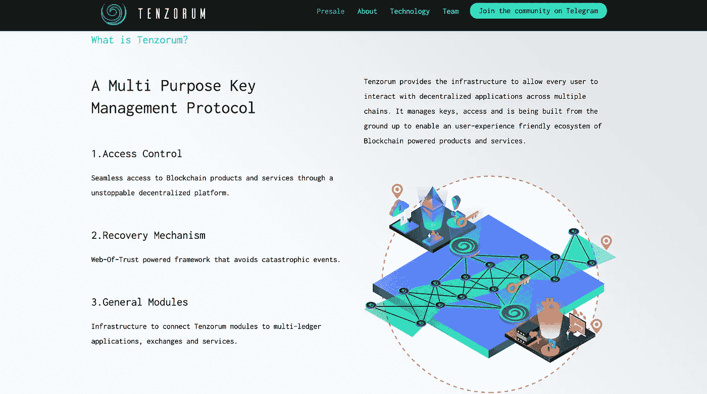

# 如何被广泛采用:改善加密投资中臭名昭著的糟糕用户界面/UX

> 原文：<https://medium.com/hackernoon/improving-the-notoriously-bad-ui-ux-in-crypto-investing-7acb73285a50>

## 交易最好的时候令人紧张，最坏的时候令人恐惧

People hypnotizing themselves to remember their passwords is a real thing.

交易加密货币的用户体验不利于让新用户积极参与进来。

关于中央交易所被黑、资金汇错地址、丢失私钥的恐怖故事不在少数。

一些最大的问题是保管、安全地发送付款和私钥管理，但幸运的是，一些有前途的项目正在解决这些问题。

# 用户资金的保管

在当今用户体验的三个主要问题中，托管问题可能是最臭名昭著的。

Mt. Gox 是一个集中的交易所，在 2014 年被黑客攻击前的高峰期，处理了超过 70%的所有[比特币](https://hackernoon.com/tagged/bitcoin)交易。超过 850，000 个比特币被盗，价值相当于今天的 76.5 亿美元。最近，中央交易所 BitGrail 遭到破坏，黑客窃取了价值超过 1.87 亿美元的 Nano(以前的 RaiBlocks)。

将资金存放在交易所的用户并不拥有自己的资金，同样，他们并不真正拥有自己银行账户中的钱。安全存储加密货币的唯一真正方法是使用 Ledger Nano S 这样的冷藏钱包。

进入去中心化的交易所，允许用户直接从他们的钱包以点对点的方式互相交易。不必被迫创建一个要求提供个人信息的账户，这可以保护匿名性，并避免将 BTC/ETH 发送到中央交易所并等待 30 多个确认消息的紧张时刻。

Instead of using an intermediary party, Kyber uses an on-chain reserves that bring liquidity to the exchange.

诚然，即使是最受欢迎的分散交易所的交易量也不到像[币安](https://hackernoon.com/tagged/binance)这样的顶级集中交易所交易量的 1%。这导致一些限价买入/卖出订单永远不会成交，因为另一方没有人来执行它们。分散式交易所的广泛采用还需要时间，但它们可以解决集中式交易所难以解决的许多问题，而且一旦流动性问题得到解决，就没有什么可以阻止它们了。

查看 [Kyber Network](https://kyber.network/) 开始使用分散交换。

# 向错误的地址汇款

“现实世界”的送钱过程已经是一个紧张的过程。即使有了像 Venmo 这样的可信服务，输入正确的用户名并看到收件人的照片，当你点击确认时，仍然觉得信息不够。

与加密货币相比，这是天赐之物，在加密货币中，你将以太网发送到地址“0 x3f 5 ce 5 FB Fe 3 e 9 af 3971 DD 833d 26 ba 9 b 5c 936 f 0 be”，你只能祈祷你复制并粘贴了正确的地址，并确保每个字母和数字都匹配。匿名的不利之处在于，如果你把资金汇错了地址，就没有办法追踪地址持有者的位置和身份。

[Request Network](https://request.network/#/) 的目标是成为一个分散版的 Paypal，双方可以非常容易地用任何货币(加密货币或法定货币)进行交易，而没有中间人从交易中收取费用。

拥有一个无缝点对点汇款的一键式解决方案将是朝着加密货币的正确方向迈出的令人难以置信的一步，Request Network 的解决方案与像 [Civic](https://www.civic.com/) 这样的了解你的客户服务相结合，将保持匿名性，同时还可以验证你向其汇款的一方的身份。

Request Network 还提供实时会计，因为所有交易都在不可变的分类账上，该团队已经在与会计领域的大规模参与者合作，如普华永道-法国。

# 私钥管理

最初的以太坊白皮书的创造者 Vitalik Buterin 说,“..对加密的首要用户体验需求仍然是安全的密钥管理解决方案。Multisig、焦土金库(……)硬件钱包，都不错，但在 UI 方面还有很多工作要做。”

访问像 MyEtherWallet 或 MetaMask 这样的 Dapps 需要您跟踪您的私钥来访问您的帐户。这些私钥通常是一串随机的 12 到 24 个单词，除非你想失去对你的资金的访问权，否则你必须保证它们的安全。

目前，存储这些私钥最常见的方式是在云上(不是很好)或者在相框后面的一张折叠纸上(效率不高)。Tenzorum 项目专注于分布式网络的密钥管理。

该项目通过将安全登录、恢复机制和访问控制等协议结合在一起，解决基本的密钥管理要素，使用户能够控制他们与分散技术的互动方式。

Tenzorum 正在做的一件非常有趣的事情是，他们通过使用 Shamir 的秘密共享实现来备份私钥，这意味着“可以使用信任网将密钥分成片段并加密，这样用户就可以依赖他们的信任网，以防他们需要重新访问相关的加密资产。”

当 Tenzorum 发布时，为你的 USB 翻垃圾或者雇佣催眠师来记住你的私人钥匙的日子将一去不复返。

# 最后

这是加密货币世界需要解决的三个最大和最紧迫的痛点，以获得广泛采用。机构资金不会想在资金面临巨大风险的情况下进入市场，除非有可信的托管、支付和私钥解决方案，否则市场将继续横盘整理。

对我们来说幸运的是，有强大的项目和非常有能力的开发人员来解决这个问题。

> 欢迎在 Medium 或 [Twitter](https://twitter.com/bharat_olympus) 上关注我，了解更多内容，我保证不会再这么长时间中断写作了。