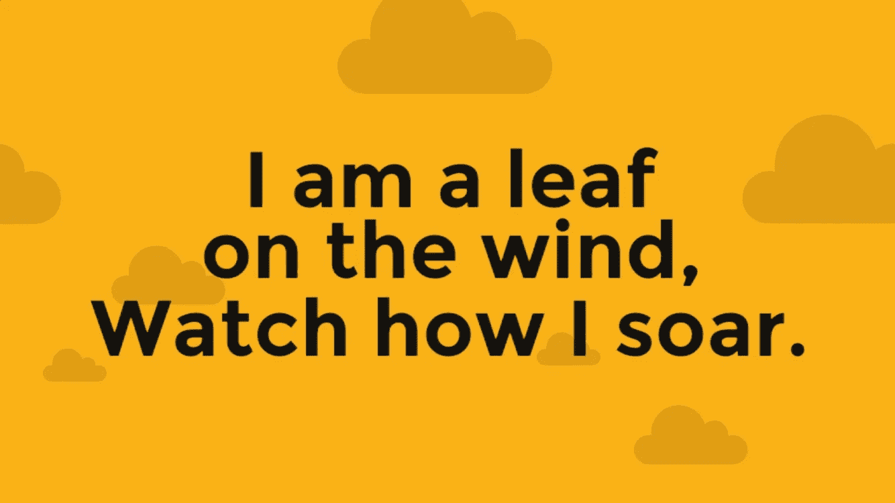

# 即兴创作作为一种生活方式。

> 原文：<https://medium.com/hackernoon/improvisation-as-a-way-of-life-26c221f375ef>

逆来顺受，随波逐流，随遇而安……人们总是说，你应该对自己的计划保持灵活。不要害怕改变事情。

我做梦也想不到，和我们有了第一个孩子时相比，我会完全理解不断即兴创作的生活意味着什么。

就在一个多月前，我们迎来了我们的小女儿。从一开始，我们就认为我们可以制定一个计划，但这个计划却被抛到了九霄云外。

你想顺产吗？不，对不起，宝贝女儿，你要剖腹产了。好吧，让我们开始吧，我们会处理好的，一切都会好的。

我们为婴儿准备了托儿所和婴儿床。不，她不想睡在那里，她会睡在你的怀里。好吧，我们可以这样做让我们制定一个计划，我们轮流值班，有人会一直醒着照顾她。这在第一个月很有效，虽然很累，但是很有效。

在这第一个月里，我学到了很多东西，但最重要的是制定一个计划，但假设这个计划一旦开始就会化为乌有。是的，制定一个计划至少会让人们走出这扇门，但是走出这扇门的第一步，一切都会改变。制定一个计划也可以考虑到各种可能性和突发事件，因为相信它，这些将变得至关重要。然后寻找阻力最小的路径，就像“窗户上的一片叶子，看我如何飞翔。”

这看起来像是轶事般的建议，但我坚信，一个人越灵活，生活就越轻松。如果我没有能力处理事情，那么我会看到更多的压力和焦虑。一切最终都会自行解决，而且可能不会按计划进行。没关系，只要最终的结果是安全和健康的，那么通往那里的道路不是一开始就可以预见的又有什么关系呢？

孩子们无疑是我所经历过的最疯狂的学习。今天管用的明天就不管用了，5 分钟前安抚婴儿的方法现在已经失效了。

“我们要去冒险了！”拥抱旅程，一路上睁大眼睛，因为你将经历的景象和场景将伴随你一生。和你的孩子在一起，享受他们给你的微笑和注视。到目前为止，这无疑是一次冒险，我迫不及待地想看看我们将从这里走向何方。