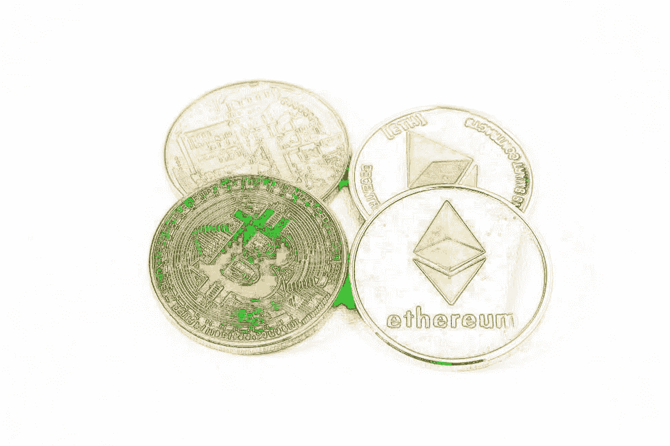

# 在分权公司中，每个人都有股份

> 原文：<https://medium.com/hackernoon/in-decentralized-companies-everyone-has-a-stake-6a6069006576>

> Beetoken 的联合创始人阿里·阿亚什(2017 年至今)。[原载](https://www.quora.com/How-important-is-decentralization-for-the-future-of-cryptocurrencies/answer/Ali-Ayyash)于 [Quora](http://quora.com/?ref=hackernoon) 。

2017 年夏天，Equifax——追踪和评估消费者金融历史的三家全国性信用报告机构之一——[遭遇了大规模安全漏洞](https://www.ftc.gov/equifax-data-breach)，泄露了多达 1.43 亿美国人的敏感信息。

这一漏洞揭示的是，当像 Equifax 这样的集中化公司拥有您的数据时，他们可以以任何方式操纵它，并在此过程中使它面临潜在的危险和盗窃。

但这就是区块链的用武之地:如果 Equifax 数据被加密，并由一家分散的公司管理，将数据存储在区块链上，那么数据泄露本来是可以避免的。

区块链使用加密散列函数来加密您的数据并跟踪数据的历史变化。因此，在任何时间点，如果您的任何数据被篡改，您自己可以立即确定篡改发生在哪里，并努力减轻损害。

但是安全并不是分散公司比集中公司更受欢迎的唯一原因。分散化的公司也激励他们各自社区的良好行为，并更有效地运作。

# 这是因为在分权公司中，从创始人到基层员工，每个人都有股份。

这是我们在构建 Bee Token 时一直牢记的。

Bee Token 是一个基于开放以太坊协议的分散式家庭共享网络，由 Bee Token 自己的实用程序令牌提供支持。这意味着拥有我们令牌的每个人——从创始人到嘉宾和主持人——都拥有平台的一部分。这是一种数字资产。同样，所有用户都可以跟踪其数据的使用情况和保护情况。

现在，在任何公司——尤其是那些共享经济中的公司——都必然会有坏演员。但是在分散的社区里，糟糕的表演会受到积极的抑制。这是因为如果公司做得好，所有的利益相关者都会受益。

让我们把 Bee Token 比作一家集中式的房屋共享公司:AirBnB。在 AirBnB，对公司健康和成功的所有投资完全取决于创始团队和早期投资者。所做的决定仅仅是为了使这些人的利润最大化。领导团队还完全控制着 AirBnB 收集的数据，这意味着他们可以选择按照自己的意愿使用这些数据或将其货币化。

与此同时，房主没有任何利益。

优步也有类似的情况。优步车手与优步的最终成功没有任何关系。反过来，他们也没有更大的动力去为公司的最大利益而行动，因为公司创造的一切只会让高层受益。

# 由于这个原因，分散的公司更值得信赖。

博弈论表明，一个人可以相信一群人和从他们的共识中得出的集体决定，但不应该相信一个人的决定。

分散经营的公司也遵循同样的信念。即使你可能不相信一个人组成了一个更大的区块链，你可以相信整个链条。

想想像脸书或谷歌这样的中央集权公司是如何控制你的数据的。这些平台上的用户目前无法知道他们的数据是如何被利用的，或者这些数据是否被第三方——比如美国国家安全局——访问。这是因为脸书和谷歌集中控制这些数据，并且可以，假设，允许政府机构或其他第三方角色后门访问。

权力下放不允许这样做。

诚然，不良行为者或公司可以试图操纵存储在区块链上的数据，但他们这样做而不被发现是不可能的。一旦这样的行为者在一个分散的社区中被发现做了这样的事情，社区就有能力将他们拿下，这也阻止了不良行为者贯彻他们的恶意意图。

## 以我的经验来看，我还发现分权公司的运营效率更高。

> 设计有严格等级结构的中央集权公司就像笨重的游轮:它们的方向由位于公司高层的一群特定的人决定，任何方向上的改变都是缓慢而笨拙的。

这类公司的创新几乎不可能实现。当决策制定出来，产品或工具的变更实际实现时，本应该从变更中受益的用户可能不再需要它了。

大型中央集权的公司几乎没有适应能力，也几乎没有能力在不同层级之间进行沟通，或者迅速采取行动来满足较小的需求。我职业生涯的大部分时间都在这些公司度过。我从经验中知道这一点。

然而，在分权的公司中，层级结构要简单得多，激励措施也更有针对性，因此改进会在需要的时候发生，产品也会更快地发布。这类公司关注的是结果，真正改善受益于你的产品或创意的用户的体验。

## 底线是:不管你是否同意我的观点，向权力下放的转变已经开始了。

作为他新年决心的一部分，马克·扎克伯格甚至宣布了一项承诺，即[向脸书](https://www.facebook.com/zuck/posts/10104380170714571)下放权力。

此外，越来越多像 Bee Token 这样的分散化公司正在成为各自行业的真正参与者，如家庭共享。

最终的原因是因为去中心化对用户来说更好——地面上的人，他们组成了我们的消费者群体。

随着越来越多的社区成员看到集中化公司和分散化公司之间的差异，他们在安全性和一致的经济激励方面感受到的差异越多，他们就越会开始要求这种新模式。

> 作者[阿里·阿亚什](https://www.quora.com/profile/Ali-Ayyash)，比托肯的联合创始人(2017 年至今)。[最初发表于](https://www.quora.com/How-important-is-decentralization-for-the-future-of-cryptocurrencies/answer/Ali-Ayyash) [Quora](http://quora.com/?ref=hackernoon) 上的。
> 
> 更多来自 Quora[的趋势科技答案，请访问](/@quoraofficial)[HackerNoon.com/quora](https://hackernoon.com/quora/home)。