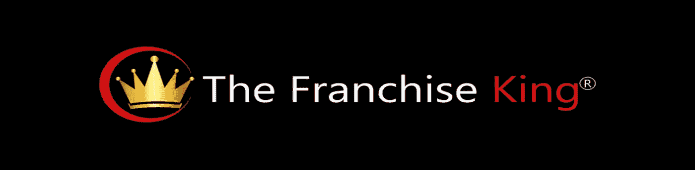

# 在特许经营中,“如何”必须放在“什么”之前

> 原文：<https://medium.com/hackernoon/in-franchising-the-how-must-come-before-the-what-3276b6b5c82f>

玛格丽特看上去非常困惑。

她刚刚问我，我认为“*最佳*系列”是什么，我的回答是这样的:

*“最好的专营权就是最适合你的专营权。最符合您特定标准的特许经营机会。这是一个与* [*总投资在你的财务范围内达到*](https://www.thefranchiseking.com/how-much-money-needed-to-buy-franchise) *。一个可以帮助你达成短期* ***和长期*** *目标的机会。而且你可以很容易地‘看到’自己拥有和经营*。”

“不……真的是乔尔。最好的专营权是什么？”

玛格丽特……玛格丽特……玛格丽特……你没明白。

# 购买特许经营权是一个循序渐进的过程

玛格丽特并不孤单。

像大多数和我一起工作的人一样，玛格丽特想开门见山。

她想知道最好的特许经营机会是什么，作为老板她能赚多少钱，以及她什么时候能开始她的特许经营业务。简单的东西。但事实并非如此。

那是因为为了得到"*什么*，"你需要学习"*如何*"

换句话说，你必须学会如何达到你的目标。

**错误错误**

其实你要定目标，*先*。然后你可以开始学习如何打击他们。

# 特许权

如果你选择了正确的特许经营机会，并且知道如何最好地利用特许经营的商业模式，你就有很大的机会成为一名成功的特许经营企业主。你只需要知道*如何*选择。

以及*如何*区分赢家和输家。

如何进行你的研究。

*如何*保护自己和家人，用[好的法律建议](https://www.thefranchiseking.com/top-franchise-attorneys)。

*如何*获得融资——适合你独特情况的融资类型。

还有更多。

但是，在你做上面这些事情之前，你必须认真地自我发现。

做个净值计算。

想出一个特许经营搜索策略。

和你的配偶、伴侣……无论是谁，都要交心，决定自己做老板。

太多了。

除非按部就班。

除非你确切地知道***如何购买特许经营权**。*

*你可以在这里学习*如何做**。****

********

****(*特许经营之王乔尔·利巴瓦是《成为特许经营者》一书的作者他专门教人们如何选择、研究和购买可以赚钱的特许经营机会。[了解更多](https://www.thefranchiseking.com/about-the-franchise-king)*。)****

********