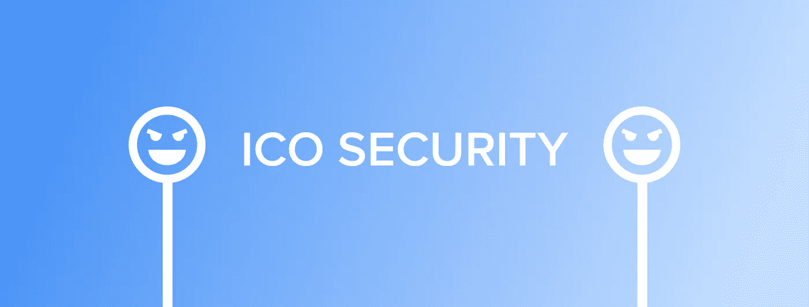
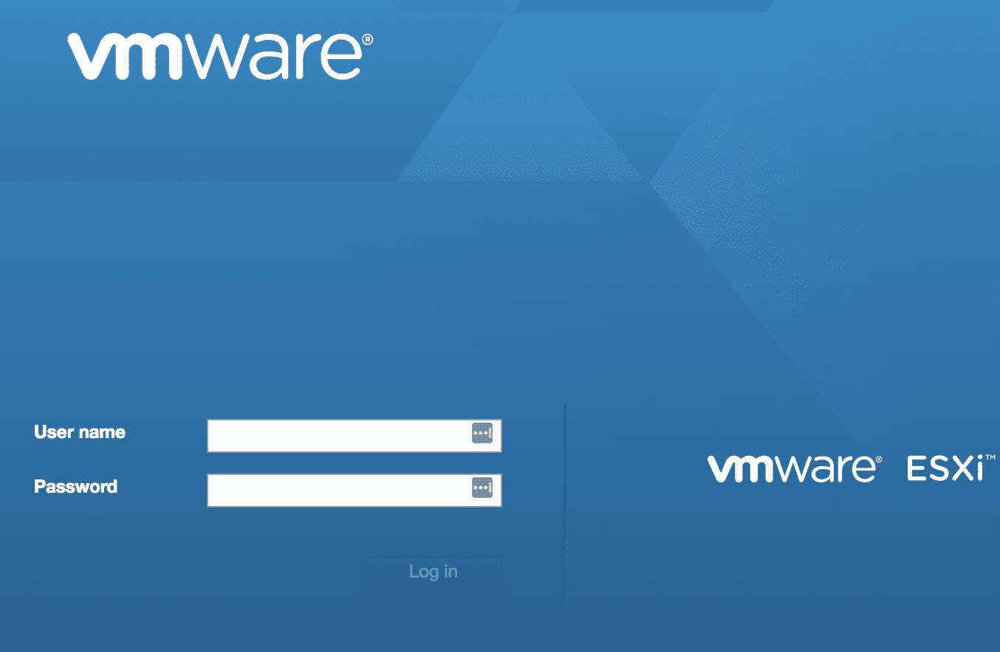
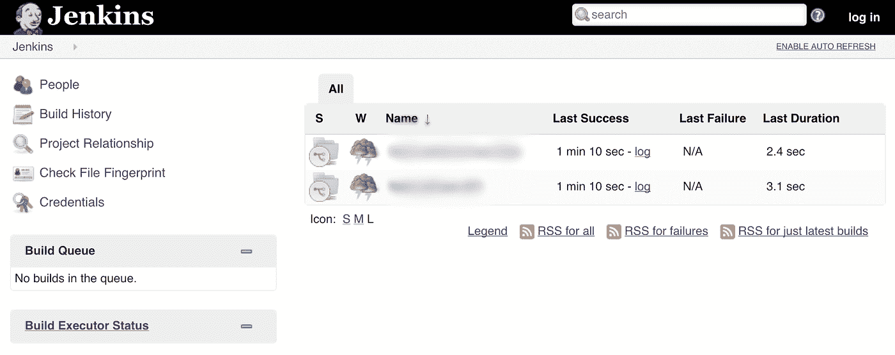
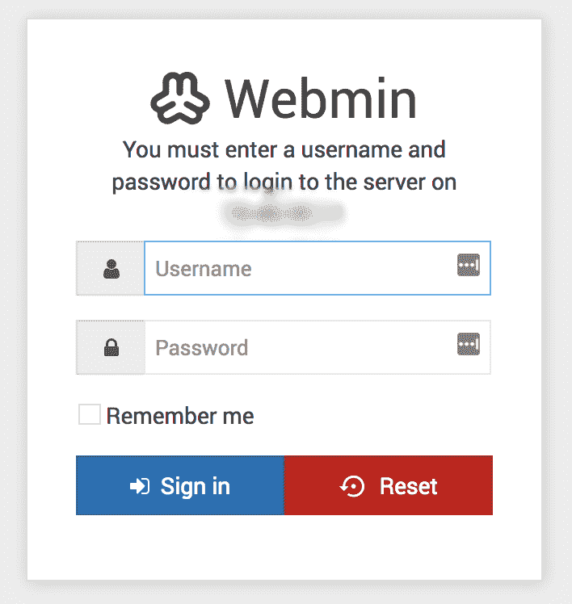
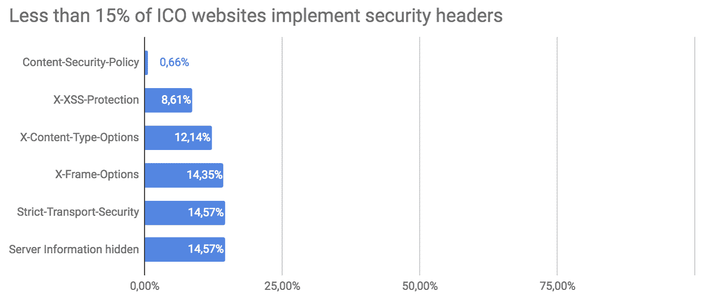
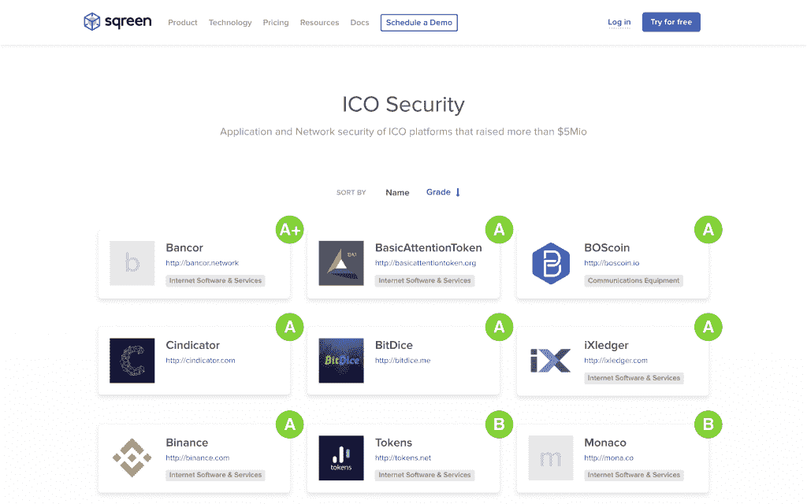
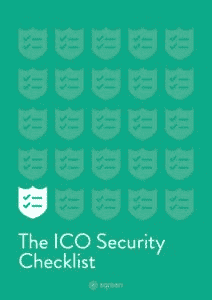

# 在 ICO 中，S 代表安全

> 原文：<https://medium.com/hackernoon/in-ico-the-s-stands-for-security-64c4a5a863b8>

> 由 Sqreen 的联合创始人兼首席技术官让·巴普蒂斯特·阿维亚特撰写。最初发布于 [Sqreen](https://blog.sqreen.io/ico-security/) 。

ico 如今风靡一时。你有 ico 在几秒钟内筹集了数百万，其他的[在几秒钟内损失了数百万](https://www.coindesk.com/coindash-ico-hacker-nets-additional-ether-theft-tops-10-million/)。来自一个安全背景，我想知道这些 ico 是否值得他们受到的爱/恨。

我们对募集了超过 500 万美元的 ICO 证券[进行了评级分析。](https://www.coinschedule.com/icos.html)

TL*；艾科斯博士在安全方面很差劲。我们的研究揭示了在 ICO 安全领域普遍存在的不良做法。*

# 为什么安全性对 ico 很重要？

众所周知，大多数年轻的公司不会投资于安全:他们有一个产品要生产，需要先获得用户和客户。对于 ICO 公司来说，这是非常不同的。

ICO 公司经手数百万美元的加密资金。这通常是他们自己客户的钱——和/或投资者的钱。

由于技术安全问题，许多 ico 已经失败或处于危险之中:

*   [道](http://hackingdistributed.com/2016/06/18/analysis-of-the-dao-exploit):智能合约中存在漏洞，使得攻击者能够窃取筹集金额的⅓
*   [系绳](https://www.theverge.com/2017/11/21/16684296/tether-cryptocurrency-stolen-30-million-hack)损失超过 3000 万美元
*   由于一个安全漏洞，钱包被冻结了
*   [CoinDash](https://www.theregister.co.uk/2017/07/18/coindash_hack/) 黑客设法改变了一个支付地址。
*   [Veritaseum](https://www.coindesk.com/veritaseum-founder-claims-8-million-ico-token-stolen/) 损失了 800 万美元的 ICO 代币
*   等等。

更重要的是，这些公司中的许多都有平台，允许他们的用户交换他们的硬币或转换他们的代币。对此应用程序的攻击是导致 ICO 失败的部分原因。

# ico 未能向其用户展示出像样的安全性…

那么 ICO 安全的现状如何呢？

在我们的分析中，超过 60%的公司在应用和网络安全层面表现出明显的令人担忧的技术失误。我们发现的最令人担忧的事情没有在这篇文章中列出，但已经向这些公司报告了。这里有一个选择:

## 公开的私有云管理门户(VMware ESXi)。

Exposed VMware

这使得攻击者能够接管公司的整个基础设施。

## 过时且易受攻击的 SSH 服务器。

许多公司的 SSH 服务器已经使用了两年，证明操作系统从未更新过。

## 公开的构建工具。

发布构建测试是一种常见的做法，但是构建工具是复杂的野兽，经常会出现安全故障。你不应该暴露他们。

Exposed Jenkins

## 暴露的 DNS 服务器。

在过去的几年里，DNS 服务器已经暴露出了很多漏洞。它们还可能被用来对在线服务执行拒绝服务。

## 暴露的数据库。

这使得攻击者能够暴力破解数据库凭据，或者让前雇员或承包商仍然能够连接到数据库。这也使得对公司有所了解的攻击者更容易访问这些系统。数据库也是对公司各种系统进行其他攻击的媒介。

## 暴露的图形管理工具(微软远程桌面，VNC，Webmin)。

Exposed Webmin

对于攻击者来说，这是一种进入公司的简单方法。

## 分析和监控引擎(Grafana，Munit)。

它们通常是数据库的一个简单接口，或者是显示基础设施细节的一种很好的方式。

上面列出的所有项目都应该是私有的。我们发现它们是因为它们可以从互联网上公开获取。将它们隐藏在 VPN 或源地址监控后面是一种基本的安全措施。

这些公司本身也提供很多服务，比如聊天服务和论坛。托管这样的服务是一件很难保持安全的事情:它们需要更新，相应地配置，对于大多数公司来说，这通常不是一个重要的焦点。因此，保证它们的安全非常复杂。

自托管服务极难保护:必须实施网络过滤，身份验证需要使用强大的密码策略、双因素身份验证，以确保托管服务的安全。在这种情况下，许多服务都可以公开访问。

ICO 公司基本上不使用旨在保护其用户的安全措施，如内容安全政策(他们使用 CSP 的可能性实际上比互联网平均水平低 3 倍)。

最简单的安全措施，如 HTTP 头，甚至没有放在他们的网站上。这种安全头提供了基本但重要的保护，迫使浏览器使用 HTTPS，阻止跨站脚本(XSS)或 MIME 攻击。

最后，没有一个 ICO 应用程序使用任何严肃的实时应用程序安全解决方案来保护其数据。

# …但是关心速度

然而，我们发现 ICO 公司担心它们的可用性和速度。他们使用 cdn，使他们的网站运行更快，并可以防止分布式拒绝服务(DDoS)。几乎 70%的 ico 使用像 CloudFlare 这样的 CDN。这种 CDN 的采用似乎比其他公司普遍得多。

防 DDoS CDNs 保护网站免受攻击，使其暂时无法访问。网站关闭的商业影响是可怕的:它阻止用户登录，访问者(潜在投资者)查看公司网站或…白皮书。

但是 cdn 不能保护应用用户或投资者:跨站点脚本(XSS)、NoSQL 注入、账户接管等等。

分析的完整结果可在 [**此处**](https://www.sqreen.io/opendoor/ico) 获得。

Security Ranking of ICOs [https://www.sqreen.io/opendoor/ico](https://www.sqreen.io/opendoor/ico)

# ICO 安全观

以下是给 ICO 演员的几个小提示:

## 如果你计划或运行一个 ICO，你需要做什么？

对于您的企业来说，安全性不是一个选项。我们已经建立了一个基本的安全检查表，开发人员应该遵循它来提高他们的 ICO 安全性。

ICO Security Checklist [https://www.sqreen.io/resources/ico-security](https://www.sqreen.io/resources/ico-security)

这里 可以得到 [**。**](https://www.sqreen.io/resources/ico-security)

重要的是建立一个清晰的路线图，并对其进行优先排序。先解决简单的步骤。

就 ico 而言，安全问题与负面新闻、法律问题或失去客户无关。这关系到你公司的终结和数百万美元的潜在损失。

## 如果你是一个秘密投资者，你需要做什么？

重点需要放在两件事上:首先，作为硬币或代币的主人，你需要保护自己。您可以查看这些教程:

第二，除了你所有附加的“智能投资标准”，确保你想投资的 ICO 认真对待安全性！他们在 https://www.sqreen.io/opendoor/ico/的分数是一个指标。其他指标包括:

*   他们的安全问题历史和他们的反应:他们很快就解决了吗？他们是否就问题和解决方案进行了沟通？
*   不管他们是管理安全团队还是安全漏洞奖励计划。

谢谢你一直读到最后！有意见或反馈吗？让我知道！

## 关于作者

让·巴普蒂斯特·艾维特花了五年时间寻找苹果的漏洞；帮助开发者解决问题，开发安全软件。他现在是 Sqreen 的联合创始人兼首席技术官。

*原载于 2018 年 1 月 11 日*[*blog . sqreen . io*](https://blog.sqreen.io/ico-security/)*。*