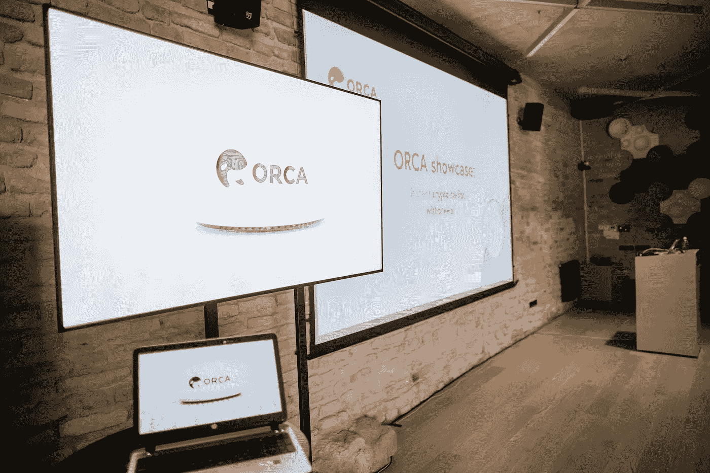
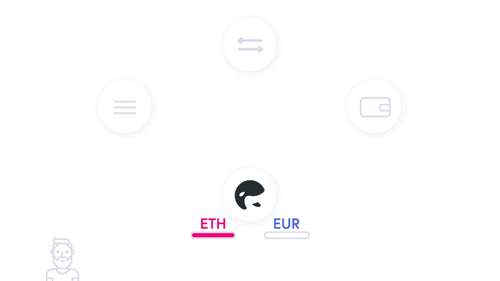
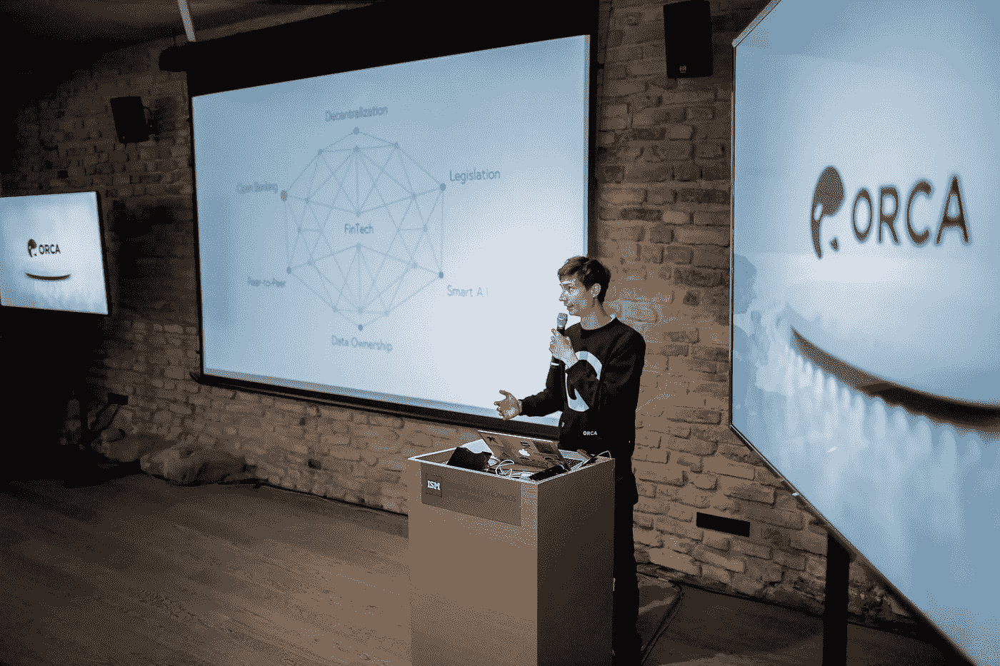

# 不到 7 秒:技术案例将密码从交易所撤回到欧元

> 原文：<https://medium.com/hackernoon/in-less-than-7s-tech-case-to-withdraw-crypto-from-exchange-to-euro-f7f54d717b84>

Visit: www.orcaalliance.eu

即时提取密码现在已经成为现实。连接加密货币和常规金融的桥梁正在一砖一瓦地建造。金融科技初创公司 ORCA 在一场在线直播活动中向社区展示了他们的技术案例。ORCA 在 6 秒内完成了从加密货币交易所到用户银行账户的直接转账。

**# # #按此处** [**进入录音。**](https://www.youtube.com/watch?v=X_DgEir5GBw&t=644s)

ORCA fintech 直播了维尔纽斯 ISM 管理和经济大学创新基地的演示。ORCA Youtube 频道也对该活动进行了直播。立陶宛金融部门代表和其他初创公司聚集在一起，见证 ORCA 技术解决方案如何实时工作。

ORCA 首席运营官兼前投资银行分析师 Laurent Bourquin 宣布演示开始，他介绍了不断变化的全球金融格局。

*“整个银行业正在被打乱< … >。L. Bourquin 声称，几年前，很难想象一家初创企业能够进入零售和投资银行的封闭市场，并夺取其部分市场份额。*

Laurent Bourquin, COO of ORCA Alliance

据他介绍，新的金融科技创业公司正在通过提供更便宜、更高效的服务来挑战传统银行。开放银行业已经在向欧洲进军，而其他国家正在密切关注它的发展。此外，加密货币的兴起正在成为一种大众现象，引起了个人和机构投资者的关注。

[ORCA Alliance 的联合创始人兼首席执行官 Natan Avidan](https://www.linkedin.com/in/natanavidan/) 就 ORCA 初创公司及其旨在解决的问题做了更广泛的介绍。ORCA 是面向加密货币用户的金融管理工具，通过 API 连接各种金融账户。

名词（noun 的缩写）Avidan 表示，只有当市场变得更加用户友好，便于未受过技术教育的用户使用时，加密货币才会被大规模采用。

ORCA 正在构建的解决方案之一是从交易所直接向用户欧元账户即时提取加密货币的能力。ORCA 现场活动的原因是公开展示技术解决方案。

ORCA 首席技术官 Dmitrij Radin 在一台自动售货机的帮助下展示了技术案例，该自动售货机能够验证资金的成功收到。传输只用了 6 秒钟，比最初预计的时间短 10 倍。

ORCA 的解决方案将缓解困扰加密货币采用者的大量问题。ORCA 正在建立一个开放的银行平台，让每个人的银行体验变得方便简单。用户将能够从欧洲银行、加密货币交易所和钱包连接、跟踪和管理他们的金融账户。ORCA 正在提供一体化银行解决方案。

“核心上，ORCA 是一个消费者应用程序，我们很清楚只有通过实际使用案例和便利性优势才能实现大规模采用。即时撤销密码只是实现我们目标的一个垫脚石，尽管这是一个重要的步骤。” —虎鲸联盟首席执行官 Natan Avidan 评论道。

Natan Avidan, CEO of ORCA Alliance

ORCA 目前处于白名单模式。更多信息: [https://orcaalliance.eu](https://orcaalliance.eu)