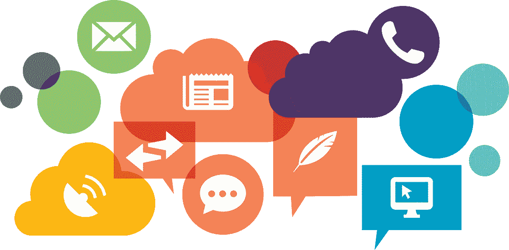

# 电子邮件、Slack 和 docs 是一回事

> 原文：<https://medium.com/hackernoon/in-response-to-slack-is-the-opposite-of-organizational-memory-post-by-abe-winter-who-argues-that-203837564492>

作为对 Abe Winter 发表的“ [Slack 是组织记忆](https://abe-winter.github.io/plea's/help/2018/02/11/slack.html)的反义词”的回应，他认为聊天驱动的工作场所文化，尤其是 Slack，从长远来看对企业是有害的。我跳过了安倍强调的许多要点，所以先读一遍可能会有更好的印象。

以职场沟通为最重要方面之一的信息流管理问题，是我花了很多时间思考的问题。似乎总是有一群初创公司试图“取代[的电子邮件](https://hackernoon.com/tagged/email)”，然而，一些来了又走，一些坚持更长时间，但沟通的核心问题不知何故仍然没有解决。

与此同时，无处不在的聊天似乎做得很好，尽管存在“反应性思维”和持续分心的巨大权衡。这些必须由其他利益来证明。也许聊天完全解决了另一个问题。或许，那些被认为应该由工作场所聊天应用解决的问题的框架并没有反映出真正的实质——Slack 很好，但电子邮件也很好，只是方式不同而已。就目前的形式而言，这两种工具是互补的，没有一种工具是明显优越或完整的。

在我非常简化的模型中，这一切都归结为我们还没有找到一种方法来实现最佳和足够灵活的平衡:

*   个人注意焦点。众所周知，真正的多任务处理是不存在的(对于任何给定的任务集，上下文切换越少，效率就越高；我们仍然称赞它的唯一原因是它处理紧急事件的效率更高，有时这种权衡是合理的。在这方面，电子邮件仍然是明显的领导者，但也有明显的缺点，即没有切实可行的方法来区分优先级和低效的过滤。
*   优先级和升级。信息的重要性并不相同，它们的“相关性”和目标受众会随着时间的推移而变化。通过促进无所不在(并含蓄地惩罚缺席)，聊天文化确保了重要的事情得到处理。但这是一种肮脏的黑客行为，有着巨大的负面影响。然而在极端情况下，已经有了更好的工具，比如 PagerDuty。在我看来，我们只是遗漏了一个关键的概念，那就是对所有事情都要进行结构化上报，而不仅仅是棘手的问题。一旦搞清楚了这一点，办公室就会立刻变成一个更好的地方。
*   上下文捕捉和知识共享。电子邮件和聊天都做不好；文档共享工具填补了这个空白，最初是 G，现在像 Quip 这样的东西让它变得更容易发现和使用。值得注意的是，聊天和某种形式的通知总是它的一部分——这很可能意味着我们只是试图从不同的角度解决同一个根本问题。
*   受众管理。提及、线索、抄送/密件抄送都是为了同样的目的——让相关的人参与进来，同时不分散其他人的注意力/保持隐私。与个体注意力相关，但来自“推动”端——改变注意力表面的“期望状态”。

如果我们假设所有这些都是一个问题的各个方面，可以通过一个尚不存在的产品来解决，那么我们操作的基本框架是不完整的，甚至不足以进行有效的假设。一些基本的构建模块、基本概念缺失了；否则，至少这个问题现在已经被很好地表达和探讨了。这是解释为什么我们有各种各样成功的消息平台，但在过去的 20 年里在这方面几乎没有质的进步(除了共享文档)。

我认为“信息”的概念阻碍了我们。无论围绕它做什么，都不能解决问题。原因很简单，因为现实生活中的对话往往与大量的背景联系在一起，而不是悬在真空中。因此线程、房间等等——但这些仍然是极端的简化。另一个方面是它如何随时间变化。对所有相关方的重要性、紧迫性、受众变化、解决方案，以及随后将其转化为可发现的东西——这些工作流在聊天时效率非常低，在电子邮件中效率要高得多，但仍然不太好。

消息实际上是未解决问题的表现，有其自身的生命周期。在今天的软件中，很少有杠杆可以拉动生命周期的变化。电子邮件与精心设计的过滤器和智能通知相结合，仍然遥遥领先于其他一切。

现在，我真的不知道“如果不是信息，那是什么？”问题。但是我很有信心，在我们操作的基本概念的结构中，在基本的思维框架中，存在着解决我们这个时代最紧迫的问题——信息泛滥——的关键。

历史记录了我们以前做出的许多质的飞跃:演讲，然后是写作，然后是印刷，然后是互联网。每一次核心概念被创造出来之后，许多相邻的概念就出现了——语言、图书馆、社交网络，不胜枚举。但是数字通信似乎落后了。我们仍然在考虑书面信函，现在唯一的区别是传递方式。我们可以做得更好。