# 寻找数据优势:Spark 对 Flink

> 原文：<https://medium.com/hackernoon/in-search-of-data-dominance-spark-versus-flink-45cefb28f377>

## *认识定义大数据下一个时代的强大数据处理引擎*

*本文是* [***阿里巴巴旗下 Flink 系列***](/@alitech_2017/a-flink-series-from-the-alibaba-tech-team-b8b5539fdc70) *的一部分。*

谈到大数据，流计算的重要性以及它所支持的强大实时分析是不可回避的。说到流计算，也不能回避这个领域最强大的两个数据处理引擎:Spark 和 Flink。

自 2014 年以来，Apache Spark 的受欢迎程度迅速上升，在某些情况下，Apache Spark 的性能超过了 Hadoop MapReduce 的三位数，提供了一个统一的引擎，支持所有常见的数据处理场景，如批处理、流处理、交互式查询和机器学习。凭借其高性能和全面的场景支持，它继续受到大数据开发早期采用者的青睐。

在 Spark 出现后不久，阿帕奇·弗林克(Apache Flink)开始作为一个外部挑战者进入公众视野，直到 2016 年左右才广为人知。早期的 Spark 用户在实时流处理等场景中面临可用性问题，而 Flink 提供了一个卓越的流处理引擎，支持广泛的场景以及其他优势。

在他们短暂的竞争中，Spark 继续优化其实时流功能，2.3 版本(2 月发布)引入了连续处理模型，将流处理延迟降至毫秒级。Flink 同样也是一个强大的创新者，这两个框架中的哪一个将最终在定义下一代大数据计算中占据上风还有待观察。通过对它们各自的技术和用途的综合分析，这篇文章应该有助于阐明这个问题。

# 大数据计算引擎的起源

Hadoop 和其他基于 MapReduce 的数据处理系统首先出现，以解决超出传统数据库能力的数据处理需求。继 2004 年 Google 发布 MapReduce 白皮书以来的发展浪潮，用 Hadoop 的开源生态系统或类似系统处理大数据已经成为业界的基本要求。

尽管最近的工作放宽了准入门槛，但组织在开发自己的数据处理系统时不可避免地会遇到一系列问题，通常会发现从数据中获取价值所需的投资远远超出预期。

以下部分详细介绍了这些问题中最普遍的问题，这将有助于解释 Spark 和 Flink 继续争夺行业优先权的基础。

## 非常陡峭的学习曲线

大数据的新来者常常被他们需要掌握的技术数量惊呆了。过去几十年开发的传统数据库通常是为全面的数据处理而构建的，而像 Hadoop 这样的大数据生态系统需要几个不同的子系统，在各种需求场景出现之前，每个子系统都有自己的专业和优势。

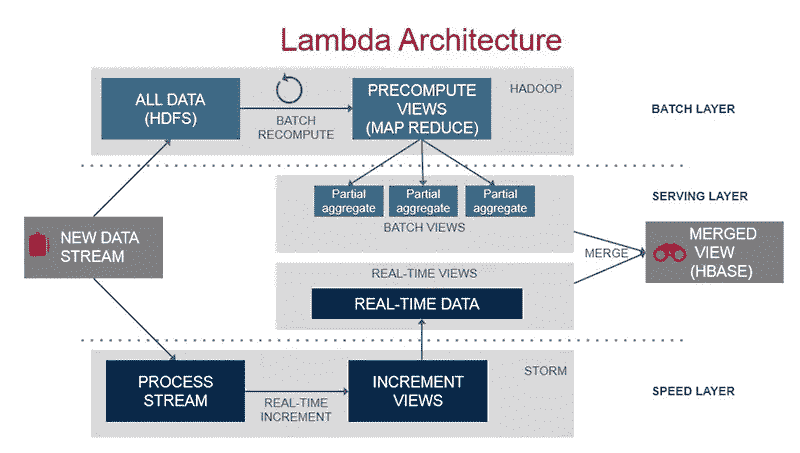

上图描述了一个典型的 lambda 架构。只展示了两个场景(批处理和流处理)，它已经涉及了至少四五种技术，还不算经常需要考虑的替代方案。添加实时查询、交互式分析、机器学习和其他场景，每种情况都涉及以不同方式覆盖重叠区域的几种技术之间的选择。因此，企业通常需要使用多种技术来支持完整的数据处理。再加上研究和选择，投资者需要消化的信息量是巨大的。

为了了解可用的技术，请考虑以下对大数据行业的概述。

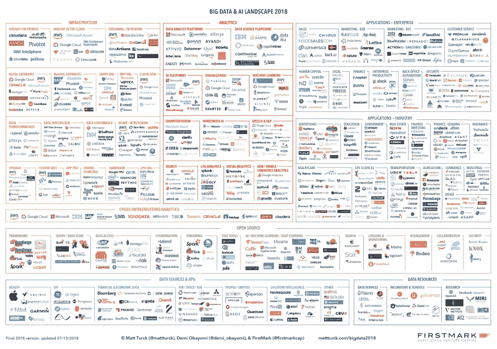

## 低效的开发和运营

由于涉及各种系统，每个系统都有自己的开发工具和语言，大数据的开发效率在默认情况下非常有限。由于数据需要在多个系统之间传输，进一步的开发和运营成本不可避免地出现。与此同时，数据的一致性仍然难以保证。

在许多组织中，超过一半的开发工作花费在系统间的数据传输上。

## 复杂的操作、数据质量和其他问题

多个系统，每个系统都需要自己的操作和维护，这增加了操作成本，并增加了系统出错的可能性。此外，很难保证数据的质量，当出现问题时，很难跟踪和解决它们。

最后但同样重要的是，还有人的问题。在许多情况下，系统的复杂性意味着对每个子系统的支持和使用必须在不同的部门实现，这些部门的目标和优先级并不总是一致的。

## 走向解决

鉴于这些问题，很容易理解 Spark 的受欢迎程度。在 2014 年崛起时，Spark 不仅推出了提高 Hadoop MapReduce 性能的增强功能，还推出了一个通用引擎来支持全方位的数据处理场景。看到一个 Spark 演示，上面提到的所有场景都在一个笔记本中一起工作，对于许多开发人员来说，转移到 Spark 是一个相对容易的决定。因此，Spark 成为 Hadoop 中 MapReduce 引擎的完全替代品也就不足为奇了。

与此同时，Flink 的出现为一系列场景提供了更好的易用性，尤其是在数据流的实时处理方面。

随着竞争领域的建立，下面的章节将在技术层面上比较这两个竞争框架。

# Spark 和 Flink 发动机加工

本节重点介绍 Spark 和 Flink 引擎的架构特性，重点介绍其架构的潜力和局限性。除了它们的数据和处理模型之外，它们在数据处理场景、有状态处理方法和编程模型方面的侧重点也是不同的。

## 数据模型和处理模型

为了理解 Spark 和 Flink 中的引擎特性，首先检查它们各自的数据模型是非常重要的。

Spark 使用弹性分布式数据集(RDD)数据模型。RDD 比 MapReduce 的文件模型更抽象，并且依赖沿袭来确保可恢复性。RDD 通常可以实现为分布式共享内存或完全虚拟化。这就是说，当下游处理完全是本地的时，一些中间结果 RDD 可以被优化和省略。这省去了很多不必要的输入输出，也是 Spark 早期性能优势的主要基础。

Spark 还使用 RDD 上的变换(运算符)来描述数据处理。每个运算符(如映射、过滤、连接)都会生成一个新的 RDD。所有操作符一起构成了一个有向无环图(DAG)。Spark 只是把边分为宽依赖和窄依赖。当上游和下游数据不需要洗牌时，边缘是一个狭窄的依赖关系。在这种情况下，上游和下游操作符可以在同一阶段中被本地处理，并且上游结果 RDD 的具体化可以被省略。下图显示了相关的基本概念。

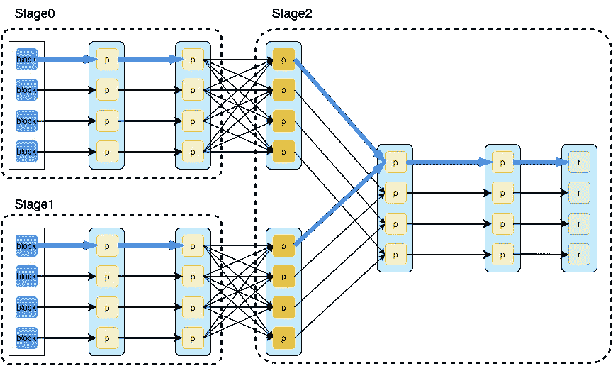

相比之下，Flink 的基本数据模型由数据流组成，即事件序列。数据流作为数据的基本模型，可能不像表或数据块那样直观和熟悉，但仍然可以提供完全等效的功能集。溪流可以是无边无际的无限溪流，这是普遍的认知。也可以是有边界的有限流，处理这些流相当于批处理。

为了描述数据处理，Flink 在数据流上使用运算符，每个运算符生成一个新的数据流。在运算符、Dag 以及上下游运算符的链接方面，整体模型与 Spark 的大致相当。Flink 的顶点大致相当于 Spark 中的 stages，将算子划分为顶点会与上图 Spark DAG 中的划分 stages 基本相同。

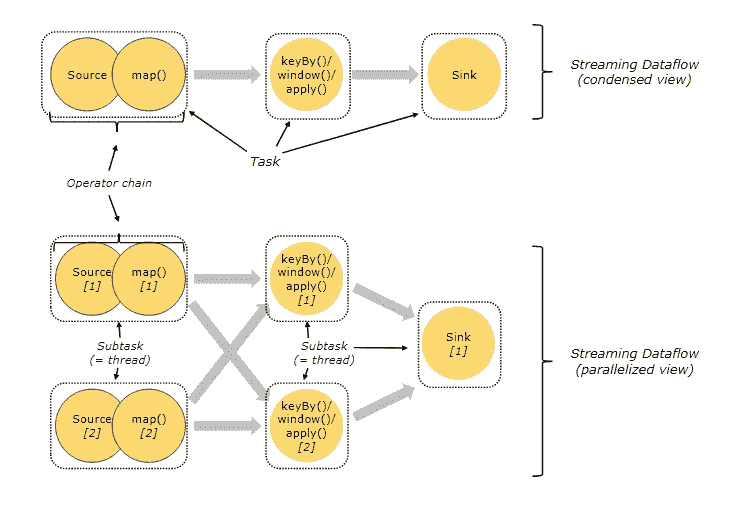

Spark 和 Flink 在 DAG 执行方面有一个显著的不同。在 Flink 的流执行模式中，事件在一个节点上处理后的输出可以发送到下一个节点进行立即处理。这样，执行引擎不会引入任何额外的延迟。相应地，所有节点需要同时运行。相反，Spark 的微批处理执行与其普通批处理执行没有什么不同，因为只有在上游阶段完成微批处理的处理后，下游阶段才开始处理其输出。

在 Flink 的流执行模式中，多个事件可以一起传输或计算，以提高效率。然而，这纯粹是由执行引擎决定的优化。它可以为每个操作符独立确定，并且不像在批处理模型中那样与数据集的任何边界(如 RDD)绑定。它可以为优化留下灵活性，同时满足低延迟要求。

Flink 使用异步检查点机制来实现任务状态的可恢复性，以确保处理的一致性。因此，可以在数据源和输出之间的整个主处理路径中消除 I/O 延迟，以实现更高的性能和更低的延迟。

## 数据处理场景

除了批处理，Spark 还支持实时数据流处理、交互式查询、机器学习和图形计算等场景。

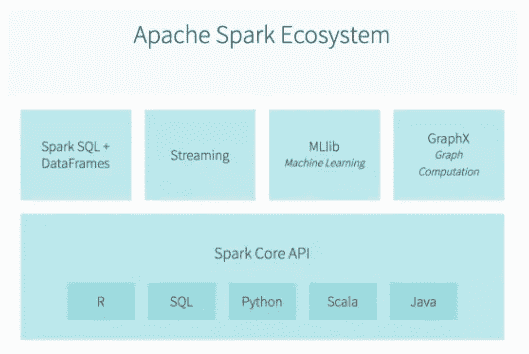

实时数据流处理和批处理之间的主要区别是低延迟要求。因为 Spark RDD 是基于内存的，所以可以很容易地将其分割成更小的块进行处理。足够快地处理这些小块可以实现低延迟。

如果所有数据都在内存中并且处理得足够快，Spark 还可以支持交互式查询。

Spark 的机器学习和图形计算可以被视为不同类别的 RDD 算子。Spark 提供了支持常见操作的库，用户或第三方库也可以扩展和提供更多的操作。值得一提的是，Spark 的 RDD 模型非常兼容机器学习模型训练的迭代计算。从一开始，它就在某些场景中带来了显著的性能改进。

鉴于这些特性，Spark 本质上是一个比 Hadoop MapReduce 更快的基于内存的批处理处理器，并使用足够快的批处理来实现各种场景。

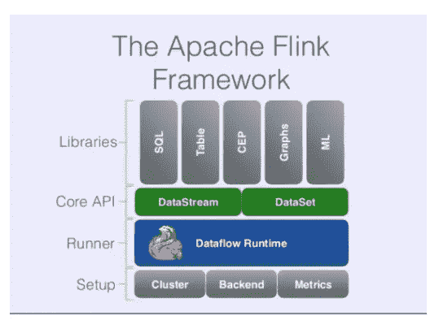

在 Flink 中，如果输入数据流是有界的，那么批处理的效果自然就产生了。流处理和批处理之间的区别仅在于输入类型，而与底层实现和优化无关，因此用户需要实现的逻辑是完全相同的，从而产生一种更清晰的抽象。

Flink 还提供库来支持机器学习和图形计算等场景。在这方面，它与 Spark 并没有太大的不同。

值得注意的是，Flink 的低级 API 可以用来单独使用 Flink 集群实现一些数据驱动的分布式服务。一些公司使用 Flink 集群来实现社交网络、网页抓取和其他服务。这些用途反映了 Flink 作为通用计算引擎的多功能性，并受益于 Flink 内置的状态支持。

总的来说，Spark 和 Flink 的目标都是在单个执行引擎中支持大多数数据处理场景，两者都应该能够实现。主要区别在于，在某些情况下，它们各自的体系结构可能会受到限制。一个值得注意的地方是 Spark 流的微批处理执行模式。Spark 社区应该已经意识到了这一点，并且最近已经开始致力于连续处理。我们稍后将回到这一点。

## 有状态处理

Flink 的另一个非常独特的方面是在引擎中引入了托管状态。为了理解托管状态，我们必须首先从有状态处理开始。如果处理一个事件(或一段数据)的结果只与事件本身的内容有关，则称为无状态处理；否则，结果与先前处理的事件相关，这被称为有状态处理。任何重要的数据处理，比如基本的聚合，通常都是有状态的处理。Flink 长期以来一直认为，没有良好的状态支持，就不会有高效的流，因此，托管状态和状态 API 很早就被引入了。

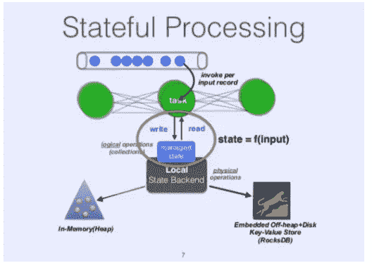

一般来说，有状态处理是在流的上下文中考虑的，但是仔细观察它也会影响批处理。以窗口聚合的常见情况为例，如果批量数据周期大于窗口，可以忽略中间状态，用户逻辑会倾向于忽略这个问题。然而，当批处理周期变得小于窗口时，批处理的结果实际上取决于先前已处理的批处理。因为批处理引擎通常看不到这种需求，所以它们通常不提供内置的状态支持，需要用户手动维护状态。例如，在窗口聚合的情况下，用户将需要一个中间结果表来存储不完整窗口的结果。因此，当用户缩短批处理周期时，处理逻辑变得更加复杂。在结构化流发布之前，这是早期 Spark 流用户的常见问题。

另一方面，作为流媒体引擎的 Flink 从一开始就不得不面对这个问题，并引入了托管状态作为通用解决方案。与用户实现的解决方案相比，除了使用户的工作更容易之外，内置的解决方案还可以实现更好的性能。最重要的是，它可以提供更好的一致性保证。

简单来说，数据处理逻辑固有的一些问题可以在批处理中忽略或简化而不妨碍结果，而这些问题将在流处理中暴露和解决。因此，在流引擎中将批处理实现为有限的流自然可以产生正确的结果，并且主要的工作是为了优化而在一些区域中进行专门的实现。相反，用较小的批处理来模拟流意味着会暴露出新的问题。当计算引擎对一个问题没有通用的解决方案时，它要求用户自己去解决。除了状态之外，问题还包括维度表更改(比如更新用户信息)、批量数据边界、延迟到达的数据等等。

## 程序设计模型

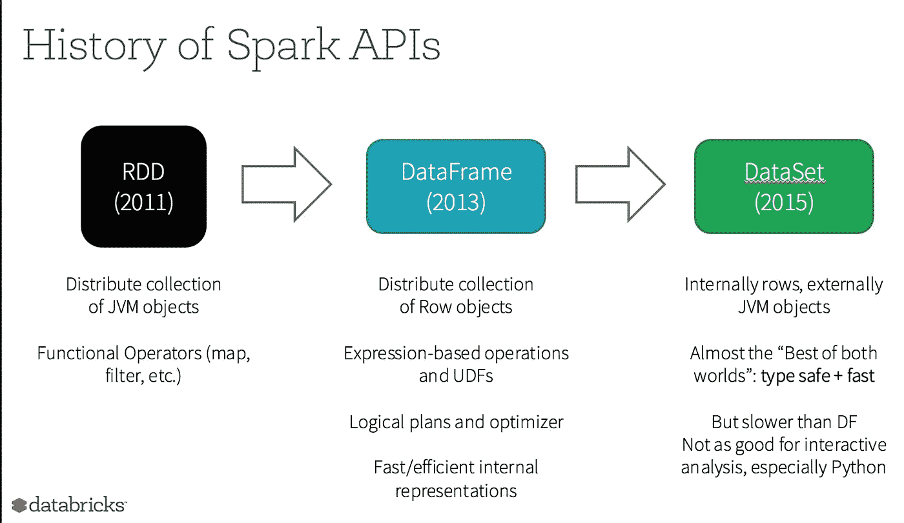

Spark 的初衷之一是提供一个统一的编程模型，能够解决不同用户的各种需求——这是它投入大量精力的焦点。Spark 最初基于 RDD 的 API 已经能够处理各种数据。后来，为了简化用户开发，Spark 2.0 中引入并整合了更高级别的数据框架(在 RDD 中向结构化数据添加列)和数据集(向数据框架列添加类型)(数据框架=数据集[行])。Spark SQL 支持也是相对较早引入的。随着特定场景 API 的不断改进，如结构化流和与机器学习和深度学习的集成，Spark 的 API 变得非常易于使用，今天形成了框架最强的方面之一。

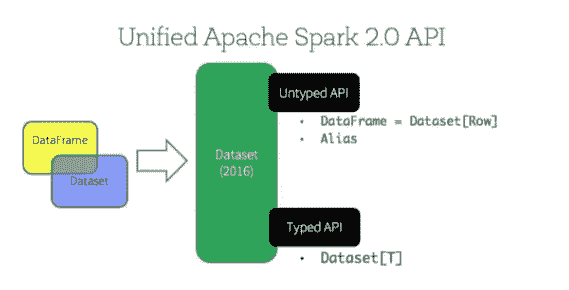

Flink 的 API 遵循了类似的目标和开发路径。Flink 和 Spark 的核心 API 可以认为是粗糙的对应物。如今，Spark 的 API 总体上更加完整，正如过去两年机器学习和深度学习的整合一样。Flink 在流媒体相关方面仍然领先，比如它对水印、窗口和触发器的支持。

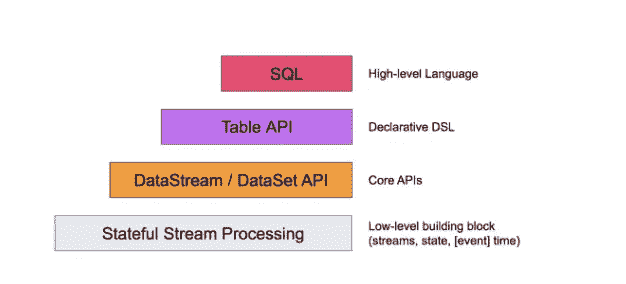

# 外卖食品

Spark 和 Flink 都是通用计算引擎，支持超大规模数据处理和各种类型的处理。每一个都提出了大量这里没有涉及到的探索，比如 SQL 优化和机器学习集成。这种比较的主要目的是从基本架构和设计特征的角度来考察这两个系统。基本原理是，协作学习以赶上更高层次的功能更实际，而基础设计的改变往往成本更高，更令人望而却步。

Spark 和 Flink 不同的执行模型最大的区别在于对流处理的支持。最初的 Spark Streaming 的流处理方法过于简单，在更复杂的处理中出现了问题。Spark 2.0 中引入的结构化流清理了流语义，并增加了对事件时间处理和端到端一致性的支持。尽管在功能性方面仍有许多限制，但它在过去的迭代中取得了相当大的进步。由于微批量执行方法导致的问题仍然存在，特别是在非常大的规模上的性能。最近，Spark 受到应用需求的刺激，开发了连续处理模式。2.3 中的实验版只支持简单的类似地图的操作。

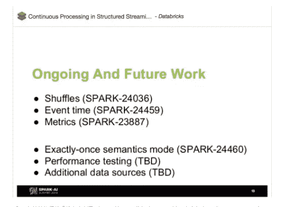

在最近的 Spark+AI 峰会上进行更新后，连续处理似乎定位于发展成为一个与 Flink 的流处理模型非常相似的执行引擎。但是，如上图所示，主要功能仍在继续发展。这些工具的性能如何，以及将来如何与 Spark 的原始批处理执行引擎集成，还有待观察。

**(Original article by Wang Haitao 王海涛)**

*本文是* [***阿里巴巴旗下 Flink 系列***](/@alitech_2017/a-flink-series-from-the-alibaba-tech-team-b8b5539fdc70) *的一部分。*

# 阿里巴巴科技

关于阿里巴巴最新技术的第一手深度资料→脸书: [**《阿里巴巴技术》**](http://www.facebook.com/AlibabaTechnology) 。Twitter:[**【AlibabaTech】**](https://twitter.com/AliTech2017)。