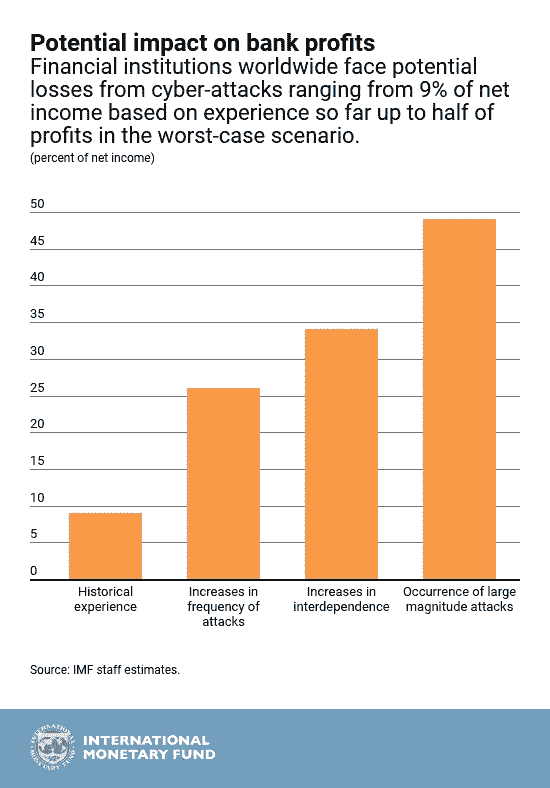
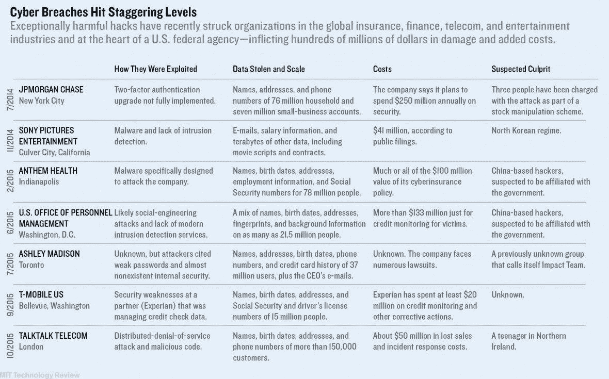
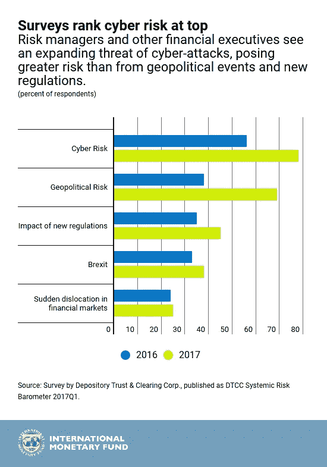

# 在大规模网络入侵的时代；你的银行有弹性吗？

> 原文：<https://medium.com/hackernoon/in-the-age-of-mega-cyber-breach-is-your-bank-resilient-a1394cb25dbb>

金融机构正被证明是网络攻击的中心，这可能是因为黑客们直接攻击他们能拿到钱的地方。据估计，这些金融机构每年都会遭受几千亿美元的损失！这些数字清楚地表明，这些机构的利润受到了侵蚀，从长远来看，这对金融稳定构成了威胁。

> 对一家机构的成功网络攻击可能会在高度互联的金融系统中迅速蔓延。

## 在深入了解更多细节之前，让我们回顾一下一些值得注意的攻击:

*   总部设在东京的加密交易所 Coincheck 最近损失了大约 5 亿美元。这种欺诈不仅窃取金钱，还窃取客户的机密数据。
*   华尔街巨头摩根大通(J.P. Morgan)的 8300 万名客户的数据被盗，据称是一个总部位于以色列的团队试图操纵股市，这揭示了网络攻击如何破坏金融业的令人不寒而栗的可能性。
*   今年早些时候，黑客利用支付转账信息服务 Swift 从美联储银行窃取了 8100 万美元
*   Swift 称，今年早些时候，T2 一些银行因黑客使用与美联储银行入侵类似的方法而遭受损失，具体数目不详

当美国国家安全局(National Security Agency)承包商爱德华·斯诺登(Edward Snowden)透露情报机构正在自由利用主要互联网公司存储的数据时，许多公司承诺采取更多措施加密数据。他们开始在自己的公司服务器上使用加密，但大多数用户仍然暴露在外，除非他们知道安装和使用第三方应用程序来加密他们的数据。

## 网络安全崛起？

金融服务业在网络安全上投入巨大，今年在 T2 花费了 86 亿美元。摩根大通[将其网络安全费用翻了一番](http://www.forbes.com/sites/stevemorgan/2016/01/30/why-j-p-morgan-chase-co-is-spending-a-half-billion-dollars-on-cybersecurity/#67dba0d22a7f)至 5 亿美元，美洲银行称其有[无限预算](http://www.forbes.com/sites/stevemorgan/2016/01/27/bank-of-americas-unlimited-cybersecurity-budget-sums-up-spending-plans-in-a-war-against-hackers/#4ad4dc0d434b)用于打击网络犯罪。随着银行增加其安全投资，信息保障专业人员在该行业非常吃香。近年来，安全专家的职位空缺增加了 131%。专业人士可以通过继续深造来增加他们在行业中获得职位的机会。

这些机构必须保护自己免受无数的攻击，但黑客只需要一次成功的尝试就能进入系统。这是一场非常艰难和不公平的战斗，仅仅预防是不够的。人们必须尽可能快地检测和响应攻击。历史表明，多次攻击在很长一段时间内都没有被注意到。

# 现在的重点是恢复能力，用更智能的方法来检测攻击和更快的方法来响应它们。

目前，对银行和保险公司来说，代价最大的攻击类型是:

*   拒绝服务
*   网络钓鱼
*   社会工程
*   恶意的内部人士

DoS 攻击的一个众所周知的例子是 [Mirai 未来组合僵尸网络](https://www.corero.com/resources/ddos-attack-types/mirai-botnet-ddos-attack.html)，一种自我传播的僵尸网络病毒。它利用物联网攻击几种类型的公司，包括银行。

## 机器学习，大数据拯救？

大数据分析可以为金融公司提供解决方案。随着网络攻击的速率、速度和复杂性继续呈指数级增长，安全性已成为一个大数据问题。实时分析是当今安全策略的基础。

国际分析研究所(IIA)预测，大数据分析工具将成为第一道防线——将机器学习、文本挖掘和本体建模结合在一起，可以提供整体和集成的安全威胁预测、检测、威慑和预防计划。

应用可以利用来自各种来源的数据的机器学习框架，使企业能够实时标记异常活动，防止任何潜在的安全攻击或欺诈发生。根据“发生的”数据采取行动是一项关键优势，可以帮助金融机构领先于犯罪分子。借助融合数据平台，对运营和分析数据的分析可用于预测攻击并主动预防攻击。

> 数据被盗，但数据也可以拯救世界。你只需要知道如何正确地使用它。例如，员工设备可能被用作访问和窃取数据的特洛伊木马，但您可以通过大数据分析来阻止它。

归根结底，选择权在你；创新或者被颠覆！