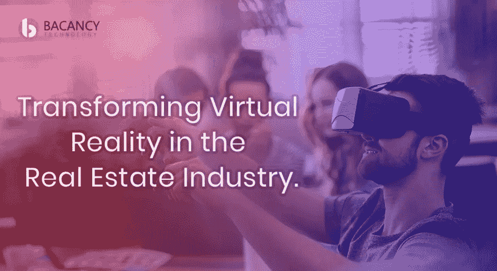

# VR 在哪些方面让房地产行业现代化？

> 原文：<https://medium.com/hackernoon/in-what-ways-vr-is-modernizing-the-real-estate-industry-fe528294244c>

[**Source: Bacancy Technology**](https://www.bacancytechnology.com)

虚拟现实和房地产之间的联系确实是显而易见的:你可以进行虚拟现实之旅，体验新房地产如何按照你的预期开发的同样感觉，而不是亲自参观潜在的房地产——新家、公寓或商业办公场所。在这个时代，房地产行业正在通过基于技术的突破性创新来塑造其光明的未来。

房地产虚拟旅游的概念无疑简化了在做出任何购买决定之前看到最终产品的过程。按照这种趋势，到 2025 年，房地产市场规模似乎将达到 42，637 亿美元。根据普华永道的新兴趋势报告，到 2025 年，房地产 AR/VR 有可能达到 26 亿美元。

# 虚拟现实技术如何重新定义传统的房地产世界？

*   千禧一代购房者
*   **简单的买卖流程**
*   **有影响力的游戏规则改变者**

# VR 技术在房地产领域有什么优势？

为了对虚拟现实技术在房地产行业的应用有一个清晰的了解，让我们来讨论一下虚拟现实技术如何使房地产行业受益。

*   **形成情感纽带**
*   **省钱省时**
*   **保持全局接近**
*   **拥有感**

# 为您的房地产业务创建自己的虚拟现实应用程序

虚拟现实拥有发人深省的力量，可以从想象中产生现实，无论是公寓、建筑还是整个城市。如果你对用基于虚拟现实的高端应用来改变你的房地产业务感到兴奋，那么你已经登陆了正确的页面。

Bacancy technology 是一家技术创新和先进的虚拟现实 app 开发公司。我们拥有一个经验丰富的行业专家团队，他们在为房地产企业构建虚拟现实应用程序方面拥有深入的知识和丰富的经验。因此，如果您正在寻找一个应用程序开发合作伙伴来为您的企业创建创新解决方案并为您的客户提供高级服务，那么请选择 Bacancy Technology 作为您的[房地产应用程序开发](https://www.bacancytechnology.com/real-estate-software-development)合作伙伴。

*原载于***。**