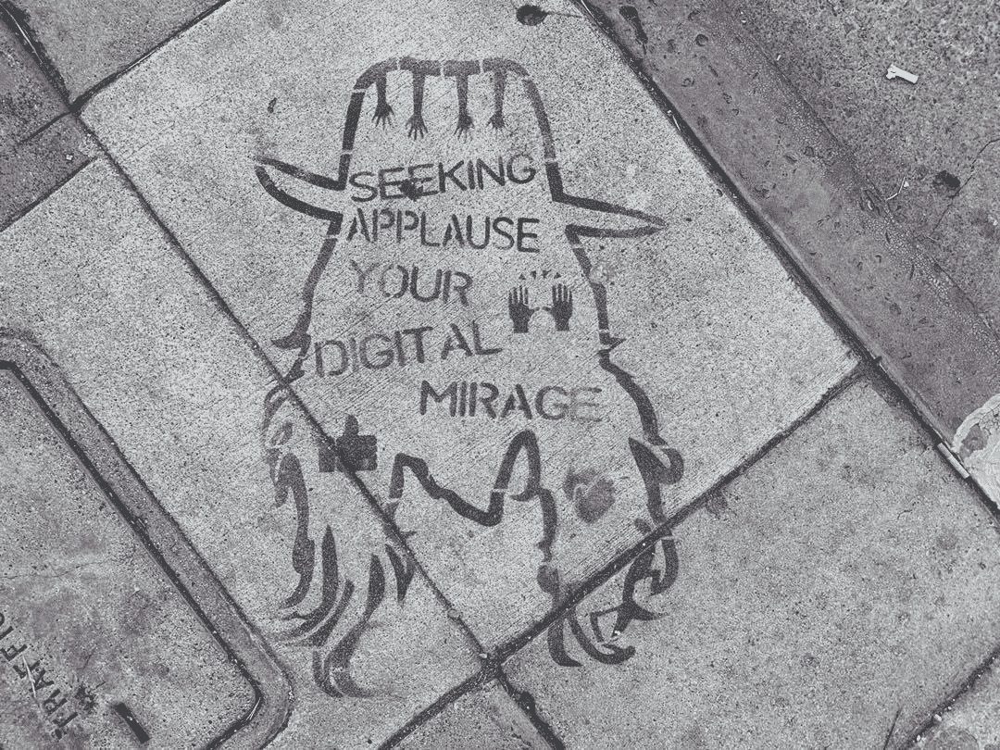

# 激励跟踪系统

> 原文：<https://medium.com/hackernoon/incentive-tracking-system-85935089d356>

[Source](https://leapsmag.com/will-blockchain-technology-usher-in-a-healthcare-data-revolution/)

# 问题

每卖出一笔，销售人员都会得到一份奖励。跟踪这些销售非常重要。这将有助于组织对销售主管给予准确的激励。

当组织规模较小，员工人数较少时，该系统可以很容易地在传统的关系数据库上实现。

然而，当组织遍布全球多个城市时，就会出现**问题**。这时，我们需要一个可以在全球范围内运行的系统，并且可以轻松跟踪系统中的数据。

我们不能取消激励制度，因为激励有助于销售主管更有效地工作，甚至表现得更好。

谢天谢地，**企业区块链**可以帮我们解决这个问题。

# 解决办法

如前所述，我打算和**企业区块链**一起解决这个问题。

我们可以在区块链上实现一个键值对来解决这个问题。其中，key 是主管的姓名，value 是销售人员获得的奖励。

这可以通过使用**自主智能合同**代码进一步改进，该代码将自动计算销售人员获得的奖励。我们还可以有一个具体的系统，如果两个销售人员合作完成一笔交易，这个智能合同代码可以在这两个销售人员之间平均分配激励。这不仅会提高组织的透明度，还会促进员工之间的健康关系，帮助整个组织大规模发展。

让我用下面的例子来解释这一点:

1.  假设我们有两个推销员“A”和“B”。
2.  他们两人合作完成了一笔价值 1000 美元的客户交易。
3.  我们可以让这些销售人员在 UI 系统中输入销售的详细信息和他们合作的同事，该系统将在后端嵌入智能合同。
4.  假设根据公司的规定，完成交易的销售人员将获得 1%的奖励。
5.  在这里，我们有两个代表，所以智能合同将平分激励，每个人 5 美元。
6.  最后，键值对是“A:5”和“B:5”。

这就是我们如何在区块链上可视化“激励跟踪系统”,并且这可以在云的帮助下作为服务提供，帮助组织大规模繁荣。

下面这段引语激励我写这篇文章:

> “区块链是一项新发明，它允许开放网络中的优秀参与者在没有统治者和金钱的情况下进行治理。它们是基于成绩的、防篡改的、开放的投票系统。有功的是那些致力于推进网络的人。”~ [海军 Ravikant](https://twitter.com/naval/status/877469839803142144?s=20)

感谢您阅读我的文章。

**注:**
本文来自莱特州立大学智能实验室在裴勇博士指导下完成的研究工作。

莱特州立大学:[https://www.wright.edu/](https://www.wright.edu/)计算机科学与工程系:[https://www . Wright . edu/degrees-and-programs/profile/Computer-Science](https://www.wright.edu/degrees-and-programs/profile/computer-science)
裴勇俊博士:[https://people.wright.edu/yong.pei](https://people.wright.edu/yong.pei)

*如有任何问题，欢迎随时给我发* [*邮件*](mailto:pamanalionline@gmail.com) *。也可以通过*[*Linkedin*](https://www.linkedin.com/in/amanali1/)*联系我。也可以关注我的* [*推特*](https://twitter.com/aliandco) *。*

*为了入门区块链阅读我的* [*文章*](https://hackernoon.com/blockchain-learning-path-2019-e54d6763dd6c) *发表于*[*hacker noon*](https://hackernoon.com/)*。*

