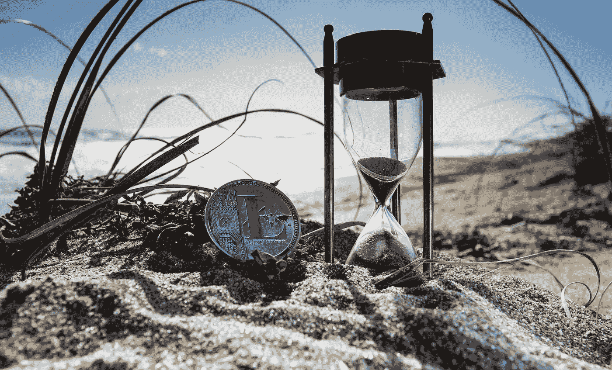
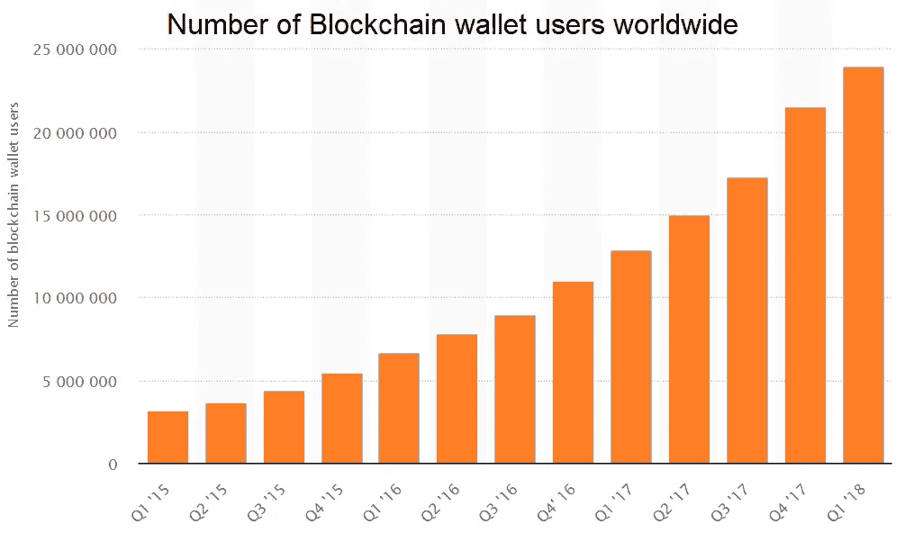
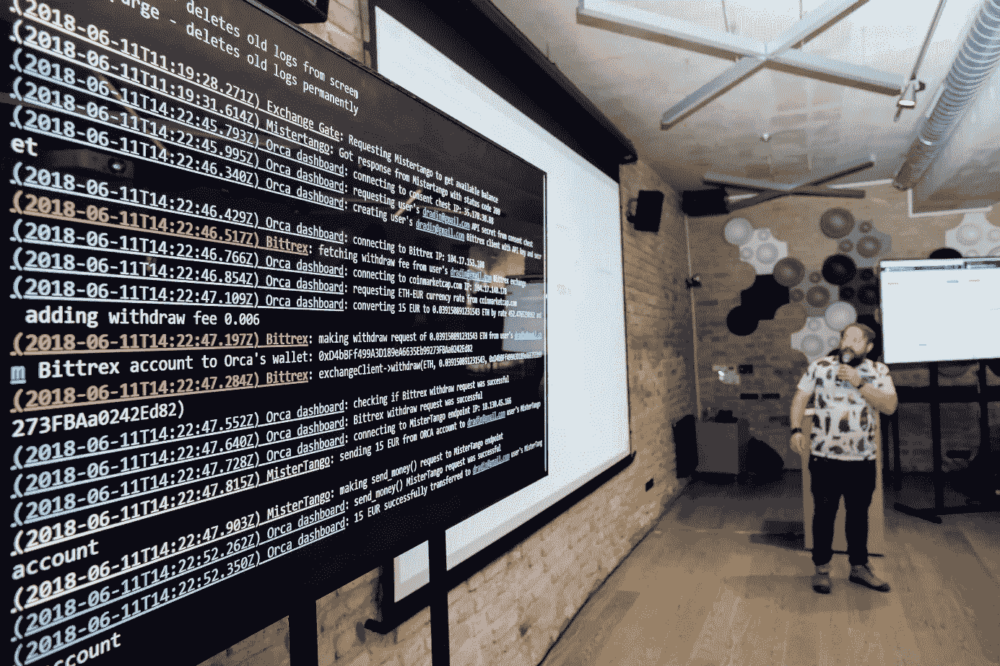

# 慢慢走向认可:加密货币正在融入主流金融服务。

> 原文：<https://medium.com/hackernoon/inching-towards-recognition-crypto-currencies-are-integrating-into-mainstream-financial-services-ce12b124d921>

**十指交叉**

自从日本选择将比特币作为合法支付方式合法化后，基于区块链的加密货币的使用因预期新一波流行而增加。对于将密码全面纳入金融体系，动物精神非常高涨。

然而，没有目前根深蒂固的金融巨头的支持，crypto 面临着艰难的时刻。它的优点大多被忽视，缺点被夸大，使其成为金融界的恶魔。它被指责为千禧一代的一种消遣，甚至很少被认为是金融服务的一种可能的补充。

然而，区块链加密货币在私人交易、汇款、网上购物或投资科技初创公司方面的潜力仍然很大。随着老牌金融公司开始关注 FinTech(金融[科技](https://hackernoon.com/tagged/technology))的未来并为此做准备，这一点正慢慢被人们所认识。

Source: Statista

**新边疆**

最近，7 月 17 日，万事达卡从美国专利商标局获得了一项专利，将加密货币与法定账户联系起来。该公司的研发部门万事达实验室此前已经申请了 30 多项不同的区块链或加密货币相关专利，但这一项尤为重要。

通过将 crypto 与其高效的交易系统联系起来，该公司将能够克服令密码界担忧的一个主要问题:交易速度。

传统上，区块链的交易需要 10 分钟左右才能处理完毕。如果你是交易的接收方，在你收到钱之前，你不会关心交易的安全性和匿名性。因此，商家、零售商、服务提供商可能会对接受产品加密持谨慎态度，因为让客户在商店里呆一段时间听起来不是特别有吸引力。

为了缩短转账时间，万事达卡正计划开发一种新型账户。一个可以通过转移与传统政府支持的货币挂钩的密码来减少旅行时间的账户。这不仅应该更有效，而且应该更安全。

该公司被新技术的使用所吸引，这些新技术用于[防御欺诈和身份盗窃](https://toshitimes.com/mastercard-investigates-the-use-of-blockchain-to-combat-fake-identities/)，这是通过将所有信息存储在一个分散的分类账中实现的。

简而言之，传统支付技术和区块链货币的这种结合，可能正是将加密技术纳入金融领域所急需的推动力。

**都在数字里，傻傻的**

当然，尽管这些庞然大物正在迎头赶上，但加密和欧元或美元之间无缝来回交易的愿景已经成为一些新贵的生计。

[ORCA Alliance](https://orcaalliance.eu) ，一家连接加密和传统金融的公司，最近在网上直播的[活动中向社区展示了其技术案例](https://www.youtube.com/watch?v=X_DgEir5GBw&t)。ORCA 在 [6 秒内完成了从加密货币交易所到用户银行账户的直接转账。](https://www.youtube.com/watch?v=B48Engs_vtU)

D. Radin presenting ORCA’s technical solution

这个新贵通过结合 3 个 API(应用编程接口)成功完成了这一壮举:一个用于加密交换，另一个用于支付网关和一个金融机构的 API。凭借这种精心设计的方法及其用户友好的财务管理工具，该公司非常适合成为加密社区迫切需要的解决方案提供商。

**完成散列**

以前封闭的硅谷内部人士俱乐部正在慢慢走向主流金融服务提供商。新贵和现任者都在提出解决方案，以缓解困扰加密货币采用者的诸多问题。如果他们的新想法给旧的金融惯例带来了新的变化，不要感到惊讶。