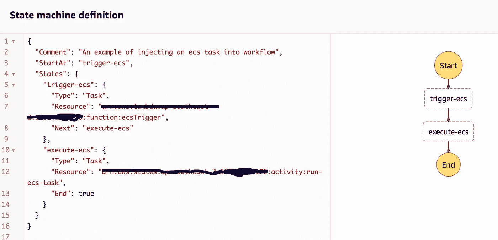
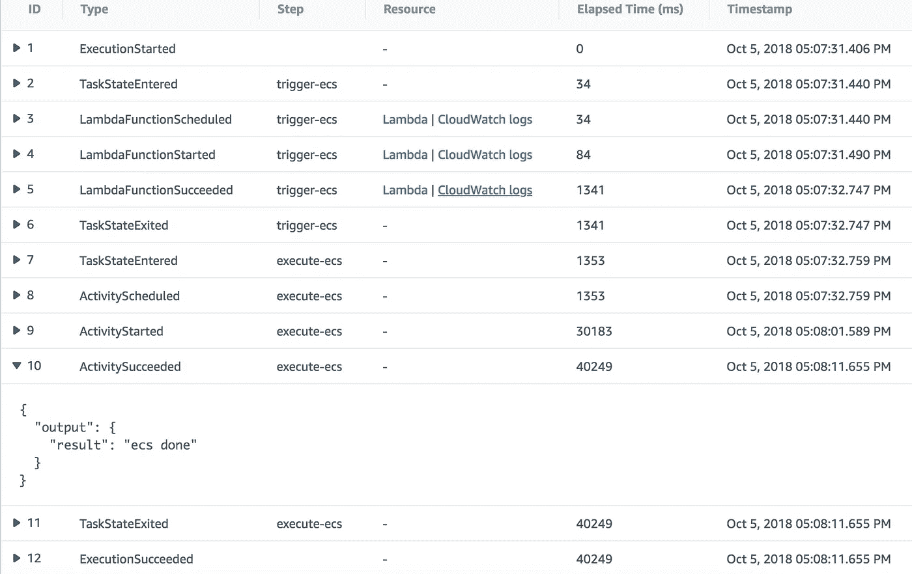

# 将 AWS Fargate 合并到阶跃函数中

> 原文：<https://medium.com/hackernoon/incorporate-aws-fargate-into-step-functions-8003d688d027>

## [步骤功能](https://aws.amazon.com/step-functions/)是编排[无服务器工作流](https://aws.amazon.com/serverless/)的好方法。由于 Lambda 函数的执行时间限制，长时间运行的流程通常是不可避免的，并且它们通常依赖于“永远在线”的基础设施。如何将这些长时间运行的流程集成到您的工作流程中，同时仍然保持无服务器状态？


photo by [elCarito](https://unsplash.com/@elcarito?utm_source=medium&utm_medium=referral) on [Unsplash](https://unsplash.com?utm_source=medium&utm_medium=referral)

人们已经听说过，或者使用 [AWS](https://hackernoon.com/tagged/aws) Step 函数来协调云原生任务(即 Lambda 函数)来处理他们的部分/全部生产工作负载。在这篇文章中，我将介绍如何在 Step 函数中将非 lambda 任务合并到状态机中。

## 在高层次上，阶跃函数到底是什么？

这可能是每个新接触阶跃函数的人都会问的第一个问题。经过一番思考后，我得出这样的结论:

> 它仅仅是一个编排工具，让你从分布式的、单独管理的服务中组成一个工作流。

因此，Step 函数，不像它的名字所暗示的那样，并不是你为了把应用程序的组件连接在一起而需要编写的实际函数。其核心是一个**状态机**，或者更准确地说，是一个*有限*状态机，这是一种通过定义单个*状态*和这些状态之间的*转换*来说明应用程序流程的方式。实际上，一个状态通常注定要执行一个**任务** *。*AWS 是这样定义任务的:

> 任务可以是活动或 Lambda 函数。

我们都知道 Lambda 函数是什么，对吧？那么究竟什么是活动呢？我们开始吧:

> 活动是 AWS 步骤函数的一个特性，它使您能够在状态机中拥有一个任务，该任务由一个*工作器*执行，该工作器可以托管在亚马逊弹性计算云(Amazon EC2)、亚马逊弹性容器服务(Amazon ECS)、移动设备上——基本上在任何地方。

简单地说，一项活动是一个符号，它必须由做实际工作的*工人*来实现。worker 基本上是您单独管理的服务，只要它可以通过 HTTP 连接到 Step 函数，它就可以托管在任何地方。工作者将不得不对活动进行[轮询](https://en.wikipedia.org/wiki/Polling_(computer_science)),以检查状态机是否已经达到该状态。一旦该状态中的活动被激活，工作者将开始工作，然后向该状态报告，以便状态机继续进行。

## 那么，法盖特是如何融入这一切的呢？

在这一点上，人们可能会问，为什么 AWS 不能直接从状态机内部触发一个托管在别处的任务，就像它执行 Lambda 函数一样？好问题。这是我对 AWS 的期望之一。我没有答案，但我猜这是由于员工的移动性/未知性，这将使定义您的状态变得非常棘手。

如前所述，在任务可以执行之前，工作者必须轮询处于某个状态的任务。这实质上意味着您必须在某个地方托管它，以维护一个套接字来单步执行函数，以便在需要时启动。如果您致力于 AWS，那么您很有可能将您的工作人员托管在 EC2 上或 ECS 集群上的容器中。这样做的主要缺点是，当你的员工下班时，你可能最终要为资源付费。为了节省成本，许多人最终不得不在工人执行之前和之后连接 Lambda 函数，从而引入了更多的状态，这些状态的唯一工作是预热/退役底层基础设施。

那次，一直痛苦到 [**Fargate**](https://aws.amazon.com/blogs/aws/aws-fargate/) 发布。在我看来，这是在 AWS 中运行许多东西的游戏改变者。它基本上是一个[无服务器](https://hackernoon.com/tagged/serverless) ECS 产品，使用它，您不需要为容器生命周期之外的任何资源付费。这也意味着你的容器会一直保持关闭状态，直到有东西把它唤醒。

## 在实践中，您将如何实现这一点？

> 那么，如果容器在默认情况下是关闭的，它如何在步骤函数中轮询任务呢？

我的一位同事问道。我刚才已经回答了这个问题。如果您知道如何预热 ECS 集群来运行您的 ECS worker，那么您肯定知道如何通过使用 AWS SDK API 来唤醒“fargated”容器。所以我实现它的方法是在指定 ECS worker 的状态之前引入一个额外的状态。这个额外的状态将运行 Lambda 函数中的一个任务，该任务运行容器。一旦这个 Lambda 函数完成，状态机就进入下一个状态，这就是被触发的容器将要轮询的状态。我从我的生产用例中提取了这一部分，并将其简化为下图。



处于`trigger-ecs`状态的任务运行一个 Lambda 函数，它的工作是调用`runTask` API 来唤醒和运行 ECS 容器，如下所示

```
exports.handler = async (event) => {

    var params = {
        taskDefinition: 'step-functions-task',
        cluster: 'ecs-test',
        launchType: 'FARGATE',
        networkConfiguration: {
            awsvpcConfiguration: {
                subnets: ['my-subnet'],
                assignPublicIp: 'ENABLED'
            }
        }
    }

    await ecs.runTask(params).promise()

    console.log('ECS has been triggered.')
};
```

在上面的 Lambda 函数中需要注意的一点是`assignPublicIp`必须设置为 ENABLED 才能工作，因为 fargated 容器需要一个公共 IP 地址来建立到 Step 函数的 HTTP 连接以进行轮询。

在完成这个 Lambda 函数后，状态机转换到下一个状态`execute-ecs`。在容器预热并开始运行后，工人将从`execute-ecs`状态收到一个任务令牌，知道它准备好行动了。下面 NodeJS 中的代码显示了一个工人如何轮询一个任务，并在任务完成后报告。

```
var AWS = require('aws-sdk')var options = {
  'region': 'ap-southeast-2'
}var client = new AWS.StepFunctions(options);var getStepFunctionActivity = () => {
  let params = {
    activityArn: 'arn:aws:states:ap-southeast-2:<account-id>:activity:run-ecs-task'
  }
  return client.getActivityTask(params).promise()
}var reportBack = (token) => {
  let params = {
    taskToken: token,
    output: JSON.stringify({result: 'ecs done'})
  }
  return client.sendTaskSuccess(params).promise()
}var executeTask = () => {
  return new Promise(resolve => {
    setTimeout(() => {
      resolve('job done')
    }, 10000)
  })
}var execute = async () => {
  while (true) {
    var task = await getStepFunctionActivity()
    if (task.taskToken) {
      await executeTask()
      await reportBack(task.taskToken)
      break
    }
  }
}execute()
```

注意到我是如何模拟`executeTask`函数在 10 秒内返回的吗？这是你真正的逻辑所在。在执行结束时，代码将通过 json 字符串输出向状态机报告。下面是整个状态机的执行历史。



注意到 9 和 10 之间有大约 10 秒的间隔吗？这就是法盖特容器的执行过程。ID 10 还显示了容器执行的输出。

就是这样。希望您喜欢这次演练。我会感谢任何反馈，并乐意指出我哪里做错了。