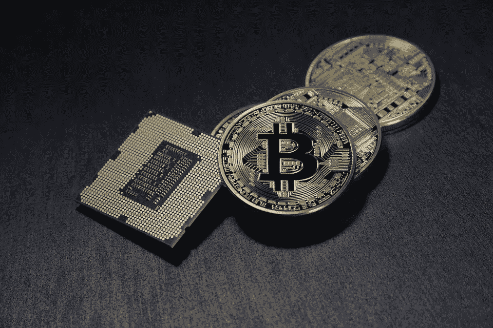

# 风投对 ico 的兴趣日益增加

> 原文：<https://medium.com/hackernoon/increasing-interest-of-vcs-in-icos-890cb34d5f8b>

尽管监管机构对 ico 越来越担忧，但风险资本家对这些产品表现出越来越大的兴趣。然而，他们更感兴趣的是股权，而不是出售硬币的收益。此外，随着监管机构的干预，预计证券代币将会增长。

根据 CoinDesk 的统计，总部位于区块链的公司获得的资金大幅增加，自去年 12 月以来，初创公司仅在 3 个月内就成功筹集了约 4.34 亿美元。尽管美国的代币行业正处于证券交易委员会的审查之下，但风投们激起的兴趣表明，数字货币业务将会增长。

SparksLab Group 的合伙人弗兰克·米汉(Frank Meehan)说，如果一家公司获得首次发行的硬币，他的股票价值就会增加；这正是它的意义所在。他还补充说，他们已经投资了 6 家区块链公司。事实上，2017 年底推出的 1 亿美元区块链基金就是该集团的一部分。

**押注区块链公司**

如前所述，在过去的三个月里，投资者越来越多地资助了区块链的初创企业。CoinDesk 数据显示，2018 年前两个月，代币销售额激增，创业公司通过 ico 筹集了超过 30 亿美元的资金。这是他们在 2017 年筹集的 50%以上。

根据 TokenData 的统计，去年 46%的 token 初创公司要么在上市后遭遇失败，要么无法完成融资。它进一步透露，2018 年迄今为止，在 340 家创业公司中，共有 50 家失败。至于为什么失败率这么高，并不奇怪。毕竟，这只是一份白皮书，他们提供的许多产品甚至都没有功能——这项技术甚至没有经过大规模测试。

**风险投资公司对投资过多过快持谨慎态度**

因此，一些投资者会等待这些公司成熟，同时等待监管机构未来可能做出的决定。投资者正在寻找成熟的公司，这意味着初创公司应该筹集资金来资助他们的营销和开发活动。

Insight Venture Partners 的董事总经理 Lonne Jaffe 承认这一点，他说现在是他们保持谨慎的好时机，因为他们不会错过任何重大的事情。他进一步说，一旦公司开始扩大规模，他们就会开始投资；他们也一直在与他们的投资组合公司沟通，讨论如何为初创公司服务并使用区块链的技术。他还透露，他们总共为 300 多家公司筹集了 180 亿美元的资金，其中也包括 Twitter Inc。

**来自监管机构的压力？**

尽管监管机构已建立了完善的制度，但首次硬币发行的法规仍在不断发展。美国财政部于 3 月 6 日发出一封信，信中指出，发行代币将被视为汇款工具；他们将被要求遵守了解你的客户和银行保密准则。

SEC 主席杰伊·克莱顿(Jay Clayton)表示，他遇到的每一种产品都是一种证券，即使代币初创公司认为它们不是。事实上，上个月 3 月，谷歌、脸书和 Twitter 联手禁止硬币销售和 ico 的广告。此外，领先的数字货币比特币的价值下降了 8.7%。

投资者有兴趣购买以股权或其他资产形式附有某种证券的证券代币，因为这将在未来出现某种监管冲击时起到缓冲作用。

Securitize.io 的联合创始人杰米·芬恩(Jamie Finn)透露，他们计划筹集数十亿美元，并有 100 多家初创公司正在筹备中。它们提供了一个平台来发行有某种支持的代币，如公司收入或股权。

目前，几乎没有任何交易证券代币的交易所。一家在美国证券交易委员会注册的经纪交易商 Templum LLC 一直在提供这项服务。这是一个另类的交易系统。

此外，与多年来一直被套牢的传统创业公司股权相比，股权支持的代币更容易交易。芬恩还补充说，在封锁结束后，一个人甚至可以出售股权支持的代币。此外，人们可以很容易地在网上购买和出售它们。同样，家族理财室可以直接投资于这些证券，而不是通过基金进行投资。