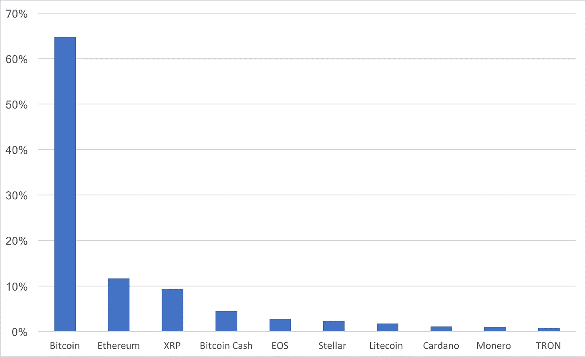
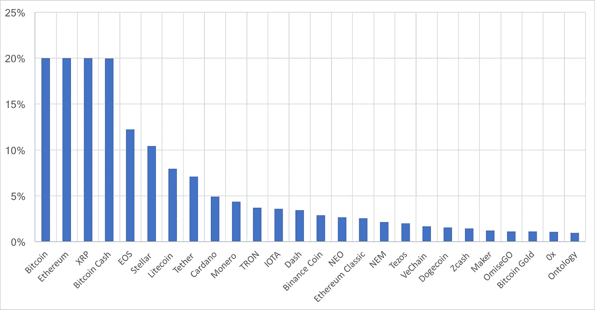
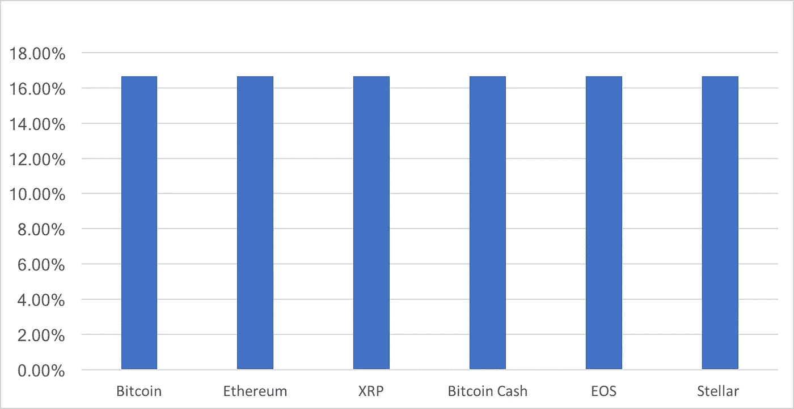

# 用 Shrimpy[功能发布]索引加密市场

> 原文：<https://medium.com/hackernoon/index-the-crypto-market-with-shrimpy-feature-release-4cc0df892ce4>

Shrimpy 正在成为加密领域的默认投资组合管理应用程序。在多个交易所配置多样化的投资组合从未如此容易。继续我们的愿景需要更多针对项目组合管理的其他方面的特性。

今天我们来介绍一下 ***Shrimpy 指数工具*** 。这种免费的索引功能将为加密货币市场提供最强大的索引方式。该指数将自动买卖你最喜欢的交易所的资产，以构建你所选择的指数。

## 为什么要用 Shrimpy 做索引？

在 Shrimpy 中，我们不会将您限制在几个精选的索引上。您有无限的选项来配置适合您的索引。

*   ***为你的指数选择任意数量的资产。***
*   ***根据市值或平均分配进行分配。***
*   ***设置每项资产的最大分配百分比。***
*   ***确定每项资产的最低分配百分比。***
*   ***排除你的指数应该忽略的资产。***
*   选择一个适合你策略的再平衡期。

为了更好地理解这些配置是如何工作的，让我们看几个可以在 Shrimpy 应用程序中构建的索引的例子。首先要看最传统风格的指数基金。一个指数，分配按市值加权的十大加密货币。

This is an index of the top ten cryptocurrencies, weighted by market cap. USDT was excluded because it is tethered to a fiat currency.

看这个指数，很明显这个基金的整体表现将严重依赖比特币的表现。因此，你可能会决定通过限制任何一种资产的分配比例来减少对比特币的依赖。在这个例子中，假设我们想要 20%的最大分配百分比。

Shrimpy 允许您通过输入最小和最大分配百分比来轻松解决这个问题。这将防止任何资产保持大于最大分配百分比的目标分配，以及实现小于最小分配百分比的目标分配。

> 您选择的最大和最小百分比完全由您决定。

除了设定最小和最大百分比，让我们假设你读了我们关于多元化的文章，这让你想要一个更多元化的投资组合。

 [## 多样化的加密用户表现更好[新研究]

### 这是你投资组合的一小步，回报的一大步。

hackernoon.com](https://hackernoon.com/crypto-users-who-diversify-perform-better-new-research-ebf775d348dd) 

同样，您可以使用 Shrimpy 来实现这一点。你所需要做的就是输入你想在指数中持有的资产数量。如果您想要 26 项资产，只需输入 26 项。

到目前为止的结果是一个指数，它有 26 种按市值加权的资产，最大分配百分比为 20%。该索引看起来如下所示:

This is an index of the top 26 cryptocurrencies, weighted by market cap. The maximum allocation for any asset is capped at 20%.

> 我们可以很快看到这正成为众多用例的强大工具。

在配置了如此漂亮的 26 项资产组合后，假设你改变了主意。您决定只索引前 6 种加密货币。此外，也许你读过我们关于优化资产分配的文章，并认为平均分配的投资组合是更好的策略。

 [## 优化加密货币再平衡的资产分布

### 在我们之前的研究中，所有的回溯测试都是在资产平均分布的情况下进行的。这意味着如果一个投资组合…

hackernoon.com](https://hackernoon.com/optimizing-asset-distribution-for-cryptocurrency-rebalancing-d31c7a7d607b) 

Shrimpy 允许您立即改变策略，并在几秒钟内实现这个新的索引。这是你在加密领域最容易做的事情。让我们来看看 Shrimpy 中的最终分配是什么。

Top 6 assets weighted evenly.

现在您的投资组合已经分配，您可能想知道需要多少维护。

> 嗯，没有。

当资产进出你指定的等级时，Shrimpy 会自动从你的分配中添加和删除资产。如果你选择持有市值排名前 5 的资产，那么你将永远拥有前 5，即使市场变动和排名变化。

## 再平衡期

每个人都知道我们的再平衡，所以你可能会问自己“好吧，但它再平衡了吗”。

> 别傻了！

它当然会重新平衡。选择任何重新平衡周期。从每一小时到每一百万年。你可以自由选择你的重新平衡周期。您也可以随时通过单击控制面板上的“立即重新平衡”按钮来立即重新平衡。

如果您不熟悉再平衡，您可以在这里了解更多信息:

 [## 加密货币的投资组合再平衡

### 投资组合再平衡是投资者使用了几十年的策略。首先，投资者必须确定如何…

hackernoon.com](https://hackernoon.com/portfolio-rebalancing-for-cryptocurrency-7a129a968ff4) 

# 今天就开始

市场上没有任何应用程序可以与 Shrimpy 相比。免费获得高级应用程序的灵活性和自由度。当其他应用程序收费很高时，我们让世界成为你的游乐场，不收你一分钱。今天注册，享受 Shrimpy 提供的一切。

## 索引的未来

Shrimpy 是加密索引的先驱。如果不购买指数基金，你可以通过维护 Shrimpy 上的基础资产并通过 Shrimpy 指数工具进行指数化来获得最强大的指数。

但是我们还没有完成索引。Shrimpy 应用程序将为我们的用户提供更多的特性和功能。随着我们探索指数选项，我们将继续推出新的方法来管理您的投资组合。

# 面向机构的 Shrimpy

如果你是手动指数化行情的机构。是时候自动化您的流程了。注册免费试用 Shrimpy Institution 平台，获得最强大的工具来管理您的加密基金。

 [## 机构投资者现在使用 Shrimpy 来重新平衡他们的加密基金

### 多年来，我们一直听到机构投资者将如何在今年开始购买加密货币。如果…

hackernoon.com](https://hackernoon.com/institutional-investors-are-now-using-shrimpy-to-rebalance-their-crypto-funds-34baef7b8718) 

> 免责声明:本文中提到的资产和策略仅用于示例目的。它无意成为投资建议。

别忘了查看一下 [Shrimpy 网站](https://www.shrimpy.io/)，在 [Twitter](https://twitter.com/ShrimpyApp) 和[脸书](https://www.facebook.com/ShrimpyApp)上关注我们的更新，并在[Telegram](https://t.me/ShrimpyGroup)&[Discord](https://discord.gg/gXyy95y)上向我们令人惊叹的活跃社区提问。

*捕虾队*