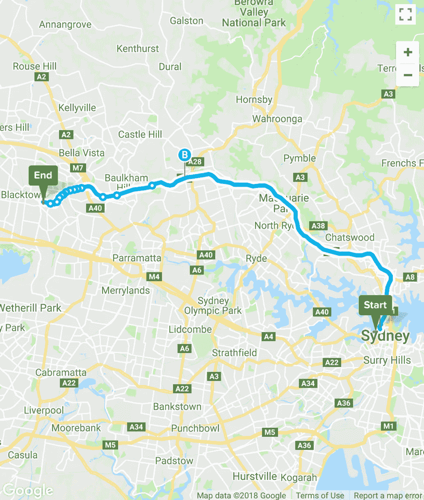
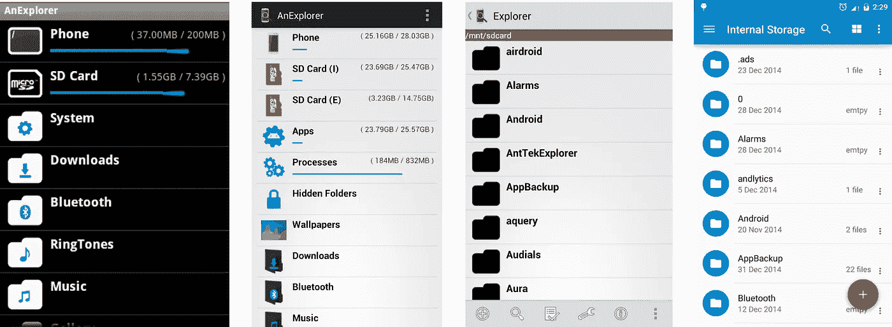
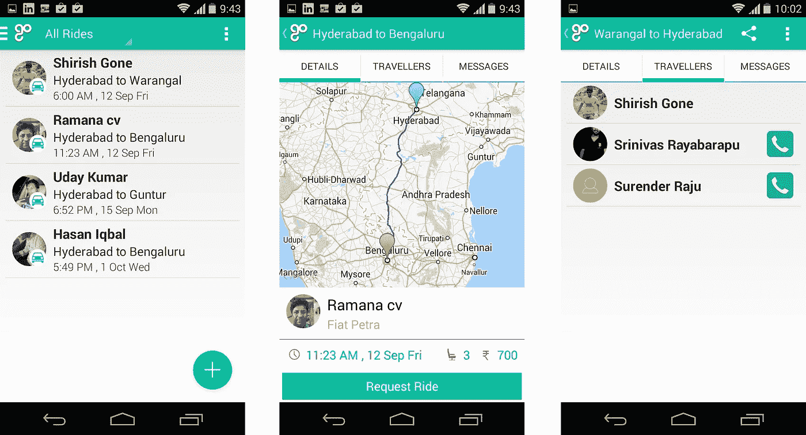
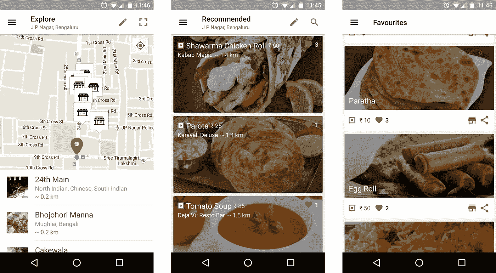
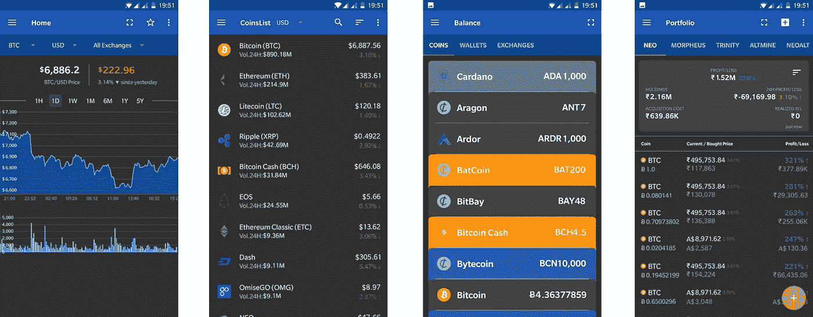

# 独立黑客之旅:到最后，只是命运吗？

> 原文：<https://medium.com/hackernoon/indie-hackers-journey-at-the-end-is-it-just-destiny-50659f157d6a>

Photo by [Danica Tanjutco](https://unsplash.com/@danidums?utm_source=medium&utm_medium=referral) on [Unsplash](https://unsplash.com?utm_source=medium&utm_medium=referral)

你们中有多少人相信自己会处于相同的人生阶段，会成为今天的自己，尽管到目前为止发生的所有重大决策和事件都与此相反？

我的旅程始于十年前，但当时我从未想过我会喜欢做我今天做的事情。在过去 10 年的每个阶段，我都做出了不同的选择，因为我坚信不要随大流。

当我刚从大学毕业并获得计算机科学学位时🎓，我很热情。对于软件工程师来说，这也是一个非常艰难的时期，正如 [**大衰退**](https://www.investopedia.com/terms/g/great-recession.asp) 。如果你有幸无知，或者你只是一个在学校玩电子游戏的孩子，那么你可以在这里阅读更多关于它的内容。现在我回头看，从那时到今天，当我把那些不是“又是一天”而是对我来说非常重大的决定联系起来时，它们最终把我带入了一个我一直想进入或做到的阶段？为了给你一个更好的视角，我将告诉你我的**点**的故事。是的，有不少点！

# dot 1—2009 年 7 月

不知是幸运还是不幸，在我毕业前一年，一家跨国公司给了我一份工作。由于经济衰退，在我毕业后，我没有被要求接受大学时提供给我的工作。所以像其他人一样，我开始寻找新工作。那时创业还不算什么，但我脑子里总是有一些想法。在海得拉巴，2009 年左右，优步刚刚起步，公共汽车是从一个地方到另一个地方最常见/最便宜的交通方式🚍。作为当时安得拉邦的首府，这座被称为“高科技城市”的城市充斥着来自该邦各个角落的年轻失业毕业生。

大约在这个时候，我有了我的第一个问题，需要建立一些东西来解决这个问题。我过去每天都面临一个大问题，那就是记住公共汽车上的路线号码，以及它们可以把你带到哪个地方。谷歌地图和 T2 城市地图之类的应用程序都没有公交路线选项。

something similar i built (not the actual screenshot)

我想，如果我能做一个简单的网站，你只需给出你的目的地，它会显示所有的路线和他们的巴士号码，并在地图上绘制路线。我知道 PHP 是在我做毕业设计的时候学的。我试着用谷歌地图和我手动收集的数据建立一个网站，但不知何故我无法完成它。可以说，这是我第一次失败的[微启动](https://hackernoon.com/tagged/microstartup)😔。我缺乏技能和知识，最重要的是，我缺乏信心去建造我喜欢的东西。我失败了，但是创造我喜欢的东西的火花开始增长。

# dot 2—2009 年 11 月

我失业了，我的大多数朋友也失业了。我知道经济衰退会过去，我会被跨国公司高薪聘用，这只是时间问题(一年左右)。我也知道，在此之前，通过浏览论坛上的所有招聘信息来寻找工作是没有意义的。所以我做的是在谷歌地图上搜索我所在城市附近的当地小型软件服务公司。**是的！**😎你没听错，在谷歌地图上。然后我从谷歌地图上得到了他们网站的链接(很多都没有)。然后我去了所有这些网站，从他们的联系我们页面上收到了电子邮件。我编了一封很简单的求职信邮件(直到 2011 年我才知道它叫什么)，一封一封发给他们。

在大约 120 多封邮件中，我收到了 5-6 封回复😀他上了几所学校，进入了一家规模虽小但不错的咨询公司。我觉得，直到今天，这是我有史以来最艰难和最长的一次面试。我加入时是一名 PHP 开发人员，但一周后，我被要求去学习，那是在 2009 年十月左右。这是发生的非常重要的事情之一。我慢慢学会了建造我喜欢和享受的东西所需的“技能”。我非常喜欢 Android💕，你知道程序员是怎样的吧？在公司，周六是“做你喜欢的事”。我想到了一个 Android 文件管理器的想法。慢慢变得擅长 Android 开发，在这短短的时间里做了三个应用，培训了两个人。4 个月后，我接到了跨国公司的工作邀请。我认为这能让我找到一份更好的工作，所以我接受了这份工作。

# **Dot 3—2011 年 3 月**

所以我白天的工作是在一家很棒的咨询公司，在那里我用 X++(封闭源代码语言)写代码！)为微软 Dynamics 360 作为厂商。大约在这个时候，开始拥抱开源，鄙视闭源语言。

as my skills evolved so did my first app over the years

在接下来的两年里，我慢慢地但稳步地开始做文件管理器，这个想法是我在以前的工作中得到的。我想制造安卓系统中所缺少的东西， [**一个探索者**](https://anexplorer.co) 📁哪个设计更好，并且可以显示文件夹大小！这是我第一次完整而成功的微启动，我第一次创造了我想要的东西。这是我真正学会自己构建软件的地方，从构思到设计再到编码👨🏻‍💻。我发布了它，它在接下来的几个月里有很好的牵引力。我也在 6 个月后发布了无广告版。你喜欢的事情，你应该不断地为之努力，只有这样你才会看到结果。对我来说，花了两年时间，对一些人来说，可能花了两个月，真正的重点是坚持不懈地做你有信心喜欢的事情。我真的很喜欢这次旅行和我所取得的成就。在这家咨询公司的 3 年里，我对 android 的热爱与日俱增。因此，在一个阳光明媚的日子里，我终于辞去了“系统分析师”的工作，开始寻找作为一名 **Android 开发人员**的工作。这个决定把我从一家大公司的平凡小齿轮推进到一家有前途的初创公司的日常司机。

> 我选择了一条人迹较少的路，这让一切变得不同——罗伯特·弗罗斯特

# dot 4—2013 年 3 月

在那之前，我从未接受过 Android 开发人员的采访，这是理所当然的，因为我从未作为一名专业的 Android 开发人员工作过。在过去的 3 年里，我所知道和学习的都是在线和开源项目。作为我自己的贡献，我甚至开源了一个浏览器。经过几次尝试和失败，我最终加入了一家名为 Practo 的小型初创公司，该公司涉足医疗保健领域。在我加入之前有两位工程师。由于我没有专业经验，我不确定我会如何表现，但在一年内，我被提升为团队领导，随着公司的发展，我在 6 个月内被提升为工程经理。我从工程角度处理公司的整个移动体验。

i bult an app to help sales guys called “4s” — from idea to design to coding

与此同时，我总是向产品经理抛出想法和建议，赢得黑客马拉松，在那里我会构思、设计和构建小而有用的应用程序。这确实快速提升了我的技能、对我的信心以及我作为软件工程师的能力。后来事情发生了变化。我所在的初创公司陷入了某种危机，它一再未能聘请到项目经理来推动移动优先战略📱公司的。在那些多次失败的尝试之后，有人找到我，让我接过项目经理的衣钵，从工程转向产品。坦率地说，我非常担心，也有点害怕，但我最喜欢的是挑战。所以我答应了。这是另一个重要的决定，从我在工程领域的职业生涯到开始一个新的产品管理职业生涯。但这又一次让一切变得不同。你必须不时地做出大胆的选择。

# dot 5—2015 年 8 月

在接下来的 3 年里，我作为项目经理，学习并掌握了产品管理，设计用户体验和产品的商业方面。我在公司推出了一款新产品，并在一年内扩大了规模。

carpooling for inter cities — a startup idea i worked on

在此期间，我帮助我的一个朋友 Shirish 创业公司 Gotogether，该公司致力于城际拼车旅行者。我花了大约 4 个月的时间，有空的时候就写代码。没有成功。

embracing failures and learning from my startup idea shifoo

在那之后，我和我的朋友[阿米特·查杰尔](https://medium.com/u/3147eab87541?source=post_page-----50659f157d6a--------------------------------)开始着手另一个创业想法。这个想法是把枯燥的食物菜单变成手机上的智能菜单。我们解决这个问题的方法不是最好的，也不太奏效。我认为这个想法仍然适用。随着时间的推移，我从几次失败中认识到，创业真的不是我的菜。你必须从你的错误和失败中不断学习，不要因为你没有立即看到任何结果而失去希望。

# dot 6—2017 年 7 月

大约在这个时候，我的一个好朋友[阿特耶夫](https://medium.com/u/1a036f298568?source=post_page-----50659f157d6a--------------------------------)向我介绍了比特币。我对加密货币非常着迷，开始小额投资。第一周一切都很好，因为我对一切都很陌生，但在第二周，我开始意识到有这么多问题。交易甚至管理加密货币都不容易。所以我把这件事掌握在自己手中，决定给自己建一个 app。

我休了一周的假，坐在家里不停地编码，七天后发布了 MVP。我知道这听起来如何，但是我使用了来自我的开源项目[a explorer](https://github.com/1hakr/AnExplorer)的样板代码，这使它变得很容易。我想一次开发所有的功能，但是我的产品经理直觉告诉我，我把功能削减到了我认为最重要的前三个(如果没有这三个功能，应用程序将毫无用处)。

while making acrypto, i found my true calling

一路走来，我意识到我不是唯一一个面临这种问题的人，于是我决定把它发表在《谷歌 Play 商店》上。我开始在公司内部分享[的加密本](https://acrypto.io)，并且一炮而红。这帮助我认识到它的潜力。

from novice to a decent designer

这是**和平-高薪**工作对**过山车**。作为一个冒险的爱好者，我选择了我的长期呼吁。我辞掉了工作，决定全职做我的项目。从那以后我再也没有回头。从那以后，它一直呈指数级增长，我也成为了一名全职的独立黑客。简而言之，这就是我从一个崇拜者到一个成功的独立黑客的 10 年历程。我完全独立已经一年了，我仍然不敢相信我做到了这一步😅。我写了一篇详细的文章“ [**为什么辞职是有史以来最好的事情？**](https://hackernoon.com/why-quitting-my-job-was-the-best-thing-ever-6268e71de5db)

这是我过去 10 年中的 6 个重要点，当我现在把它们联系起来时，我意识到了一些惊人的事情。这基本上是写这篇文章的动机。

在每一个阶段，无论是第一次在小公司工作，还是第一次去跨国公司工作，还是第一次在 X++上工作，还是第一次在创业公司做 android 开发人员，还是第一次过渡到产品和管理产品，而不是开发产品，我每次都以抄近路和走完全不同的道路而告终。不管我走哪条路，系统分析师，安卓开发者，工程经理，产品经理。我最终成为了一名独立黑客。我认为这更多的是与我自己的态度和个性有关，而不是与实际的决定有关，现在我想起来，这是长期的，而不是在任何特定的时期。

有人说决定不是永久的，这是真的。我现在的处境并不是因为我选择了一个而不是另一个，而是因为我的个性和我内心深处渴望做的事情。

有时你不得不采取一些跨越式的信念，有时你不得不不断地，始终如一地对你想做的事和想成为的人抱有信念。有时候你必须放弃做你不擅长的事情，有时候你必须做一些与众不同的事情。重要的从来不是你完成的一件大事，而是你做的有时有用但大多数时候无用的小事。最后，你会看到结果，这是和每个人都相关的。

这意味着你正处于人生的同一个阶段，不是因为你迄今为止所做的选择，而是因为你的坚强意志，即使你没有立即看到任何结果，你也坚持相信并尽你所能。所以最终你到达了你一直想成为的那个点，那就是我所说的*。*

*所以简而言之，不要生活在别人设定的模板中，设定你自己的模板或什么的。不要跟随任何事情，只做你喜欢和热爱的事情。YOLO。*

*destiny is what you want*

*我有一个别名，是我名字的缩写，我所有的朋友、同事都叫我这个名字。我的名字是 **Ha** ri **Kr** ishna。我希望我没有辜负这个名字😅。到目前为止，我已经*

*   *[**一个探索者**](https://anexplorer.co)*
*   *[ACrypto](https://acrypto.io)*
*   *[**VisaList**](https://visalist.io)*

*我前面有一个漫长而激动人心的旅程，我不知道它会把我带到哪里，我才刚刚开始…*

**

*“An empty suspension bridge leading to a dense forest” by [Marc-Antoine Dépelteau](https://unsplash.com/@autumnsgrief?utm_source=medium&utm_medium=referral) on [Unsplash](https://unsplash.com?utm_source=medium&utm_medium=referral)*

*所有人！这是 [**HaKr**](https://1hakr.com) 的收尾。感谢你的阅读，如果你觉得这是一本有趣的书，请点击👏这样其他人也能找到它。*

*我制造微型创业汽车，并在可能的时候旅行。如果你觉得这类东西有趣，你可以在 [Twitter](https://twitter.com/1hakr) 上关注我，并在 [GitHub](https://github.com/1hakr) 上查看我的开源作品。*