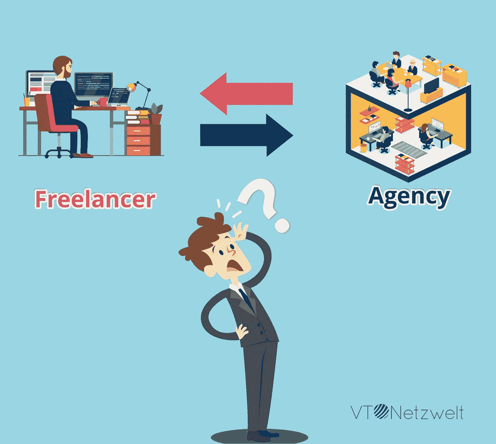

# 外包 IT 服务——自由开发者与专业 IT 公司

> 原文：<https://medium.com/hackernoon/individual-freelancer-vs-agency-all-you-need-to-know-bf24c61f5e08>

为了你的应用程序开发需要，雇佣一个自由职业者或一个代理是明智的吗？

App [开发](https://hackernoon.com/tagged/development)在当今时代已经成为一个多美元的产业。公司和个人都在不断寻找能够创造令人兴奋的应用程序的个人和机构，这些应用程序可以帮助他们在这个应用程序热潮中获利。

事实上，应用程序 rush 正在席卷全球。找到一个合适的应用程序开发者需要付出很多努力，而且也在你的预算之内。你的勤奋和知识会帮助你从平凡中挑出非凡。

只有当你的应用程序是由一个灵巧的开发者开发的，你才能尝到成功的甜头，以免浪费你宝贵的金钱。

*   如果您的公司需要一个应用程序，您可以雇佣一个内部团队，根据需要和要求开发产品。此外，你可以获得一个自由职业者的帮助，他可以与你的内部团队合作，以便根据你的要求创建一个应用程序。
*   第二个选择是你雇佣一家移动应用开发[代理](https://hackernoon.com/tagged/agency)的专家服务。

这两种选择是完全不同的，你必须判断每一种选择的利弊。

雇佣一个自由职业者是一个非常有吸引力的选择，很多企业都走这条路。但是根据统计，80%的企业都面临着诸如自由职业者的可用性，他或她的响应时间，甚至在某些情况下的质量等问题的冲击。

更重要的是，对于大型企业来说，即使是最有才华的自由职业者也无法应对工作压力。自由职业者通常有他们自己执行事情的方式，这可能不适合那些寻找有组织和面向过程的服务提供商的企业。

另一方面，代理基本上是你所有应用需求的一站式解决方案。它提供了效率和统一的力量来实现您的业务目标。他们甚至可以提出灵活的时间表，这样你就可以为你真正需要的资源付费。

为了让你的决定更容易，我们将给出一个关于自由职业者和代理机构的想法，让你做出明智的选择。

**在你选择一个人或机构之前，注意下面提到的一些基本参数-**

*   **自由职业者或代理人的工作质量**

在你雇人去找他们所做的工作之前。一个应用程序充分说明了它的开发者。它类似于一种营销工具。

如果应用程序是草率或过时的，这意味着开发者没有进步和创新的心态。所以，无论你打算雇佣中介公司还是自由职业者，你都必须[审查他们开发的应用程序。这会让你对自己的工作有一个现实的感觉。](https://www.vtnetzwelt.com/portfolio)

如果代理机构或自由职业者只在构建简单的应用程序方面有经验，如果你在寻找复杂的东西，不要给他们增加负担。

只要确保你的愿景与候选人的经历相匹配。此外，请记住这一点，代理机构遵循标准化的测试程序，而自由职业者通常进行自我测试，这可能不是很准确。

有了代理，你就有了整个团队为你工作的好处。如果开发人员在某个地方陷入困境，团队中会有其他人帮助他摆脱困境。然而，一个好的开发人员就是一个好的开发人员，不管他是独立工作还是在代理公司工作。

*   **工作范围**

通常，自由职业者会根据你的需求为你提供解决方案。这促使你需要完全理解你想要的技术规范。

如果你不清楚，那么结果就不会达标。因此，如果你提供的规格有任何滞后，自由职业者永远不会建议你做一些不同的事情。

另一方面，代理机构的工作方式不同。他们将指导你如何完成产品可能会形成。

这类似于在电影中工作，工作不仅仅是你在屏幕上看到的演员，而是许多人的集体努力，如设计师、创意总监、制片人等。

当一个团队自始至终通力合作，最后的结果简直是辉煌。独立工作者过于投入工作，无法理解最终结果的缺点。

此外，你不能期望一个人在所有方面都是最好的，比如 UX 设计、UI 设计、 [iOS 开发、Android 开发](https://www.vtnetzwelt.com/mobile-app-development)等等。

*   **发布后协助**

代理机构比独立工作者提供更好的发布后支持。这是因为代理商通常有一个单独的部门处理客户的所有售后查询。

这并不是说自由职业者会拒绝你的支持，但很可能他或她时间紧迫。

代理机构通常会提供其团队在任何发布后支持方面可用性的完整详细信息。这一点在合同中有明确提及。

一个应用程序需要不断升级，以提供卓越的用户体验，这只有在你与团队合作时才有可能。

大多数机构提供某种担保或发布后保证。他们预测操作系统更新，并在用户开始抱怨之前向应用程序所有者提供同样的服务。

自由职业者绝不可能向应用程序所有者提供同样水平的服务。

*   **可用性**

对于自由职业者来说，要记住的一个非常重要的点是他们的可用性。很有可能当你需要一个人的时候，他可能在那个时候不在，因此，你的项目不得不受到影响。

但是，有了代理，当需要的时候，你总会有一个团队来开发你的应用程序。

*   **体验**

任何一家普通的经纪公司都比自由职业者拥有更多的经验，因为团队中有更多的人。

一个自由职业者有太多的角色要扮演，所以你很可能得不到专家服务。

*   **花费的金钱和时间**

自由职业者很可能会在更短的时间内完成你的项目。代理机构通常需要较长的交货时间。但是，最终，你想要的只是质量。

此外，就定价而言，自由职业者向你收取的费用可能比代理机构低，因为间接成本相对较少。

一个代理公司有一个团队为你工作，所以他们肯定会向你收取更多的费用。

最后一个电话是你的，无论你是在有限的预算下工作，你只是需要一个没有太多规格的工作应用程序，还是需要一个复杂的应用程序来满足用户的广泛需求。

代理机构为你招揽的客户越多，收费就越高。他们为您提供各种各样的服务，并确保他们有效地提供结果。

所以，如果你手头有足够的资源，不要让价格因素左右你对自由职业者的决定，因为它可能没有你预期的那么好。

*   **一致性**

与代理合作的最大好处是，你将获得一致的最终产品，因为他们的整个团队将朝着预期的结果努力。

所以，基本上你最后得到的是一个准备好发布的应用程序。然而，自由职业者不能提供类似水平的一致性，因为很难协调不同的人被选中参加类似的项目。

当你为一个特定的项目雇佣自由职业者时，你真的必须努力工作并小心谨慎，以希望获得一致的产品。

# 风险

和一个自由职业者以及一个代理机构一起工作会让你面临不同的风险。

**自由职业者的风险**

1.  项目延期完工的风险更大。万一只有一个人负责所有部门，他或她可能对你的项目不够重视。
2.  最终产品有缺陷的风险更高。这可能是由于缺乏经验，甚至负担过重。
3.  你有可能不得不重新开始。如果和你一起工作的自由职业者“跳槽”去做一份全面的工作，你就别无选择了。

**代理机构的风险**

1.  与自由职业者相比，代理相对“更贵”。一个机构有不同的人为你工作，比如项目经理、销售团队、设计师、开发人员、质量保证团队等。是你为他们所有人支付费用，但不是他们在项目中的实际参与和持续时间。
2.  一个机构可能不会同意你所说的一切。一些代理机构拒绝不符合其范围的额外服务，即代理机构只专注于软件开发而不是其推广，在这种情况下，他们不会为您提供开发的应用程序推广服务。尽管这使他们专注于他们提供的特定服务。

但是，如果你看到更大的图景，建议你与团队合作，而不是依赖于个人表演。

此外，一个团队无疑会为你手头的项目提供全面的专业知识。

一个机构永远不会转移到一个新的工作，让你被困在中间。简而言之，一个团队将确保你在任何时候都有一个后盾。

*   **灵活性**

自由职业者提供了更多的灵活性，因为他们甚至愿意在非正常时间工作，但这可能会危及你的项目质量。

要想成功，遵循固定的工作模式以避免低效是至关重要的。即使自由职业者通常没有问题，甚至调整你的项目的时区，你也不能确定最终的产品。

代理机构的目标是以系统的方式为您提供一流的服务。所以你不能把他们有序的工作方式说成是缺乏灵活性。

**在雇佣中介公司之前，你应该问他们的一些问题**

*   你从事这个行业多久了？
*   对于手头的项目，你采用什么方法？
*   你的项目管理策略是什么？
*   你一天会花多少时间在我的项目上？
*   你的平均送货时间是多少？
*   你们提供发布后支持吗？
*   你能给这个项目一个大概的报价吗？

只有当你对所有这些问题都得到满意的答复时，你才应该去雇佣一家代理公司。

最好一开始就把所有的事情都搞清楚，以避免以后出现任何差异。一个代理机构有合适的人员组合来根据你的需要提供给你东西。

此外，你会得到正确的指导，因为代理机构要维护自己的声誉。他们不遗余力地在行业中树立自己的名声和地位。

**结论**

你的公司是雇佣一个自由职业的应用开发者，还是让一个团队为你的项目工作，这完全是你的决定。

上面提到的参数会帮助你决定走哪条路。只要确保你雇佣的开发人员拥有开发应用程序的专业知识，以免你浪费金钱。他应该能够测试应用程序，也审查代码。

当你进入一家代理公司时，有一个团队可以处理应用程序开发的所有方面。这可以最大限度地减少你在小问题上的头痛。但是，如果你不愿意花很多钱，那么雇佣一个自由职业者并与他合作是有意义的，这样你就可以在规定的预算内获得一个应用程序。

一天结束时，不管你的应用程序是由代理公司还是自由职业者制作的，过程都是一样的。

需要类似水平的专业知识，同样的步骤需要建立应用程序。所以，如果你想要一个成功的产品和体验，请雇佣业内最好的人。

自由职业者和专业机构都有优点和缺点，所以它缩小到你的项目要求。如果你的项目庞大而复杂，不要犯与自由职业者合作的错误，因为合作团队会毫不犹豫地为你提供更好的结果。

你可能也喜欢阅读— [错误的技术合作伙伴如何让你的创业失败](https://www.linkedin.com/pulse/how-wrong-tech-partner-makes-your-start-up-fail-ravi-sharma/)

找专家建议？参观— [VT Netzwelt](https://www.vtnetzwelt.com)