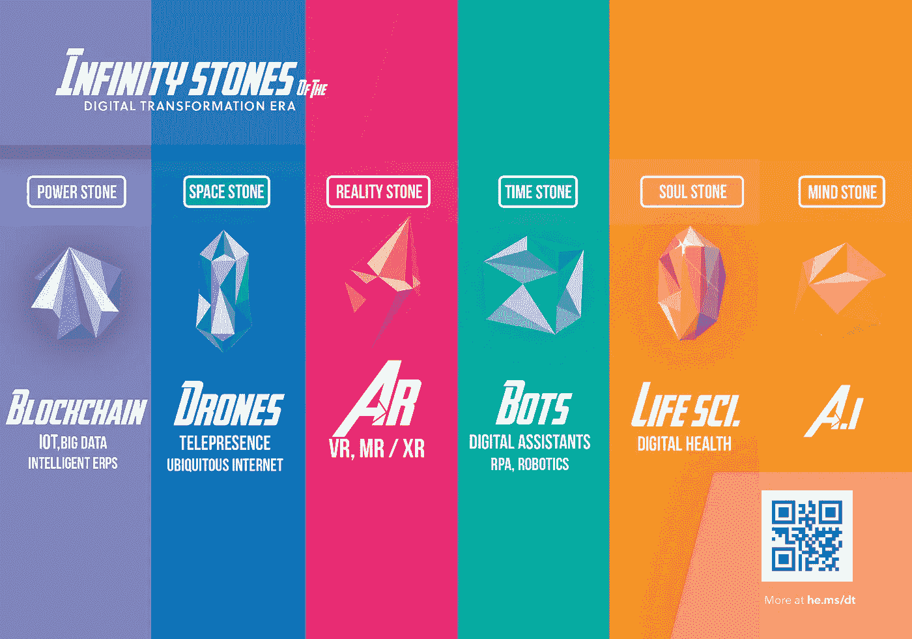
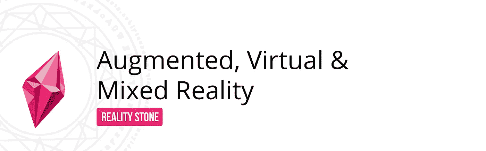
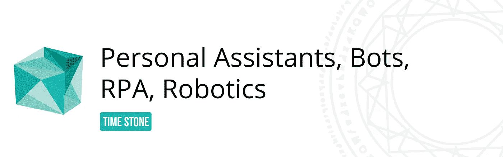
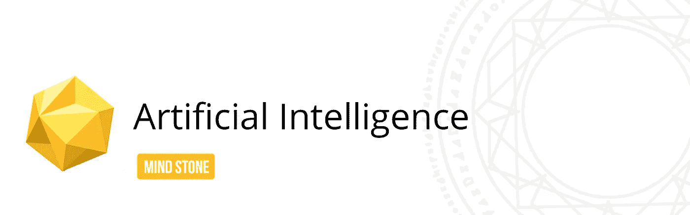
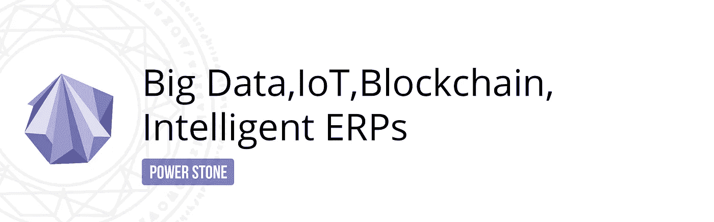
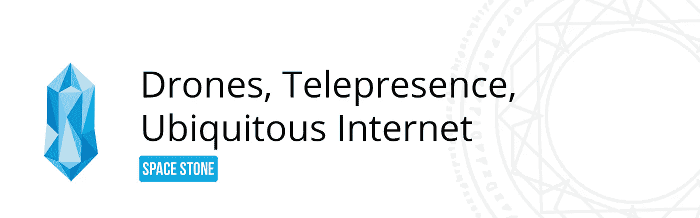
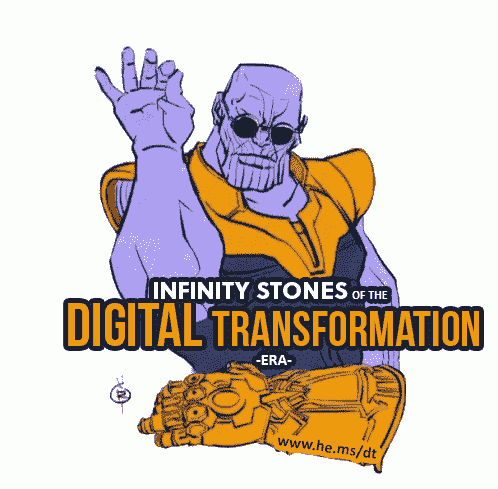

# 💎无限的石头，你现在就可以拥有而不用和灭霸战斗！—了解最新的数字化转型技术

> 原文：<https://medium.com/hackernoon/infinity-stones-that-you-can-posses-right-now-without-fighting-thanos-digital-transformation-tech-deb70bc6d2c1>

不是每个人都渴望成为一个紫色的泰坦巨人，带着无限长的手套疯狂地摧毁半个宇宙。我仍然相信，相当一部分人希望经营有利可图的企业，让他们的客户满意。然而，无论是灭霸还是你的企业，一个科技假体都不可避免地会加速这场游戏。让我们来看看数字[转型](https://hackernoon.com/tagged/transformation)时代的无限基石，并分析它如何成为您企业的潜在增值！

R ***现实之石*** *授予你对现实本身的支配权，你将能够把棉花糖变成石头或者把你的老板变成一袋薯片。*

[数字现实(DR](https://www.linkedin.com/pulse/escaping-flatland-using-augmented-virtual-reality-hemchander-s/) )，AR、VR & MR 的统称，通过在我们的现实世界上叠加信息，提供了操纵现实的方法。AR/MR 通过投影虚拟物体来实现，如地图、音乐播放器、建筑物的 3D 模型、汽车等。就像全息图一样，就在我们面前。

而 VR 则完全让我们沉浸在一个虚拟的环境中。通过改变现实，灾难恢复在 B2B 和 B2C 领域有着巨大的应用。灾难恢复已经被应用于教育、医疗保健、空间、营销、新闻、旅游、房地产、汽车、零售等领域。，仅 AR/VR 方面的总支出预计到 2021 年[**【1600 B】美元**](https://www2.deloitte.com/insights/us/en/focus/tech-trends/2018/immersive-technologies-digital-reality.html) **！**

T ***ime 石*** *，顾名思义，让你掌控时间。你可以倒带，冻结它或创建有趣的时间循环。*

由数字助理( [**)驱动的自动化。到 2021 年**](https://www.statista.com/statistics/589079/worldwide-virtual-digital-assistants-consumer-market/) ，机器人和机器人减少了重复性任务，甚至变得足够聪明，可以复制某些人类水平的任务。[谷歌双工](/@LanceUlanoff/did-google-duplex-just-pass-the-turing-test-ffcfe6868b02) ***能代表你预约*** 像真人一样交谈！随着 Alexa 技能**每年翻一番**，手动任务正以更快的速度被抽象化。

**70%到 80%** 基于规则的业务流程已经可以使用机器人流程自动化(RPA)实现自动化— [**【到 2021 年市场价值 29 亿美元**](https://www.forrester.com/report/The+RPA+Market+Will+Reach+29+Billion+By+2021/-/E-RES137229) 。机器人已经取代了工厂、仓库和 T21 的劳动力，并且正在取代厨师、咖啡师和仆人等。到 2024 年，这个市场预计将达到 1300 亿美元，并得到软银等企业集团的大力支持，这些企业集团愿意尽快将其商业化。仅美国就投资了**7320 亿**美元在[机器人股票](https://futurism.com/the-u-s-has-732-billion-invested-in-robotics-stock/)上！

M ***ind 石头*** *可以用来控制别人的思想。也可以很大程度上增加持用者的智力。*

与普遍认为我们是人工智能的活靶子相反，我个人认为这是人类不可避免的升级。这十年的主要剧变之一是人工智能的*民主化，这使得敢于冒险的开发者/非专业用户成为它的直接受益者。人工智能市场预计到 2025 年约为 190 亿美元。*

*从搜索引擎到自动驾驶汽车再到 ERP，人工智能都扮演着重要的角色。为了让机器做出智能决策，它需要数据。我们人类，由于我们的存在，已经创造了无数的数据集。随着各种可穿戴设备和智能万物方法的出现，数据质量每天都在提高。*

*在商业领域，人工智能已经在对话式企业资源规划、防止欺诈、提供 24/7 支持、丰富的见解、网络安全等方面得到应用。ERP 巨头 SAP 已经在其 ERP(S/4 HANA Cloud)&[CRM(C/4 HANA)](https://www.zdnet.com/article/sap-unveils-c4hana-aims-to-revamp-crm-leverage-its-erp-base/)解决方案中采用了人工智能。Salesforce 拥有[爱因斯坦](https://www.computerworlduk.com/cloud-computing/how-salesforce-embeds-ai-across-its-product-range-3677724/) & Oracle 拥有自适应智能应用程序来支持其 ERP 套件！*

**

*力量石 *赋予持用者巨大的力量和耐久性。它也放大了其他无限宝石的力量！**

*从健身追踪器到大规模企业，一切都会产生数据。随着时间的推移，它的质量会越来越好。它所能提供的数据广度和知识财富使它变得极其强大。于是就需要**大数据** [**(到 2021 年 66 B 的市场)**](https://www.marketsandmarkets.com/PressReleases/big-data.asp) 去挖掘那隐藏的财富。*

*[**区块链**](https://www.linkedin.com/pulse/why-2018-could-year-blockchain-hemchander-s/)——从金融交易到公证文件的应用，强化了数据的真实性和信任度。到 2025 年 ，区块链预计将为企业提供[1760 亿美元的增值。](https://www.gartner.com/doc/3627117/forecast-blockchain-business-value-worldwide)*

***数字孪生**概念让我们创建真实世界产品、流程或服务的虚拟复制品。新加坡有自己的数据丰富的数字孪生兄弟，主要用于城市规划决策。我个人认为，数字双胞胎将是未来的常态，从而使我们能够获得**“完美信息”**——随时随地了解任何事情&。到 2022 年，底层物联网市场的估值为[**【5600 亿美元】**](https://www.marketsandmarkets.com/PressReleases/iot-m2m.asp) **！***

*ERP 的未来正在向使用数据分析有效优化业务流程和运营的方向倾斜。智能的/聪明的/聪明的/无论听起来如何的——ingenius ERP 正在崛起，并将极大地影响到 2021 年 800 亿美元的市场。所有上述途径都引出了一句老话——“数据是新的石油”！*

**

*S***pace stone****，顾名思义，让你掌控空间。你可以创造入口，从宇宙的一部分跳到另一部分，并以非凡的速度旅行！**

*互联网是一个强大的媒体，它使网络空间。 [**Jio**](https://gadgets.ndtv.com/telecom/features/jio-10-ways-the-indian-telecom-industry-changed-after-jio-started-operations-1746342) 清醒地认识到这一点，并在全国范围内铺开了超廉价的 4G 网络。它提供了更好的免费语音通话连接，每 GB 数据成本降低了 100 倍。通过解决连接部分，Jio 正在成为数字化转型的催化剂&预计在 2 到 5 年内[**【160 亿美元】**](http://www.bgr.in/news/reliance-jios-revenues-could-reach-16-billion-in-2-5-years/) 。网飞 CEO 雷德·哈斯汀斯甚至提到[每个国家都需要一个 Jio](https://qz.com/1226577/netflix-ceo-reed-hastings-says-every-country-needs-its-own-reliance-jio-boost/) ！数字经济已经从 Jio 后的印度市场上看到了巨大的增长，人们能够在线访问大量的资源！*

***特斯拉**有[类似但更大的计划](https://www.express.co.uk/news/science/919947/space-launch-starlink-satellites-internet-network-elon-musk)提供全球无处不在的互联网&也获得了[绿色信号](https://techcrunch.com/2018/03/29/fcc-approves-spacex-plan-for-4425-satellite-broadband-network/)！截至 2018 年， [958 架**无人机**登上《时代》杂志封面](http://www.thedrive.com/tech/21247/time-magazines-drone-issue-and-the-958-uavs-that-created-its-cover)。无人机的使用案例从自拍到做 CPR，预计到 2023 年将是一个[**【500 亿美元的市场**](https://www.marketsandmarkets.com/PressReleases/commercial-drones.asp) 。网真(到 2023 年市场价值 80 亿美元)获得了重大升级——立体 3D 捕捉，可能是 holo lens/其他现实耳机最广泛的应用。这是我们得到的最接近于"**把我传送上去**，**斯科特**"的选择！*

**

*S ***灵魂石*** *授予生命统治权&死亡。它也充当了一个被称为灵魂世界(被困灵魂居住的地方)的袖珍宇宙的入口**

*忘记灵魂陷阱吧，在两个世纪前，对付轻微的咳嗽是生死攸关的事情！幸运的是，情况变了&医疗变得更好了。仅医疗保健可穿戴市场在过去 3 年就增长了 20 倍，到 2021 年(T5)，其价值将达到 180 亿美元(T2，t 3，T4)。*

*移动医疗- **“移动医疗”**应用为患者提供即时、低成本&的直接护理，预计到 2020 年将成为一个**500 亿美元**的市场！随着 28%的中国人&和 26%的印度人拥有互联健康，互联健康正成为常态。最近，谷歌&苹果[发布了几个功能](https://www.firstpost.com/tech/news-analysis/google-io-2018-android-p-comes-with-digital-wellbeing-to-help-you-reduce-excessive-smartphone-usage-4462941.html)确保你不会在手机上花太多时间。*

*“数字的你”可以通过解开你的基因组来创造，这可以揭示关键的洞察力并预测可能的疾病。有趣的是，在过去的十年里，测序成本下降了 1 万倍！*

*该领域值得一提的一些项目包括谷歌 Calico 项目(逆转衰老)、用于血糖水平监测的纹身传感器、 [3D 打印角膜以对抗失明](https://thenextweb.com/science/2018/05/30/researchers-create-the-first-3d-printed-corneas-to-combat-blindness/)和[其他有趣的基于传感器的应用](https://www.theverge.com/2018/5/25/17394806/sensor-gut-hand-teeth-biology-disease-health)。*

*我是思想实验的超级粉丝，我相信你(是的，你！你就在那里！)有独特的想象力。你认为这些强大的无限宝石的潜在候选物是什么？*

*请随意与你的朋友和同事进行这个思想实验，并在评论区分享你的想法！*

> *📝感谢 [Mahalakshmi Kannuchamy](https://medium.com/u/b93377fe58dc?source=post_page-----deb70bc6d2c1--------------------------------) 耐心编辑这篇文章！*

*分享就是关爱！[点击这里在 LinkedIn](https://www.linkedin.com/shareArticle?mini=true&url=https://cdn-images-1.medium.com/max/1125/1*d2jR9CUCNGiSHbarvQI4vA.png&summary=Infinity%20stones%20of%20the%20Digital%20Transformation%20Erahttps://medium.com/@hemchander/infinity-stones-that-you-can-posses-right-now-without-fighting-thanos-digital-transformation-tech-deb70bc6d2c1%20%20%23AR%20%23VR%20%23MR%20%23DR%20%23ArtificialIntelligence%20%23AI%20%23ERP%20%23C4HANA%20%23S4HANA%20%23BigData%20%23IOT%20%23Robotics%20%23Bots%20%23RPA%20%23Blockchain%20%23IntelligentEnterprise%20%23DigitalTwin%20%23Telepresence%20%23Drone%20%23UAV%20%23lifescience%20%23digitalhealth%20%23google%20%23apple%20%23mhealth%20%23tesla%20%23jio%20%234g%20%23ubiquitous%20%23wearable%20%23tracker%20%23digitaltwin%20%23waymo%20%23softbank%20%23bostondynamics%20%23machinelearning%20%23thanos%20%23SAP) 、 [Pinterest](https://pinterest.com/pin/create/button/?url=https%3A//medium.com/%40hemchander/infinity-stones-that-you-can-posses-right-now-without-fighting-thanos-digital-transformation-tech-deb70bc6d2c1&media=https%3A//cdn-images-1.medium.com/max/1125/1*d2jR9CUCNGiSHbarvQI4vA.png&description=The%20Modern%20Infinity%20stones%20of%20the%20Digital%20Transformation%20Era%20-%20The%20Good%20thing%20is%20you%20don't%20have%20to%20fight%20Thanos%20to%20get%20them.%20I%20have%20curated%20the%20latest%20and%20greatest%20of%20the%20Digital%20Transformation%20technologies%20and%20mapped%20them%20to%20the%20Marvel%20Infinity%20stones.%20Check%20this%20out%20!%20%23AR%20%23VR%20%23MR%20%23DR%20%23ArtificialIntelligence%20%23AI%20%23ERP%20%23C4HANA%20%23S4HANA%20%23BigData%20%23IOT%20%23Robotics%20%23Bots%20%23RPA%20%23Blockchain%20%23IntelligentEnterprise%20%23DigitalTwin%20%23Telepresence%20%23Drone%20%23UAV%20%23lifescience%20%23digitalhealth%20%23google%20%23apple%20%23mhealth%20%23tesla%20%23jio%20%234g%20%23ubiquitous%20%23wearable%20%23tracker%20%23digitaltwin%20%23waymo%20%23softbank%20%23bostondynamics%20%23machinelearning%20%23thanos%20%23SAP%20%23design%20%23poster%20%23art) 或 [facebook](https://www.facebook.com/sharer/sharer.php?u=https%3A//medium.com/%40hemchander/infinity-stones-that-you-can-posses-right-now-without-fighting-thanos-digital-transformation-tech-deb70bc6d2c1) 上分享这篇文章。*

**