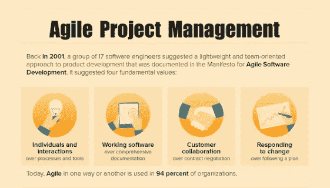

# [信息图表]敏捷项目管理方法

> 原文：<https://medium.com/hackernoon/infographic-agile-project-management-methods-8d3852ee4dfc>

我们在白皮书中广泛地介绍了[敏捷开发方法和手段](https://www.altexsoft.com/whitepapers/agile-project-management-best-practices-and-methodologies/?utm_source=MediumCom&utm_medium=referral)。如果你不知道基本知识，可以先检查一下论文。在这里，我们简要回顾一下敏捷中使用的主要方法。

# 来源:

1.  职业脉搏 2017—[http://www . PMI . org/-/media/PMI/documents/public/pdf/learning/think-leadership/pulse/pulse-of-the-Profession-2017 . pdf？sc_lang_temp=en](http://www.pmi.org/-/media/pmi/documents/public/pdf/learning/thought-leadership/pulse/pulse-of-the-profession-2017.pdf?sc_lang_temp=en)
2.  Gartner 词汇表:项目管理—【https://blogs.gartner.com/it-glossary/project-management/ 
3.  管理大型软件系统的开发—[http://www-SCF . USC . edu/～csci 201/lectures/lectures 11/royce 1970 . pdf](http://www-scf.usc.edu/~csci201/lectures/Lecture11/royce1970.pdf)
4.  第 11 次年度敏捷状态报告—[https://explore . version one . com/State-of-Agile/version one-第 11 次年度敏捷状态报告-2](https://explore.versionone.com/state-of-agile/versionone-11th-annual-state-of-agile-report-2https://explore.versionone.com/state-of-agile/versionone-11th-annual-state-of-agile-report-2)
5.  新产品开发游戏—[https://HBR . org/1986/01/the-new-新产品开发游戏](https://hbr.org/1986/01/the-new-new-product-development-game)
6.  迭代和增量开发:简史—[https://www . cs . UMD . edu/~ basili/publications/journals/j90 . pdf](https://www.cs.umd.edu/~basili/publications/journals/J90.pdf)
7.  敏捷软件开发宣言—[http://www.agilemanifesto.org/](http://agilemanifesto.org/)
8.  Scrum 指南—[http://www . Scrum guides . org/docs/Scrum Guide/v 2016/2016-Scrum-Guide-us . pdf # zoom = 100](http://www.scrumguides.org/docs/scrumguide/v2016/2016-Scrum-Guide-US.pdf#zoom=100)
9.  面向对象编程、系统、语言和应用—[http://www.sigplan.org/Conferences/OOPSLA/](http://www.sigplan.org/Conferences/OOPSLA/)
10.  2017 年 Scrum 报告状态—[https://www . Scrum liance . org/Scrum/media/ScrumAllianceMedia/Files % 20 和% 20 pdf/State % 20 of % 20 Scrum/State 0 fs crum _ 2016 _ final . pdf？aliId=261272923](https://www.scrumalliance.org/ScrumRedesignDEVSite/media/ScrumAllianceMedia/Files%20and%20PDFs/State%20of%20Scrum/State0fScrum_2016_FINAL.pdf?aliId=261272923)
11.  丰田生产系统—[http://www . Toyota-global . com/company/vision _ philosophy/Toyota _ Production _ System/](http://www.toyota-global.com/company/vision_philosophy/toyota_production_system/)
12.  Gartner 词汇表:双峰—【https://www.gartner.com/it-glossary/bimodal/ 
13.  双峰 IT[—http://www1 . software ag . com/corporate/images/SAG _ Bimodal _ IT _ 8PG _ WP _ aug 16-Web _ TCM 16-143391 . pdf](http://www1.softwareag.com/corporate/images/SAG_Bimodal_IT_8PG_WP_Aug16-Web_tcm16-143391.pdf)
14.  波普迪克—[http://www.poppendieck.com/](http://www.poppendieck.com/)
15.  精益软件开发:敏捷工具包—[http://ptg media . Pearson CMG . com/images/9780321150783/sample pages/0321150783 . pdf](http://ptgmedia.pearsoncmg.com/images/9780321150783/samplepages/0321150783.pdf)
16.  测试驱动开发指南—[https://msdn . Microsoft . com/en-us/library/aa 730844(v = vs . 80)。aspx](https://msdn.microsoft.com/en-us/library/aa730844(v=vs.80).aspx)
17.  加强结对编程的必要性—[http://www.cs.utah.edu/~lwilliam/Papers/ieeeSoftware.PDF](http://www.cs.utah.edu/~lwilliam/Papers/ieeeSoftware.PDF)
18.  结对编程:如何入门—[https://www . IBM . com/devo PS/method/content/code/practice _ pair _ programming](https://www.ibm.com/cloud/garage/content/code/practice_pair_programming/)
19.  极限编程:温柔的介绍—[http://www.extremeprogramming.org/index.html](http://www.extremeprogramming.org/index.html)

*原载于 AltexSoft Tech 博客****’***[***‘敏捷项目管理方法’***](https://www.altexsoft.com/infographics/agile-project-management-methods/?utm_source=MediumCom&utm_medium=referral)