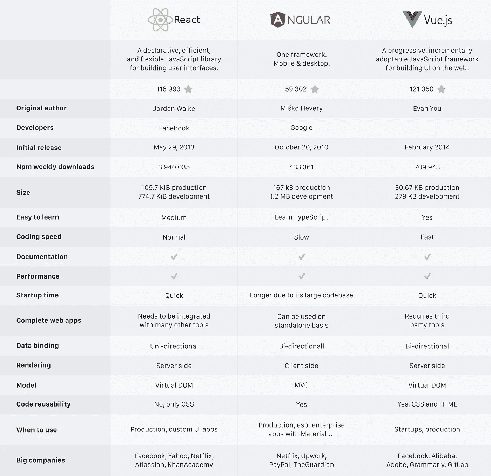
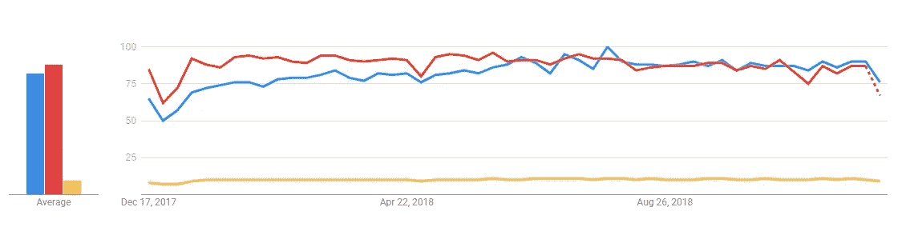

# 信息图:React vs Angular vs Vue.js

> 原文：<https://medium.com/hackernoon/infographic-react-vs-angular-vs-vue-js-3fdb602895e1>


虽然 Angular 可以用来构建组件，但它还附带了其他工具，可以用来构建完整的 web 应用程序。多亏了 Angular，开发人员可以构建单页面应用程序。与 Angular 不同，React 是一个 JavaScript 库，而不是一个框架。React 用于构建可重用的 UI 元素。Vue 是一个类似 Angular 的框架。然而，它并不具备所有使其轻便的功能。Vue 可以用来构建完整的组件驱动的应用程序。



# 装置

## 有角的

要安装 Angular，请执行以下操作:

```
git clone https://github.com/angular/quickstart.git quickstart cd quickstart npm install npm start
```

要安装 Angular CLI(命令行界面),请使用以下命令:

```
npm install -g @angular/cli
```

# 装置

## 有角的

要安装 Angular，请执行以下操作:

```
git clone https://github.com/angular/quickstart.git quickstart
cd quickstart
npm install
npm start
```

要安装 Angular CLI(命令行界面),请使用以下命令:

```
npm install -g @angular/cli
```

## 反应

React 可以使用下面的 NPM 命令进行安装:

```
npm install react --save
```

要安装 React CLI，您可以使用 Create-React-App，如下所示:

```
npm install -g create-react-app
```

## 某视频剪辑软件

可以使用下面的 NPM 命令安装 Vue:

```
npm install vue
```

可以使用以下命令安装 Vue CLI:

```
npm install -g @vue/cli
```

# 示例代码

## 角度:

```
import { enableProdMode } from '@angular/core';
import { platformBrowserDynamic } from '@angular/platform-browser-dynamic';
import { AppModule } from './app/app.module';
import { environment } from './environments/environment';
if (environment.production) {
enableProdMode();
}
const bootstrapPromise =  platformBrowserDynamic().bootstrapModule(AppModule);
// Logging bootstrap information
bootstrapPromise.then(success => console.log(`Bootstrap success`))
.catch(err => console.error(err));
```

从 [**这里得到的代码片段**](https://github.com/gothinkster/angular-realworld-example-app) 。

## 反应

```
import * as React from "react";
import { Component } from 'react';
import './App.css';
import * as logo from './logo.svg';
class App extends Component {
           render() {
            return (
            <div className="App">
                        <div className="App-header">
                       
                      <h2>Welcome to React!</h2>
                      </div>
                      <p className="App-intro">
                     To get started, edit
                      <code>src/App.js</code>
                       and save to reload.
                      </p>
          </div>
          );
            }
}export default App;
```

从[这里的](https://github.com/fuse-box/react-example) 得到的代码片段。

## 某视频剪辑软件

```
new Vue({
el: '#editor',
data: {
input: '# hello'
  },
  computed: {
   compiledMarkdown: function () {
   return marked(this.input, { sanitize: true })
  }
},
  methods: {
  update: _.debounce(function (e) {
    this.input = e.target.value
   }, 300)
 }
})
```

从 [**这里得到的代码片段**](https://vuejs.org/v2/examples/)

# 谷歌趋势

世界范围内的兴趣。



每个框架和库都有自己的优点和缺点。因此，问题是为特定的产品选择正确的软件工具。

[*安东·沙利尼科夫*](https://www.linkedin.com/in/anton-shaleynikov-45812a1/) 撰写