# 无服务器松弛展开的信息警报

> 原文：<https://medium.com/hackernoon/informative-alerts-with-serverless-slack-unfurling-acb6457e3a59>

## 了解如何使用 Node.js、Serverless.js 和 AWS Lambda 将重要信息附加到松弛消息中

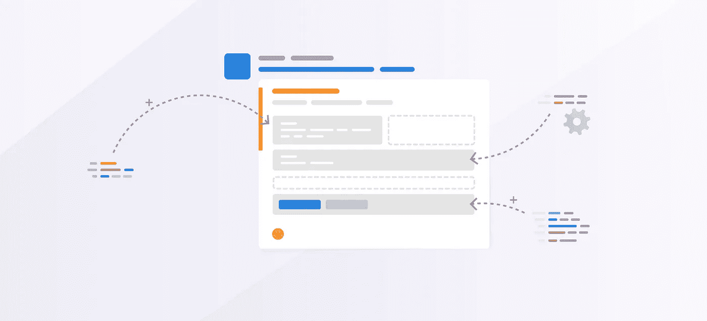

当你复制和粘贴一个链接时,会显示大量的细节。继续粘贴[一个来自媒体](https://engineering.opsgenie.com/4-advantages-of-using-java-with-aws-lambda-21c0dc539de3)的链接。您会看到类似这样的内容:

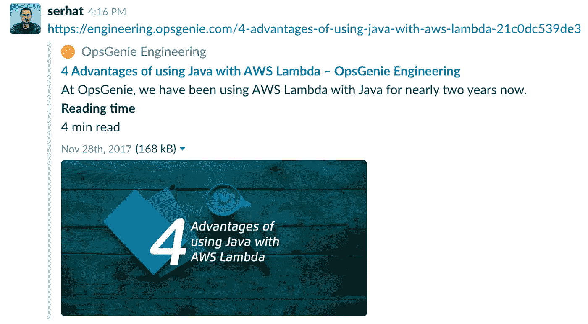

Slack attaches details to your messages. This is called unfurling.

这在 Slack 中被称为“链接展开”。对于一些消息，Slack 会自动完成这项工作(经典的展开)，并附上一些非常漂亮的细节，比如“阅读时间”。好消息是，你也可以这样做你的链接！当您需要更多信息或需要从需要用户批准/身份验证的受保护源中检索数据时，这尤其有用。在这种情况下，您需要稍微动手，构建自己的 Slack 应用程序。

在这篇博客文章中，您将通过一个真实的例子一步一步地学习如何构建自己的 Slack 展开应用程序。当您共享 OpsGenie 警报的链接时，我们会将详细信息附加到您的 OpsGenie 警报中。

对于那些不熟悉的人来说， [OpsGenie](https://www.opsgenie.com/?utm_source=medium&utm_medium=hackernoon) 是一款面向 DevOps 和 ITOps 团队的事件和随叫随到管理解决方案。我们将在这个例子中使用 OpsGenie，因为我们有使用它的集成和 API 的经验。我们还认为，当您复制和粘贴链接时，查看警报详细信息非常有用，可以减少应用程序之间的上下文切换。

## 设置您的环境

在我们深入开发细节之前，让我们先准备好您的开发环境。首先，您需要 AWS、Slack 和 OpsGenie 帐户来运行这个项目。

我们为这个项目选择了无服务器(AWS Lambda)计算服务，因为它的价格是按触发付费的，我们不需要关心维护。对于这种可能有少量请求的应用程序来说，这很有意义。

我们将使用 Lambda，AWS 的 API 网关服务，Node.js 作为语言，Serverless.js 用于部署项目。

我将跳过 npm 和 Node.js 安装。你可以谷歌一下——:D，不要忘记安装 Node.js v6.10 或更高版本，因为这是我们将在 AWS Lambda 中使用的版本，因为它是最新支持的版本。要安装 Serverless.js，请运行:

```
npm install -g serverless
```

## 松弛展开流是如何工作的？

当我们完成了初始设置，是时候了解这个项目的流程了。通过跟踪图上的数字，您可以了解我们的应用程序流程是如何工作的。

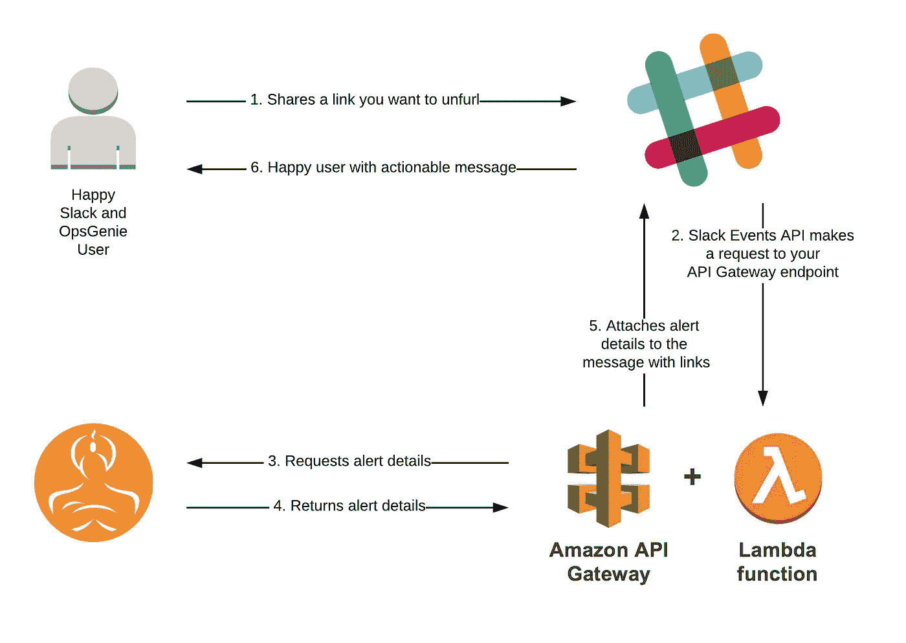

Application flow

这里一个重要的细节是 Slack 的 Events API。我们使用这个 API 在发生新消息或向消息添加 pin 等事件时得到通知。

## 创建您的 Slack 应用程序

现在，是时候深入研究 Slack 应用程序部分了。我们将建立一个内部的松散集成。内部集成就像常规的 Slack 应用程序一样，只是它们只能安装在你的工作空间中；因此，您不需要实现 [OAuth 认证流程](https://api.slack.com/docs/slack-button)。这更容易，更适合我们的用例。

首先进入 https://api.slack.com/apps[的](https://api.slack.com/apps)链接，点击“*创建新应用*按钮。然后，您将为您的应用程序命名，并选择您希望应用程序存在的工作区。不要担心，您可以稍后更改这些细节。

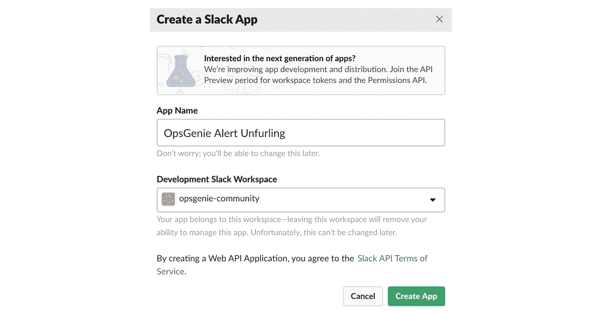

Create your new Slack app!

目前就这些，一旦我们将功能部署到 AWS，我们将再次访问这个页面。

## 从 OpsGenie 获取 API 密钥

[如果您还没有帐户，请在 OpsGenie](https://app.opsgenie.com/customer/register?utm_source=medium&utm_medium=hackernoon) 中申请一个新帐户。在集成- >下创建一个新的 API 集成。

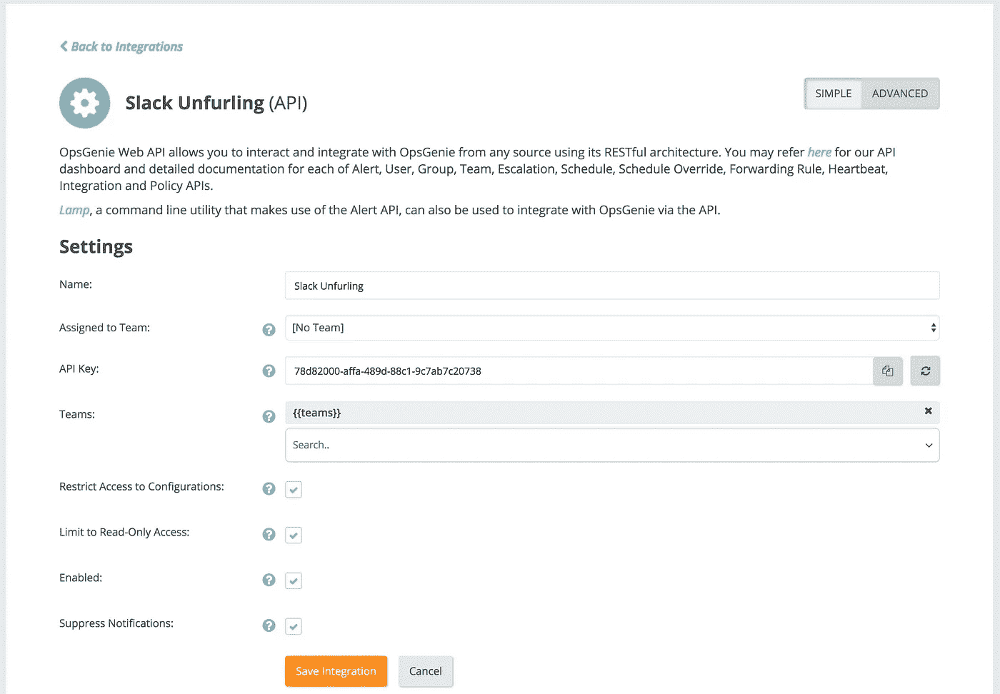

Create an API integration in OpsGenie

这个函数的一个重要提示是，我们不需要这个 API 键来更新 OpsGenie 中的配置或发送通知。因此，我们将集成配置为只读访问并禁止通知。

## 创建你的 Lambda 函数

创建 Lambda 函数最简单的方法是克隆下面的链接库，并根据需要修改代码。然后，只需安装依赖项。

```
git clone [https://github.com/serhatcan/serverless-opsgenie-slack-alert-unfurling](https://github.com/serhatcan/serverless-opsgenie-slack-alert-unfurling)cd serverless-opsgenie-slack-alert-unfurlingnpm install
```

如果您想从头开始或构建自己的代码，您有三种选择:

*   使用这个项目并替换逻辑，
*   使用 AWS Lambda 提供的蓝图之一，或者使用 AWS CodeStart 为更大的项目提供更完整的设置，
*   运行以下无服务器命令创建新的 Lambda 函数:

```
serverless create — template aws-nodejs — path my-service
```

现在，让我们看看代码的主要构建块。除了从这里看，你还可以看看 GitHub 上的[这~100 行代码](https://github.com/serhatcan/serverless-opsgenie-slack-alert-unfurling/blob/master/handler.js)。

流程是这样的:

*   检查我们是否向 Lambda 函数传递了正确的密钥(松弛验证令牌、松弛访问令牌-API 令牌和 OpsGenie API 密钥)
*   通过比较我们拥有的验证令牌和从请求中收到的令牌，验证请求来自 Slack
*   检查事件负载和我们收到的事件的类型。
    如果事件为；
    -"*URL _ verification*"事件:从 JSON 负载发回 *challenge* 值，因为该事件意味着 Slack 正在检查您的端点的健康状况
    - " *event_callback* "事件:运行逻辑

现在，我们已经讨论了主要的构建模块，让我们也来讨论一下当接收到 event_callback 时运行的逻辑。我们使用 Slack 和 OpsGenie Node.js SDKs 来避免在访问 API 时编写样板代码。逻辑部分包括以下步骤:

*   一条消息可以包含来自我们注册域名的多个链接(在我们的例子中是 app.opsgenie.com)。松弛事件 API 以数组的形式发送这些链接。我们迭代这些链接(*有效负载*中的 event.links)并为每个链接运行*messageAttachmentFromLink*函数
*   首先，我们使用一个简单的正则表达式从这样的链接中提取 alertId 如果您愿意，您的链接可以支持其他大小写

```
https://app.opsgenie.com/alert/V2#/show/df2d5224-6df3-4905-a98d-c08c9388f3b5-1516805551907/details
```

*   使用 OpsGenie 中的警报 ID 检索警报详细信息
*   使用我们获得的详细信息构建我们的松弛消息附件
*   使用 Slack API 更新包含必要附件的 Slack 消息

我们了解了我们的功能是如何工作的。但是，我建议你还是继续阅读代码，因为这对大多数开发者来说更有意义。

## 部署 Lambda 函数的第一个版本

在创建 Slack 应用程序、OpsGenie 集成和编写我们的函数之后，现在是时候部署我们的函数了。在这一步，我们将把我们的函数放在 AWS Lambda 上，但是由于我们仍然没有一个 API 端点来告诉 Slack 发出请求，所以我们还不能在我们的工作区中安装我们的应用程序。这意味着我们也没有安装应用程序后会得到的 Slack API 密钥。

一旦我们完成了功能部署，我们将从 API Gateway service 获得一个 HTTPS 端点，并使用它来完成我们在 Slack 中的配置。然后，我们将通过设置 Slack API 键来更新 Slack 应用程序的配置，并再次部署应用程序。

一步一步来。所以在这一步，你应该从 Slack app 中获取验证令牌，并粘贴到 *serverless.yml* 文件中的*Slack _ verification _ token*config 中。我们将使用这个令牌通过与收到的令牌进行比较来验证请求来自 Slack。

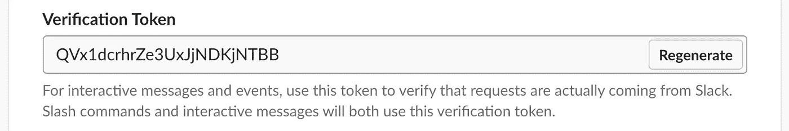

Slack verification token can be found under ***Basic information -> App credentials***

我们还有 OpsGenie API 密钥，让我们也将它粘贴到我们的配置中。我们的配置将如下所示(唯一缺少的是 *slack_access_token* ，因为我们还没有在工作区中安装应用程序):

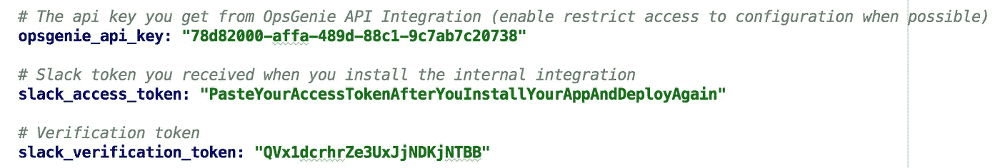

Our config before we deploy first time

现在，我们可以部署。转到项目的主文件夹，运行部署命令:

```
serverless deploy
```

所有这些都将由 *serverless.js 处理。* Serverless 使用 AWS CloudFormation 来提升您的堆栈。您也可以访问 CloudFormation 了解更多信息。

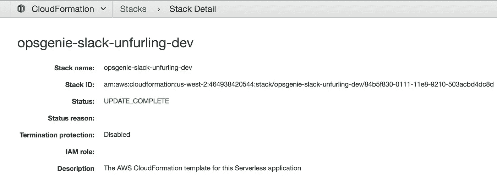

CloudFormation Stack Serverless.js created

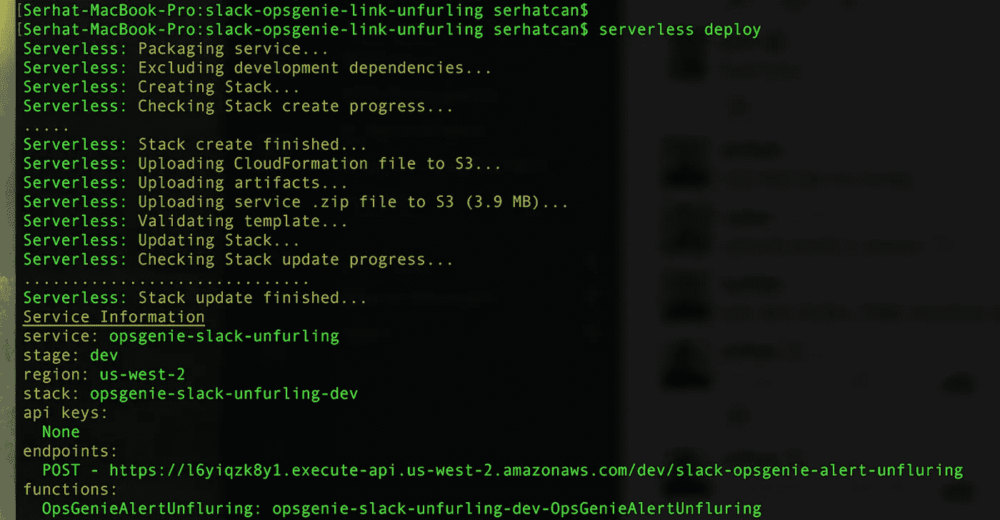

After you run **serverless deploy** command

运行命令并完成堆栈创建后，您将在终端中看到一个 HTTP 端点。抄下来继续下一部分！

## 配置松弛应用程序

您拥有 API 网关端点。Slack 将使用这个 API 端点来发送事件细节。要将此事告知 Slack，请转到*事件订阅*选项卡。

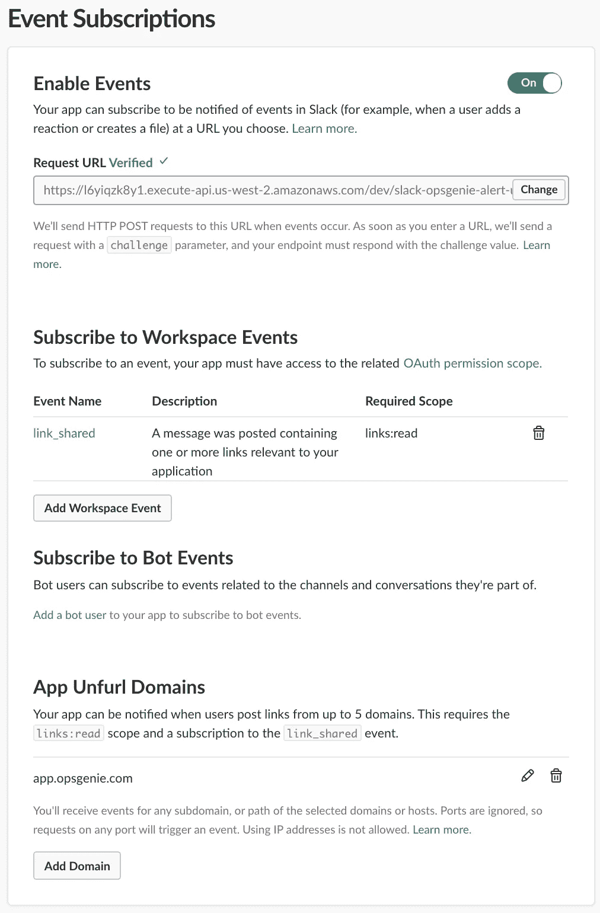

启用*事件*并将您获得的端点粘贴到“请求 URL”输入中。此时，Slack 将向您的端点发出请求，以确保它能够工作。不用担心，我们的代码知道如何处理这个有效载荷，并能返回正确的响应。

在你获得“*验证*标志后，现在是时候订阅一些活动了。Slack 只会发送您订阅的事件。在我们的例子中，当一个链接包含 app.opsgenie.com 的域时，为了调用我们的端点，我们需要订阅链接共享事件。

这一页的最后一步是告诉 Slack 你想要监听哪些域。在 App 展开域名部分*下添加*app.opsgenie.com*域名。*

现在，让我们从侧边栏切换到 *OAuth & Permissions* 页面。在这个页面中，你需要确保你有*链接:读*和*链接:写*范围。读范围是 Slack 向我们发送事件所必需的，写范围是我们用附件更新消息所必需的。用户需要在安装我们的应用程序时批准这一点。

## 在你的工作区安装你的 Slack 应用

现在，是时候安装应用程序并获得 **OAuth 访问令牌**来访问 Slack API 了。进入**安装 App** 页面并安装:)

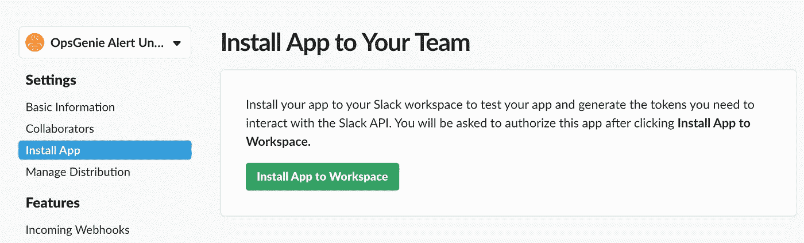

Click Install App to Workspace

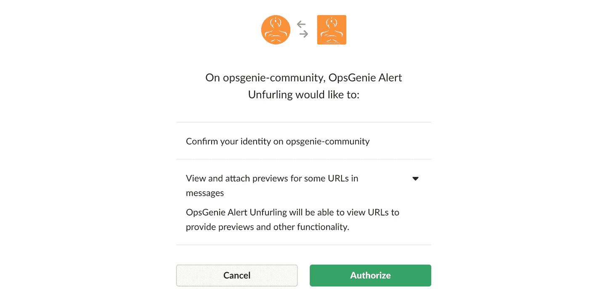

Authorize the app

授权应用程序后，您离完成设置只有一步之遥！

## 更新您的函数并再次部署

在 Slack 重定向你的页面中安装之后，你会看到 **OAuth 访问令牌**。复制粘贴到 *serverless.yml* 文件的 *slack_access_token* 配置中。

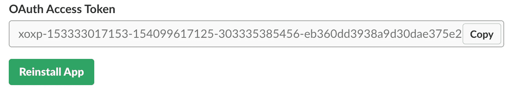

OAuth Access Token we need to access Slack API

然后再次部署应用程序，第二次运行部署命令:

```
serverless deploy
```

就是这样！⛱

## 试试看有没有用！

我们需要一个 OpsGenie 警报来测试我们的应用程序。您可以通过键入*/精灵警报“测试我的警报”*命令或仅使用 web 界面从 Slack 创建一个。

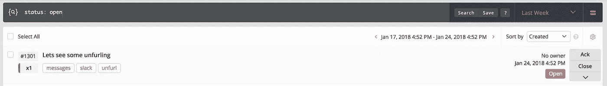

Create a new OpsGenie alert

单击警报详细信息，在浏览器上，您将看到一个类似于以下内容的端点:

```
https://app.opsgenie.com/alert/V2#/show/df2d5224-6df3-4905-a98d-c08c9388f3b5-1516805551907/details
```

复制这个链接并粘贴到 Slack，享受你的工作！

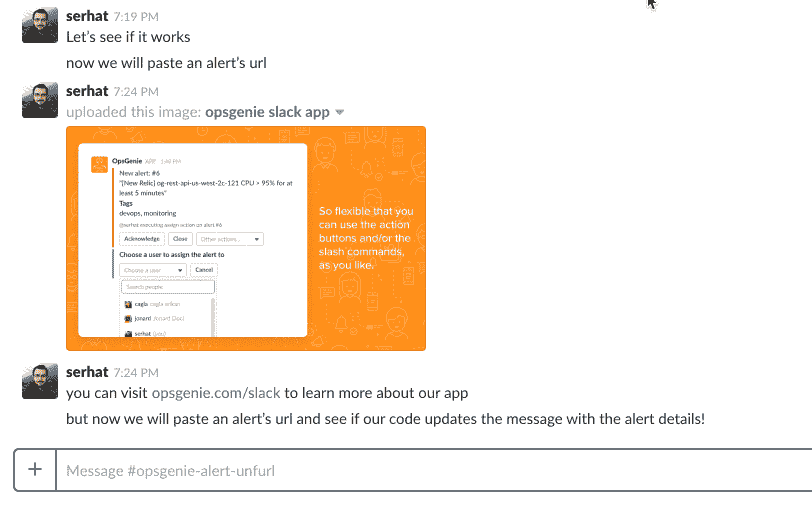

Enjoy your work!

代码可在此库中找到:
[https://github . com/serhatcan/server less-ops genie-slack-alert-unfurling](https://github.com/serhatcan/serverless-opsgenie-slack-alert-unfurling)

## 进一步的改进和提示

您可以做一些事情来增强这种集成:

*   使用 KMS 来安全地管理您的密钥——不建议对密钥使用环境变量
*   用更多细节改进松弛消息，可能添加按钮！
*   如果你正在考虑处理更多的事件，并且想要隐藏一些复杂性，你可以使用 [Slack Events API 模块用于节点。](https://github.com/slackapi/node-slack-events-api)

Slack 有[很好的文档](https://api.slack.com/docs/message-link-unfurling)和[在 Github](https://github.com/slackapi/sample-app-unfurls) 上展示的很好的样本。遵循这些，你就可以让你的应用进入下一步了！

## **参考文献及相关链接**

*   [https://github . com/serhatcan/server less-ops genie-slack-alert-unfurling](https://github.com/serhatcan/serverless-opsgenie-slack-alert-unfurling)
*   [https://api.slack.com/docs/message-link-unfurling](https://api.slack.com/docs/message-link-unfurling)
*   [https://github.com/slackapi/sample-app-unfurls](https://github.com/slackapi/sample-app-unfurls)

感谢您读到这里！

如果你喜欢这个教程，别忘了👏为了表示你的支持😃