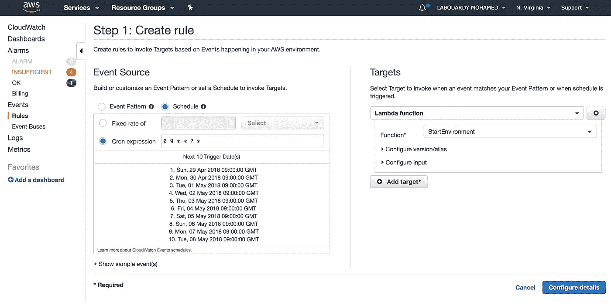
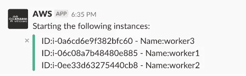

# 利用 Lambda 优化基础设施成本

> 原文：<https://medium.com/hackernoon/infrastructure-cost-optimization-with-lambda-83b4bb733e76>

拥有多个环境对于构建持续的集成/部署管道非常重要，并且能够轻松地在生产中重现 bug，但这是有代价的。为了降低 AWS 基础设施的成本，不必要地全天候运行的实例(**沙盒** & **分级**环境)必须在正常工作时间之外关闭。

下图描述了调度、停止和启动实例以帮助削减成本的自动化流程。这个解决方案是使用**无服务器计算**的完美例子。

注意:我的 [GitHub](https://github.com/mlabouardy/cost-optimization) 上有完整的代码。

2 Lambda 函数将被创建，它们将扫描所有环境寻找特定的标签。我们使用的标签命名为 *'* ***环境*** *'* 。没有 ***环境*** 标签的实例不会受到影响:

**StartEnvironment** 函数将使用前一个函数返回的实例 id 列表查询 **StartInstances** 方法:

类似地， **StopEnvironment** 函数将查询 **StopInstances** 方法:

最后，两个功能都将向 **Slack** 通道发布一条消息，用于实时通知:

现在我们的函数已经定义好了，让我们使用下面的 Bash 脚本来构建部署包( *zip* 文件):

这些功能需要一个 **IAM** 角色才能与 **EC2** 交互。StartEnvironment 函数必须能够描述和 *start* EC2 实例:

StopEnvironment 函数必须能够*描述*和 *stop* EC2 实例:

最后，为每个功能创建一个 IAM 角色，并附加上述策略:

该脚本将为每个 IAM 角色输出 **ARN** :

在跳转到部署部分之前，我们需要创建一个 [Slack WebHook](https://my.slack.com/services/new/incoming-webhook/) 来将消息发布到 Slack channel:

接下来，使用以下脚本将您的函数部署到 **AWS Lambda** (确保替换 IAM 角色，Slack WebHook 令牌&目标环境):

部署完成后，如果您登录到 [AWS 管理控制台](http://console.aws.amazon.com/console/home)，导航到 Lambda 控制台，您应该会看到两个功能都已成功部署:

**启动环境:**

**停止环境:**

以进一步自动化在正确的时间调用 Lambda 函数的过程。将使用 AWS **CloudWatch 预定事件**。

使用下面的 *cron* 表达式创建一个新的 CloudWatch 规则(它将在每天上午 9 点被调用):

以及另一个在下午 6 点停止环境的规则:

注:所有时间都是 GMT 时间。

**测试:**

**a —停止环境**

结果:

**b —启动环境**

结果:

该解决方案易于部署，有助于降低运营成本。

*完整代码可以在我的*[*GitHub*](https://github.com/mlabouardy/cost-optimization)*上找到。请务必在下面留下您的评论、反馈或建议，或者直接在 Twitter 上与我联系*[***@****mlabouardy*](https://twitter.com/mlabouardy)*。*