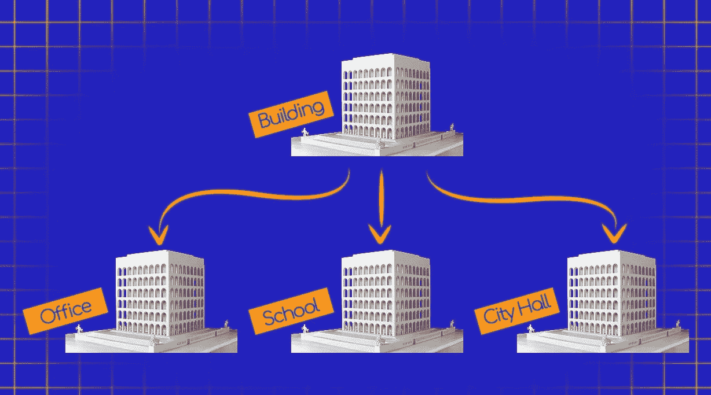

# PHP 中的继承和接口

> 原文：<https://medium.com/hackernoon/inheritance-and-interfaces-in-php-d46b61c65b84>


# 介绍

从前，

曾经有一个 Web 开发人员花了一周又一周的时间更新相同的代码行。

这使他非常头疼。

一天，在浏览博客的帖子时，他看到了“面向对象编程”这几个字，接下来发生的事情令人震惊…

在上一篇文章中，您发现了 PHP 中 OOP 范例的[基础，](http://anastasionico.uk/blog/object-oriented-programming-in-php)

从其简单的语法到以简单而强大的方式重用相同代码的优势。

**今天你将学习如何最好地管理这些对象，并使用继承和接口在它们之间创建长期安全的关系。**

# 遗产

# OOP 上有哪些继承？

在 [PHP](https://hackernoon.com/tagged/php) 中，我们现在进入面向对象[编程的 4 个基本支柱之一。](https://hackernoon.com/tagged/programming)

继承以及封装、抽象和多态都需要掌握，才能精通编程并真正提高你的技能。

**继承所做的是在父子模型中将类相互联系起来。**

这在提取相关类必须共有的特征时非常有用，并且允许实现进一步的方法和属性，而无需再次重写。



像上一篇文章一样，我们仍然使用 *Building* 类作为例子，
在这个例子中，我们假设当你想要实例化一个新的建筑物时，构建它的工作已经完成，并且对公众开放。

```
class Building{ $inConstruction = false; $isOpen = true; function closeBuilding() { return $this->isOpen = false; } function openBuilding() { return $this->isOpen = true; }
}class School extends Building{}class Office extends Building{ $isOpen = false;}
```

我们这里有三节课，

作为 building 类的父类及其继承 Building 特性、属性和方法的子类。

我们现在可以实例化具体的学校和办公室，而不是抽象的班级建筑

```
$mySchool = new School();$myOffice = new Office();echo $myShool->closeBuilding(); // The output will be “false” because of the parent Buildingecho $myOffice->isOpen; // The output will be “false” because of the child Office
```

如你所见，我实际上没有在学校类中写任何东西，但是它仍然继承了它的父类 Building 的所有属性和方法。

**这个原则叫做 DRY(不要重复自己)，它的目标是减少我们一遍又一遍写的文字。**

我相信你也注意到了 *Office* 类在 *$isOpen* 变量上的值与其父类不同，

事实上，

通过将父级的中的相同属性或方法写入子级，我们覆盖了它的功能。

基本上，

当实例化的 *$myOffice* 关闭，而不是 *$mySchool* 跟随建筑的行为并保持 *$isOpen* 保持假( *$mySchool* 开放访问)。

# 为什么使用继承？

关于这个话题有几种思潮，

有人说继承是好的，如果你只是想在一个活的项目中使用它，一些高级开发人员会杀了你，

我认为大部分时间真相都在中间。

**继承是一种节省时间的神奇方法，可以避免重复写同样的东西**，

这很容易理解，对于 OOP 新手来说，这是一条正确的道路。

同样真实的是**继承有几个限制**，对于一个有经验的 web 开发人员来说，有相当多的更好的选择，一个在所有组合之上。

看看这个来自 from Fun Fun Function 的视频

我的建议是使用继承，只要你对这种技术 100%熟悉，你知道如何使用它，什么时候使用它来共享功能，什么时候使用其他技术，如组合、设计模式(工厂模式是一个非常接近的例子)，或者甚至只是在类中添加一个特征。

# extends 关键字

没有人知道为什么创建继承的关键字不是继承或更一致和容易记住的东西，但我们在这里。

**为了允许一个类从另一个类继承，我们需要在子类名称之后和左括号之前指定关键字“extends”和父类。**


需要注意的一个情况是，子类必须总是只依赖于单个父类，这意味着不支持多重继承。

请这样想:
我们在前面的例子中使用的 Office 类不能同时从 Building 类和 Animal 类继承特性。

他们只是没有共同的特点。

# “最终”关键字

最后一个关键词是 php5 中首次引入的非常简单的概念。

简单来说，

它防止方法或类被扩展。

让我们看一个简单的例子。

假设我们想象中的城市的市长决定所有的建筑必须至少有一个紧急出口，现在看看下面的代码示例。

```
class Building{ ... function setFireExtinguisher() { $this->fireExtinguisherCount = 1; }} class Office extends Building{ function setFireExtinguisher() { $this->fireExtinguisheCount = 0; }
}
```

在这种情况下，

*Office* 类的*setfire 灭火器()*方法已经覆盖了 *Building* 类并将*fire 灭火器计数*设置为 0，

市长认为这是非法的。

一种防止它和避免架构师入狱的方法是将 final 关键字添加到方法中。

```
class Building{ ... final function setFireExtinguisher() { $this->fireExtinguisherCount = 1; }}class Office extends Building{ function setFireExtinguisher() { $this->fireExtinguisheCount = 0; }}
```

现在 *Office* 类的*setfire 灭火器()*方法的代码无法使用，实际上会导致致命错误*“无法覆盖最终方法构建->setfire 灭火器()”*。

非常简单的概念，非常容易实现。

文章的这一部分只有一个规则:

不能在属性上使用 final。

属性是变量，顾名思义，它们需要能够变化。

您可以在不想扩展的类或不能被覆盖的方法上使用 final。

# 接口

建筑师和建造者需要遵循哪些强制性步骤来建造一座建筑？

有几项规定需要遵守，尤其是在公共场所，比如增加一些急救设备，制定疏散计划等。

一个接口可以让你预先安排这些步骤，并迫使类相应地实现它们。

非常简单地说，如果一个类是一个对象的蓝图，你可以把接口想象成类的蓝图。

把接口看作一个纯粹的模板。

让我解释一下，

为什么首先需要对象接口？

**在 PHP 中，接口定义了一个类必须实现哪些方法，**

**同时接口没有指定这些方法需要如何实现，**

你很快就会看到，最后一句话给了你在管理班级时很大的自由度。

# “接口”关键字

创建接口的语法几乎与创建类的语法相同，

命名一个接口通常遵循一些约定，这样会让其他人更容易理解你的代码，最常用的约定有:

*   ThingInterface
*   IThing
*   I _ Thing

在下面的例子中，我将创建我将在 *Building* 类中使用的接口。

我们城市已经很有名的市长非常关心安全问题，他决定我们城市的每一栋建筑都必须有火灾报警器和集合点，以防灾难发生。

让我们编写这些接口的代码。

```
interface FireAlarmInterface{ function setFireAlarm();}interface AssemblyPointInterface{ function setAssemblyPoint();}
```

在前面的代码片段中，您应该注意两件事，

第一个是接口看起来非常类似于类，

第二，在方法中没有打开代码块的大括号，原因是接口并不决定方法需要如何实现，它们只是决定需要实现什么方法。

# “实现”关键字

既然已经创建了接口，我们需要在我们的*构建*类中实现它们。

要实现一个接口，你需要使用 implements 关键字。

您必须注意的一个重要的基本特性是:**接口中的所有方法都必须包含在实现接口**的类中。

这是强制性规定，没有例外；

PHP 会通过在屏幕上抛出一个致命错误来让你知道你是否忘记了方法。

```
class Building implements FireAlarmInterface{ function setFireAlarm() { $this->fireAlarm = true; }}
```

如前所述，接口中的所有方法都必须在一个类中实现；

否则将导致致命错误。

与继承不同，一个类可以实现多个接口。

事实上，

如果需要，您可以列出尽可能多的接口，并用逗号分隔每个接口。

```
class Building implements FireAlarmInterface, AssemblyPointInterface{ …}
```

尽管这是 PHP 的一个令人印象深刻的特性，但让我再次强调，实现的每个接口的每个方法都必须包含在类中，这可能会导致很多混乱。

因此，请谨慎使用您的接口，只有在您研究了所有可能出现的问题之后才使用它们。

# PHP 包含的内置接口列表

PHP 有一些集成到语言中的接口。

虽然它们中的大部分不太可能在日常生活中使用，但有些可能非常有用，肯定会在项目开发过程中为您节省一些时间。

# 可否定的

顾名思义， ***可遍历*接口分析一个类并返回一个布尔值，这取决于该类是否使用 foreach** 来实现可遍历。

这个接口没有方法，它的目的是作为可遍历类的基础。

```
Traversable {}
```

您可以在条件语句中使用该接口来检查如果使用 foreach，某些内容是否可用。

这里有一个简单的例子

```
if( $buildings instanceof Traversable ){ foreach ($buildings as $building){ …    }}
```

请注意，该接口不能在数组和对象上工作，
，这意味着您不能使用 *Traversable* 来检查这些类型的变量是否可以在数组中使用。

为什么一开始就需要验证它们呢？

# 迭代程序

这个*接口*作用于可以重复自身的对象或迭代器。

上面的句子只是意味着您可以将*迭代器*接口扩展到任何可遍历的元素，并在类中包含以下方法。

```
Iterator extends Traversable { function current () { } function key () { } function next () { } function  rewind () { } function valid () { }}
```

明白了吗？？
这里有一个真实的例子，展示了该接口可能如何真正用于:

```
public function rewind(){ $this->position = 0;}public function current() { return $this->array[$this->position];}public function key() { return $this->position;}public function next() { ++$this->position;}public function valid() { return isset($this->array[$this->position]);}
```

# 迭代器聚合

*IteratorAggregate* 接口只是在代码中实现迭代器的另一种方法。

```
IteratorAggregate extends Traversable { function getIterator () { }}
```

使用这个接口的好处是速度快，

事实上， *IteratorAggregate* 比其他选项要快得多，

你需要注意，尽管名字如此，这不是一个迭代器，但它是一个*可遍历的*。
这意味着没有下一个、关键、当前、有效、倒带方法可用。

# 可投掷的

*Throwable* 接口用于所有可以通过 throw 语句抛出的对象，
包括错误和异常。
以下是接口及其完整的方法列表:

```
interface Throwable { function getMessage () { } function getCode () { } function getFile () { } function getLine () { } function getTrace () { } function getTraceAsString () { } function getPrevious () { } function __toString () { }}
```

PHP 不能直接实现这个接口，

它只能通过异常来扩展。

[](http://eepurl.com/dIZqjf)

# 第二部分的结论


[一体化版的《面向对象编程完全指南》的完整版在亚马逊上有 Kindle 格式的版本](https://www.amazon.co.uk/dp/B07J47L6PB)

不过不要担心，以下部分将在接下来的几周内发布。

…这位 Web 开发人员真的相信他的工作非常出色，说实话，他是对的。

他已经能够创建他脑海中的一切，他可以从头开始创建应用程序，甚至是让他的老板和客户满意的复杂系统，

他意识到的是，他的领域是一个不停的学习，一件事情之后是另一件，然后是另一件，然后是另一件。

今天你像他一样，

你已经学习了 OOP 基础知识 ，现在你知道了更多的关键词，明天你将沉浸在其他信息中。

**编程永无止境，你认为你知道的越少，你就变得越好。**

你在开发知识的哪一部分？你已经学会了所有的东西，还是刚刚开始接触面向对象的原则？

请在下面的评论中告诉我…

*如果你喜欢这个内容，并且你渴望更多的内容* [*加入脸书的社区*](https://www.facebook.com/anastasionico.uk/) *，在这里我们可以像这样分享信息和新闻！*