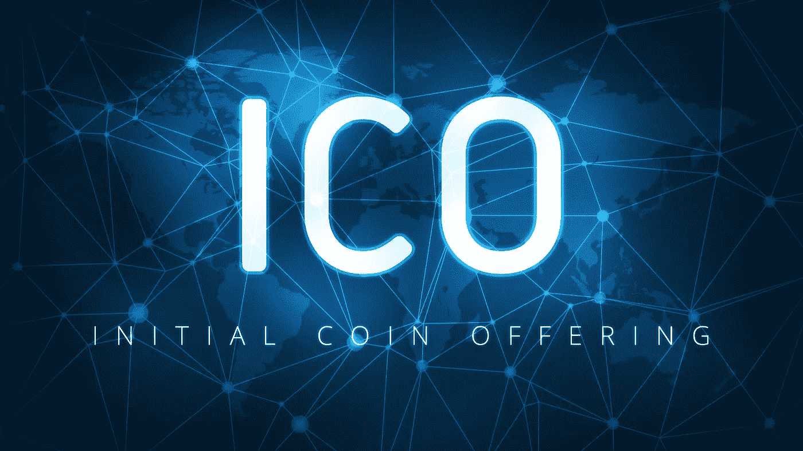
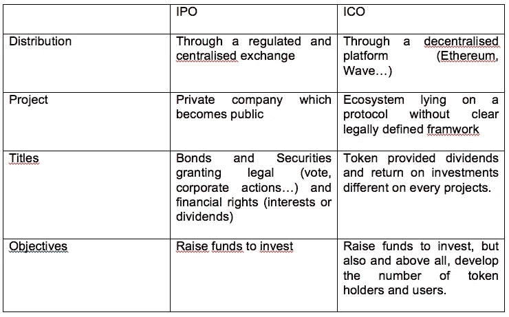
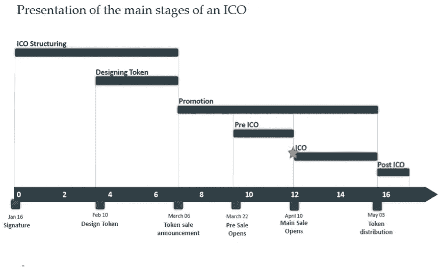
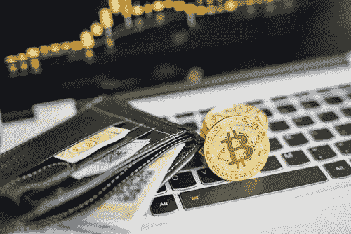

# 初始硬币发行:完整指南(1/3)

> 原文：<https://medium.com/hackernoon/initial-coin-offering-a-complete-guide-1-3-bd2535702be6>

当然，目前最著名的表达之一，首次发行硬币或 ICO，是指首次公开发行或首次公开募股，具有一定规模的公司通过向公众开放资本来筹集资金。ICO 很可能会彻底改变金融界。

注意，使用 ITO 进行“初始代币发售”也是很常见的，因为“币”和“代币”一般是不一样的。例如，在 Coinmarketcap.com 网站上，通过选择所有代币列表顶部的“硬币”或“代币”,可以识别这两个类别。“硬币”对应的是所谓的“本地代币”，根据网站的定义，这是“可以独立运行的加密货币”，因为它们依赖于自己的区块链。

相比之下，“代币”(或“非本地代币”)是“依赖于另一种加密货币作为工作平台的加密货币”。例如，在以太坊协议(Storje、augur、Iconomi、假人、Omnisgo……)之上创建的 Dapps 就是这种情况。他们实际上受益于以太坊维护的开发环境和区块链。

简单来说，ICO/ITO 是一种分散的融资方式。它是一种去中心化的方式，因为它允许创业者通过去中心化的平台(以太坊、Wave……)直接接触投资人，而不必经过传统的风险投资路径。我们谈论的是代币/硬币，而不是传统公司发行的“证券”，因为根据项目的不同，这些代币/硬币可能具有与传统金融工具截然不同的功能和投资回报。

**令牌发放方式**:通过 ICO 发放令牌有两种选择。第一种方法是收集请求的资本，然后按照参与者的参与比例将所有代币分配给参与者。这种方法可以与我们目前所知的一级市场发行相比较。

第二种方法是在交易所发行代币并出售给参与者。这种方法可以比作二级市场。

请注意，在 ICO/ITO 期间，这两种方法都可以相继使用，例如在进行预售时。

因此，ico 是 IPO 和众筹的混合体，但实际上要更进一步。

ICO

**ICO 有哪些不同的步骤？**

在这一节中，我们将从企业家的角度(1)和投资者的角度(2)来探讨 ICO/ITO，因为两者是完全不同的。

**我——企业家视角**

我有机会协助巴黎领先的 ICO 律师事务所 Kramer Levin 的 Hubert de Vauplane 和 Valentine Baudoin 进行演示，他们解释了 ICO 的所有不同步骤。鉴于律师事务所在 IPO 方面的经验，更好地理解这两个过程之间的差异是非常有趣的。

他们的第一个观点是，ICO/ITO 流程在许多情况下类似于 IPO，从与专家(顾问、律师、贷款银行……)签订合同以完成项目的必要性开始。雇佣这样的承包商需要企业家预先筹集大量资金(大约 50 万美元)。

这就是为什么许多企业家决定通过预 ICO 融资，他们通过向早期采用者分发代币来筹集资金。筹集到的资金将用于支付顾问、律师、银行和真实 ICO 的所有费用。

因此，任何人都可以通过向承包商支付 ICO 代币来组织一个严肃的 ICO 的想法是不符合现实的。依赖于严肃项目的 ICO 通常会经历以下步骤:

ICO workflow

我们将在本系列文章的第三部分中详细讨论每一个要点，但是目前来看，了解一下不同的步骤是很有趣的:

**1 —第一阶段:ICO 结构化**

这一部分与将要出售的代币的发行或开采同时进行。

*   与主办机构(也称为全球顾问)签署服务协议/授权协议。
*   与律师事务所签署业务约定书。

**2 —第二阶段:产品包装**

在这一部分，团队通过建立网站和最终确定白皮书，专注于产品的准备工作。最重要的是，如果他们已经有了一个社区，他们会试着去激励这个社区。如果没有，他们将需要使用营销工具，如奖金计划和空投，以及传统的方法，在短时间内建立一个社区。值得一提的是，通过 ICO 是开始开发社区的一个很好的方式。

**3 —第三阶段:预售和销售**

正如我们已经提到的，可以组织预售来从早期采用者那里筹集资金，以支付 ICO/ITO 流程的费用。与销售期间提议的 ICO/ITO 价格相比，预售通常以折扣价提议。

**4 —第四阶段:发布 ICO/ITO 并上市**

将硬币/代币上市对 ICO/ITO 的成功至关重要。在一个著名的交易所获得一枚硬币/代币几乎肯定会确保更高的价格，并暴露给更多的投资者。

然而，这是一个挑战，大多数交易所在考虑是否上市数字货币时，都发布了他们评估的标准。该框架列出了一些考虑因素，如数字货币是否符合比特币基地准则下的证券资格，它有多少流动性，以及已经有哪些交易所交易这种货币。

**二—投资者观点**

大多数 ICO 都是在以太坊区块链创造的。在实践中，智能合约被创建并存储在区块链上，以管理所有 ICO 过程:代币的接收、达到融资触发时的支付或未达到触发时的退款。建立这种智能合约非常简单，因为代码可以在[以太坊网站](https://www.ethereum.org/crowdsale)上找到。

如果你想参加 ICO 并从零开始，你需要完成以下步骤。

**1-在交易所购买以太或比特币:**

你将不能参加法定货币的 ICO，所以第一步是获得加密货币。大部分 ICO 都是用比特币和以太(以太坊原生令牌)进行的。正如我们在本文的[中所描述的，有几种方法可以获得加密货币，但最常见的是通过交换。](https://www.blockchains-expert.com/en/how-to-buy-bitcoins-and-altcoins-the-ultimate-guide/)

**2-设置本地钱包:**

正如我们在本文的[中解释的，当你的加密货币存储在交易所时，你并不拥有你的私钥。换句话说，你无法控制你的硬币。](https://www.blockchains-expert.com/en/how-to-securely-store-your-coins-the-ultimate-guide/)

Portefeuille bitcoin

每个 ICO 都使用自己的一套规则，但大多数情况下，您需要将特定硬币(通常是 BTC 或瑞士法郎)的私钥发送到为 ICO 创建的钱包中。有效扣留和转移您的私钥的唯一方法是从您的本地文件夹中。

您千万不要将您的硬币从兑换处直接转移到 ICO 的钱包中，因为您不会扣留私钥，并且您购买的 ICO 代币也不会发送给您。

你应该选择哪个钱包？显然，一个钱包是兼容的 ICO 令牌，你正在寻找。今天，大多数 ICO 令牌都是 ERC20 兼容的(即这些令牌与以太坊协议兼容)，因此您需要一个能够接受这种类型令牌的钱包。最常见的是 MyEtherWallet、元掩码或奇偶校验。重要的是要记住，这些钱包不能提供最高级别的安全性，你所有的代币都应该冷藏起来。

**3-接收您的硬币:**

所有的 ICO 都有不同的流程，所以你必须访问他们的网站并遵循他们的指示，但大多数情况下，一旦 ICO 完成，你会被要求将以太发送到给定的地址并接收令牌。

请注意，这是很常见的，要等一两天才能收到你的硬币。

在 ICO/ITO 系列的下一篇文章中，我们将详细介绍如何分析 ICO/ITO。

**在哪里搜索 ICO:**

如果您想参加 ICO，您可以访问以下网站，这些网站列出了即将举办的 ICO:

 [## ICObazaar -加密市场洞察

### 元索引

icobazaar.com](https://icobazaar.com/)  [## ICO 跟踪软件

### 最后更新:2018 年 1 月 1 日欢迎使用 CoinDesk ICO 追踪器。面向分析师、记者的综合资源…

www.coindesk.com](https://www.coindesk.com/ico-tracker/)  [## 最佳加密 ICO 和令牌销售

### 比特币的加密货币 ico(初始硬币发行)和代币销售、里程碑、路线图和事件列表…

www.coinschedule.com](https://www.coinschedule.com/)  [## ICO Alert-ICO、代币销售和众筹销售的唯一完整列表。活动日历和…

### ICO Alert 维护唯一完整的日历，记录所有正在进行的和即将进行的初始硬币发行(ICO)、代币销售…

www.icoalert.com](https://www.icoalert.com/)  [## ICO 日历

### Cointelegraph 列出了正在进行和即将进行的 ico。最有前途和吸引力的 ICO 项目

cointelegraph.com](https://cointelegraph.com/ico-calendar) 

我希望你喜欢这篇文章！如果有，请不要犹豫，喜欢它并分享！！