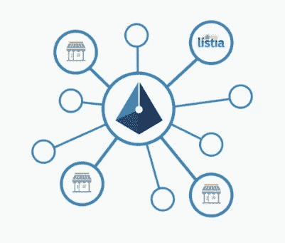
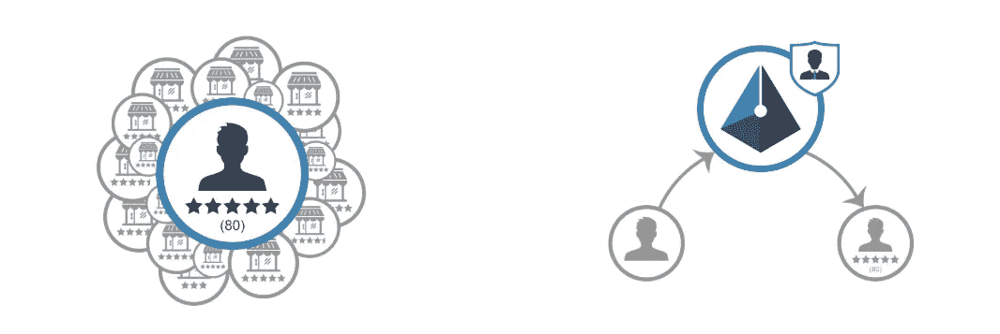
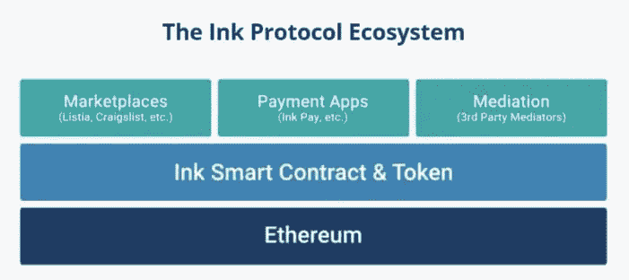

# Ink 协议——用于分散信誉和托管的区块链

> 原文：<https://medium.com/hackernoon/ink-protocol-blockchain-for-decentralized-reputation-and-escrow-ab54abace0d3>

将以太坊区块链用于点对点市场。

# 什么是[墨水协议](https://paywithink.com/) (XNK)？

Ink Protocol 是一个新兴的区块链项目，旨在为 P2P 市场提供一个分散的支付和信誉系统。该项目允许用户使用 XNK 令牌通过分散的信誉和托管在任何地方安全地购买和销售。它旨在基于买家和卖家在平台上建立的信誉来增强他们之间的信任。

墨水协议是由 [Listia](https://www.listia.com/) 的团队开发的，这是一个拥有超过 1000 万注册用户的在线买卖二手商品的市场。Listia 于 2009 年成立，由来自 [YCombinator](https://blog.ycombinator.com/listia-yc-s09-raises-9m-from-general-catalyst-for-its-used-and-free-goods-marketplace-mobile-use-up-2x-in-3-months/) 、 [Andreessen Horowitz](https://techcrunch.com/2011/04/19/andreessen-horowitz-leads-1-75m-round-in-freebie-marketplace-listia/) 和其他几家风险投资公司的风险投资支持。最近，ConsenSys Ventures [宣布投资 Ink Protocol](/@PayWithInk/announcement-ink-protocol-is-one-of-consensys-ventures-newest-portfolio-companies-cf8858d15a60) 。

# 墨水协议的好处

**买家**

买家可以查看任何卖家的全球声誉，使用托管支付，并为完成的交易留下反馈。Ink Pay 应用程序也在开发中，这将大大简化人们使用 XNK 进行买卖的方式。

**卖家**

声誉是去中心化的、独立的、随处可得的。跨平台获得的所有声誉都会计入您的整体声誉！随身携带，永远不用担心从头开始重建。

**任何市场**

Ink 协议可以集成到新的或现有的市场中，也可以用在不直接处理支付的市场中。目前，Ink Protocol 已经集成到[Listia.com](https://www.Listia.com)、[EverydayCarry.com](https://www.EverydayCarry.com)、[Sharetribe.com](https://www.Sharetribe.com)、[QRYPTOS.com](https://www.qryptos.com/)…,更多功能即将推出！

**任何交易**

墨水协议不需要市场。它可以用于任何对等交易，不管它在哪里。在 Listia 上集成 2.5 个月后，Ink Protocol 已经达到了第[100 万个 XNK 上市](/@PayWithInk/community-update-one-million-xnk-listings-exchange-marketplace-partnerships-and-ink-pay-coming-d3a0228d5e14)里程碑！

# 2018 年路线图

请记住，Ink 协议本身已经**完全完成，任何人都可以使用**，所以这个路线图只涉及 XNK 团队正在积极研究的补充功能和应用程序。任何人都可以并且被鼓励去开发额外的甚至是竞争性的应用。更完整的路线图包括 2019 年及以后的[可以在这里找到](/@PayWithInk/ink-protocol-roadmap-2-0-and-community-update-half-a-million-xnk-listings-7e5b5f92e808)。

## Q2 2018

*   推出墨水支付应用程序和墨水支付合作伙伴关系
*   启动墨水协议事务浏览器(如“墨水以太扫描”)
*   市场伙伴关系
*   消费者应用合作伙伴关系
*   航运和物流伙伴关系
*   首次与消费者应用合作伙伴进行实时集成
*   围绕 [Ink 开发者门户](https://developer.inkprotocol.com)和 [Gitter](https://gitter.im/InkProtocol/contracts) 创建一个开发者社区

## 2018 年第三季度

*   启动 Ink 协议公共 API，以便更轻松地集成合作伙伴关系
*   启动第一个信誉分数聚合器
*   为现有市场推出反馈和信誉导入程序
*   为第三方网站和应用程序推出信誉和支付小工具
*   开始菲亚特支付集成工作
*   更多市场、消费者应用和其他合作伙伴

## 2018 年第四季度

*   开始为论坛和留言板开发市场插件
*   开始为在线商店开发市场插件
*   开始接受额外的加密货币支付
*   启动与消费者和市场合作伙伴的额外实时集成
*   更多市场、消费者应用和其他合作伙伴
*   将本地市场和其他垂直市场整合到 Ink Pay
*   Listia 和 Ink Pay 的国际增长

# 我们为什么要关注墨水协议？

在过去的 4 个月里，Ink Protocol 团队一直专注于技术的前端和后端开发，同时确保与 ConsenSys、[EverydayCarry.com](/@PayWithInk/announcing-ink-protocols-first-big-consumer-e-commerce-partnership-with-men-s-accessories-site-2a2aec108335)或 [Sharetribe](/@PayWithInk/ink-protocol-partners-with-sharetribe-creating-the-easiest-way-to-build-your-own-peer-to-peer-7656df0a6c4a) 等公司的战略合作伙伴关系……由于缺乏实质性的营销，XNK 仍然相对不为人知，尽管它是一个成品，并被区块链和电子商务领域的几个大公司采用和支持。

既然他们即将在 6 月发布他们的 Ink Pay 应用程序，XNK 团队就要将他们的一些重点转移到公关方面。通过多年经营 Listia，他们在商业和电子商务领域拥有丰富的经验和联系，因此我们可以预计他们的营销工作将非常有效。在不久的将来，我们一定要关注 Ink 协议！

*免责声明:本文仅用于教育目的，非理财建议！*

**对于那些想了解更多关于 Ink 协议的人**:

中:[https://medium.com/@PayWithInk](/@PayWithInk)

网址:[https://paywithink.com/](https://paywithink.com/)

推特:[https://twitter.com/PayWithInk](https://twitter.com/PayWithInk)