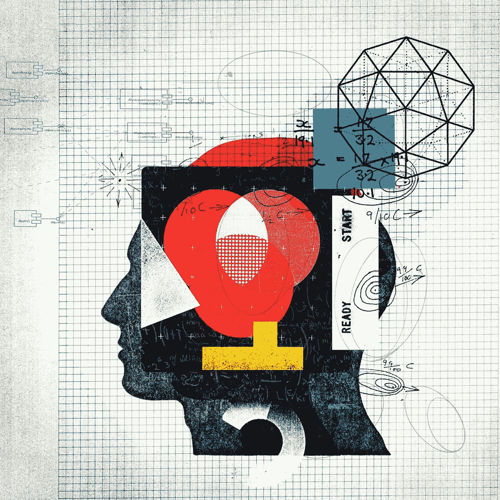

# 创新您的组织始于了解您的客户体验

> 原文：<https://medium.com/hackernoon/innovating-your-organization-begins-by-understanding-your-customer-experience-46bbcbf0d703>

**Image source:* [*The eight essentials of innovation (McKinsey)*](https://www.mckinsey.com/business-functions/strategy-and-corporate-finance/our-insights/the-eight-essentials-of-innovation)

消费者行为的变化速度比大多数组织都快。虽然拥抱新技术——如人工智能、区块链、营销自动化、聊天机器人、个性化——是你的供应商和服务提供商倡导的解决方案，但最终大多数“数字化转型”项目都会失败。

这一挑战的背后是数据的谎言。

更准确地说，基于对消费者不断发展的过时假设而收集的数据总是存在固有的缺陷。这不是管理不善的因素，而是组织(公司、政府或其他)擅长运营的结果，而不是客户行为分析的结果。

接下来是一个受设计思维启发的创新蓝图，我们的[研究咨询公司 PH1](http://ph1.ca) 用它来帮助客户化挑战为机遇。这也是我们为市场研究和情报协会于 4 月 17 日在温哥华举办的 [CX 研讨会的基础。](https://mria-arim.ca/membership/chapters-councils/british-columbia-chapter/bc-chapter-events)

## 最适合客户体验的创新挑战(CX)研究

客户体验研究使组织能够了解消费者如何与所有接触点互动和互动。它能够更深入地了解动机、棘手问题，以及识别未开发的机会。

当面临以下任何挑战时，这是我们推荐的研究形式:

*   对老龄化客户群的过度依赖
*   依赖传统技术或方法的业务
*   受到新品牌和创业公司威胁的市场地位
*   客户满意度差或 NPS 数据
*   失去市场份额或市场分裂

归根结底，创新不是一个技术问题，而是一个采用问题。这意味着，如果消费者决定不采用，最好的解决方案——硬件、活动、产品、后台流程或其他——都可能失败。

# 为你的研究做准备

## 消费者比数据显示的要复杂得多

瞄准千禧一代并不能解决你的创新挑战——角色缺乏特异性。也不依赖于人口统计学、购买分析、NPS 或网站分析等其他过于简化的方法——它们通常缺乏对个人决策过程的背景和理解。

包括客户满意度和 NPS 开放文本数据在内的一般调查可能会受到语言主观性和偏见的困扰。我一会儿再回来。

## 满足他们的期望

客户体验研究是理解更深层次的以人为中心的因素(如动机)的一种极好的方法，因为它为客户/消费者提供了一个有形的参考点(他们所拥有的体验)来构建一系列问题。例如，“在阅读‘现在为什么’页面后，是什么促使你报名参加这个项目？”

为了准备开始这种类型的研究，重要的是围绕决策过程而不是转换点建立面试指南和数据分析。目标是了解动机、期望以及他们在个人经历中的成就感。

创新是通过加快发现、满足和交付未满足期望的速度来实现的。为了能够做到这一点，你需要看到明显积压的项目，这些项目已经被期望通过升级、迭代、发布来解决。

## 理解他们特定的镜头

如果你问大范围的消费者他们想要什么，为什么想要，那就是浪费你的时间。调查和数据通常会错误地报告创新机会，因为它们缺乏三个关键的洞察力:

1.  购买或采用的动机

2.感知价值(可以通过优先级或品牌置换来衡量)

3.量化价值(可以通过节省的时间或可比的采购节省来衡量)

虽然这三种见解对寻求创新的组织来说是最有价值的，但如果它打算大规模识别和联系消费者(细分)，您将需要第四种见解:

4.消费者镜头

创新是一种高度主观的追求，镜头对于理解消费者如何定义主观情绪状态很重要，如:“忠诚”、“沮丧”、“兴奋”和“对我来说个性化”了解他们的特定镜头使组织能够确定是什么约束了这些类型的潜在客户。

根据你的项目，你会发现高度个性化的特征，这些特征将消费者群体绑定到以人为中心的细分中。例如，在最近的一个项目中，我们的团队将“来自工作与生活平衡不佳的压力”定义为消费者群体看待 CPG 产品的视角。

# 如何理解你的客户体验

## 调查顾客真正想要什么

在回答“客户实际上想从我的组织中得到什么”之前，我们需要更深入地了解他们生活中的什么促使他们寻找你的组织提供的解决方案(产品/服务等)。

[要做的工作理论](https://jobs-to-be-done.com/the-5-tenets-of-jobs-to-be-done-theory-ba58c3a093c1)从实用主义的角度看待这个问题，即每个顾客使用产品或服务都是因为他们的生活中有工作要做。在分析客户体验时，深入了解消费者面临的挑战非常重要。

例如，如果我们问一组人他们为什么使用脸书，许多人会回答“因为它很简单”，然而当你理解他们的特定镜头并深入探究时，答案可以扩展到:

“作为一名脸书用户，我节省了时间，因为它被普遍采用。与使用电子邮件、短信和各种其他工具而不是单一平台相比，我可以保持更多的联系。”

## 怎么

定量数据是识别整体趋势的唯一方法，然而这些方法(调查、分析等。)缺乏以有意义的方式回答问题所需的稳健性。它能做的是使用定性方法或高度细分的调查，以更有力的方式确定值得调查的主题。

我们的团队如何获得您所寻求的经验洞察力:

*   允许消费者用自己的话来定义术语(例如，“健康目标对您意味着什么？”)
*   用上下文来描绘一个经历，而不是问一个问题，这样他们就可以把自己放在场景中
*   关注宏观习惯(“你为什么购买”与“你今天购买了什么”)
*   关注微观激励因素(“知道有人支持我让我很开心”与“我感觉好多了”)

## 了解顾客是如何体验你的品牌的

关于客户在体验过程中与什么交互的数据让组织不堪重负，但是他们不清楚为什么会这样。他们也缺乏对那些早期放弃体验的人，或者那些从未尝试过的人的真实体验的了解。在许多情况下，边缘人群(例如，尚未使用该服务的人群)的数量远远超过他们拥有数据的人群。

具有讽刺意味的是，从消费者的角度来看，像丹·艾瑞里这样的科学家发现[消费者在做决定时并不像他们认为的那样理性。](https://www.ted.com/talks/dan_ariely_asks_are_we_in_control_of_our_own_decisions)

所有这些加在一起，导致组织对客户的实际体验知之甚少。由于消费者自己也没有明确的答案来解释他们为什么做出这样的选择，[这就需要研究人员表现得更像科学家来消除偏见](https://artplusmarketing.com/5-reasons-you-need-to-question-what-customers-are-telling-you-77365155c4c4)。

最终，我们寻求以下见解:

*   在整个品牌/产品体验中描绘情感触发和感觉
*   每一步的详细决策过程，包括动机和因素
*   通过实验和盲法研究验证假设
*   用他们自己的话进行比较类比或描述体验

## 怎么

对于参与者来说，研究经历本身就是一种经历。这意味着使用各种方法——如实验、演示、研讨会——作为鼓励对话的一种方式，而不是简短且可能是强迫性的回答。

这些定性的方法也需要研究者去推断，而不是询问，并设置一系列的问题来验证或否定一个论点。我们推荐这种迟钝形式的研究，因为它可以消除固有的偏见和假阳性。

研究一次经历的每个方面是不可能的，这就是为什么我们关注通过数据分析发现的转折点。这些是与消费者互动的点，对体验的质量有重大影响。

## 比较客户旅程图并发现机会

现在有了对顾客想要什么以及他们实际上如何体验你的品牌的理解，我们可以开始分析这些见解了。创新机会和潜在的颠覆性挑战交织在说与不说之间。

不断提到的人工智能、区块链、虚拟现实等新兴技术增加了这种复杂性。

与其令人沮丧地试图把一个方形的钉子(新的流行技术)塞进一个三角形的洞(你的组织的优势和预算)，我们建议对一组比你想象的更广泛的同行进行比较分析。然后研究一种新兴技术，如果它适合你的机会。

创新不是通过推出相同的产品来追赶竞争对手(比如脸书抄袭 Snapchat)；[这是关于找到一种新的方法来解决一个老的或新的客户问题](https://www.inc.com/greg-satell/if-you-want-to-innovate-you-need-to-focus-on-this-one-thing.html)(例如，文档设计简化合同)。

## 怎么

经验是基于时间的活动，应该以同样的方式进行分析。这就是为什么客户旅程图是将客户情绪、动机、需求、要做的工作等转化为可量化产品的重要工具。[它们能让你像你的顾客一样看世界](https://www.mckinsey.com/business-functions/marketing-and-sales/our-insights/from-touchpoints-to-journeys-seeing-the-world-as-customers-do)。

它们也是很好的竞争情报和 R&D 工具。

设计思维方法使我们的团队能够将不确定性和无关紧要的见解转化为创新的机会。遗留思维就像一个锚，拖垮了看问题没有局限的可能性。这就是为什么初创公司可以发展得如此之快——它们不会受到“事情应该如何做”的阻碍，你也不应该受到阻碍。

将这些工具结合起来，在一系列精心挑选的组织中比较客户体验，以发现创新机会。

# 创新您的组织

创新不会在两天的黑客马拉松中发生。它需要耐心和领导力，决心为客户提供一些特殊的东西。根据您的具体业务挑战，这些项目可能需要几周或几个月的时间，尤其是如果您是现任市场领导者。

这一客户体验分析流程将使您的组织能够:

*   与客户和团队内部建立更牢固的关系
*   优化产品体验和营销
*   识别竞争机会
*   评估新产品或机会的产品市场适合度

有问题吗？请在 [PH1 Media](http://ph1.ca/agency) 给我们发消息。如果您想快速体验这一过程，以及每个阶段使用哪些工具的建议，请于 4 月 17 日[下午 5 点参加我们在温哥华举办的 CX 实践研讨会](https://mria-arim.ca/membership/chapters-councils/british-columbia-chapter/bc-chapter-events)。